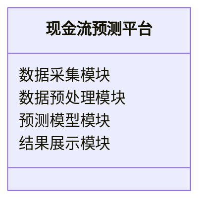
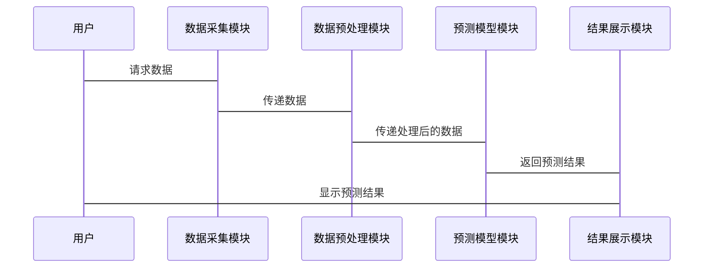

                 


# 智能现金流预测与管理平台

> 关键词：智能现金流预测、机器学习、时间序列分析、系统架构设计、现金流管理

> 摘要：智能现金流预测与管理平台通过结合机器学习和大数据分析技术，显著提升了现金流预测的准确性和管理效率。本文详细探讨了智能现金流预测的核心概念、算法原理、系统架构设计以及实际应用案例，帮助读者全面理解智能现金流管理的技术与实践。

---

# 第一部分: 智能现金流预测与管理平台概述

# 第1章: 智能现金流预测与管理平台背景

## 1.1 传统现金流管理的挑战
### 1.1.1 现金流管理的核心概念
现金流管理是企业财务管理的重要组成部分，涉及对企业未来现金流入和流出的预测与规划。现金流的准确性直接影响企业的财务健康和投资决策。

### 1.1.2 传统现金流预测方法的局限性
传统的现金流预测方法主要依赖历史数据和简单的统计模型，存在以下问题：
- 数据依赖性强，预测结果受历史波动影响大。
- 预测模型缺乏灵活性，难以适应市场变化。
- 需要大量人工干预，效率低下。

### 1.1.3 智能技术在现金流管理中的应用前景
智能技术（如机器学习、大数据分析）的应用为现金流预测带来了新的可能性，能够显著提高预测的准确性和效率，为企业提供更精准的财务决策支持。

## 1.2 智能现金流预测与管理平台的定义
### 1.2.1 平台的定义与目标
智能现金流预测与管理平台是一款结合机器学习和大数据分析技术的智能化财务工具，旨在通过实时数据分析和预测模型优化，帮助企业实现精准的现金流预测和高效管理。

### 1.2.2 平台的核心功能模块
- 数据采集与预处理
- 预测模型训练与优化
- 现金流预测与可视化
- 风险评估与预警

### 1.2.3 平台的适用场景与用户群体
适用于企业财务部门、金融机构、投资公司等，特别适合需要高频现金流预测和管理的行业。

## 1.3 本章小结
本章介绍了智能现金流预测与管理平台的背景、传统方法的局限性以及智能技术的应用前景，为后续章节的深入探讨奠定了基础。

---

# 第2章: 智能现金流预测的核心概念

## 2.1 现金流预测的基本原理
### 2.1.1 现金流预测的数学模型
现金流预测可以通过统计模型和机器学习模型实现。常见的统计模型包括时间序列分析（如ARIMA）和回归分析。

### 2.1.2 现金流预测的关键影响因素
影响现金流的主要因素包括：
- 市场需求变化
- 企业经营状况
- 宏观经济环境
- 财务政策调整

### 2.1.3 现金流预测的准确性评估
通过均方误差（MSE）、平均绝对误差（MAE）等指标评估预测模型的准确性。

## 2.2 智能预测的核心要素
### 2.2.1 数据采集与处理
- 数据来源：企业财务数据、市场数据、外部经济指标等。
- 数据预处理：清洗、特征提取、标准化等。

### 2.2.2 预测模型的选择与优化
- 算法选择：根据数据特点选择合适的时间序列模型或机器学习模型。
- 超参数调优：通过网格搜索等方法优化模型性能。

### 2.2.3 结果展示与决策支持
通过可视化工具展示预测结果，并提供风险预警和优化建议。

## 2.3 传统方法与智能方法的对比
### 2.3.1 对比分析表格
| 方法        | 数据依赖性 | 灵活性 | 预测精度 | 计算效率 |
|-------------|------------|--------|----------|----------|
| 传统统计模型 | 高         | 低     | 一般     | 低       |
| 智能算法     | 中         | 高     | 高       | 高       |

### 2.3.2 优缺点分析
- **传统方法**：简单易懂，但预测精度有限。
- **智能方法**：预测精度高，但实现复杂，需要大量数据支持。

### 2.3.3 适用场景总结
- 传统方法适用于数据有限、变化不大的场景。
- 智能方法适用于数据丰富、变化频繁的复杂场景。

## 2.4 本章小结
本章详细探讨了智能现金流预测的核心概念，分析了传统方法与智能方法的优劣，并为后续算法选择提供了理论基础。

---

# 第3章: 常见现金流预测算法解析

## 3.1 时间序列分析方法
### 3.1.1 ARIMA模型原理
ARIMA（自回归积分滑动平均模型）通过捕捉数据的自相关性来预测未来值。其数学公式为：
$$ ARIMA(p, d, q) $$
其中，$p$ 表示自回归阶数，$d$ 表示差分阶数，$q$ 表示滑动平均阶数。

### 3.1.2 SARIMA模型的应用
季节性ARIMA模型（SARIMA）在ARIMA的基础上引入季节性因子，适用于具有明显周期性特征的数据。

### 3.1.3 LSTM模型的优势
长短期记忆网络（LSTM）通过记忆单元捕获长期依赖关系，特别适合处理时间序列数据中的长周期模式。

## 3.2 机器学习算法
### 3.2.1 线性回归模型
线性回归模型通过建立线性关系预测现金流，公式为：
$$ y = \beta_0 + \beta_1x + \epsilon $$

### 3.2.2 支持向量回归
支持向量回归（SVR）通过构建支持向量将问题转化为凸二次规划问题，适用于非线性数据。

### 3.2.3 随机森林与梯度提升树
随机森林和梯度提升树（如XGBoost）通过集成学习提升预测精度，适用于高维特征数据。

## 3.3 算法选择与优化策略
### 3.3.1 数据特征的重要性
特征选择直接影响模型性能，常用方法包括Lasso回归和递归特征消除（RFE）。

### 3.3.2 超参数调优方法
通过网格搜索（Grid Search）或随机搜索（Random Search）优化模型超参数。

### 3.3.3 模型评估与验证
使用交叉验证（Cross-Validation）评估模型性能，避免过拟合。

## 3.4 本章小结
本章介绍了常见的现金流预测算法，分析了各自的优势和适用场景，为后续实现提供了算法选择依据。

---

# 第4章: 现金流预测的数学模型

## 4.1 时间序列模型
### 4.1.1 ARIMA模型公式
$$ ARIMA(p, d, q) $$
其中，$p$ 表示自回归阶数，$d$ 表示差分阶数，$q$ 表示滑动平均阶数。

### 4.1.2 LSTM模型结构
$$ f(t) = \text{LSTM}(x_t, h_{t-1}) $$
LSTM通过记忆单元（$h_t$）捕获长期依赖关系，公式为：
$$ i_t = \sigma(W_i x_t + U_i h_{t-1} + b_i) $$
$$ f_t = \sigma(W_f x_t + U_f h_{t-1} + b_f) $$
$$ o_t = \sigma(W_o x_t + U_o h_{t-1} + b_o) $$
$$ c_t = f_t \cdot c_{t-1} + i_t \cdot \tanh(W_c x_t + U_c h_{t-1} + b_c) $$
$$ h_t = o_t \cdot \tanh(c_t) $$

## 4.2 机器学习模型
### 4.2.1 线性回归模型
$$ y = \beta_0 + \beta_1x + \epsilon $$

### 4.2.2 随机森林模型
随机森林通过集成多个决策树模型，公式为：
$$ y = \frac{1}{n} \sum_{i=1}^{n} \text{Tree}_i(x) $$

## 4.3 本章小结
本章详细推导了现金流预测的数学模型，为后续算法实现提供了理论基础。

---

# 第5章: 系统分析与架构设计

## 5.1 问题场景介绍
现金流预测与管理平台需要满足实时数据处理、高精度预测和高效管理的需求。

## 5.2 项目介绍
### 5.2.1 项目目标
开发一个基于机器学习的现金流预测与管理平台，实现数据采集、预测、可视化和管理功能。

## 5.3 系统功能设计
### 5.3.1 领域模型（Mermaid 类图）


### 5.3.2 系统架构设计（Mermaid 架构图）
```mermaid
container 现金流预测平台 {
    数据采集模块
    数据预处理模块
    预测模型模块
    结果展示模块
}
```

### 5.3.3 系统接口设计
API接口用于数据输入和输出，支持RESTful接口。

## 5.4 系统交互设计（Mermaid 序列图）


## 5.5 本章小结
本章详细设计了现金流预测与管理平台的系统架构，为后续开发提供了指导。

---

# 第6章: 项目实战

## 6.1 环境安装
安装Python、机器学习库（如scikit-learn、Keras）和数据可视化库（如Matplotlib）。

## 6.2 系统核心实现源代码
### 6.2.1 数据预处理代码
```python
import pandas as pd
from sklearn.preprocessing import StandardScaler

# 数据加载
data = pd.read_csv('cash_flow.csv')

# 特征提取
features = data[['revenue', 'expenses', 'net_income']]
labels = data['cash_flow']

# 标准化
scaler = StandardScaler()
features_scaled = scaler.fit_transform(features)
```

### 6.2.2 LSTM预测模型实现
```python
import numpy as np
from keras.models import Sequential
from keras.layers import LSTM, Dense

# 模型构建
model = Sequential()
model.add(LSTM(64, input_shape=(None, 3)))
model.add(Dense(1))
model.compile(loss='mean_squared_error', optimizer='adam')

# 训练
model.fit(features_scaled, labels, epochs=100, batch_size=32)
```

## 6.3 代码应用解读与分析
- 数据预处理：标准化处理确保模型输入数据的均衡性。
- LSTM模型：通过记忆单元捕捉长期趋势，提升预测精度。

## 6.4 实际案例分析
以某公司为例，利用上述代码实现现金流预测，并对比传统方法的预测结果，验证智能算法的优势。

## 6.5 本章小结
本章通过实际案例展示了现金流预测与管理平台的实现过程，验证了智能算法的有效性。

---

# 第7章: 总结与展望

## 7.1 全文总结
智能现金流预测与管理平台通过机器学习和大数据分析技术，显著提升了现金流预测的准确性和管理效率，为企业财务决策提供了有力支持。

## 7.2 未来展望
未来，随着深度学习和强化学习技术的发展，现金流预测将更加智能化和个性化，为企业创造更大的价值。

## 7.3 最佳实践 tips
- 数据质量是预测精度的基础，需确保数据的准确性和完整性。
- 模型选择需结合实际业务需求，避免盲目追求复杂模型。
- 定期更新模型参数，适应市场变化。

## 7.4 本章小结
本章总结了全文内容，并展望了智能现金流预测技术的未来发展方向，为读者提供了实践中的注意事项和未来研究的方向。

---

# 作者：AI天才研究院/AI Genius Institute & 禅与计算机程序设计艺术 /Zen And The Art of Computer Programming

