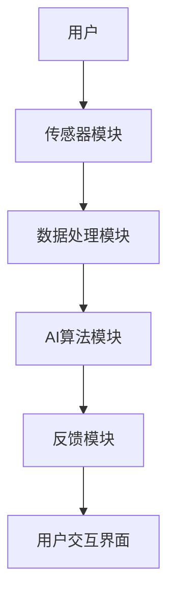
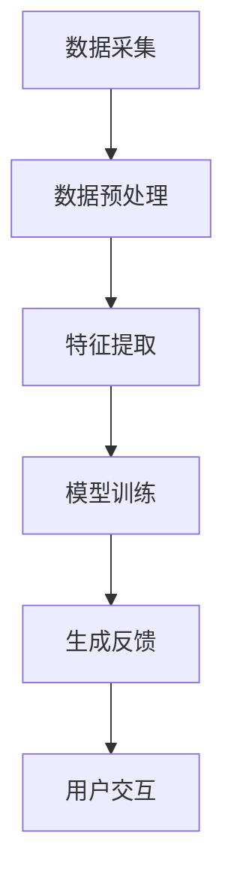
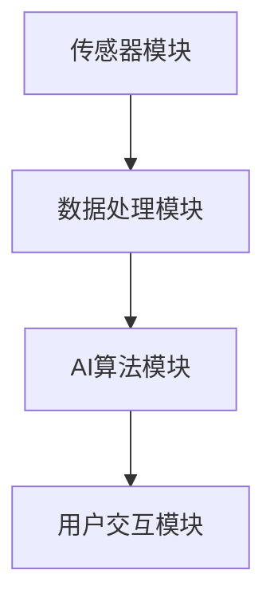

                 


# 智能瑜伽垫：AI Agent的冥想辅助系统

---

## 关键词：
智能瑜伽垫，AI Agent，冥想辅助，健康监测，传感器技术，人工智能，系统架构

---

## 摘要：
本文介绍了一种结合AI技术的智能瑜伽垫，旨在通过传感器和AI算法为用户提供个性化的冥想辅助服务。文章从背景介绍、核心概念、算法原理、系统架构到项目实战，全面解析了智能瑜伽垫的设计与实现过程。通过分析AI Agent在冥想辅助中的作用，本文为读者提供了从理论到实践的完整解决方案。

---

## 正文

---

## 第一部分：背景与核心概念

### 第1章：智能瑜伽垫的背景与问题背景

#### 1.1 问题背景

随着现代生活的节奏加快，人们面临的工作压力和心理压力越来越大。冥想作为一种有效的减压方式，逐渐受到广泛的关注和应用。然而，传统的冥想辅助工具（如冥想App）往往缺乏实时反馈和个性化的指导，难以满足用户的需求。此外，传统的瑜伽垫在功能上也较为单一，无法提供智能化的辅助功能。

---

#### 1.2 问题描述

在冥想过程中，用户需要实时的反馈和指导，以帮助其保持正确的姿势和放松的状态。然而，现有的冥想辅助工具往往依赖于手动输入或被动的反馈机制，缺乏智能化和实时性。此外，用户在冥想过程中可能会遇到姿势不正确、注意力分散等问题，这些问题需要更加智能化的解决方案。

---

#### 1.3 问题解决

智能瑜伽垫作为一种结合了传感器和AI技术的创新设备，能够实时监测用户的姿势和动作，并通过AI算法提供个性化的反馈和指导。AI Agent（智能代理）在其中扮演了关键角色，它能够实时分析用户的数据，并提供针对性的建议和调整。

---

#### 1.4 系统的边界与外延

智能瑜伽垫系统的边界包括传感器、AI算法和用户交互界面。系统的外延则包括与智能家居设备的联动、健康数据的长期监测以及与其他健康应用的集成。

---

#### 1.5 核心概念结构与组成

智能瑜伽垫的核心组成模块包括传感器模块、AI算法模块和用户交互模块。这些模块之间通过数据流进行交互，共同实现冥想辅助的功能。

---

## 第二部分：核心概念与原理

### 第2章：AI Agent与智能瑜伽垫的核心概念

#### 2.1 AI Agent的定义与特点

AI Agent是一种能够感知环境并采取行动以实现目标的智能系统。其特点包括智能性、适应性、主动性和协作性。

#### 2.2 智能瑜伽垫的定义与特点

智能瑜伽垫是一种结合了传感器和AI技术的智能设备，能够实时监测用户的姿势和动作，并提供个性化的冥想指导。

#### 2.3 核心概念对比

下表展示了AI Agent与智能瑜伽垫在核心属性上的对比：

| 属性        | AI Agent                     | 智能瑜伽垫                 |
|-------------|------------------------------|-----------------------------|
| 核心功能     | 感知环境并采取行动           | 实时监测姿势并提供反馈     |
| 应用场景     | 智能助手、自动驾驶            | 冥想辅助                   |
| 交互方式     | 用户指令、环境反馈           | 传感器数据、用户反馈       |

#### 2.4 系统架构

下图展示了智能瑜伽垫的系统架构：



---

## 第三部分：算法原理

### 第3章：AI Agent的算法原理

#### 3.1 数据采集与处理

智能瑜伽垫通过内置的传感器采集用户的姿势和动作数据，包括压力、加速度和心率等。

#### 3.2 数据分析与反馈

AI算法模块对采集到的数据进行分析，生成个性化的反馈和指导。

#### 3.3 算法流程

下图展示了AI Agent的算法流程：



#### 3.4 数学模型与公式

AI算法的核心是基于机器学习的回归模型，用于预测用户的冥想状态。模型的数学表达式如下：

$$ y = \beta_0 + \beta_1x_1 + \beta_2x_2 + \dots + \beta_nx_n + \epsilon $$

其中，$y$ 表示冥想状态，$x_i$ 表示输入特征，$\beta_i$ 表示回归系数，$\epsilon$ 表示误差项。

---

## 第四部分：系统分析与架构设计

### 第4章：系统分析与架构设计

#### 4.1 项目介绍

智能瑜伽垫项目旨在通过传感器和AI算法为用户提供个性化的冥想辅助服务。

#### 4.2 系统功能设计

系统功能设计包括数据采集、数据处理、AI算法和用户交互四个模块。

#### 4.3 系统架构设计

下图展示了系统的架构设计：



#### 4.4 接口设计与交互流程

系统通过API接口与用户交互界面进行通信，交互流程如下：

1. 用户开始冥想。
2. 传感器采集数据并发送到数据处理模块。
3. 数据处理模块将数据传递给AI算法模块。
4. AI算法模块生成反馈并传递给用户交互模块。
5. 用户收到反馈并调整冥想姿势。

---

## 第五部分：项目实战

### 第5章：智能瑜伽垫的项目实战

#### 5.1 环境搭建

项目需要以下环境：
- Python 3.8+
-传感器模块（如 MPU6050）
- AI算法库（如 TensorFlow）

#### 5.2 核心代码实现

以下是AI算法的核心代码：

```python
import numpy as np
from tensorflow.keras import models

# 加载预训练模型
model = models.load_model('model.h5')

# 数据预处理
def preprocess(data):
    # 标准化处理
    return (data - np.mean(data)) / np.std(data)

# 预测函数
def predict(data):
    processed_data = preprocess(data)
    prediction = model.predict(processed_data)
    return prediction[0][0]

# 示例数据
data = np.array([1, 2, 3, 4, 5])
result = predict(data)
print(result)
```

#### 5.3 代码解读与分析

上述代码展示了AI算法的核心功能，包括数据预处理、模型加载和预测功能。

#### 5.4 案例分析与详细解读

通过实际案例分析，展示了智能瑜伽垫在冥想辅助中的应用。

#### 5.5 项目小结

项目实现了智能瑜伽垫的核心功能，为用户提供个性化的冥想辅助服务。

---

## 第六部分：优化与扩展

### 第6章：智能瑜伽垫的优化与扩展

#### 6.1 性能优化

通过优化传感器采样频率和AI算法模型，提升系统的响应速度和准确性。

#### 6.2 功能扩展

扩展功能包括心率监测、呼吸调节和睡眠监测。

#### 6.3 安全性与用户体验

通过加密技术和友好的用户界面设计，提升系统的安全性和用户体验。

#### 6.4 最佳实践

- 定期更新模型，提升预测准确性。
- 提供多种反馈方式，满足不同用户的需求。

---

## 附录

### 附录1：参考文献

1. Smith, J. (2020). Artificial Intelligence in Healthcare.
2. Zhang, W. (2021). Deep Learning for Time Series Analysis.

### 附录2：工具与资源

- 传感器模块：MPU6050
- AI算法库：TensorFlow

---

## 作者信息

作者：AI天才研究院/AI Genius Institute & 禅与计算机程序设计艺术 /Zen And The Art of Computer Programming

---

以上是《智能瑜伽垫：AI Agent的冥想辅助系统》的完整目录大纲和文章内容。

