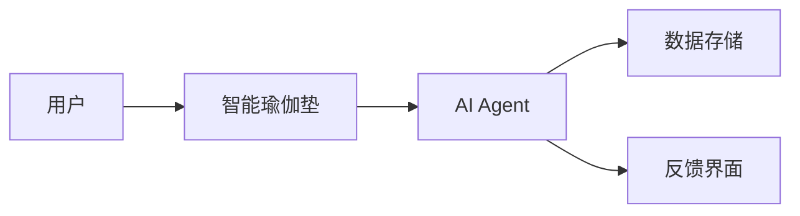
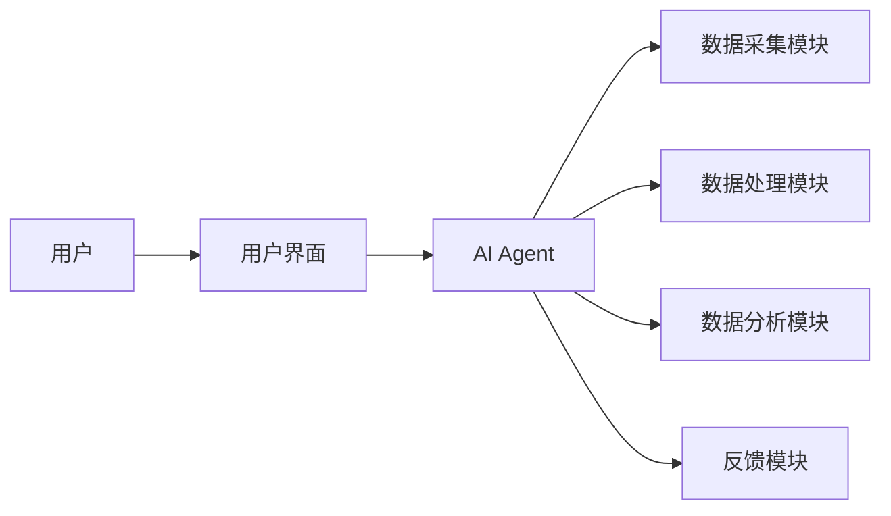
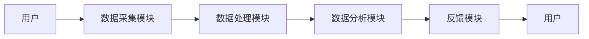
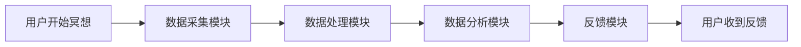

                 


# 智能瑜伽垫：AI Agent的冥想进度追踪系统

**关键词**：智能瑜伽垫、AI Agent、冥想进度、数据采集、机器学习、健康监测

**摘要**：  
本文详细介绍了智能瑜伽垫与AI Agent结合的冥想进度追踪系统。通过传感器采集用户冥想数据，结合机器学习算法，AI Agent能够实时分析用户的冥想状态，提供个性化反馈与建议，帮助用户提升冥想效果。文章从系统背景、核心概念、算法原理、系统架构到项目实战，全面阐述了该系统的实现过程，展示了AI技术在健康领域的创新应用。

---

## 第一部分：智能瑜伽垫与AI Agent的背景介绍

### 第1章：智能瑜伽垫与AI Agent概述

#### 1.1 问题背景与描述
- **1.1.1 冥想练习的现状与挑战**  
  冥想是一种有效的身心健康练习方式，但传统冥想练习缺乏科学的指导和反馈，用户难以量化进度，容易失去耐心。  
  - **问题**：用户无法实时了解冥想状态，缺乏个性化反馈，练习效果难以评估。  
  - **现状**：市场上缺乏能够实时监测冥想进度的工具，用户需要更智能的辅助设备。

- **1.1.2 瑜伽垫的智能化需求**  
  智能瑜伽垫通过内置传感器，能够采集用户的呼吸、心率、体态等数据，为AI Agent提供输入。

- **1.1.3 AI Agent在健康监测中的作用**  
  AI Agent通过分析用户的冥想数据，提供实时反馈和个性化建议，帮助用户优化冥想练习。

#### 1.2 系统解决的问题
- **1.2.1 冥想进度的实时追踪**  
  通过传感器采集用户的数据，AI Agent实时分析用户的冥想状态，提供进度反馈。

- **1.2.2 用户行为的智能分析**  
  AI Agent能够识别用户的冥想习惯、呼吸节奏等问题，提供针对性的建议。

- **1.2.3 个性化反馈与建议**  
  根据用户的冥想数据，AI Agent生成个性化的反馈，帮助用户提升练习效果。

#### 1.3 系统的边界与外延
- **1.3.1 系统功能的边界**  
  本系统仅关注冥想练习的监测与反馈，不涉及其他健康数据（如运动或睡眠）。

- **1.3.2 外部系统的接口**  
  系统可与第三方健康平台（如智能手表）集成，扩展功能。

- **1.3.3 系统的可扩展性**  
  系统支持后续功能的扩展，例如与其他健康监测设备的数据同步。

#### 1.4 系统的核心要素与组成
- **1.4.1 硬件部分：智能瑜伽垫**  
  内置传感器，采集用户的呼吸频率、体态变化等数据。

- **1.4.2 软件部分：AI Agent**  
  负责数据处理、模型训练和反馈生成。

- **1.4.3 用户交互界面**  
  提供实时反馈和个性化建议，便于用户查看和调整练习。

---

## 第二部分：核心概念与联系

### 第2章：AI Agent的核心原理

#### 2.1 AI Agent的基本原理
- **2.1.1 代理（Agent）的定义与特点**  
  代理是一种能够感知环境并采取行动以实现目标的实体。AI Agent结合了人工智能技术，能够进行自主决策和学习。

- **2.1.2 AI Agent的核心算法**  
  - **监督学习**：通过标记数据训练模型，预测用户冥想状态。  
  - **无监督学习**：发现数据中的潜在模式，优化反馈机制。  
  - **强化学习**：通过奖励机制，优化AI Agent的决策过程。

- **2.1.3 AI Agent与传统代理的区别**  
  AI Agent具有自主学习和优化能力，能够根据环境变化调整行为。

#### 2.2 系统实体关系图


#### 2.3 系统架构图


---

## 第三部分：算法原理讲解

### 第3章：AI Agent的算法实现

#### 3.1 数据采集与预处理
- **3.1.1 数据采集**  
  智能瑜伽垫通过压力传感器采集用户的体态变化和呼吸频率。

- **3.1.2 数据清洗**  
  对采集的数据进行去噪处理，确保数据的准确性。

#### 3.2 特征提取
- **3.2.1 呼吸频率分析**  
  通过FFT（快速傅里叶变换）提取呼吸频率的特征。

- **3.2.2 体态变化分析**  
  分析用户在冥想中的体态变化，判断是否专注。

#### 3.3 模型训练
- **3.3.1 算法选择**  
  使用支持向量机（SVM）进行分类任务，预测用户的冥想状态。

- **3.3.2 模型优化**  
  使用交叉验证优化模型参数，提高分类准确率。

#### 3.4 结果输出
- **3.4.1 冥想状态反馈**  
  AI Agent实时输出用户的冥想状态，包括专注程度和放松程度。

- **3.4.2 个性化建议**  
  根据用户的数据，生成个性化的冥想练习建议。

---

### 第4章：数学模型与算法实现

#### 4.1 算法的数学模型
$$
\text{分类模型} = \argmax_{y} \text{SVM}(x)
$$  
其中，$x$是输入特征向量，$\text{SVM}(x)$是支持向量机的输出。

#### 4.2 代码实现
```python
import numpy as np
from sklearn import svm

# 假设X为输入特征矩阵，y为标签
X = np.array([[...], [...]])  # 特征向量
y = np.array([...])            # 标签

# 训练模型
model = svm.SVC()
model.fit(X, y)

# 预测新样本
new_sample = np.array([[...]])  # 新特征向量
prediction = model.predict(new_sample)
print("预测结果：", prediction)
```

---

## 第四部分：系统分析与架构设计方案

### 第5章：系统分析与架构设计

#### 5.1 系统功能设计
- **5.1.1 数据采集模块**  
  负责采集用户的呼吸频率和体态变化数据。

- **5.1.2 数据处理模块**  
  对采集的数据进行清洗和特征提取。

- **5.1.3 数据分析模块**  
  使用机器学习模型分析数据，生成反馈结果。

- **5.1.4 反馈模块**  
  将分析结果反馈给用户，提供实时建议。

#### 5.2 系统架构图


#### 5.3 接口设计
- **5.3.1 数据采集接口**  
  通过蓝牙或Wi-Fi与智能瑜伽垫连接，获取实时数据。

- **5.3.2 反馈接口**  
  通过移动应用或语音助手将反馈结果呈现给用户。

#### 5.4 交互流程


---

## 第五部分：项目实战

### 第6章：项目实战

#### 6.1 环境安装
- 安装Python和相关库：
  ```bash
  pip install numpy scikit-learn
  ```

- 安装智能瑜伽垫的SDK：
  ```bash
  pip install yoga_pad_sdk
  ```

#### 6.2 核心代码实现
```python
import numpy as np
from sklearn import svm
from yoga_pad_sdk import YogaPad

# 初始化智能瑜伽垫
yoga_pad = YogaPad()

# 采集数据
data = yoga_pad.collect_data(10)  # 采集10秒数据

# 数据预处理
processed_data = yoga_pad.preprocess(data)

# 特征提取
features = yoga_pad.extract_features(processed_data)

# 训练模型
model = svm.SVC()
model.fit(features, labels)

# 预测结果
new_data = yoga_pad.collect_data(5)
new_features = yoga_pad.extract_features(new_data)
prediction = model.predict(new_features)
print("预测结果：", prediction)
```

#### 6.3 案例分析
- **案例1**：用户冥想过程中呼吸频率不稳，AI Agent建议调整呼吸节奏。  
- **案例2**：用户体态变化频繁，AI Agent建议加强专注训练。

---

## 第六部分：最佳实践与总结

### 第7章：最佳实践

#### 7.1 小结
- 智能瑜伽垫与AI Agent的结合，为用户提供了一种高效、个性化的冥想练习方式。  
- 通过实时数据采集和分析，AI Agent能够优化用户的练习效果。

#### 7.2 注意事项
- 数据隐私保护：确保用户数据的安全性。  
- 系统兼容性：支持多种设备和平台的集成。  
- 用户教育：帮助用户理解AI Agent的工作原理和使用方法。

#### 7.3 拓展阅读
- 推荐阅读《机器学习实战》和《深度学习入门》，进一步了解AI技术在健康领域的应用。

---

## 作者信息

作者：AI天才研究院/AI Genius Institute & 禅与计算机程序设计艺术 /Zen And The Art of Computer Programming

---

**全文完**

