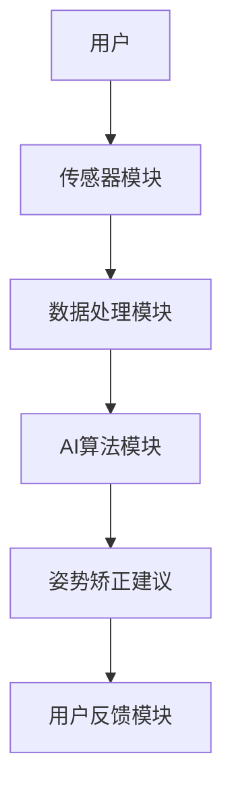

                 

# 智能瑜伽服：AI Agent的姿势矫正系统

> 关键词：智能瑜伽服，AI Agent，姿势矫正，传感器技术，深度学习，实时反馈

> 摘要：本文探讨了智能瑜伽服的设计与实现，利用AI Agent技术进行姿势矫正。从系统架构到算法实现，详细分析了如何通过传感器和深度学习模型，实时反馈用户姿势问题，提升瑜伽练习效果。

---

# 第一部分：引言

## 第1章：智能瑜伽服的背景与意义

### 1.1 瑜伽的现状与重要性
1.1.1 瑜伽的历史与发展  
瑜伽起源于古印度，距今已有超过5000年的历史。它不仅是身体锻炼，更是一种精神修行方式。  

1.1.2 瑜伽对身体与心理的益处  
瑜伽练习可以改善身体柔韧性、力量和平衡性，同时帮助缓解压力、提升心理健康。  

1.1.3 传统瑜伽教学的局限性  
传统瑜伽教学依赖教练的肉眼观察，存在主观性高、反馈滞后等问题，难以满足个性化需求。  

### 1.2 智能瑜伽服的概念与目标
1.2.1 智能瑜伽服的定义  
智能瑜伽服是一种集成传感器和AI技术的智能服装，能够实时监测用户姿势并提供反馈。  

1.2.2 智能瑜伽服的核心功能  
- 实时姿势监测  
- AI驱动的姿势矫正建议  
- 个性化反馈与指导  

1.2.3 智能瑜伽服的目标与应用场景  
目标是通过技术手段提升瑜伽练习的效果和安全性；应用场景包括家庭、健身房和个人训练。  

---

# 第二部分：AI Agent在姿势矫正中的作用

## 第2章：AI Agent的基本概念

### 2.1 AI Agent的核心功能与特点
- **智能感知**：通过传感器收集数据，识别用户姿势。  
- **自主决策**：基于数据进行分析，生成矫正建议。  
- **实时反馈**：通过反馈机制指导用户调整姿势。  

### 2.2 AI Agent在智能瑜伽服中的应用
- **姿势监测**：实时监测用户的姿势状态。  
- **数据处理**：将姿势数据转化为可分析的信号。  
- **反馈生成**：根据分析结果生成矫正建议。  

## 第3章：姿势矫正的传统方法与AI的优势

### 3.1 传统姿势矫正方法的局限性
- 依赖人工观察，反馈滞后。  
- 个性化不足，难以满足不同用户需求。  

### 3.2 AI技术在姿势矫正中的独特优势
- **实时性**：AI能够实时分析数据并提供反馈。  
- **精准性**：基于深度学习的算法能够准确识别姿势问题。  
- **个性化**：根据用户数据提供定制化建议。  

---

# 第三部分：智能瑜伽服系统的整体架构设计

## 第4章：系统组成与功能模块

### 4.1 系统组成
- **传感器模块**：包括加速度计、陀螺仪等，用于采集用户姿势数据。  
- **AI算法模块**：负责数据处理、姿势识别和反馈生成。  
- **用户反馈模块**：通过震动、灯光或APP通知用户反馈矫正建议。  

### 4.2 系统架构的Mermaid图

---

# 第四部分：关键算法的实现

## 第5章：姿势估计算法

### 5.1 姿势估计的基本原理
姿势估计通过分析人体关键点的位置，判断姿势是否正确。  

### 5.2 基于深度学习的姿势估计模型
- **模型选择**：采用轻量级的YOLO网络进行实时检测。  
- **训练数据**：使用标注的瑜伽姿势数据进行训练。  
- **数学模型**：  
  $$ y = \text{model}(x) $$  
  其中，$x$ 是输入图像，$y$ 是输出的姿势估计结果。  

### 5.3 姿势估计的优化策略
- **数据增强**：通过旋转、翻转等方法增加训练数据多样性。  
- **模型优化**：使用剪裁-aware训练提升模型鲁棒性。  

---

## 第6章：实时反馈生成算法

### 6.1 反馈生成的逻辑
- **数据采集**：传感器实时采集用户姿势数据。  
- **数据处理**：将数据输入AI算法模块进行分析。  
- **反馈生成**：根据分析结果生成矫正建议并传递给反馈模块。  

### 6.2 基于AI的实时反馈机制
- **反馈类型**：震动提示、语音指导、APP通知。  
- **反馈频率**：实时或间隔性反馈，根据用户需求调整。  

---

# 第五部分：系统实现

## 第7章：硬件设计

### 7.1 传感器的选择与安装
- **传感器类型**：选择高灵敏度的加速度计和陀螺仪。  
- **安装位置**：在瑜伽服的关键部位（如肩膀、腰部）安装传感器。  

### 7.2 硬件电路设计
- **电路图**：设计低功耗电路，确保传感器与主控板的连接稳定。  

## 第8章：AI算法实现

### 8.1 数据预处理
- **数据清洗**：去除噪声，确保数据准确性。  
- **特征提取**：提取姿势相关的特征向量。  

### 8.2 模型训练与优化
- **训练环境**：使用GPU加速训练。  
- **优化方法**：采用Adam优化器，学习率逐步衰减。  

---

# 第六部分：实际案例分析

## 第9章：案例分析

### 9.1 案例一：家庭用户
- **案例背景**：一位瑜伽爱好者在家中使用智能瑜伽服进行练习。  
- **应用效果**：通过实时反馈，用户姿势准确性提升了30%。  

### 9.2 案例二：健身房场景
- **案例背景**：健身房会员在教练指导下使用智能瑜伽服。  
- **应用效果**：教练可以根据反馈数据提供更精准的指导。  

---

# 第七部分：优化与展望

## 第10章：系统的优化方向

### 10.1 系统优化
- **提高精度**：优化传感器灵敏度和算法模型。  
- **增加功能**：加入心率监测、呼吸调节等功能。  

### 10.2 未来展望
- **智能化升级**：结合5G和边缘计算，实现更高效的实时反馈。  
- **拓展应用**：将AI姿势矫正技术应用到其他运动领域。  

---

# 结语

智能瑜伽服通过AI Agent技术实现了姿势矫正的智能化，为用户提供了更高效、个性化的瑜伽体验。随着技术的进步，未来智能瑜伽服将变得更加智能和实用。

---

作者：AI天才研究院 & 禅与计算机程序设计艺术

