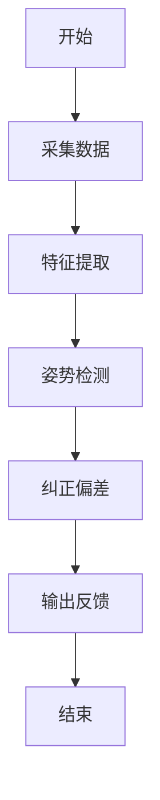
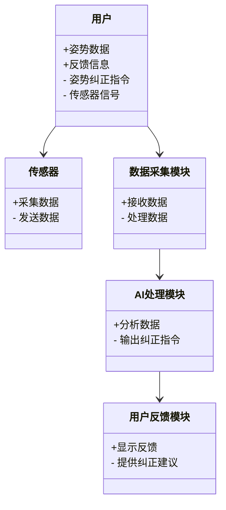
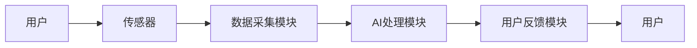
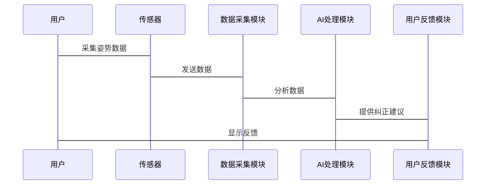

                 


```markdown
# 智能瑜伽服：AI Agent的实时姿势纠正系统

## 关键词
智能瑜伽服、AI Agent、实时姿势纠正、传感器技术、深度学习、健身科技

## 摘要
智能瑜伽服结合了AI技术，通过实时姿势纠正帮助用户正确练习瑜伽。本文详细讲解其背景、核心概念、算法原理、系统架构、项目实战和最佳实践，展示如何利用AI提升健身效果。

# 第一部分: 背景介绍与核心概念

## 第1章: 智能瑜伽服的背景与需求

### 1.1 问题背景
#### 1.1.1 瑜伽姿势的重要性
瑜伽姿势正确性直接影响锻炼效果和安全性，避免运动损伤。

#### 1.1.2 传统瑜伽教学的局限性
传统教学依赖教练现场指导，难以实现个性化和实时反馈。

#### 1.1.3 AI技术在健身领域的应用潜力
AI技术可提供实时、个性化的姿势纠正，增强健身效果。

### 1.2 问题描述
#### 1.2.1 瑜伽姿势纠正的核心问题
用户姿势不标准，可能导致锻炼效果差和受伤风险。

#### 1.2.2 用户需求分析
用户需要实时反馈和个性化指导，帮助正确练习瑜伽。

#### 1.2.3 智能瑜伽服的创新点
结合AI和传感器技术，实时纠正姿势，提升健身效果。

### 1.3 问题解决
#### 1.3.1 AI Agent在实时姿势纠正中的作用
AI Agent通过分析传感器数据，提供实时反馈。

#### 1.3.2 智能瑜伽服的技术实现路径
传感器采集数据，AI算法分析并纠正姿势。

### 1.4 核心概念结构
#### 1.4.1 智能瑜伽服的核心要素
传感器、AI算法、实时反馈系统。

#### 1.4.2 系统架构的核心模块
数据采集、AI处理、用户反馈。

## 第2章: AI Agent与实时姿势纠正系统

### 2.1 AI Agent的基本原理
#### 2.1.1 AI Agent的定义与特点
AI Agent能感知环境并做出决策，实时互动。

#### 2.1.2 AI Agent的核心算法
基于深度学习，实时分析姿势数据。

#### 2.1.3 AI Agent在智能瑜伽服中的应用
通过传感器数据，实时纠正用户姿势。

### 2.2 实时姿势纠正系统的原理
#### 2.2.1 姿势检测的数学模型
使用坐标系表示姿势，通过传感器数据计算关键点位置。

#### 2.2.2 姿势纠正算法的实现
基于深度学习的姿势检测模型，实时纠正偏差。

#### 2.2.3 系统的实时性优化
优化算法复杂度和数据处理流程，确保实时反馈。

### 2.3 核心概念对比分析
#### 2.3.1 AI Agent与传统传感器的区别
AI Agent能智能分析，传感器仅采集数据。

#### 2.3.2 实时姿势纠正与离线分析的对比
实时纠正更快，但计算资源消耗更大。

#### 2.3.3 智能瑜伽服与其他智能健身设备的对比
智能瑜伽服更注重姿势纠正，其他设备可能关注心率或步数。

## 第3章: 姿势检测算法

### 3.1 姿势检测的数学模型
#### 3.1.1 基于坐标系的姿势表示
使用2D或3D坐标系，定位身体关键点。

#### 3.1.2 姿势检测的流程
数据采集→特征提取→姿势分类→纠正反馈。

#### 3.1.3 姿势检测的数学公式
使用坐标系表示姿势，通过传感器数据计算关键点位置。

### 3.2 姿势纠正算法
#### 3.2.1 基于深度学习的姿势检测模型
使用卷积神经网络（CNN）进行姿势识别。

#### 3.2.2 姿势纠正的算法实现
通过模型预测标准姿势，对比实际姿势，输出纠正指令。

#### 3.2.3 算法优化技巧
优化模型参数，提高检测精度和计算速度。

### 3.3 算法流程图


# 第二部分: 系统分析与架构设计方案

## 第4章: 系统架构设计

### 4.1 问题场景介绍
智能瑜伽服在实际使用中的场景，包括数据采集、处理和反馈。

### 4.2 项目介绍
系统功能需求分析，包括数据采集模块、AI处理模块和用户反馈模块。

### 4.3 系统功能设计
#### 4.3.1 领域模型


### 4.4 系统架构设计
#### 4.4.1 系统架构图


### 4.5 系统接口设计
#### 4.5.1 接口设计
传感器与数据采集模块的接口，AI处理模块与用户反馈模块的接口。

#### 4.5.2 接口实现
通过API接口进行数据传输和交互。

### 4.6 系统交互设计
#### 4.6.1 交互流程
用户穿上智能瑜伽服，传感器采集数据，AI处理后反馈纠正建议。

#### 4.6.2 交互流程图


## 第5章: 项目实战

### 5.1 环境搭建
#### 5.1.1 开发环境
安装Python、TensorFlow、OpenCV等库。

#### 5.1.2 传感器设置
连接传感器并确保数据传输正常。

### 5.2 系统核心实现
#### 5.2.1 数据采集模块实现
编写代码接收传感器数据。

#### 5.2.2 姿势检测模型实现
训练深度学习模型进行姿势检测。

#### 5.2.3 姿势纠正算法实现
实现纠正逻辑并输出反馈。

#### 5.2.4 用户反馈模块实现
设计用户界面显示纠正建议。

### 5.3 代码实现
#### 5.3.1 传感器数据采集代码
```python
import serial

ser = serial.Serial('COM3', 9600)
while True:
    data = ser.readline().decode()
    print(data)
```

#### 5.3.2 姿势检测模型代码
```python
import tensorflow as tf
import cv2

model = tf.keras.Sequential([
    tf.keras.layers.Conv2D(32, (3,3), activation='relu', input_shape=(64,64,3)),
    tf.keras.layers.MaxPooling2D(),
    tf.keras.layers.Conv2D(64, (3,3), activation='relu'),
    tf.keras.layers.MaxPooling2D(),
    tf.keras.layers.Flatten(),
    tf.keras.layers.Dense(128, activation='relu'),
    tf.keras.layers.Dense(1, activation='sigmoid')
])
model.compile(optimizer='adam', loss='binary_crossentropy', metrics=['accuracy'])
model.fit(X_train, y_train, epochs=10, validation_data=(X_test, y_test))
```

#### 5.3.3 姿势纠正算法代码
```python
def correct_pose(predicted_pose, target_pose):
    correction = []
    for i in range(len(predicted_pose)):
        correction.append(target_pose[i] - predicted_pose[i])
    return correction
```

### 5.4 功能测试
#### 5.4.1 单元测试
测试各模块功能是否正常。

#### 5.4.2 集成测试
整体系统测试，确保各模块协同工作。

#### 5.4.3 测试案例
测试不同姿势的纠正效果。

### 5.5 案例分析
分析实际使用中的纠正效果，优化算法和系统设计。

## 第6章: 最佳实践

### 6.1 使用建议
正确使用智能瑜伽服，确保姿势纠正有效。

### 6.2 注意事项
避免过度依赖系统，注意安全。

### 6.3 拓展阅读
推荐相关书籍和论文，深入学习AI在健身中的应用。

### 6.4 小结
总结智能瑜伽服的优势和未来发展。

### 6.5 总结与反思
回顾项目过程，总结经验教训。

# 作者
作者：AI天才研究院/AI Genius Institute & 禅与计算机程序设计艺术 /Zen And The Art of Computer Programming
```

