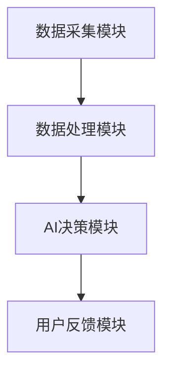

                 


# 智能瑜伽球：AI Agent的平衡训练指导

## 关键词
智能瑜伽球, AI Agent, 平衡训练, 姿态识别, 算法原理, 系统架构, 项目实战

## 摘要
智能瑜伽球通过集成AI Agent技术，实现智能化的平衡训练指导。本文从背景介绍、核心概念、算法原理、系统架构、项目实战到最佳实践，全面解析智能瑜伽球的技术细节与实现方案，探讨其在健身领域的应用前景。

---

## 第一部分：智能瑜伽球的背景与意义

### 第1章：智能瑜伽球的背景介绍

#### 1.1 传统瑜伽与现代科技的结合
瑜伽作为一种古老的健身方式，强调身体的平衡与协调。传统瑜伽依赖于教练的指导，但个性化和实时反馈有限。随着科技的发展，AI技术的引入为瑜伽训练带来了新的可能性。

#### 1.2 AI Agent在健身领域的应用
AI Agent（智能代理）是一种能够感知环境、自主决策并执行任务的智能系统。在健身领域，AI Agent可以实时分析用户的动作，提供个性化的指导和反馈，提升训练效果。

#### 1.3 智能瑜伽球的创新意义
智能瑜伽球结合了AI技术与传统瑜伽，通过实时的姿态识别和平衡训练算法，为用户提供个性化的训练方案，帮助用户更高效地提升身体平衡与柔韧性。

---

## 第二部分：AI Agent的核心概念与原理

### 第2章：AI Agent的核心概念

#### 2.1 AI Agent的定义与特征
AI Agent是一种具有感知、决策和执行能力的智能系统。其核心特征包括：
- **感知**：通过传感器或摄像头获取环境数据。
- **决策**：基于感知数据进行分析和判断。
- **执行**：根据决策结果执行相应的动作。

#### 2.2 智能瑜伽球中的AI Agent架构
智能瑜伽球的AI Agent架构分为三层：
1. **感知层**：负责采集用户的动作数据，如姿态、重心分布等。
2. **决策层**：通过算法分析数据，生成训练建议和反馈。
3. **执行层**：通过振动或语音等方式将反馈传递给用户。

### 第3章：AI Agent的算法原理

#### 3.1 姿态识别算法
姿态识别是智能瑜伽球的核心技术之一。基于深度学习的姿势识别模型（如CNN）可以实现高精度的姿态检测。

##### 3.1.1 使用卷积神经网络进行姿态识别
- **模型结构**：采用多层卷积神经网络，提取动作特征。
- **数学模型**：
  $$ \text{输出} = \text{卷积}(\text{输入}, \text{滤波器}) $$
- **流程图**：
  ```mermaid
  graph LR
  A[输入图像] --> B[卷积层] --> C[池化层] --> D[全连接层] --> E[输出结果]
  ```

#### 3.2 平衡训练算法
平衡训练算法通过实时反馈调整用户的动作，帮助其保持平衡。

##### 3.2.1 基于反馈的平衡控制算法
- **PID控制**：通过比例、积分和微分控制实现平衡调整。
- **流程图**：
  ```mermaid
  graph LR
  A[用户动作] --> B[姿态识别] --> C[平衡计算] --> D[反馈输出]
  ```

---

## 第三部分：智能瑜伽球的系统架构与实现

### 第4章：智能瑜伽球的系统架构设计

#### 4.1 系统功能模块划分
智能瑜伽球的系统架构包括以下几个模块：
1. **数据采集模块**：采集用户的动作数据。
2. **数据处理模块**：对数据进行预处理和特征提取。
3. **AI决策模块**：基于算法生成训练建议。
4. **用户反馈模块**：将反馈传递给用户。

#### 4.2 系统架构的Mermaid图


### 第5章：系统接口与交互设计

#### 5.1 系统接口设计
- **数据采集接口**：通过传感器获取用户的动作数据。
- **AI决策接口**：调用姿态识别和平衡算法。
- **用户反馈接口**：通过振动或语音输出反馈。

#### 5.2 用户交互设计
- **用户界面设计**：简洁直观的界面，显示训练建议和反馈。
- **交互流程图**：
  ```mermaid
  sequenceDiagram
  participant 用户
  participant 系统
  用户 -> 系统: 进行瑜伽动作
  系统 -> 用户: 提供实时反馈
  ```

---

## 第四部分：项目实战与优化

### 第6章：智能瑜伽球的开发实战

#### 6.1 环境搭建
- **开发工具**：安装Python、TensorFlow、OpenCV等工具。
- **数据集**：准备瑜伽动作的数据集。
- **环境配置**：配置开发环境，确保传感器和AI模型正常运行。

#### 6.2 核心代码实现
##### 6.2.1 姿态识别代码
```python
import tensorflow as tf
from tensorflow.keras import layers

model = tf.keras.Sequential([
    layers.Conv2D(32, (3,3), activation='relu', input_shape=(64,64,3)),
    layers.MaxPooling2D(pool_size=(2,2)),
    layers.Conv2D(64, (3,3), activation='relu'),
    layers.MaxPooling2D(pool_size=(2,2)),
    layers.Flatten(),
    layers.Dense(128, activation='relu'),
    layers.Dense(10, activation='softmax')
])
```

##### 6.2.2 平衡控制算法实现
```python
def balance_control(sensor_data):
    # PID控制
    target = 0
    current = sensor_data['balance']
    error = target - current
    Kp = 0.5
    Ki = 0.1
    Kd = 0.2
    integral += error * dt
    derivative = (error - previous_error) / dt
    output = Kp * error + Ki * integral + Kd * derivative
    return output
```

#### 6.3 代码解读与优化
- **代码解读**：详细解释每部分代码的功能。
- **优化建议**：通过调整模型参数和算法参数，提升识别精度和控制效果。

---

## 第五部分：最佳实践与总结

### 第7章：最佳实践与注意事项

#### 7.1 开发经验总结
- **数据质量**：确保数据的多样性和准确性。
- **算法优化**：定期更新模型，提升性能。
- **用户体验**：注重界面设计和反馈的及时性。

#### 7.2 使用技巧与注意事项
- **数据采集**：确保传感器的准确性。
- **算法调优**：根据用户反馈调整模型参数。
- **安全提示**：用户在使用过程中注意安全，避免受伤。

### 第8章：未来展望与拓展阅读

#### 8.1 未来发展趋势
- **多模态交互**：结合语音和视觉反馈，提升用户体验。
- **个性化训练**：根据用户数据提供定制化训练方案。

#### 8.2 拓展阅读
推荐相关书籍和论文，供读者深入学习。

---

## 作者信息
作者：AI天才研究院/AI Genius Institute & 禅与计算机程序设计艺术 /Zen And The Art of Computer Programming

---

以上是《智能瑜伽球：AI Agent的平衡训练指导》的完整目录和内容概要。文章从背景、概念、算法、系统架构到实战和总结，全面解析了智能瑜伽球的技术实现与应用。

