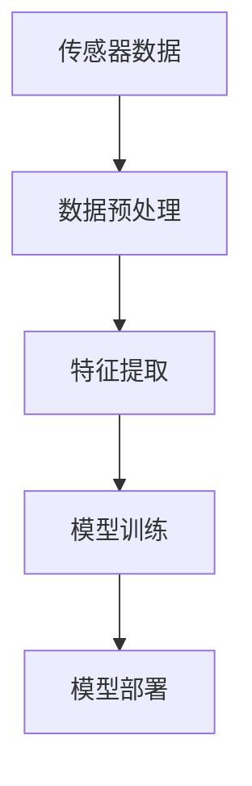
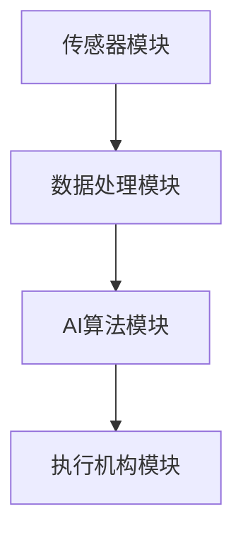

                 


# 智能瓦斯炉：AI Agent的烹饪安全监控

## 关键词：智能瓦斯炉, AI Agent, 烹饪安全, 物联网, 安全监控

## 摘要：本文探讨了智能瓦斯炉结合AI Agent在烹饪安全监控中的应用，分析了其核心原理、系统架构、算法实现及实际案例，为厨房安全提供了创新解决方案。

---

# 第1章: 智能瓦斯炉与AI Agent的背景介绍

## 1.1 问题背景与问题描述

### 1.1.1 瓦斯炉的安全隐患
瓦斯炉作为厨房的重要设备，虽然方便，但存在诸多安全隐患，如漏气、火焰失控等，容易引发火灾或中毒事故。

### 1.1.2 烹饪过程中的安全监控需求
现代家庭对厨房安全的需求日益增长，特别是在烹饪过程中，需要实时监控瓦斯的使用情况，确保安全。

### 1.1.3 AI Agent在烹饪安全中的作用
AI Agent（智能代理）能够实时监控瓦斯炉的状态，预测潜在危险，并采取相应措施，确保烹饪安全。

## 1.2 问题解决与边界定义

### 1.2.1 AI Agent如何实现烹饪安全监控
AI Agent通过传感器收集数据，分析烹饪过程中的异常情况，及时发出警报或采取应急措施。

### 1.2.2 智能瓦斯炉的边界与外延
智能瓦斯炉系统包括传感器、AI Agent、用户界面和执行机构，边界明确，外延可扩展至家庭物联网系统。

### 1.2.3 核心概念与关键要素
- **传感器**：实时采集温度、压力、气体流量等数据。
- **AI Agent**：分析数据，识别异常，发出警报或控制阀门。
- **用户界面**：提供交互界面，显示安全状态。

## 1.3 核心概念与联系

### 1.3.1 AI Agent的核心原理
AI Agent通过传感器数据，利用机器学习算法识别烹饪过程中的异常情况，确保安全。

### 1.3.2 智能瓦斯炉的系统架构
系统架构包括传感器、数据处理模块、AI算法模块和执行机构。

### 1.3.3 传感器与AI Agent的交互关系
传感器采集数据，AI Agent分析数据，根据结果控制阀门或发出警报。

## 1.4 本章小结
本章介绍了智能瓦斯炉的背景，分析了AI Agent在烹饪安全中的作用，并明确了系统的边界和核心要素。

---

# 第2章: AI Agent的核心原理与算法

## 2.1 AI Agent的基本原理

### 2.1.1 传感器数据采集
传感器实时采集瓦斯炉的温度、压力、气体流量等数据。

### 2.1.2 数据预处理与特征提取
数据预处理包括清洗和归一化，特征提取包括主成分分析。

### 2.1.3 AI模型的训练与部署
利用训练数据训练机器学习模型，并部署到智能瓦斯炉系统中。

## 2.2 算法原理与流程图

### 2.2.1 数据流图（Mermaid）



### 2.2.2 算法实现与代码示例
传感器数据处理代码如下：

```python
import numpy as np

def preprocess_data(sensor_data):
    # 数据清洗
    cleaned_data = sensor_data.dropna()
    # 特征提取
    features = cleaned_data[['temperature', 'pressure', 'gas_flow']]
    return features
```

## 2.3 数学模型与公式

### 2.3.1 线性回归模型
$$ y = \beta_0 + \beta_1x + \epsilon $$

### 2.3.2 分类模型
$$ P(y|X) = \frac{e^{\beta X}}{1 + e^{\beta X}} $$

## 2.4 本章小结
本章详细讲解了AI Agent的核心原理，包括数据采集、预处理、特征提取和模型训练，并通过代码示例和数学公式进行了详细说明。

---

# 第3章: 系统架构与功能设计

## 3.1 系统架构设计

### 3.1.1 系统模块划分
系统模块包括传感器模块、数据处理模块、AI算法模块和执行机构模块。

### 3.1.2 系统功能设计
系统功能包括实时监控、异常检测、警报发出和阀门控制。

### 3.1.3 系统架构图（Mermaid）



## 3.2 系统实现与代码

### 3.2.1 环境安装
需要安装Python、numpy、scikit-learn等库。

### 3.2.2 系统核心代码
AI算法模块的代码如下：

```python
from sklearn.linear_model import LogisticRegression

model = LogisticRegression()
model.fit(X_train, y_train)
```

### 3.2.3 代码解读与分析
代码实现了逻辑回归模型，用于分类传感器数据。

## 3.3 本章小结
本章详细讲解了智能瓦斯炉系统的架构设计，包括模块划分、功能设计和系统架构图，并通过代码示例进行了实现。

---

# 第4章: 项目实战与案例分析

## 4.1 项目实战

### 4.1.1 环境安装
安装必要的Python库和工具。

### 4.1.2 核心代码实现
实现传感器数据处理和AI算法模块。

### 4.1.3 代码解读与分析
解读核心代码的功能和实现细节。

## 4.2 案例分析

### 4.2.1 实际案例
分析一个典型的安全案例，说明AI Agent如何发挥作用。

### 4.2.2 详细解读
详细解读案例中的数据处理和模型分析过程。

## 4.3 本章小结
本章通过项目实战和案例分析，展示了智能瓦斯炉系统在实际中的应用和效果。

---

# 第5章: 最佳实践与注意事项

## 5.1 小结与总结

### 5.1.1 核心观点总结
总结智能瓦斯炉与AI Agent的核心原理和实际应用。

### 5.1.2 实践中的注意事项
在实际应用中需要注意数据隐私、模型优化和系统维护等问题。

## 5.2 注意事项

### 5.2.1 数据隐私
保护用户数据隐私，避免数据泄露。

### 5.2.2 模型优化
定期优化模型，提高检测精度。

### 5.2.3 系统维护
定期维护系统，确保正常运行。

## 5.3 拓展阅读

### 5.3.1 相关技术
推荐阅读相关领域的书籍和论文。

### 5.3.2 实际应用案例
分析更多实际应用案例，积累经验。

## 5.4 本章小结
本章总结了智能瓦斯炉系统的核心观点，提出了实践中的注意事项，并推荐了拓展阅读材料。

---

# 作者：AI天才研究院 & 禅与计算机程序设计艺术

