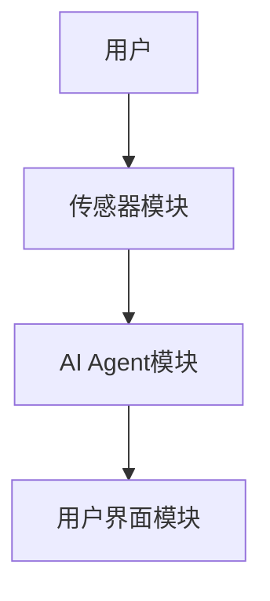

                 


# 智能瓶盖：AI Agent的药物服用提醒

> 关键词：智能瓶盖，AI Agent，药物提醒，人工智能，物联网，智能硬件，健康管理

> 摘要：智能瓶盖是一种结合AI Agent技术的智能硬件，用于提醒用户按时服用药物。本文从背景介绍、核心概念、算法原理、系统架构、项目实战等多个方面详细阐述智能瓶盖的设计与实现，探讨AI Agent在智能瓶盖中的应用。

---

## 第一部分: 智能瓶盖与AI Agent的背景介绍

### 第1章: 智能瓶盖与AI Agent概述

#### 1.1 智能瓶盖的定义与应用场景

##### 1.1.1 智能瓶盖的定义
智能瓶盖是一种集成传感器、通信模块和AI技术的智能硬件，用于监测药品使用情况并提供智能化提醒服务。

##### 1.1.2 智能瓶盖的主要应用场景
- **家庭用药管理**：帮助老年人或慢性病患者按时服药。
- **医疗机构**：用于医院或诊所的药品管理。
- **健康管理**：通过数据分析提供个性化的健康管理建议。

##### 1.1.3 智能瓶盖的技术优势
- **实时监测**：通过传感器实时监测瓶盖的开启和关闭状态。
- **智能提醒**：基于AI算法提供个性化的用药提醒。
- **数据同步**：通过物联网技术同步用药数据到云端。

#### 1.2 AI Agent的基本概念

##### 1.2.1 AI Agent的定义
AI Agent（人工智能代理）是一种能够感知环境、自主决策并执行任务的智能系统。

##### 1.2.2 AI Agent的核心特征
- **自主性**：能够自主决策。
- **反应性**：能够实时感知并响应环境变化。
- **目标导向**：基于目标进行决策和行动。

##### 1.2.3 AI Agent在智能瓶盖中的应用
- **药物提醒**：AI Agent根据用户习惯和医嘱生成提醒。
- **数据处理**：AI Agent分析用药数据，提供健康建议。
- **交互反馈**：AI Agent通过语音或APP与用户交互。

---

### 第2章: 智能瓶盖与AI Agent的结合

#### 2.1 智能瓶盖的功能需求

##### 2.1.1 药物服用提醒功能
- **定时提醒**：根据用户设定的服药时间发送提醒。
- **个性化提醒**：基于用户习惯调整提醒时间。
- **重复提醒**：在用户未按时服药时进行多次提醒。

##### 2.1.2 药物库存监测
- **库存预警**：当药品即将用完时提醒用户补货。
- **库存记录**：记录药品的使用和剩余情况。

##### 2.1.3 用户行为分析
- **行为监测**：监测用户是否按时服药。
- **习惯分析**：分析用户的用药习惯，优化提醒策略。

#### 2.2 AI Agent在智能瓶盖中的角色

##### 2.2.1 AI Agent作为智能瓶盖的核心决策系统
AI Agent负责分析用户的用药数据，制定提醒策略，并执行相应的操作。

##### 2.2.2 AI Agent与智能瓶盖硬件的交互
AI Agent通过传感器数据感知用户行为，通过通信模块发送提醒指令。

##### 2.2.3 AI Agent的数据处理与反馈机制
AI Agent分析用药数据，生成健康报告，并通过APP或语音反馈给用户。

---

## 第二部分: 智能瓶盖与AI Agent的核心技术

### 第3章: AI Agent的核心算法原理

#### 3.1 AI Agent的核心算法原理

##### 3.1.1 基于规则的AI Agent算法
基于规则的AI Agent通过预定义的规则进行决策，适用于简单的任务。

##### 3.1.2 基于模型的AI Agent算法
基于模型的AI Agent通过机器学习模型进行预测和决策，适用于复杂任务。

##### 3.1.3 基于强化学习的AI Agent算法
基于强化学习的AI Agent通过与环境的交互不断优化决策策略。

#### 3.2 算法实现与优化

##### 3.2.1 算法实现的数学模型
基于规则的AI Agent算法模型：
$$
\text{如果条件满足，则执行动作}
$$

##### 3.2.2 算法优化的策略
- **规则优化**：根据用户反馈不断优化规则。
- **模型优化**：通过数据反馈优化机器学习模型。
- **策略优化**：通过强化学习不断优化决策策略。

#### 3.3 算法实现的代码示例

##### 3.3.1 基于规则的AI Agent实现
```python
def ai_agent_rule(trigger_time):
    current_time = get_current_time()
    if current_time >= trigger_time:
        return "提醒用药"
    else:
        return "无提醒"
```

##### 3.3.2 基于模型的AI Agent实现
```python
import numpy as np

def ai_agent_model(data):
    # 输入数据处理
    processed_data = preprocess(data)
    # 预测结果
    prediction = model.predict(processed_data)
    return prediction
```

##### 3.3.3 基于强化学习的AI Agent实现
```python
def ai_agent_reinforcement(action_space):
    # 状态观测
    state = observe_state()
    # 动作选择
    action = choose_action(state)
    # 反馈接收
    reward = get_reward(action)
    # 策略更新
    update_policy(state, action, reward)
```

### 第4章: 智能瓶盖与AI Agent的系统架构

#### 4.1 系统整体架构设计

##### 4.1.1 系统模块划分
- **感知层**：传感器模块，用于采集数据。
- **计算层**：AI Agent模块，用于数据处理和决策。
- **交互层**：用户界面模块，用于与用户交互。

##### 4.1.2 系统功能模块的交互关系
使用Mermaid流程图展示系统模块的交互关系：


##### 4.1.3 系统架构的可扩展性设计
系统采用分层架构，各层之间通过接口通信，便于功能扩展。

#### 4.2 系统功能模块详细设计

##### 4.2.1 药物服用提醒模块
- **功能描述**：根据设定时间提醒用户服药。
- **实现方式**：基于规则或强化学习的AI Agent算法。

##### 4.2.2 药物库存监测模块
- **功能描述**：监测药品库存，提醒用户补货。
- **实现方式**：通过传感器数据和AI Agent分析。

##### 4.2.3 用户行为分析模块
- **功能描述**：分析用户用药习惯，优化提醒策略。
- **实现方式**：基于机器学习模型的用户行为分析。

#### 4.3 系统架构的Mermaid图


---

## 第三部分: 智能瓶盖与AI Agent的项目实战

### 第5章: 项目实战

#### 5.1 环境安装

##### 5.1.1 安装Python和必要的库
- 安装Python：`python --version`
- 安装必要的库：`pip install numpy scikit-learn`

#### 5.2 核心代码实现

##### 5.2.1 AI Agent的感知模块
```python
import time

def get_current_time():
    return time.strftime("%H:%M:%S", time.localtime())
```

##### 5.2.2 AI Agent的决策模块
```python
def decide_to_remind(current_time, trigger_time):
    if current_time >= trigger_time:
        return True
    else:
        return False
```

#### 5.3 项目总结

##### 5.3.1 成果展示
智能瓶盖与AI Agent结合的系统成功实现了药物服用提醒功能。

##### 5.3.2 经验总结
- **传感器精度**：传感器的精度直接影响系统的准确性。
- **算法选择**：选择合适的AI算法可以提高系统的智能性。
- **用户交互**：良好的用户交互设计可以提高用户体验。

---

## 第四部分: 智能瓶盖与AI Agent的最佳实践

### 第6章: 最佳实践

#### 6.1 小结
智能瓶盖结合AI Agent技术，可以为用户提供智能化的药物服用提醒服务。

#### 6.2 注意事项
- **隐私保护**：注意用户数据的隐私保护。
- **系统稳定性**：确保系统的稳定性和可靠性。
- **用户体验**：注重用户体验设计，提高用户满意度。

#### 6.3 拓展阅读
- **相关技术**：了解更多的AI技术，如深度学习、强化学习等。
- **行业动态**：关注智能硬件和AI领域的最新动态。

---

作者：AI天才研究院/AI Genius Institute & 禅与计算机程序设计艺术 /Zen And The Art of Computer Programming

