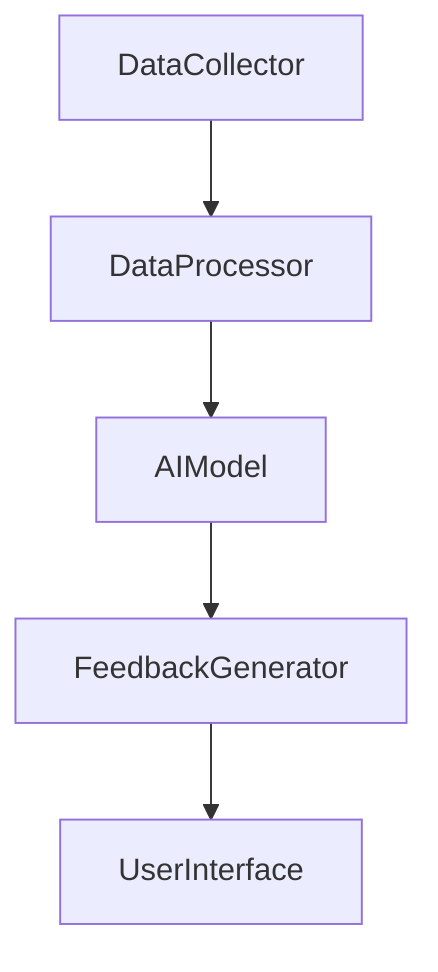
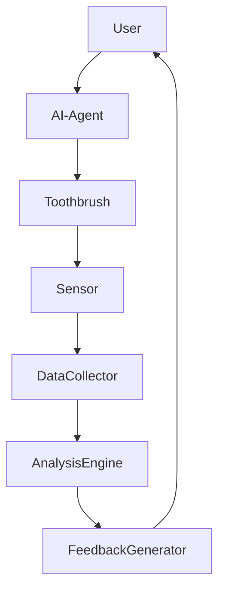
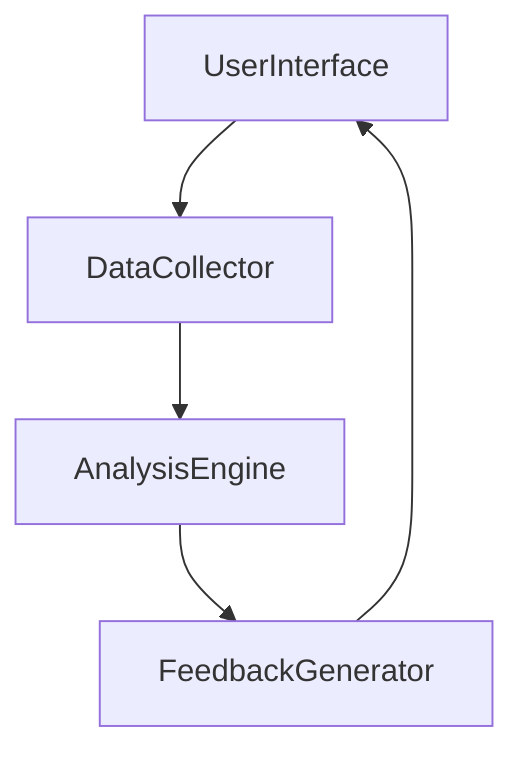
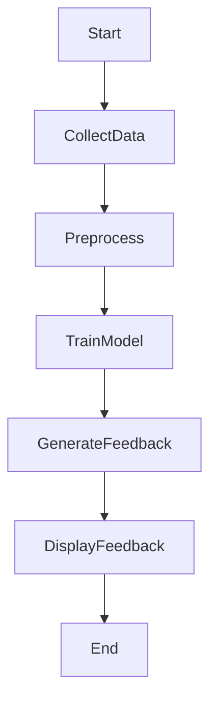
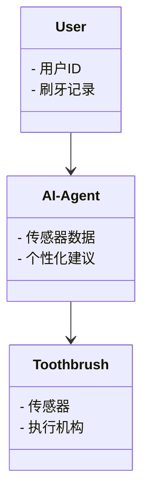
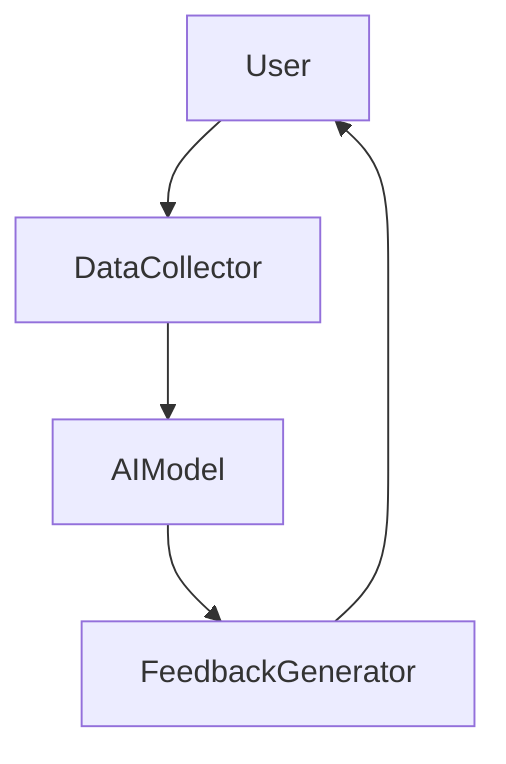
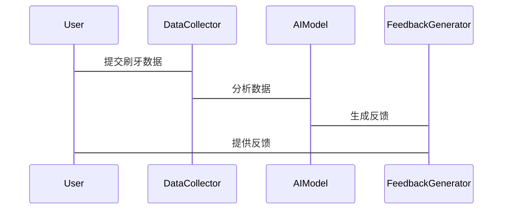

                 


```markdown
# 智能电动牙刷：AI Agent的个性化刷牙指导

> 关键词：智能电动牙刷，AI Agent，个性化刷牙，口腔健康，人工智能，算法实现

> 摘要：本文将详细探讨智能电动牙刷如何通过AI Agent提供个性化的刷牙指导，从背景介绍到系统架构设计，再到算法实现，最后通过项目实战展示如何将AI技术应用于智能牙刷，为用户带来更科学、更高效的刷牙体验。

---

# 第一部分：智能电动牙刷与AI Agent的背景与概念

## 第1章：背景介绍与问题背景

### 1.1 智能电动牙刷的发展历程

#### 1.1.1 传统牙刷的功能与局限
传统牙刷仅提供基本的清洁功能，无法根据个人需求进行调整，使用体验单一。

#### 1.1.2 智能电动牙刷的出现与演变
智能电动牙刷通过内置传感器和智能算法，能够实时监测刷牙力度、时间、角度等参数，为用户提供更科学的刷牙方式。

#### 1.1.3 AI技术在智能牙刷中的应用趋势
随着人工智能技术的发展，智能牙刷开始结合AI Agent，进一步提升个性化指导能力。

### 1.2 个性化刷牙指导的需求分析

#### 1.2.1 不同人群的刷牙需求差异
不同人群（如儿童、成人、牙龈敏感人群等）对刷牙力度、时间、频率的需求不同。

#### 1.2.2 刷牙习惯对口腔健康的影响
不正确的刷牙习惯可能导致牙龈出血、牙齿敏感等问题，影响口腔健康。

#### 1.2.3 个性化刷牙指导的必要性
通过个性化指导，可以帮助用户养成科学的刷牙习惯，预防口腔问题。

### 1.3 AI Agent在智能牙刷中的角色

#### 1.3.1 AI Agent的定义与功能
AI Agent是一种智能代理，能够感知环境、理解用户需求并提供相应的服务。

#### 1.3.2 AI Agent在智能牙刷中的应用场景
AI Agent可以实时分析用户的刷牙数据，提供个性化建议、纠正不良习惯等。

#### 1.3.3 AI Agent与智能牙刷的结合方式
AI Agent通过传感器收集数据，结合预训练模型进行分析，生成反馈并指导用户。

### 1.4 本章小结
智能电动牙刷的发展离不开AI技术的支持，AI Agent在个性化刷牙指导中的作用日益重要。

---

## 第2章：核心概念与系统架构

### 2.1 AI Agent的核心原理

#### 2.1.1 AI Agent的基本概念
AI Agent通过感知输入数据，利用算法进行分析和决策，提供相应的输出。

#### 2.1.2 AI Agent的核心算法与技术
包括数据采集、特征提取、模型训练、实时反馈等。

#### 2.1.3 AI Agent的输入输出模型
输入：传感器数据（刷牙力度、时间、角度等）  
输出：个性化建议（调整力度、延长刷牙时间等）

### 2.2 智能电动牙刷的系统架构

#### 2.2.1 系统功能模块划分
- 数据采集模块：传感器采集刷牙数据
- 数据处理模块：对数据进行预处理和特征提取
- AI算法模块：利用机器学习模型进行分析和预测
- 用户反馈模块：将结果反馈给用户

#### 2.2.2 系统组件之间的关系


#### 2.2.3 系统的硬件与软件架构
- 硬件部分：传感器、MCU、蓝牙模块
- 软件部分：数据处理算法、AI模型、用户界面

### 2.3 实体关系与功能模块图

#### 2.3.1 ER实体关系图


#### 2.3.2 功能模块图


### 2.4 本章小结
通过系统架构设计，可以清晰地看到AI Agent在智能牙刷中的核心作用和各模块之间的关系。

---

## 第3章：算法原理与数学模型

### 3.1 AI Agent的核心算法

#### 3.1.1 个性化推荐算法
基于用户的历史数据，推荐适合的刷牙方式。

#### 3.1.2 实时反馈算法
根据实时数据，调整刷牙建议。

#### 3.1.3 数据分析与学习算法
利用机器学习模型，不断优化个性化指导。

### 3.2 算法流程图



### 3.3 算法实现细节

#### 3.3.1 数据预处理
```python
import numpy as np
import pandas as pd

# 示例数据预处理代码
data = pd.read_csv('brushing_data.csv')
data = data.dropna()
data = (data - data.mean()) / data.std()
```

#### 3.3.2 机器学习模型训练
```python
from sklearn.ensemble import RandomForestRegressor
model = RandomForestRegressor(n_estimators=100, random_state=42)
model.fit(X_train, y_train)
```

#### 3.3.3 反馈生成
```python
def generate_feedback(data_point):
    prediction = model.predict(data_point)
    if prediction > threshold:
        return "请加大刷牙力度"
    else:
        return "继续保持，很好！"
```

### 3.4 数学模型与公式

#### 3.4.1 数据标准化公式
$$ x_{\text{normalized}} = \frac{x - \mu}{\sigma} $$

#### 3.4.2 机器学习模型的损失函数
$$ \text{Loss} = \sum_{i=1}^{n} (y_i - \hat{y}_i)^2 $$

### 3.5 本章小结
通过具体算法和数学模型的分析，展示了AI Agent在智能牙刷中的技术实现细节。

---

## 第4章：系统分析与架构设计

### 4.1 问题场景介绍
用户在使用智能牙刷时，AI Agent通过传感器数据实时分析，并提供个性化指导。

### 4.2 项目介绍
本项目旨在开发一款结合AI技术的智能电动牙刷，提供个性化的刷牙指导。

### 4.3 系统功能设计

#### 4.3.1 领域模型


### 4.4 系统架构设计

#### 4.4.1 系统架构图


### 4.5 系统接口设计

#### 4.5.1 API接口
- 数据采集接口：`POST /api/data`
- 反馈获取接口：`GET /api/feedback`

### 4.6 系统交互设计

#### 4.6.1 序列图


### 4.7 本章小结
通过系统分析与架构设计，明确了智能牙刷的实现方式和技术路径。

---

## 第5章：项目实战

### 5.1 环境安装

#### 5.1.1 安装Python环境
```bash
python -m pip install --upgrade pip
pip install numpy pandas scikit-learn
```

#### 5.1.2 安装其他依赖
```bash
pip install mermaid.py
```

### 5.2 核心代码实现

#### 5.2.1 数据预处理代码
```python
import pandas as pd
import numpy as np

data = pd.read_csv('brushing_data.csv')
data = data.dropna()
data = (data - data.mean()) / data.std()
```

#### 5.2.2 模型训练代码
```python
from sklearn.ensemble import RandomForestRegressor
model = RandomForestRegressor(n_estimators=100, random_state=42)
model.fit(X_train, y_train)
```

#### 5.2.3 反馈生成代码
```python
def generate_feedback(data_point):
    prediction = model.predict(data_point)
    if prediction > threshold:
        return "请加大刷牙力度"
    else:
        return "继续保持，很好！"
```

### 5.3 案例分析与实际应用

#### 5.3.1 案例分析
通过具体案例，展示AI Agent如何根据用户数据提供个性化建议。

#### 5.3.2 实际应用
在实际使用中，AI Agent能够实时分析刷牙数据，帮助用户养成科学的刷牙习惯。

### 5.4 项目小结
通过项目实战，验证了AI Agent在智能牙刷中的实际应用价值。

---

## 第6章：最佳实践与注意事项

### 6.1 最佳实践

#### 6.1.1 数据采集
确保数据的准确性和完整性。

#### 6.1.2 模型优化
通过不断优化算法和模型，提升个性化指导的准确性。

### 6.2 小结
总结全文的主要内容和核心观点。

### 6.3 注意事项

#### 6.3.1 数据隐私
保护用户的个人数据隐私。

#### 6.3.2 系统稳定性
确保系统的稳定性和可靠性。

### 6.4 拓展阅读
推荐相关领域的书籍和论文，供读者进一步阅读。

---

## 作者：AI天才研究院/AI Genius Institute & 禅与计算机程序设计艺术 /Zen And The Art of Computer Programming
```

