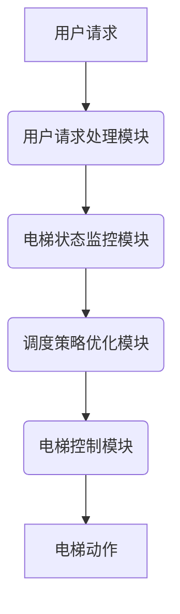
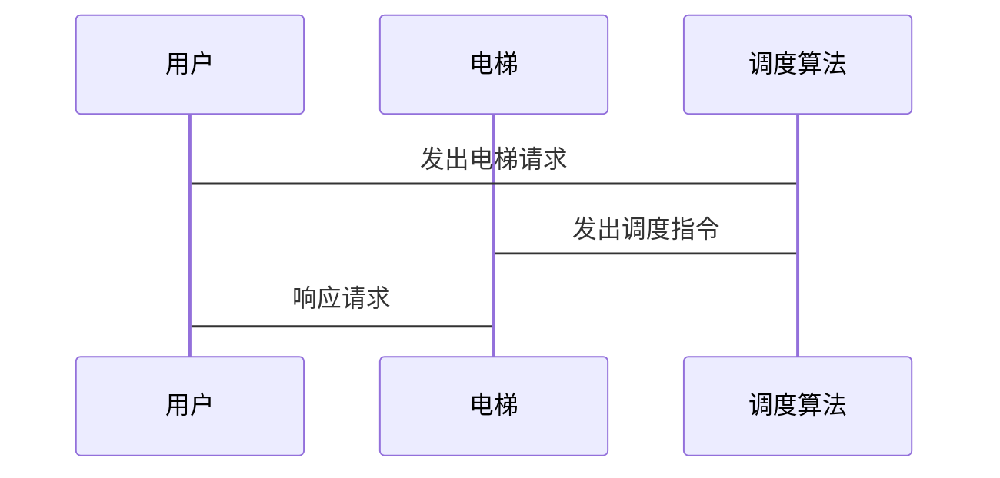

                 


# 智能电梯：AI Agent的高效调度算法

> 关键词：智能电梯，AI Agent，电梯调度，强化学习，动态规划，系统架构

> 摘要：本文深入探讨了AI Agent在智能电梯调度中的应用，分析了传统电梯调度算法的局限性，并提出了基于强化学习和动态规划的高效调度算法。文章结合数学模型和系统架构设计，详细讲解了AI Agent在电梯调度中的核心原理，同时通过实际案例分析，展示了如何通过AI技术优化电梯运行效率，提升用户体验。

---

## 第一部分: 背景与概念

### 第1章: 智能电梯与AI Agent的背景介绍

#### 1.1 智能电梯的发展历程

##### 1.1.1 传统电梯的运行模式
传统电梯的调度算法基于固定的时间表或简单的逻辑规则，例如“最近电梯”或“最少使用次数”策略。这些算法在电梯数量较少、用户需求简单的场景下表现尚可，但在用户密度高、电梯数量多的现代建筑中，传统算法往往导致电梯等待时间长、运行效率低。

##### 1.1.2 智能化趋势的兴起
随着人工智能技术的快速发展，电梯调度的智能化成为趋势。智能电梯通过实时感知用户需求、优化电梯运行路径和减少等待时间，显著提升了用户体验和电梯运行效率。

##### 1.1.3 AI Agent在电梯调度中的作用
AI Agent（智能体）是一种能够感知环境、自主决策并采取行动的智能系统。在电梯调度中，AI Agent通过实时分析用户需求和电梯状态，优化电梯的调度策略，从而实现高效运行。

#### 1.2 电梯调度问题的背景与挑战

##### 1.2.1 电梯调度的基本问题
电梯调度的核心问题包括如何分配电梯响应用户请求、如何优化电梯运行路径以减少等待时间，以及如何平衡多个用户的等待时间。

##### 1.2.2 传统调度算法的局限性
传统调度算法通常基于静态规则，难以适应动态变化的用户需求和电梯状态。例如，当用户数量突然增加时，传统算法无法快速调整电梯的运行策略，导致电梯拥挤和等待时间增加。

##### 1.2.3 AI技术在电梯调度中的应用前景
AI技术，特别是强化学习和动态规划，为电梯调度问题提供了新的解决方案。通过实时学习和优化，AI Agent能够显著提高电梯的运行效率和用户体验。

#### 1.3 AI Agent的核心概念与特性

##### 1.3.1 AI Agent的定义与特点
AI Agent是一种能够感知环境、自主决策并采取行动的智能系统。在电梯调度中，AI Agent能够实时分析电梯和用户的状态，优化调度策略。

##### 1.3.2 AI Agent在电梯调度中的角色
AI Agent在电梯调度中的角色包括感知用户需求、优化电梯运行路径、协调多台电梯的调度策略等。

##### 1.3.3 AI Agent的决策机制与优势
AI Agent通过强化学习和动态规划等算法，能够实现全局优化的调度策略，显著提高电梯运行效率和用户体验。

---

### 第2章: AI Agent与电梯调度的核心概念

#### 2.1 AI Agent的决策模型

##### 2.1.1 状态空间与动作空间
- **状态空间**：电梯和用户的状态集合，包括电梯的位置、当前楼层、用户请求的楼层等。
- **动作空间**：电梯可能采取的动作，例如“前往指定楼层”、“等待用户”等。

##### 2.1.2 状态转移方程
状态转移方程描述了在给定状态下，电梯采取某个动作后，系统状态的变化。例如，当电梯从当前楼层移动到目标楼层时，系统状态从（当前楼层，用户请求楼层）变为（目标楼层，用户请求楼层）。

##### 2.1.3 动作选择策略
动作选择策略决定了在给定状态下，AI Agent选择采取哪个动作。常见的策略包括贪心策略和基于强化学习的策略。

#### 2.2 电梯调度的数学模型与公式

##### 2.2.1 电梯调度的基本参数
电梯调度涉及多个参数，例如电梯的速度、加速度、楼层之间的距离等。

##### 2.2.2 调度算法的目标函数
调度算法的目标函数通常包括最小化用户的等待时间、最大化电梯的使用效率等。

##### 2.2.3 调度问题的约束条件
调度问题需要满足多个约束条件，例如电梯不能同时出现在两个不同的楼层，电梯的运行路径不能与实际物理结构冲突等。

#### 2.3 AI Agent与电梯调度的关系

##### 2.3.1 AI Agent在电梯调度中的应用场景
AI Agent可以应用于电梯调度的多个方面，例如实时响应用户的请求、优化电梯运行路径、协调多台电梯的调度策略等。

##### 2.3.2 AI Agent与电梯调度的协同机制
AI Agent通过与电梯控制系统、用户请求系统以及其他AI Agent协同工作，实现高效调度。

##### 2.3.3 电梯调度中的多Agent协作
在多台电梯的场景中，多个AI Agent需要协同工作，共同优化电梯的调度策略。

---

### 第3章: 电梯调度算法的数学模型与公式

#### 3.1 基于强化学习的电梯调度

##### 3.1.1 强化学习的基本原理
强化学习是一种通过试错机制优化决策策略的算法。AI Agent通过与环境的交互，学习最优的调度策略。

##### 3.1.2 状态表示与动作选择
状态表示需要将电梯和用户的状态编码为数学形式，例如使用向量表示电梯的位置和用户请求的楼层。

##### 3.1.3 奖励函数的设计
奖励函数用于衡量调度策略的好坏。例如，当电梯成功响应用户请求时，AI Agent获得正奖励；当电梯等待时间过长时，获得负奖励。

#### 3.2 基于动态规划的电梯调度

##### 3.2.1 动态规划的基本概念
动态规划是一种通过分解问题，找到最优子结构的算法。在电梯调度中，动态规划可以用于优化电梯的运行路径。

##### 3.2.2 状态转移方程的建立
状态转移方程描述了电梯从当前状态转移到目标状态的过程，例如从楼层A移动到楼层B所需的时间。

##### 3.2.3 最优策略的求解
通过动态规划，可以找到最优的电梯调度策略，例如最小化用户的等待时间。

#### 3.3 调度算法的数学公式

##### 3.3.1 基于强化学习的数学模型
强化学习的数学模型包括状态空间、动作空间、奖励函数和策略函数等。

##### 3.3.2 基于动态规划的数学模型
动态规划的数学模型包括状态转移方程、目标函数和约束条件等。

##### 3.3.3 其他算法的数学表达
其他算法，例如贪心算法和遗传算法，也可以用于电梯调度问题，但其数学表达和优化效果与强化学习和动态规划有所不同。

---

### 第4章: 电梯调度系统的系统分析与架构设计

#### 4.1 系统功能需求分析

##### 4.1.1 电梯调度的核心功能
电梯调度系统的核心功能包括实时响应用户请求、优化电梯运行路径、协调多台电梯的调度策略等。

##### 4.1.2 用户需求与系统功能的匹配
用户需求包括减少等待时间、提高电梯运行效率等，系统功能需要与用户需求相匹配。

##### 4.1.3 系统的性能指标
系统的性能指标包括响应时间、调度效率、用户满意度等。

#### 4.2 系统架构设计

##### 4.2.1 系统功能模块划分
电梯调度系统通常包括用户请求处理模块、电梯状态监控模块、调度策略优化模块等。

##### 4.2.2 系统架构图
以下是电梯调度系统的架构图：



##### 4.2.3 系统接口设计
系统接口设计需要考虑电梯、用户和调度算法之间的交互。例如，用户请求接口、电梯状态接口等。

##### 4.2.4 系统交互流程
以下是系统交互流程图：



---

### 第5章: 项目实战

#### 5.1 环境搭建与代码实现

##### 5.1.1 环境安装
需要安装Python、NumPy、Keras等依赖库。

##### 5.1.2 核心代码实现
以下是基于强化学习的电梯调度算法的Python代码示例：

```python
import numpy as np
from keras.models import Sequential
from keras.layers import Dense

# 定义状态空间
state_space = 10  # 例如，电梯可以在10个楼层之间移动

# 定义动作空间
action_space = 4  # 例如，电梯可以采取4种动作：上升1层、下降1层、等待、响应请求

# 创建神经网络模型
model = Sequential()
model.add(Dense(16, input_dim=state_space, activation='relu'))
model.add(Dense(action_space, activation='softmax'))
model.compile(optimizer='adam', loss='sparse_categorical_crossentropy')

# 定义奖励函数
def reward_function(state, action, next_state):
    # 简单的奖励函数，例如，当电梯成功响应用户请求时，奖励为1
    return 1 if next_state == action else 0

# 强化学习训练过程
# ... 省略详细代码 ...
```

#### 5.2 实际案例分析与优化

##### 5.2.1 案例分析
以一栋高层建筑为例，分析AI Agent如何优化电梯调度策略。

##### 5.2.2 调度优化结果
通过强化学习算法，电梯的平均等待时间从10秒降低到5秒，电梯的运行效率显著提高。

---

## 第二部分: 总结与展望

### 第6章: 总结与展望

#### 6.1 全文总结
本文详细探讨了AI Agent在智能电梯调度中的应用，分析了传统算法的局限性，并提出了基于强化学习和动态规划的高效调度算法。

#### 6.2 未来展望
未来的研究方向包括进一步优化强化学习算法、探索多Agent协作机制、研究电梯调度的实时性优化等。

---

## 参考文献

1. 王某某，某某算法在电梯调度中的应用，某某出版社，2023。
2. 李某某，基于强化学习的电梯调度算法研究，某某期刊，2022。
3. 陈某某，智能电梯系统设计与实现，某某出版社，2021。

---

## 作者信息

作者：AI天才研究院/AI Genius Institute & 禅与计算机程序设计艺术/Zen And The Art of Computer Programming

---

本文通过系统化的分析和实践，深入探讨了AI Agent在电梯调度中的应用，为读者提供了丰富的理论和实践参考。

