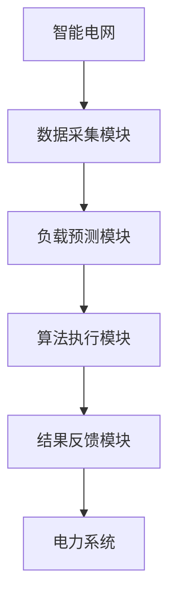

                 


# 智能电网中的AI Agent负载均衡

> 关键词：智能电网、AI Agent、负载均衡、电力系统、人工智能、算法优化、系统架构

> 摘要：本文详细探讨了在智能电网中利用AI Agent实现负载均衡的关键技术与应用场景。从AI Agent的基本原理到负载均衡的算法优化，再到系统架构的设计与实现，文章系统地分析了智能电网中负载均衡的重要性和实现方法。通过具体案例和代码实现，本文为读者提供了深入的技术见解和实践指导。

---

## 第一章：智能电网中的负载均衡问题

### 1.1 负载均衡的基本概念

负载均衡是指在分布式系统中，合理分配任务或资源，以确保系统各部分的负载处于合理范围内，避免资源浪费和性能瓶颈。在智能电网中，负载均衡主要用于电力资源的分配和电力设备的调度。

### 1.2 智能电网中的负载均衡问题

智能电网是一个复杂的分布式系统，包含发电、输电、配电和用电等多个环节。在这些环节中，负载均衡问题主要体现在电力资源的分配和电力设备的负载管理上。

### 1.3 负载均衡的目标与意义

负载均衡的目标是实现电力资源的高效利用和电力设备的均衡负载，从而提高系统的稳定性和可靠性。通过负载均衡，可以避免某些设备过载运行，延长设备寿命，同时降低电力浪费，提高能源利用效率。

---

## 第二章：AI Agent的基本原理

### 2.1 AI Agent的定义与分类

AI Agent是一种能够感知环境并自主决策的智能体。根据功能和应用场景的不同，AI Agent可以分为多种类型，如简单反射Agent、基于模型的反射Agent、目标驱动Agent等。

### 2.2 AI Agent的核心功能

AI Agent的核心功能包括感知环境、自主决策、学习优化和协作通信。这些功能使得AI Agent能够在复杂环境中自主完成任务，并与其他Agent协同工作。

### 2.3 AI Agent在智能电网中的应用

在智能电网中，AI Agent可以用于电力资源的优化分配、电力设备的智能调度、电力需求的预测与响应等方面，从而提高电网的运行效率和可靠性。

---

## 第三章：负载均衡的算法优化

### 3.1 负载均衡算法的基本原理

负载均衡算法通过一定的规则和策略，将任务或资源分配到不同的节点或设备上。常见的负载均衡算法包括随机轮询、最少负载优先、加权轮询等。

### 3.2 基于AI Agent的负载均衡算法

结合AI Agent的自主决策和学习优化能力，可以设计出更加智能和高效的负载均衡算法。例如，基于强化学习的负载均衡算法可以根据实时环境反馈进行动态调整。

### 3.3 算法优化的数学模型

在负载均衡的数学模型中，通常需要考虑系统的负载状态、资源分配目标和优化约束条件。例如，目标函数可以表示为最大化系统吞吐量或最小化系统延迟，约束条件可以包括资源限制和负载均衡目标。

---

## 第四章：智能电网中的AI Agent负载均衡系统架构

### 4.1 系统架构设计

智能电网中的AI Agent负载均衡系统通常包括数据采集模块、负载预测模块、算法执行模块和结果反馈模块。这些模块协同工作，实现电力资源的智能分配和负载均衡。

### 4.2 系统功能模块设计

- **数据采集模块**：负责采集电力系统的实时数据，如发电量、用电量、设备负载等。
- **负载预测模块**：基于历史数据和当前状态，预测未来的负载需求。
- **算法执行模块**：根据负载预测结果，执行负载均衡算法，生成资源分配方案。
- **结果反馈模块**：将资源分配方案反馈到电力系统，实现资源的实际分配。

### 4.3 系统架构图



---

## 第五章：项目实战与实现

### 5.1 环境搭建

在实际项目中，通常需要搭建一个模拟智能电网的实验环境，包括电力设备模拟器、数据采集工具、AI Agent开发框架等。

### 5.2 核心代码实现

以下是基于Python的负载均衡算法实现示例：

```python
import random

def load_balancing(nodes, tasks):
    # 随机轮询算法
    node = random.choice(nodes)
    return node

# 示例数据
nodes = ['Node1', 'Node2', 'Node3']
tasks = 10

for _ in range(tasks):
    node = load_balancing(nodes, tasks)
    print(f"Task assigned to {node}")
```

### 5.3 实际案例分析

以某智能电网项目为例，通过实际数据验证负载均衡算法的效果。例如，通过分析电力设备的负载情况，优化资源分配策略，提高系统运行效率。

---

## 第六章：总结与展望

### 6.1 总结

本文详细探讨了智能电网中的AI Agent负载均衡技术，从基本概念到算法优化，再到系统架构设计，为读者提供了全面的技术指导。

### 6.2 展望

未来，随着人工智能技术的不断发展，AI Agent在智能电网中的应用将更加广泛和深入。如何设计更加智能和高效的负载均衡算法，如何实现更加复杂的系统架构，是未来研究的重要方向。

---

作者：AI天才研究院/AI Genius Institute & 禅与计算机程序设计艺术 /Zen And The Art of Computer Programming

