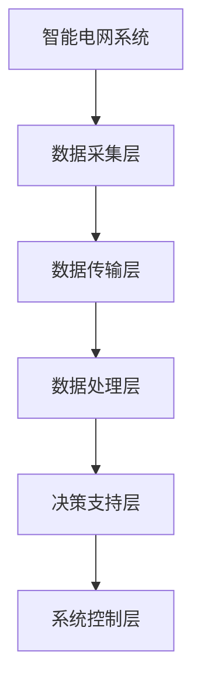
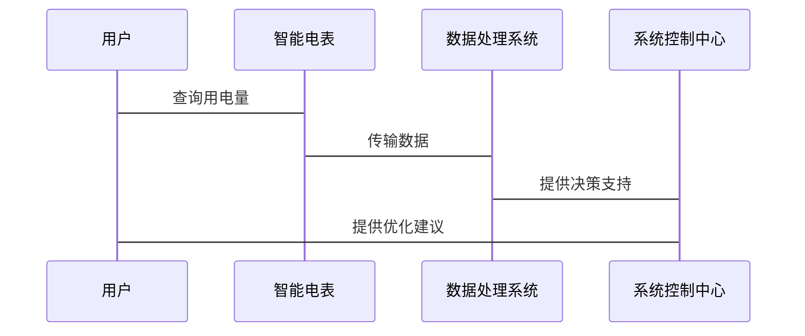

                 


# 智能电网技术在能源转型中的作用与投资

## 关键词：智能电网，能源转型，可再生能源，投资分析，系统架构，算法原理

## 摘要：智能电网技术作为现代电力系统的重要组成部分，正在能源转型中发挥着关键作用。随着全球能源结构向清洁化、低碳化方向调整，智能电网技术通过提高能源利用效率、支持可再生能源接入和促进能源市场开放，成为推动能源转型的核心技术之一。本文将从智能电网的核心技术、算法原理、系统架构、项目实战、投资分析和未来展望等多方面，详细探讨智能电网在能源转型中的作用与投资价值。

---

## 第1章：智能电网技术概述

### 1.1 智能电网的基本概念

#### 1.1.1 传统电网的局限性
传统电网在能源传输和分配过程中存在效率低下、难以适应分布式能源接入、用户参与度低等问题。例如，传统电网难以实时监测和管理分布式电源的波动性，导致能源浪费和系统不稳定性。

#### 1.1.2 智能电网的定义与特点
智能电网是以计算机技术、通信技术和信息技术为基础，通过智能化的监测、分析和控制，实现电力系统高效、可靠、经济运行的新型电力系统。其特点是高度智能化、分布式能源接入能力、用户参与度高和自适应性强。

#### 1.1.3 智能电网的核心技术
智能电网的核心技术包括智能输电、智能配电、智能用电和能源互联网技术。这些技术通过传感器、通信网络和数据分析系统，实现电力系统的实时监控和优化管理。

### 1.2 能源转型的背景与挑战

#### 1.2.1 全球能源结构的变化
全球能源结构正从化石能源向可再生能源转型，特别是风能、太阳能等清洁能源的快速发展，使得电力系统需要更加灵活和智能。

#### 1.2.2 可再生能源的发展趋势
随着技术进步和政策支持，可再生能源在电力系统中的占比不断提高。然而，可再生能源的波动性和间歇性对电力系统的稳定运行提出了更高的要求。

#### 1.2.3 能源转型中的技术挑战
能源转型面临的技术挑战包括可再生能源的不稳定性、分布式能源的接入问题、电力系统灵活性的提升以及能源存储技术的发展。

### 1.3 智能电网在能源转型中的作用

#### 1.3.1 提高能源利用效率
智能电网通过实时监控和优化管理，减少能源浪费，提高能源利用效率。例如，智能配电系统可以根据负荷变化动态调整电力分配。

#### 1.3.2 支持可再生能源的接入
智能电网通过智能输电和配电系统，支持分布式可再生能源的接入和管理，确保电力系统的稳定运行。例如，智能电网可以实时监测和调节分布式光伏和风能的输出。

#### 1.3.3 促进能源市场的开放与竞争
智能电网为能源市场的开放和竞争提供了技术基础。通过智能用电系统，用户可以参与电力市场，选择更经济的能源供应方式。

---

## 第2章：智能电网的核心技术

### 2.1 智能输电技术

#### 2.1.1 输电线路的状态监测
智能输电系统通过传感器和通信技术，实时监测输电线路的状态，包括温度、振动和绝缘性能等，确保输电系统的安全运行。

#### 2.1.2 智能变电站的建设
智能变电站采用数字化和自动化技术，实现变电站的智能化管理。例如，智能变电站可以自动调整变压器的运行状态，优化电力传输效率。

#### 2.1.3 输电系统中的智能化管理
智能输电系统通过大数据分析和人工智能技术，优化输电系统的运行策略，提高电力传输的可靠性和效率。

### 2.2 智能配电技术

#### 2.2.1 配电自动化系统
配电自动化系统通过智能终端和通信网络，实现配电系统的实时监控和自动化管理。例如，配电系统可以自动检测故障并进行自愈修复。

#### 2.2.2 分布式电源的接入与管理
智能配电系统支持分布式电源（如光伏发电和风力发电）的接入，并通过智能算法优化电力分配，确保电力系统的稳定运行。

#### 2.2.3 配电网的自愈能力
智能配电系统具有自愈能力，能够在发生故障时快速定位故障点并进行修复，减少停电时间。

### 2.3 智能用电技术

#### 2.3.1 智能电表的应用
智能电表通过实时监测用户的用电量和电价变化，帮助用户优化用电行为，降低能源消耗。

#### 2.3.2 用户侧的能源管理
智能用电系统通过用户侧的能源管理系统，实现家庭或企业的能源优化管理。例如，用户可以通过智能电表和手机应用程序实时查看用电情况并进行控制。

#### 2.3.3 需求响应技术
智能用电系统通过需求响应技术，根据电力系统的需求和用户的用电行为，优化电力分配，减少高峰时期的电力需求。

### 2.4 能源互联网的概念与实现

#### 2.4.1 能源互联网的定义
能源互联网是以电力系统为核心，结合热力、燃气等能源系统，形成一个综合性的能源网络。能源互联网的目标是实现多种能源的协同优化和高效利用。

#### 2.4.2 能源互联网的架构
能源互联网的架构包括能源生产、传输、分配和消费四个环节。通过智能电网技术和能源互联网架构，实现多种能源的协同管理和优化。

#### 2.4.3 能源互联网的技术挑战
能源互联网的实现需要克服技术上的诸多挑战，包括多种能源的协同管理、能源存储技术的突破以及能源系统的安全性等问题。

---

## 第3章：智能电网中的算法与数学模型

### 3.1 智能电网中的算法概述

#### 3.1.1 状态估计算法
状态估计算法用于估计电力系统的运行状态，包括节点电压和线路潮流等。常用的状态估计算法包括最小二乘法和最优滤波算法。

#### 3.1.2 潮流计算算法
潮流计算算法用于计算电力系统的潮流分布，包括电压和电流的分布。常用的潮流计算算法包括牛顿-拉夫逊法和PQ分解法。

#### 3.1.3 负荷预测算法
负荷预测算法用于预测电力系统的负荷需求，帮助电力公司优化电力生产计划。常用的负荷预测算法包括时间序列分析和机器学习算法。

### 3.2 算法的数学模型

#### 3.2.1 状态估计的数学模型
状态估计算法的数学模型如下：
$$
\hat{x} = (J^T J)^{-1} J^T y
$$
其中，$x$ 是状态向量，$y$ 是观测向量，$J$ 是雅可比矩阵。

#### 3.2.2 潮流计算的数学模型
潮流计算的数学模型如下：
$$
P_i = \sum_{j} G_{ij} V_i V_j \cos\theta_{ij} + B_{ij} V_i V_j \sin\theta_{ij}
$$
$$
Q_i = \sum_{j} G_{ij} V_i V_j \sin\theta_{ij} - B_{ij} V_i V_j \cos\theta_{ij}
$$
其中，$P_i$ 和 $Q_i$ 分别是节点 $i$ 的有功和无功功率，$G_{ij}$ 和 $B_{ij}$ 是节点 $i$ 和 $j$ 之间的导纳，$V_i$ 和 $V_j$ 是节点 $i$ 和 $j$ 的电压，$\theta_{ij}$ 是节点 $i$ 和 $j$ 之间的相角。

#### 3.2.3 负荷预测的数学模型
负荷预测的数学模型如下：
$$
y_t = \alpha y_{t-1} + \beta y_{t-2} + \gamma
$$
其中，$y_t$ 是预测时刻 $t$ 的负荷，$\alpha$、$\beta$ 和 $\gamma$ 是模型参数。

---

## 第4章：智能电网的系统架构

### 4.1 系统架构设计

#### 4.1.1 问题场景介绍
智能电网系统的架构设计需要考虑多方面的因素，包括能源的生产、传输、分配和消费，以及系统的实时监控和优化管理。

#### 4.1.2 系统功能设计
智能电网系统的功能设计包括数据采集、数据传输、数据处理、决策支持和系统控制等部分。通过功能设计，实现电力系统的智能化管理。

#### 4.1.3 系统架构图
以下是智能电网系统的架构图：



#### 4.1.4 系统交互图
以下是智能电网系统的交互图：



---

## 第5章：智能电网项目的实战

### 5.1 项目背景与目标

#### 5.1.1 项目背景
本项目旨在通过智能电网技术实现某地区的电力系统优化管理，提高能源利用效率，支持可再生能源的接入。

#### 5.1.2 项目目标
项目的总体目标是实现电力系统的智能化管理，包括电力传输、分配和消费的优化，支持分布式能源的接入和管理。

### 5.2 系统实现

#### 5.2.1 环境安装
项目实施需要安装和配置以下软件和硬件：
- 操作系统：Linux
- 数据库：MySQL
- 通信模块：Modbus
- 传感器：温度传感器、电压传感器
- 控制系统：SCADA

#### 5.2.2 核心代码实现
以下是智能电网系统的部分核心代码：

```python
import numpy as np

def state_estimation(J, y):
    return np.linalg.inv(J.T @ J) @ J.T @ y

def power_flow(G, B, V, theta):
    P = np.zeros_like(V)
    Q = np.zeros_like(V)
    for i in range(len(V)):
        for j in range(len(V)):
            P[i] += G[i,j] * V[i] * V[j] * np.cos(theta[i,j])
            Q[i] += B[i,j] * V[i] * V[j] * np.sin(theta[i,j])
    return P, Q

def load_forecast(y):
    alpha = 0.5
    beta = 0.3
    gamma = 0.2
    return alpha * y[-1] + beta * y[-2] + gamma
```

#### 5.2.3 代码解读与分析
上述代码实现了几种智能电网中的算法，包括状态估计算法、潮流计算算法和负荷预测算法。通过这些算法，可以实现电力系统的智能化管理。

---

## 第6章：智能电网的投资分析

### 6.1 投资回报分析

#### 6.1.1 项目投资成本
智能电网项目的投资成本包括硬件设备、软件开发、系统集成和人员培训等费用。根据实际项目规模和需求，投资成本可能在几百万到上亿美元之间。

#### 6.1.2 投资回报周期
智能电网项目的投资回报周期通常在5到10年之间，具体取决于项目的规模和实施效果。

### 6.2 风险评估与管理

#### 6.2.1 技术风险
技术风险包括智能电网技术的成熟度和可靠性。为了降低技术风险，需要选择成熟的技术方案，并进行充分的测试和验证。

#### 6.2.2 市场风险
市场风险包括能源市场需求的变化和政策变化。为了降低市场风险，需要密切关注市场动态和政策变化，及时调整项目实施策略。

### 6.3 投资策略建议

#### 6.3.1 短期投资策略
短期投资策略包括优先投资智能输电和配电系统，逐步实现电力系统的智能化管理。

#### 6.3.2 中长期投资策略
中长期投资策略包括加大对能源互联网技术的研发和应用，推动多种能源的协同优化和高效利用。

---

## 第7章：智能电网的未来展望

### 7.1 能源互联网的发展趋势
能源互联网的发展是智能电网技术未来的重要方向。通过能源互联网技术，可以实现多种能源的协同管理和优化，提高能源利用效率。

### 7.2 人工智能在智能电网中的应用
人工智能技术在智能电网中的应用将更加广泛，包括智能预测、智能控制和智能决策等方面。人工智能技术的引入将显著提高智能电网的智能化水平。

### 7.3 智能电网的技术挑战
智能电网技术的发展面临诸多挑战，包括技术成熟度、系统安全性、能源存储技术等。为了应对这些挑战，需要加强技术创新和研发投入。

---

## 结语

智能电网技术在能源转型中的作用日益重要。通过智能电网技术，可以实现电力系统的智能化管理，提高能源利用效率，支持可再生能源的接入和优化管理。随着技术的不断进步和应用的深入，智能电网将在未来能源系统中发挥更加重要的作用。

---

## 作者：AI天才研究院 & 禅与计算机程序设计艺术

