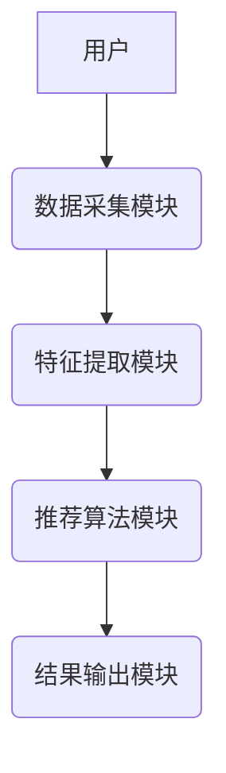

                 


# 智能电视：AI Agent的内容个性化推荐

> 关键词：智能电视, AI Agent, 内容推荐, 个性化推荐, 人工智能, 机器学习

> 摘要：本文探讨了智能电视中AI Agent如何通过内容个性化推荐提升用户体验。文章从背景介绍、推荐算法、系统架构到项目实战，详细分析了AI Agent在智能电视中的应用，结合数学模型和实际案例，为开发者和用户提供深度技术见解。

---

## 第1章: 智能电视与AI Agent概述

### 1.1 智能电视的定义与特点

#### 1.1.1 智能电视的定义
智能电视是一种结合了传统电视功能与智能设备特点的电子设备，它不仅能够接收传统电视信号，还具备互联网连接、数据处理和应用程序运行能力。智能电视通过内置的智能系统，可以实现视频点播、应用程序安装、语音控制等多种功能。

#### 1.1.2 智能电视的核心特点
- **互联网连接**：支持Wi-Fi或有线网络连接，能够访问互联网资源。
- **智能系统**：内置操作系统（如Android TV、Tizen等），支持安装应用程序。
- **语音控制**：通过语音助手（如Google Assistant、Amazon Alexa）实现人机交互。
- **多设备连接**：支持与其他智能设备（如手机、智能家居）联动。

#### 1.1.3 智能电视的发展历程
智能电视的发展经历了从传统电视到智能电视的演变。早期的智能电视主要以视频点播和应用程序扩展为主，而现代智能电视则更加注重用户体验和人工智能技术的集成，例如个性化推荐系统。

---

### 1.2 AI Agent的基本概念

#### 1.2.1 AI Agent的定义
AI Agent（人工智能代理）是指能够感知环境、自主决策并执行任务的智能实体。AI Agent可以是软件程序或硬件设备，通过传感器、数据输入和算法处理，实现特定目标。

#### 1.2.2 AI Agent的核心属性
- **感知能力**：通过传感器或数据输入接口获取环境信息。
- **决策能力**：基于获取的信息，通过算法做出决策。
- **执行能力**：根据决策结果执行操作。
- **学习能力**：通过机器学习不断优化自身行为。

#### 1.2.3 AI Agent与传统算法的区别
AI Agent的核心区别在于其具备自主决策和学习能力，能够根据环境动态调整行为，而传统算法通常是在固定规则下运行，不具备自主性和学习能力。

---

### 1.3 智能电视中AI Agent的应用场景

#### 1.3.1 内容推荐的基本问题
智能电视的内容推荐系统需要解决以下问题：
- 如何根据用户的观看历史、偏好推荐相关内容。
- 如何处理海量数据，实时提供推荐结果。

#### 1.3.2 AI Agent在内容推荐中的作用
AI Agent通过分析用户的观看行为、偏好和实时反馈，动态调整推荐策略，提供更精准的内容推荐。

#### 1.3.3 个性化推荐的核心目标
个性化推荐的核心目标是根据用户的兴趣和行为，推荐高度相关的视频内容，提升用户体验。

---

### 1.4 本章小结
本章介绍了智能电视的定义、特点及其发展历程，并详细阐述了AI Agent的基本概念和核心属性。通过分析AI Agent在智能电视中的应用场景，为后续内容推荐系统的实现奠定了基础。

---

## 第2章: 内容推荐系统的原理与算法

### 2.1 内容推荐系统的原理

#### 2.1.1 推荐系统的定义与分类
推荐系统是一种根据用户行为和数据，预测用户兴趣并推荐相关内容的技术。推荐系统可以分为基于协同过滤、基于内容的推荐和混合推荐三种类型。

#### 2.1.2 基于协同过滤的推荐算法
协同过滤是一种基于用户行为相似性进行推荐的方法，分为基于用户的协同过滤和基于物品的协同过滤。

##### 用户协同过滤公式
$$ sim(u, v) = \frac{\sum_{i} (r_{u,i} - \bar{r}_u)(r_{v,i} - \bar{r}_v)}{\sqrt{\sum_{i} (r_{u,i} - \bar{r}_u)^2} \sqrt{\sum_{i} (r_{v,i} - \bar{r}_v)^2}} $$
其中，$sim(u, v)$ 表示用户 $u$ 和用户 $v$ 的相似度，$r_{u,i}$ 表示用户 $u$ 对物品 $i$ 的评分，$\bar{r}_u$ 表示用户 $u$ 的平均评分。

##### 物品协同过滤公式
$$ sim(i, j) = \frac{\sum_{u} (r_{u,i} - \bar{r}_u)(r_{u,j} - \bar{r}_u)}{\sqrt{\sum_{u} (r_{u,i} - \bar{r}_u)^2} \sqrt{\sum_{u} (r_{u,j} - \bar{r}_u)^2}} $$
其中，$sim(i, j)$ 表示物品 $i$ 和物品 $j$ 的相似度，$r_{u,i}$ 表示用户 $u$ 对物品 $i$ 的评分，$\bar{r}_u$ 表示用户 $u$ 的平均评分。

#### 2.1.3 基于内容的推荐算法
基于内容的推荐算法通过分析内容本身的特征（如文本、图像）进行推荐，常用技术包括TF-IDF和Word2Vec。

#### 2.1.4 混合推荐算法
混合推荐算法结合了协同过滤和基于内容的推荐方法，通过集成多种推荐策略提高推荐准确率。

---

### 2.2 AI Agent在推荐系统中的角色

#### 2.2.1 AI Agent作为推荐系统的决策者
AI Agent通过分析用户行为和偏好，制定推荐策略并执行推荐操作。

#### 2.2.2 AI Agent的多目标优化
AI Agent需要在推荐准确率和计算效率之间进行权衡，实现多目标优化。

#### 2.2.3 AI Agent的实时性与响应速度
AI Agent需要在实时场景中快速响应用户需求，这对算法的效率提出了更高要求。

---

### 2.3 个性化推荐的核心算法

#### 2.3.1 基于深度学习的推荐模型
基于深度学习的推荐模型（如神经网络）能够捕捉用户行为的复杂模式，提升推荐准确率。

#### 2.3.2 基于强化学习的推荐策略
强化学习通过不断试错优化推荐策略，实现动态调整。

#### 2.3.3 基于知识图谱的推荐系统
知识图谱将实体和关系显式表示，帮助推荐系统更好地理解内容语义。

---

### 2.4 本章小结
本章详细介绍了内容推荐系统的原理和算法，重点讲解了基于协同过滤、内容分析和深度学习的推荐方法，并分析了AI Agent在推荐系统中的角色和作用。

---

## 第3章: AI Agent推荐系统的算法原理

### 3.1 推荐算法的数学模型与公式

#### 3.1.1 基于神经网络的推荐模型
神经网络推荐模型通过多层感知机（MLP）提取特征，捕捉用户和内容的隐含关系。

#### 3.1.2 基于注意力机制的推荐模型
注意力机制通过加权用户行为，突出重要特征，提升推荐精度。

$$ att(u, i) = \alpha \cdot q^T k + (1 - \alpha) \cdot q^T v $$
其中，$q$ 是查询向量，$k$ 和 $v$ 是键向量和值向量，$\alpha$ 是调整系数。

---

### 3.2 系统架构设计

#### 3.2.1 系统功能设计
系统功能包括数据采集、特征提取、推荐算法和结果输出。

#### 3.2.2 系统架构图


#### 3.2.3 系统接口设计
系统接口包括用户输入接口、数据存储接口和推荐结果展示接口。

---

### 3.3 项目实战

#### 3.3.1 环境安装
推荐系统需要安装以下环境：
- Python 3.8+
- TensorFlow 2.0+
- Keras
- scikit-learn

#### 3.3.2 系统核心实现
以下是基于协同过滤的推荐系统实现代码：
```python
def user_based_recommendation(users, items, ratings, k=5):
    # 计算用户相似度
    user_similarity = {}
    for u in users:
        user_similarity[u] = {}
        for v in users:
            if u != v:
                similarity = calculate_similarity(u, v, ratings)
                user_similarity[u][v] = similarity

    # 生成推荐列表
    recommendations = {}
    for u in users:
        similar_users = sorted(user_similarity[u].items(), key=lambda x: x[1], reverse=True)[:k]
        recommendations[u] = []
        for v, _ in similar_users:
            recommendations[u].extend(get_top_items(v, items, ratings))

    return recommendations
```

---

### 3.4 案例分析与总结
通过实际案例分析，验证推荐系统的性能和效果，总结优化方向。

---

## 第4章: 总结与展望

### 4.1 本章总结
本文全面探讨了智能电视中AI Agent的内容个性化推荐技术，分析了推荐系统的原理和实现方法。

### 4.2 未来展望
未来，随着AI技术的进步，智能电视的推荐系统将更加智能化和个性化，结合边缘计算和实时反馈，提供更优质的服务。

---

## 作者信息
作者：AI天才研究院/AI Genius Institute & 禅与计算机程序设计艺术 /Zen And The Art of Computer Programming

