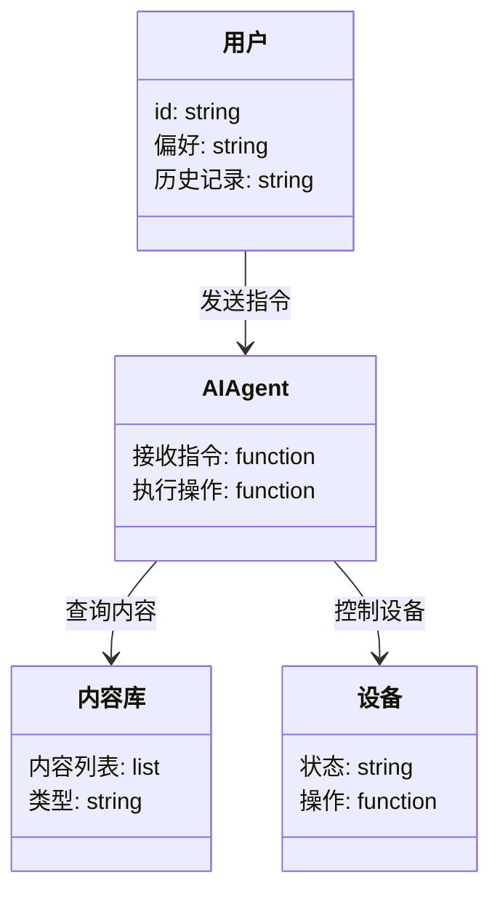
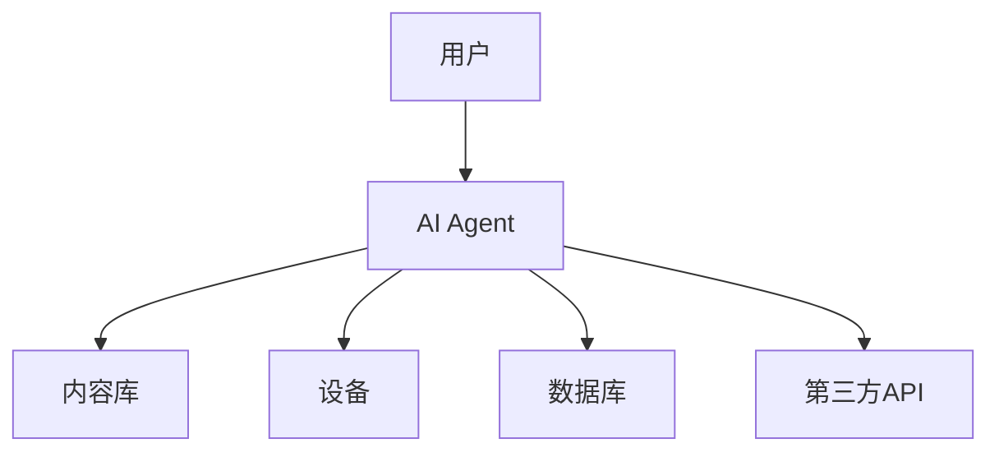
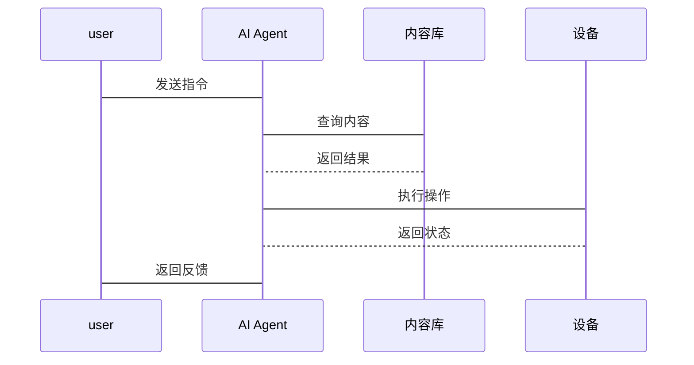

                 


# 智能电视：AI Agent的家庭娱乐管家系统

## 关键词：智能电视、AI Agent、家庭娱乐、管家系统、自然语言处理、推荐算法、系统架构

## 摘要：本文探讨AI Agent在智能电视中的应用，重点分析其如何成为家庭娱乐的全能管家。通过介绍AI Agent的核心原理、系统架构设计、推荐算法以及项目实战，深入解析智能电视的家庭娱乐管家系统的实现与优化。

---

# 第1章: 智能电视的发展历程

## 1.1 传统电视的功能与局限

### 1.1.1 传统电视的功能特点
传统电视作为家庭娱乐的核心设备，主要功能包括接收电视节目、播放视频内容以及简单的设置调节。它通过物理按钮或遥控器进行操作，功能相对单一，无法实现智能化服务。

### 1.1.2 传统电视的局限性
传统电视的局限性主要体现在以下几个方面：
- **操作复杂**：用户需要通过物理按钮或遥控器进行操作，体验不够便捷。
- **内容单一**：传统电视的内容主要依赖于电视台的播放列表，缺乏个性化推荐。
- **无法联网**：传统电视无法接入互联网，无法获取最新的娱乐资讯和多样化的内容。

### 1.1.3 电视从单一娱乐工具到家庭中心的演变
随着科技的发展，电视逐渐从单一的娱乐工具演变为家庭娱乐的核心设备。智能电视的出现，使得电视能够连接互联网，具备更多的功能，如视频点播、智能推荐、多设备联动等。这种演变不仅提升了用户体验，还为AI Agent的应用提供了基础。

---

# 第2章: AI Agent的基本概念

## 2.1 什么是AI Agent

### 2.1.1 AI Agent的定义
AI Agent（人工智能代理）是指能够感知环境、自主决策并执行任务的智能实体。它通过与用户交互或与其他系统通信，帮助用户完成特定任务或提供信息服务。

### 2.1.2 AI Agent的核心特征
AI Agent的核心特征包括：
1. **自主性**：能够在没有人工干预的情况下自主运行。
2. **反应性**：能够感知环境并实时做出反应。
3. **目标导向**：具备明确的目标，并能够采取行动实现目标。
4. **学习能力**：能够通过数据和经验不断优化自身性能。

### 2.1.3 AI Agent与传统软件的区别
AI Agent与传统软件的区别主要体现在以下几个方面：
- **智能化**：AI Agent具备学习和推理能力，能够适应不同的环境和需求。
- **自主性**：AI Agent能够自主决策并执行任务，而传统软件需要人工干预。
- **交互性**：AI Agent能够与用户或系统进行实时交互，提供动态服务。

---

# 第3章: 智能电视中的AI Agent

## 3.1 AI Agent在智能电视中的作用

### 3.1.1 AI Agent如何提升用户体验
AI Agent通过智能化服务，显著提升了智能电视的用户体验。它能够根据用户的偏好推荐内容、优化搜索结果、实现语音交互等，使用户能够更方便地获取所需信息。

### 3.1.2 AI Agent在智能电视中的应用场景
在智能电视中，AI Agent的应用场景包括：
1. **智能搜索**：用户可以通过语音或文本输入搜索内容，AI Agent能够快速理解需求并返回相关结果。
2. **个性化推荐**：AI Agent能够根据用户的观看历史和偏好，推荐相关内容。
3. **多设备联动**：AI Agent可以与其他智能家居设备联动，实现跨设备的协同工作。

### 3.1.3 AI Agent如何实现家庭娱乐管家功能
AI Agent通过以下方式实现家庭娱乐管家功能：
1. **内容推荐**：基于用户的观看历史和偏好，推荐电影、电视剧、综艺节目等内容。
2. **智能搜索**：通过自然语言处理技术，快速理解用户的搜索需求并返回相关结果。
3. **语音交互**：支持语音指令，用户可以通过语音控制电视播放、暂停、快进等功能。

---

# 第4章: 家庭娱乐管家系统的概念

## 4.1 家庭娱乐管家系统的定义
家庭娱乐管家系统是指通过AI Agent技术，为用户提供智能化的家庭娱乐服务的系统。它能够根据用户的偏好和需求，自动推荐和管理娱乐内容，优化用户体验。

### 4.1.1 系统的功能定位
家庭娱乐管家系统的功能定位是通过智能化服务，提升家庭娱乐体验。它不仅能够推荐内容，还能够管理娱乐设备、协调家庭成员的娱乐需求等。

### 4.1.2 系统的核心目标
家庭娱乐管家系统的核心目标包括：
1. 提供个性化的娱乐内容推荐。
2. 实现多设备的协同工作。
3. 提供智能化的用户交互体验。

### 4.1.3 系统的边界与外延
家庭娱乐管家系统的边界主要在家庭娱乐领域，外延则包括与其他智能家居设备的联动、与其他娱乐平台的接口集成等。

---

# 第5章: AI Agent与家庭娱乐管家系统的结合

## 5.1 AI Agent在家庭娱乐管家系统中的角色

### 5.1.1 AI Agent作为家庭娱乐管家的核心驱动力
AI Agent通过智能化服务，成为家庭娱乐管家的核心驱动力。它不仅能够理解用户需求，还能够自主决策并执行任务。

### 5.1.2 AI Agent如何实现智能化服务
AI Agent通过自然语言处理、意图识别、推荐算法等技术，实现智能化服务。它能够理解用户的语音指令，分析用户的偏好，并根据数据进行内容推荐。

### 5.1.3 AI Agent在家庭娱乐管家系统中的功能模块
AI Agent在家庭娱乐管家系统中的功能模块包括：
1. **用户交互模块**：通过语音或文本与用户进行交互。
2. **内容推荐模块**：基于用户数据推荐娱乐内容。
3. **设备控制模块**：控制智能家居设备的运行。

---

# 第6章: AI Agent的核心原理

## 6.1 自然语言处理（NLP）在AI Agent中的应用

### 6.1.1 NLP的基本原理
自然语言处理（NLP）是指通过计算机对人类语言的处理和理解，实现人机交互的技术。其基本原理包括文本分割、词法分析、句法分析、语义分析等。

### 6.1.2 NLP在对话系统中的实现
在对话系统中，NLP通过理解用户的输入，生成合适的回复。这包括意图识别、实体识别、情感分析等功能。

### 6.1.3 NLP在家庭娱乐管家中的具体应用
在家庭娱乐管家中，NLP主要用于语音交互和内容推荐。例如，用户可以通过语音指令搜索电影，AI Agent通过NLP技术理解用户的意图并返回相关结果。

---

## 6.2 AI Agent的意图识别与推理

### 6.2.1 意图识别的基本原理
意图识别是指通过分析用户的输入，确定用户的意图或目标。其基本原理包括特征提取、模型训练、结果判定等。

### 6.2.2 基于深度学习的意图识别模型
基于深度学习的意图识别模型通常使用卷积神经网络（CNN）或循环神经网络（RNN）进行训练。模型通过大量数据学习，能够准确识别用户的意图。

### 6.2.3 意图识别在家庭娱乐管家中的应用
在家庭娱乐管家中，意图识别用于理解用户的指令并执行相应的操作。例如，当用户说“我想看动作片”，AI Agent通过意图识别确定用户的意图是观看动作片。

---

## 6.3 AI Agent的推荐算法

### 6.3.1 推荐算法的基本原理
推荐算法通过分析用户的行为和偏好，推荐相关内容。其基本原理包括数据收集、特征提取、模型训练等。

### 6.3.2 基于协同过滤的推荐算法
基于协同过滤的推荐算法通过分析用户的行为，找到与当前用户相似的用户，并推荐相似的内容。

### 6.3.3 基于内容的推荐算法
基于内容的推荐算法通过分析内容的特征，推荐与当前内容相似的内容。

### 6.3.4 混合推荐算法
混合推荐算法结合了协同过滤和内容推荐的优点，能够提供更精准的推荐结果。

---

## 6.4 AI Agent的数学模型和公式

### 6.4.1 意图识别的数学模型
意图识别的数学模型通常包括特征向量、分类器等。例如，使用支持向量机（SVM）进行分类。

$$ \text{SVM} = \text{maximize} \, \omega \cdot y - \text{偏差项} $$

### 6.4.2 推荐算法的数学模型
推荐算法的数学模型通常包括矩阵分解、相似度计算等。例如，使用矩阵分解进行协同过滤。

$$ \text{推荐得分} = \sum_{i=1}^{n} w_i x_i $$

---

# 第7章: AI Agent的系统架构设计

## 7.1 系统功能设计
家庭娱乐管家系统的功能设计包括用户交互、内容推荐、设备控制等模块。通过类图和流程图展示系统的功能模块及其交互关系。

### 7.1.1 领域模型
领域模型是一个家庭娱乐管家系统的类图，展示了系统中的主要实体及其关系。



---

## 7.2 系统架构设计

### 7.2.1 系统架构图
系统架构图展示了家庭娱乐管家系统的整体架构，包括前端、后端、数据库、第三方接口等部分。



---

## 7.3 系统接口设计

### 7.3.1 系统接口描述
系统接口设计包括用户与AI Agent的交互接口、AI Agent与内容库的接口、AI Agent与设备的接口等。

### 7.3.2 系统交互流程图
系统交互流程图展示了用户与AI Agent之间的交互流程。



---

# 第8章: 项目实战

## 8.1 环境安装

### 8.1.1 系统需求
项目实战需要安装Python、TensorFlow、Keras等工具。以下是具体环境配置：

```bash
Python 3.7+
TensorFlow 2.0+
Keras 2.0+
```

---

## 8.2 核心代码实现

### 8.2.1 AI Agent的核心代码
以下是AI Agent的核心代码示例：

```python
class AI-Agent:
    def __init__(self):
        self.nlp_model = load_model('nlp_model.h5')
        self.recommendation_model = load_model('recommendation_model.h5')
    
    def process_input(self, input_str):
        # 使用NLP模型处理输入
        intent = self.nlp_model.predict(input_str)
        return intent
    
    def recommend_content(self, user_id):
        # 使用推荐模型推荐内容
        recommendations = self.recommendation_model.predict(user_id)
        return recommendations
```

---

## 8.3 代码解读与分析

### 8.3.1 代码功能解读
AI Agent的核心代码包括NLP模型和推荐模型的加载与调用。`process_input`方法用于处理用户的输入，`recommend_content`方法用于推荐娱乐内容。

### 8.3.2 代码实现细节
代码实现细节包括模型的加载、输入的处理、推荐结果的返回等。需要确保模型的准确性和系统的稳定性。

---

## 8.4 实际案例分析

### 8.4.1 案例背景
假设用户说：“我想看喜剧片”。AI Agent需要通过NLP模型识别用户的意图，并推荐相关的喜剧片。

### 8.4.2 系统交互流程
1. 用户发送指令：“我想看喜剧片”。
2. AI Agent通过NLP模型识别用户的意图是喜剧片。
3. AI Agent调用推荐模型，根据用户的偏好推荐喜剧片。
4. 系统返回推荐结果。

---

## 8.5 项目小结
通过项目实战，我们能够更好地理解AI Agent在家庭娱乐管家系统中的应用。代码实现需要确保模型的准确性和系统的稳定性，同时注重用户体验的优化。

---

# 第9章: 最佳实践与注意事项

## 9.1 最佳实践

### 9.1.1 系统设计
在系统设计中，需要注意模块的划分和接口的规范。确保系统的可扩展性和可维护性。

### 9.1.2 系统优化
系统优化包括算法的优化、系统的性能优化等。需要不断测试和调整，确保系统的高效运行。

### 9.1.3 用户体验
用户体验是家庭娱乐管家系统的核心。需要注重交互设计，提升用户的使用体验。

---

## 9.2 注意事项

### 9.2.1 数据安全
在家庭娱乐管家系统中，用户数据的安全性至关重要。需要采取有效的数据加密和访问控制措施。

### 9.2.2 系统兼容性
系统需要具备良好的兼容性，能够与多种设备和平台进行对接。

### 9.2.3 系统稳定性
系统的稳定性直接关系到用户体验。需要确保系统的高可用性和容错能力。

---

# 作者：AI天才研究院/AI Genius Institute & 禅与计算机程序设计艺术 /Zen And The Art of Computer Programming

---

通过以上章节的分析和讲解，我们深入探讨了AI Agent在智能电视中的应用，以及其作为家庭娱乐管家系统的核心作用。希望本文能够为读者提供有价值的参考和启发。

