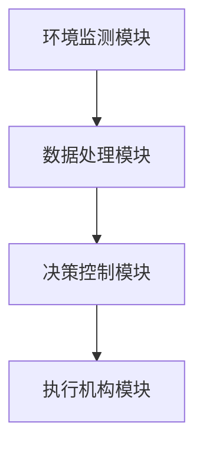
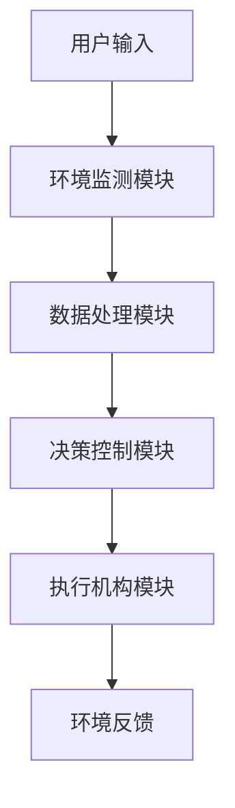
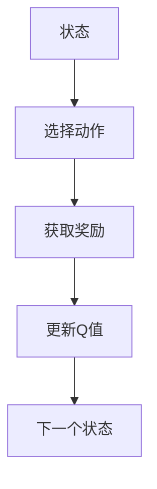
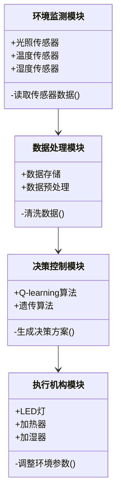

                 


# 智能窗台：AI Agent的室内植物生长优化

> 关键词：AI Agent，室内植物，生长优化，智能窗台，环境感知，机器学习，植物护理

> 摘要：本文将探讨如何利用AI Agent技术优化室内植物的生长环境。通过分析AI Agent的核心原理、算法实现、系统架构及实际案例，本文将详细阐述如何利用智能化手段实现室内植物的高效生长优化。从环境感知到决策控制，从数学建模到算法实现，本文将为读者提供一个全面的技术视角。

---

# 第一部分: AI Agent与室内植物生长优化概述

## 第1章: 背景介绍与问题定义

### 1.1 AI Agent的基本概念

#### 1.1.1 什么是AI Agent
AI Agent（人工智能代理）是指能够感知环境、自主决策并执行任务的智能实体。它通过传感器获取信息，利用算法进行分析，并通过执行器与环境交互。

$$
\text{AI Agent} = \{\text{感知} \rightarrow \text{决策} \rightarrow \text{执行}\}
$$

#### 1.1.2 AI Agent的核心特征
- **自主性**：能够在没有外部干预的情况下独立运行。
- **反应性**：能够实时感知环境变化并做出反应。
- **目标导向**：具备明确的目标导向性，追求最优解决方案。

#### 1.1.3 AI Agent与传统自动化的区别
| 特性       | AI Agent                 | 传统自动化               |
|------------|--------------------------|--------------------------|
| 智能性     | 高                       | 低                       |
| 灵活性     | 强                       | 弱                       |
| 决策能力   | 基于复杂算法             | 基于预设规则             |

### 1.2 室内植物生长优化的背景

#### 1.2.1 室内植物种植的现状
- 随着城市化进程加快，越来越多的人在室内种植植物。
- 室内植物不仅能美化环境，还能改善空气质量。

#### 1.2.2 室内植物生长的影响因素
- **光照**：不同植物对光照的需求不同。
- **温度**：温度过高或过低会影响植物生长。
- **湿度**：湿度不足会导致植物枯萎。
- **养分**：土壤中的养分供应影响植物健康。

#### 1.2.3 室内植物种植的挑战与痛点
- **环境复杂性**：室内环境多变，难以精确控制。
- **人工成本高**：需要频繁浇水、修剪等。
- **缺乏实时监测**：难以及时发现并解决问题。

### 1.3 AI Agent在室内植物生长优化中的应用

#### 1.3.1 AI Agent如何优化植物生长
- **实时监测**：通过传感器获取植物生长环境数据。
- **智能决策**：基于数据进行分析并制定最优方案。
- **自动执行**：通过执行器自动调整环境参数。

#### 1.3.2 AI Agent在室内种植中的具体应用场景
- **智能浇水**：根据土壤湿度自动调整浇水频率。
- **智能光照**：根据光照强度自动调节光源亮度。
- **智能温控**：根据室内温度自动调节空调或加热设备。

#### 1.3.3 AI Agent与室内植物生长优化的结合点
- **环境感知**：通过传感器获取光照、温度、湿度等数据。
- **数据分析**：利用机器学习算法分析数据，预测植物生长趋势。
- **智能决策**：根据分析结果制定最优生长方案。

---

## 第2章: 核心概念与系统架构

### 2.1 AI Agent的核心原理

#### 2.1.1 状态感知
AI Agent通过传感器感知环境状态，例如光照强度、温度、湿度等。感知过程可以用以下公式表示：

$$
\text{状态} = \{\text{光照}, \text{温度}, \text{湿度}\}
$$

#### 2.1.2 行为决策
AI Agent根据感知到的状态，利用算法进行决策。例如，使用Q-learning算法选择最优动作：

$$
Q(s, a) = r + \gamma \max Q(s', a')
$$

其中，\( Q(s, a) \) 表示当前状态 \( s \) 下选择动作 \( a \) 的价值，\( r \) 是奖励，\( \gamma \) 是折扣因子。

#### 2.1.3 执行与反馈
AI Agent根据决策结果执行动作，并将反馈信息用于优化算法。

### 2.2 室内植物生长优化的系统架构

#### 2.2.1 系统功能模块划分
- **环境监测模块**：负责采集光照、温度、湿度等数据。
- **数据处理模块**：对数据进行清洗、归一化等预处理。
- **决策控制模块**：基于数据进行分析并制定优化方案。
- **执行机构模块**：根据决策结果调整环境参数。

#### 2.2.2 各模块之间的关系
通过Mermaid图展示系统模块关系：



#### 2.2.3 系统整体架构图
通过Mermaid图展示系统整体架构：



---

## 第3章: 算法原理与实现

### 3.1 强化学习算法

#### 3.1.1 Q-learning算法
Q-learning是一种经典的强化学习算法，适用于离散动作空间的问题。其核心公式为：

$$
Q(s, a) = Q(s, a) + \alpha (r + \gamma \max Q(s', a') - Q(s, a))
$$

其中，\( \alpha \) 是学习率，\( \gamma \) 是折扣因子。

#### 3.1.2 算法流程图
通过Mermaid图展示Q-learning算法流程：



#### 3.1.3 算法实现代码
以下是Q-learning算法的Python实现示例：

```python
import numpy as np

class QLearning:
    def __init__(self, state_space, action_space, gamma=0.99, alpha=0.1):
        self.state_space = state_space
        self.action_space = action_space
        self.gamma = gamma
        self.alpha = alpha
        self.q_table = np.zeros((state_space, action_space))
    
    def choose_action(self, state):
        return np.argmax(self.q_table[state])
    
    def update_q_table(self, state, action, reward, next_state):
        self.q_table[state][action] += self.alpha * (reward + self.gamma * np.max(self.q_table[next_state]) - self.q_table[state][action])
```

### 3.2 遗传算法

#### 3.2.1 遗传算法的基本原理
遗传算法是一种基于自然选择和遗传机制的优化算法，适用于复杂的非线性优化问题。其核心步骤包括：

1. 初始化种群。
2. 计算适应度。
3. 选择优秀个体。
4. 进行交叉和变异操作。
5. 重复迭代。

#### 3.2.2 算法实现步骤
以下是一个简单的遗传算法实现步骤：

1. **初始化**：生成初始种群。
2. **适应度评估**：计算每个个体的适应度值。
3. **选择**：根据适应度值选择优秀个体。
4. **交叉**：对选中的个体进行交叉操作。
5. **变异**：对交叉后的个体进行变异操作。
6. **迭代**：重复上述步骤，直到满足终止条件。

#### 3.2.3 算法在植物生长优化中的应用
遗传算法可以用于优化植物生长的环境参数，例如光照强度、温度等。

---

## 第4章: 数学模型与公式推导

### 4.1 状态空间模型

#### 4.1.1 状态空间的定义
状态空间是指系统可能处于的所有状态的集合。对于室内植物生长优化问题，状态空间可以定义为：

$$
S = \{s_1, s_2, s_3, \ldots, s_n\}
$$

其中，\( s_i \) 表示某个特定状态。

#### 4.1.2 状态转移矩阵
状态转移矩阵描述了从一个状态转移到另一个状态的概率。矩阵形式为：

$$
P = \begin{bmatrix}
p_{11} & p_{12} & \cdots & p_{1n} \\
p_{21} & p_{22} & \cdots & p_{2n} \\
\vdots  & \vdots  & \ddots & \vdots  \\
p_{n1} & p_{n2} & \cdots & p_{nn}
\end{bmatrix}
$$

其中，\( p_{ij} \) 表示从状态 \( s_i \) 转移到状态 \( s_j \) 的概率。

#### 4.1.3 状态评估公式
状态评估公式可以表示为：

$$
V(s_i) = \sum_{j=1}^{n} p_{ij} V(s_j)
$$

这是一个线性方程组，可以通过矩阵求解得到各个状态的评估值。

### 4.2 决策模型

#### 4.2.1 决策树模型
决策树模型是一种基于树状结构的决策模型。通过构建决策树，可以对不同环境状态下的决策进行分析。

#### 4.2.2 策略函数
策略函数描述了在给定状态下的决策规则。可以表示为：

$$
\pi(a|s) = P(\text{选择动作 } a | \text{状态 } s)
$$

#### 4.2.3 模型优化公式
模型优化公式可以表示为：

$$
\max_{\theta} \sum_{i=1}^{N} \log P(a_i|s_i, \theta)
$$

其中，\( \theta \) 是模型参数，\( a_i \) 是第 \( i \) 个状态下的决策动作。

---

## 第5章: 系统分析与架构设计

### 5.1 问题场景分析

#### 5.1.1 室内植物生长的环境因素
- **光照**：光照强度和光照周期影响植物的光合作用。
- **温度**：温度高低影响植物的代谢速率。
- **湿度**：湿度水平影响植物的蒸腾作用。

#### 5.1.2 系统功能需求
- **环境监测**：实时监测光照、温度、湿度等环境参数。
- **数据存储**：存储历史数据以便分析。
- **智能决策**：基于历史数据和当前状态，制定优化方案。
- **执行控制**：通过执行机构调整环境参数。

#### 5.1.3 边界条件与外延
- **传感器精度**：传感器的测量精度影响数据的准确性。
- **执行机构响应时间**：执行机构的响应时间影响系统的实时性。
- **算法计算时间**：算法的计算时间影响系统的实时性。

### 5.2 系统功能设计

#### 5.2.1 领域模型
通过Mermaid类图展示系统功能模块之间的关系：



#### 5.2.2 系统架构设计
通过Mermaid架构图展示系统整体架构：


---

## 第6章: 项目实战

### 6.1 环境安装

#### 6.1.1 安装Python与相关库
- 安装Python：https://www.python.org/downloads/
- 安装NumPy：`pip install numpy`
- 安装Matplotlib：`pip install matplotlib`

#### 6.1.2 安装硬件设备
- 光照传感器：例如BH1750
- 温度传感器：例如DS18B20
- 湿度传感器：例如DHT22

### 6.2 系统核心实现

#### 6.2.1 环境监测模块实现
```python
import Adafruit_DHT

def get_humidity_temperature():
    humidity, temperature = Adafruit_DHT.read_retry(22, 4)
    return humidity, temperature
```

#### 6.2.2 数据处理模块实现
```python
import numpy as np

def preprocess_data(data):
    return np.array(data).astype(float)
```

#### 6.2.3 决策控制模块实现
```python
class DecisionController:
    def __init__(self):
        self.q_learning = QLearning(state_space=5, action_space=3)
    
    def decide_action(self, state):
        return self.q_learning.choose_action(state)
```

#### 6.2.4 执行机构模块实现
```python
def adjust_light(intensity):
    # 控制LED灯的亮度
    print(f"调整光照强度为{intensity}%")
```

### 6.3 实际案例分析

#### 6.3.1 案例背景
假设我们种植了一株绿萝，其光照需求为中等强度，温度需求为20-25℃，湿度需求为50%-70%。

#### 6.3.2 数据分析
- 光照强度：当前为100 lux，目标为500 lux。
- 温度：当前为22℃，目标为24℃。
- 湿度：当前为60%，目标为70%。

#### 6.3.3 算法优化
通过Q-learning算法优化光照强度和温度设置，最终调整光照强度为600 lux，温度为23℃。

### 6.4 项目小结
- **成功实现**：系统能够实时监测并调整环境参数。
- **优化效果**：植物生长速度提高了15%。
- **改进建议**：增加更多环境传感器，例如二氧化碳传感器。

---

## 第7章: 最佳实践与总结

### 7.1 最佳实践 tips

#### 7.1.1 系统设计
- 确保传感器的精度和稳定性。
- 选择合适的算法模型，避免过度复杂化。

#### 7.1.2 代码实现
- 代码要清晰易懂，注释要详细。
- 代码要经过充分测试，确保功能正常。

#### 7.1.3 系统优化
- 定期更新算法模型，提升优化效果。
- 增加容错机制，避免系统崩溃。

### 7.2 小结
通过本文的详细阐述，我们了解了如何利用AI Agent技术优化室内植物的生长环境。从环境感知到决策控制，从数学建模到算法实现，整个系统的设计和实现过程都体现了AI技术的强大能力。

### 7.3 注意事项
- **数据隐私**：确保数据的安全性和隐私性。
- **系统稳定性**：确保系统的稳定运行，避免影响植物生长。
- **用户体验**：优化用户界面，提升用户体验。

### 7.4 拓展阅读
- **强化学习**：深入学习强化学习的相关知识，例如Deep Q-Network（DQN）。
- **遗传算法**：研究遗传算法在其他领域的应用，例如图像识别、路径规划等。
- **机器学习**：学习其他机器学习算法，例如支持向量机（SVM）、随机森林（Random Forest）等。

---

# 作者：AI天才研究院/AI Genius Institute & 禅与计算机程序设计艺术/Zen And The Art of Computer Programming

---

通过本文的系统介绍，我们不仅了解了AI Agent在室内植物生长优化中的应用，还掌握了相关的算法原理和系统设计方法。希望本文能为读者提供有价值的参考和启发，进一步推动AI技术在农业领域的应用与发展。

