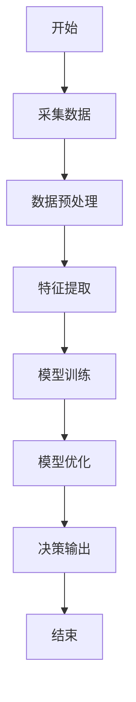
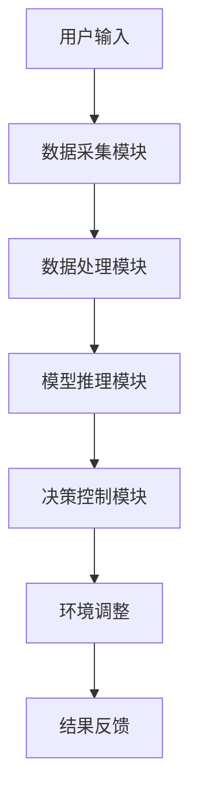
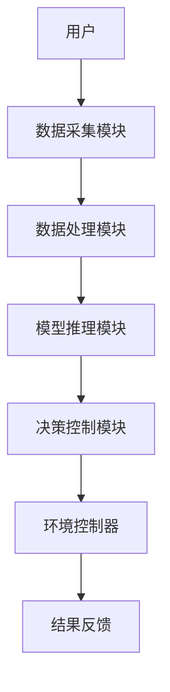

                 


# 智能窗台：AI Agent的室内植物生长监测

> 关键词：AI Agent, 室内植物, 生长监测, 计算机视觉, 机器学习

> 摘要：本文将详细探讨如何利用AI Agent技术实现室内植物生长监测。通过分析AI Agent的核心原理、算法实现、系统架构设计，结合实际项目案例，展示如何利用AI技术优化室内植物养护过程。文章内容涵盖从理论到实践的各个方面，旨在为读者提供一个全面的技术指导。

---

# 第一部分：AI Agent与室内植物生长监测的背景

## 第1章：AI Agent与室内植物生长监测的背景

### 1.1 智能窗台的概念与意义
#### 1.1.1 智能窗台的定义
智能窗台是一种集成AI技术的室内植物养护系统，通过实时监测植物的生长状态和环境参数，提供智能化的养护建议。

#### 1.1.2 室内植物生长监测的重要性
随着城市化进程加快，越来越多的人生活在狭小的居住环境中，室内植物成为改善空气质量、美化环境的重要选择。然而，由于缺乏专业的养护知识，许多人无法有效管理植物的生长状态。

#### 1.1.3 AI Agent在智能窗台中的作用
AI Agent通过感知植物的生长状况和环境变化，能够实时调整养护策略，帮助用户实现智能化、个性化的植物养护。

### 1.2 室内植物生长监测的背景与需求
#### 1.2.1 室内植物种植的现状
随着人们生活水平的提高，越来越多的人开始关注室内植物的种植与养护。然而，由于缺乏专业知识和工具，许多人难以有效管理植物的生长状态。

#### 1.2.2 植物生长监测的痛点
植物生长监测需要实时采集和分析大量数据，包括光照、温度、湿度、土壤酸碱度等环境参数，以及植物的生长状态（如叶色变化、叶片数量、高度增长等）。传统的人工监测方式效率低下，难以满足大规模种植的需求。

#### 1.2.3 AI技术在植物监测中的应用潜力
AI技术能够通过计算机视觉、机器学习等手段，实现对植物生长状态的自动化监测和分析，为植物养护提供科学依据。

### 1.3 AI Agent的核心概念与特点
#### 1.3.1 AI Agent的定义
AI Agent是一种能够感知环境、自主决策并执行任务的智能实体。它可以基于传感器数据和历史信息，实时调整行为策略。

#### 1.3.2 AI Agent的核心特点
- **自主性**：能够自主感知环境并做出决策。
- **反应性**：能够实时响应环境变化。
- **学习能力**：能够通过数据反馈不断优化自身的决策模型。

#### 1.3.3 AI Agent与传统自动化系统的区别
AI Agent不同于传统的自动化系统，它具有更强的自主学习和决策能力，能够根据环境变化动态调整行为策略。

### 1.4 本章小结
本章介绍了智能窗台的概念及其在室内植物生长监测中的重要性，分析了传统植物监测的痛点，并总结了AI Agent的核心特点及其在智能窗台中的应用潜力。

---

# 第二部分：AI Agent与室内植物监测的核心概念

## 第2章：AI Agent的核心原理与技术

### 2.1 AI Agent的基本原理
#### 2.1.1 AI Agent的感知与决策机制
AI Agent通过多种传感器（如摄像头、温度传感器、湿度传感器等）感知环境信息，并结合历史数据和模型预测，做出最优决策。

#### 2.1.2 多模态数据融合技术
AI Agent需要整合多种类型的数据（如图像数据、环境数据等），通过多模态数据融合技术，提高决策的准确性和鲁棒性。

#### 2.1.3 自适应学习算法
AI Agent能够通过自适应学习算法，不断优化自身的决策模型，以适应不同的环境和植物种类。

### 2.2 室内植物监测的关键技术
#### 2.2.1 植物图像识别技术
通过计算机视觉技术，AI Agent能够识别植物的种类、叶片状态、生长高度等信息。

#### 2.2.2 植物生长数据采集与分析
AI Agent通过多种传感器采集植物生长的环境数据（如光照、温度、湿度等），并结合图像数据，分析植物的生长状态。

#### 2.2.3 环境因素对植物生长的影响
AI Agent需要理解不同环境因素对植物生长的影响，以便做出科学的养护建议。

### 2.3 AI Agent与室内植物监测的结合
#### 2.3.1 AI Agent在植物监测中的应用场景
- **实时监测**：通过传感器和摄像头，实时采集植物的生长数据。
- **智能诊断**：基于历史数据和模型预测，识别植物的健康状况。
- **主动干预**：根据监测结果，自动调整光照、温度等环境参数。

#### 2.3.2 多模态数据的融合与分析
通过整合图像数据、环境数据和用户反馈，AI Agent能够更全面地理解植物的生长状态。

#### 2.3.3 AI Agent的自适应优化能力
AI Agent能够根据植物的生长变化和环境变化，动态优化自身的监测和决策模型。

### 2.4 本章小结
本章详细介绍了AI Agent的核心原理与技术，分析了其在室内植物监测中的应用，并探讨了多模态数据融合与自适应学习的重要性。

---

# 第三部分：AI Agent的算法原理与数学模型

## 第3章：AI Agent的算法原理

### 3.1 算法原理概述
#### 3.1.1 基于深度学习的图像识别算法
AI Agent使用深度学习模型（如卷积神经网络）对植物图像进行分类和识别。

#### 3.1.2 基于机器学习的生长预测模型
通过机器学习算法（如随机森林、支持向量机等），AI Agent能够预测植物的生长趋势。

#### 3.1.3 基于强化学习的决策优化算法
AI Agent通过强化学习算法，不断优化自身的决策策略，以实现最优的植物养护效果。

### 3.2 算法流程图


### 3.3 算法实现的数学模型与公式
#### 3.3.1 图像识别模型的数学表达
使用卷积神经网络（CNN）对植物图像进行分类，模型的损失函数为：
$$ L = -\sum_{i=1}^{n} y_i \log(p_i) + (1 - y_i) \log(1 - p_i) $$
其中，\( y_i \) 是真实标签，\( p_i \) 是模型预测的概率。

#### 3.3.2 生长预测模型的数学表达
使用随机森林算法进行生长预测，模型的决策树结构可以通过ID3算法进行优化。

---

# 第四部分：系统设计与实现

## 第4章：系统设计与实现

### 4.1 系统功能设计
#### 4.1.1 系统模块划分
- **数据采集模块**：负责采集植物的图像和环境数据。
- **数据处理模块**：对采集的数据进行预处理和特征提取。
- **模型推理模块**：基于预处理后的数据，进行植物生长状态的预测和诊断。
- **决策控制模块**：根据模型推理结果，调整环境参数（如光照、温度等）。

#### 4.1.2 系统功能流程图


### 4.2 系统架构设计
#### 4.2.1 系统架构图


#### 4.2.2 系统接口设计
- **数据采集接口**：与摄像头、传感器等硬件设备对接，获取实时数据。
- **模型推理接口**：与机器学习模型对接，进行数据处理和预测。
- **环境控制接口**：与智能灯、温控设备等对接，实现环境参数的调整。

#### 4.2.3 系统交互流程图


---

# 第五章：项目实战

## 5.1 项目环境与工具
- **硬件设备**：摄像头、温度传感器、湿度传感器、光照传感器等。
- **软件工具**：Python、TensorFlow、OpenCV、Scikit-learn等。

## 5.2 核心代码实现
#### 5.2.1 图像采集与预处理
```python
import cv2

def capture_image():
    # 初始化摄像头
    cap = cv2.VideoCapture(0)
    # 读取图像
    ret, frame = cap.read()
    if ret:
        cv2.imwrite("plant_image.jpg", frame)
    cap.release()
```

#### 5.2.2 模型训练与预测
```python
from sklearn.ensemble import RandomForestClassifier

# 假设X为特征矩阵，y为标签
model = RandomForestClassifier()
model.fit(X, y)
```

## 5.3 项目部署与测试
通过将代码部署到 Raspberry Pi 或其他嵌入式设备上，进行实际测试和优化。

## 5.4 实际案例分析
通过具体案例分析，展示AI Agent在实际植物监测中的应用效果。

---

# 第六章：系统优化与扩展

## 6.1 系统优化策略
- **算法优化**：通过调整模型参数、优化算法结构等方式，提高监测的准确性和效率。
- **数据优化**：通过数据增强、数据清洗等方式，提高数据质量。

## 6.2 系统扩展方向
- **多植物监测**：扩展系统功能，支持多种植物的监测与管理。
- **数据可视化**：通过数据可视化工具（如Matplotlib、Tableau等），直观展示植物的生长状态和环境数据。

## 6.3 注意事项
在实际应用中，需要注意数据隐私、设备兼容性等问题，确保系统的稳定性和可靠性。

---

# 第七章：总结与展望

## 7.1 本章总结
本文详细探讨了AI Agent在室内植物生长监测中的应用，分析了其核心原理、系统设计和实现方法，并通过实际案例展示了其应用效果。

## 7.2 未来展望
随着AI技术的不断发展，AI Agent在植物监测中的应用将更加广泛和深入。未来的研究方向包括更高效的算法优化、更智能的决策系统以及更广泛的应用场景探索。

---

# 作者：AI天才研究院/AI Genius Institute & 禅与计算机程序设计艺术 /Zen And The Art of Computer Programming

---

以上是一个详细的目录大纲和文章内容，涵盖了从理论到实践的各个方面，旨在为读者提供一个全面的技术指导。

