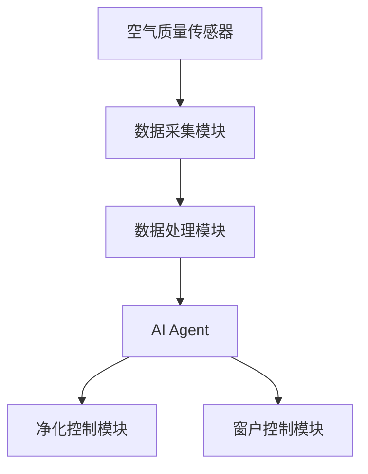

                 


# 智能窗台：AI Agent的室内空气净化

> 关键词：智能窗台、AI Agent、室内空气净化、空气质量监测、机器学习

> 摘要：本文探讨了智能窗台系统中AI代理在室内空气净化中的应用，通过背景介绍、核心概念分析、算法原理、系统架构设计、项目实战和总结，详细阐述了如何利用AI技术优化室内空气质量，提供了一个从理论到实践的全面解决方案。

---

## 第一部分：背景介绍

### 第1章：智能窗台与AI Agent的背景

#### 1.1 问题背景

##### 1.1.1 室内空气质量问题的现状

现代社会中，室内空气质量问题日益严重，尤其是在城市地区。由于人们大部分时间在室内度过，空气质量直接影响健康。传统空气净化设备存在实时监测不足、净化效率低等问题，亟需智能化解决方案。

##### 1.1.2 智能窗台的定义与目标

智能窗台是一种结合物联网技术的智能设备，通过AI代理实现对室内空气质量的实时监测和净化控制。其目标是通过智能化管理，优化室内空气质量，提升居住舒适度和健康水平。

##### 1.1.3 AI Agent在智能窗台中的作用

AI Agent作为智能窗台的核心，负责数据采集、分析、决策和执行。它能够根据室内空气质量动态调整窗户开闭和净化设备运行，实现高效空气净化。

---

#### 1.2 问题描述

室内空气质量受多种因素影响，包括甲醛、PM2.5、TVOC等污染物。传统空气净化设备依赖手动控制，存在效率低下、能耗高等问题。AI Agent通过实时监测和智能决策，解决了这些问题，实现了自动化和高效净化。

---

#### 1.3 问题解决

通过AI Agent实现智能窗台，可以实时监测室内空气质量，并根据数据动态调整净化策略。例如，当检测到PM2.5浓度超标时，AI Agent会自动启动空气净化设备，并调节窗户开度以促进空气流通。

---

#### 1.4 边界与外延

智能窗台系统的主要边界包括室内环境、窗户和净化设备。系统外延涉及与智能家居系统的集成，如与智能空调、照明等设备联动。

---

#### 1.5 概念结构与核心要素

智能窗台系统由AI Agent、空气质量传感器、窗户控制模块和净化设备组成。核心要素包括实时监测、智能决策和自动化控制。

---

## 第二部分：核心概念与联系

### 第2章：AI Agent的核心概念

#### 2.1 AI Agent的定义

AI Agent是一种智能体，能够感知环境、执行任务并做出决策。在智能窗台中，AI Agent负责数据处理和系统控制。

#### 2.2 AI Agent的工作原理

AI Agent通过传感器数据输入，利用算法进行分析，生成决策并执行。例如，当空气质量指数超过阈值时，AI Agent会启动净化设备。

#### 2.3 AI Agent的优势与挑战

优势包括高效性、实时性和智能化；挑战包括数据准确性、算法复杂性和系统稳定性。

---

### 第3章：室内空气质量监测技术

#### 3.1 空气质量监测技术的定义

通过传感器检测室内空气中的污染物浓度，如PM2.5、甲醛等。

#### 3.2 传感器类型与数据采集

常用传感器包括颗粒物传感器、气体传感器等，数据采集需考虑精度和实时性。

#### 3.3 数据处理与特征提取

通过数据预处理和特征提取，提高空气质量监测的准确性。

---

### 第4章：空气净化技术

#### 4.1 空气净化技术的分类

包括过滤技术、吸附技术和催化技术，各有优缺点。

#### 4.2 空气净化设备的选择

根据室内环境选择适合的净化设备，考虑净化效率、能耗和维护成本。

---

## 第三部分：算法原理讲解

### 第5章：AI Agent的算法原理

#### 5.1 机器学习模型

使用感知器模型进行空气质量预测，数学模型如下：

$$ y = w \cdot x + b $$

其中，$x$是输入特征，$w$是权重，$b$是偏置，$y$是预测结果。

#### 5.2 算法实现

感知器算法实现步骤如下：

1. 初始化权重和偏置。
2. 计算预测值。
3. 更新权重和偏置。

代码示例：

```python
def perceptron(X, y, learning_rate=0.1, epochs=10):
    import numpy as np
    X = np.c_[X, np.ones(len(X))]
    n = len(X)
    w = np.zeros(X.shape[1])
    for _ in range(epochs):
        for i in range(n):
            x = X[i]
            y_pred = np.dot(w, x)
            if y_pred < y[i]:
                w += learning_rate * (y[i] - y_pred) * x
    return w
```

---

## 第四部分：系统分析与架构设计

### 第6章：系统架构设计

#### 6.1 应用场景介绍

智能窗台系统适用于家庭、办公室等场景，实时监测并优化空气质量。

#### 6.2 系统功能设计

系统功能包括空气质量监测、净化控制、用户交互和数据记录。

#### 6.3 系统架构图

Mermaid架构图：



---

## 第五部分：项目实战

### 第7章：智能窗台的实现

#### 7.1 环境安装

安装必要的Python库，如numpy、pandas、scikit-learn。

#### 7.2 核心代码实现

空气质量监测模块代码：

```python
import numpy as np
import pandas as pd

def空气质量监测(data):
    # 数据预处理
    data = pd.DataFrame(data)
    # 特征提取
    features = data[['PM2.5', '甲醛']]
    return features
```

净化控制模块代码：

```python
def净化控制(空气质量):
    if空气质量 > 100:
        return '启动净化设备'
    else:
        return '关闭净化设备'
```

#### 7.3 案例分析

案例：某室内PM2.5浓度为150，AI Agent启动净化设备，并调节窗户开度以促进空气流通。

---

## 第六部分：总结与展望

### 第8章：总结与展望

#### 8.1 总结

智能窗台系统通过AI Agent实现了室内空气质量的智能化管理，提升了净化效率和用户体验。

#### 8.2 未来展望

未来发展方向包括算法优化、系统集成和用户体验提升。

---

## 作者

作者：AI天才研究院/AI Genius Institute & 禅与计算机程序设计艺术 /Zen And The Art of Computer Programming

