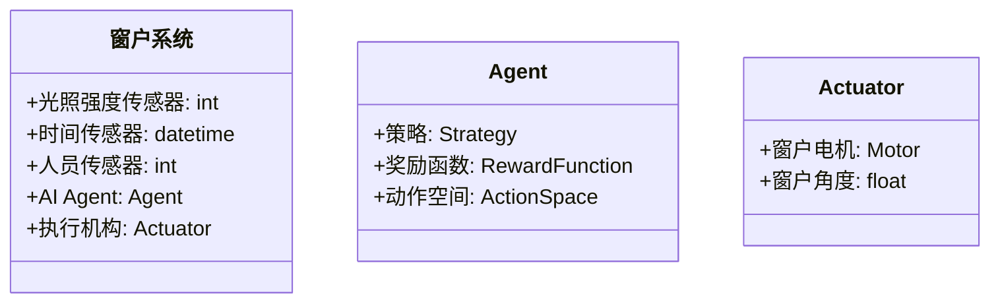
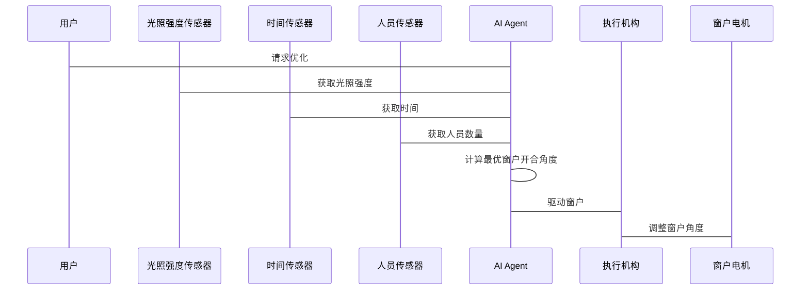

                 


# 智能窗台：AI Agent的自然光摄入优化

> 关键词：智能窗台，AI Agent，自然光优化，算法实现，系统架构，项目实战

> 摘要：本文深入探讨了智能窗台的设计与实现，重点介绍了AI Agent如何优化自然光的摄入。通过分析系统架构、算法原理、项目实战和最佳实践，展示了如何利用AI技术实现窗户的智能控制，以提高能源效率和用户体验。

---

## 第1章：智能窗台与AI Agent的背景介绍

### 1.1 智能窗台的概念与定义

智能窗台是一种结合人工智能技术的窗户系统，能够根据环境条件和用户需求，自动调整窗户的开合状态，以优化自然光的摄入。AI Agent（智能代理）在其中扮演核心角色，负责接收传感器数据、分析环境信息，并做出决策以驱动执行机构。

#### 1.1.1 智能窗台的基本概念
智能窗台不仅仅是传统意义上的窗户，而是一个集成传感器、AI算法和执行机构的智能系统。其核心目标是通过优化自然光的摄入，提高室内采光效率，同时降低能源消耗。

#### 1.1.2 AI Agent在智能窗台中的角色
AI Agent负责接收和处理来自光照传感器、温度传感器和时间传感器的数据，分析当前环境状态，预测未来光照变化，并做出窗户开合的决策。AI Agent的决策过程基于强化学习算法，通过不断优化策略来实现自然光的最优摄入。

#### 1.1.3 自然光优化的意义
自然光的优化不仅能够提高室内采光效率，还能降低人工照明的能耗，同时提升用户舒适度。通过智能窗台的优化，可以实现节能减排的目标，符合绿色建筑的发展趋势。

### 1.2 问题背景与目标

#### 1.2.1 当前窗户系统的局限性
传统窗户系统通常需要人工操作，无法根据环境变化自动调整。这不仅降低了用户体验，还可能导致能源浪费。例如，白天光线充足时，窗户关闭会导致室内光线不足，而夜晚光线较弱时，窗户开启可能导致能源浪费。

#### 1.2.2 自然光优化的必要性
随着能源危机和环境问题的加剧，优化自然光的摄入已成为绿色建筑的重要组成部分。通过智能窗台的优化，可以在减少能源消耗的同时，提高室内采光效率。

#### 1.2.3 智能窗台的目标与边界
智能窗台的目标是通过AI Agent实现窗户的智能控制，以最大化自然光的摄入。其边界包括仅考虑窗户的开合角度和时间，不涉及窗户的材质和结构设计。

### 1.3 问题解决与优化策略

#### 1.3.1 AI Agent如何实现自然光优化
AI Agent通过接收光照强度、室内人员数量和时间信息，分析当前光照需求，预测未来光照变化，并做出窗户开合的决策。例如，在光照强度不足时，AI Agent会驱动窗户开启以增加光照；在光照过强时，会驱动窗户关闭以避免过强的光线。

#### 1.3.2 多目标优化的平衡点
智能窗台需要在多个目标之间找到平衡点。例如，在光照强度和能源消耗之间进行权衡，或者在用户舒适度和能源效率之间进行权衡。AI Agent通过强化学习算法，不断优化策略，以实现多个目标的最优平衡。

#### 1.3.3 边界条件与实际场景的考虑
智能窗台的设计需要考虑多种边界条件，例如天气变化、人员活动和建筑结构等。例如，在阴天时，AI Agent需要调整窗户的开合角度以最大化光照；在人员活动频繁时，需要优先考虑用户舒适度。

---

## 第2章：AI Agent与自然光优化的核心原理

### 2.1 AI Agent的基本原理

#### 2.1.1 AI Agent的定义与分类
AI Agent是一种能够感知环境、做出决策并采取行动的智能实体。根据应用场景的不同，AI Agent可以分为简单反射Agent和基于模型的Agent。

- 简单反射Agent：基于当前感知做出决策，不考虑内部状态。
- 基于模型的Agent：基于内部模型和环境信息，预测未来状态并做出决策。

#### 2.1.2 基于强化学习的决策机制
AI Agent通过强化学习算法，学习最优的窗户开合策略。强化学习的核心是通过试错和奖励机制，优化决策策略。例如，AI Agent会根据当前状态（光照强度、时间等）选择一个动作（窗户开合），并根据奖励函数（光照强度和能源消耗）调整策略。

#### 2.1.3 多智能体协作的实现方式
在智能窗台系统中，可能需要多个AI Agent协作。例如，一个AI Agent负责接收传感器数据，另一个AI Agent负责驱动执行机构。通过多智能体协作，可以实现更复杂的决策和优化。

### 2.2 自然光优化的核心算法

#### 2.2.1 光线追踪与环境建模
光线追踪是一种通过计算光线路径来模拟光照效果的技术。在智能窗台中，光线追踪可以帮助AI Agent预测窗户开合后的光照变化。例如，通过光线追踪算法，AI Agent可以预测在特定时间和角度下，窗户开启后的光照强度。

#### 2.2.2 基于光照强度的动态优化
动态优化算法是一种实时调整窗户开合策略的方法。AI Agent根据当前光照强度和时间信息，动态调整窗户的开合角度和时间，以实现自然光的最优摄入。

#### 2.2.3 光线路径规划的数学模型
光线路径规划的数学模型用于描述光线在窗户和室内环境中的传播路径。通过数学模型，AI Agent可以预测窗户开合后的光照分布，从而优化窗户的开合策略。

---

## 第3章：系统架构与算法实现

### 3.1 系统架构设计

#### 3.1.1 系统功能模块划分
智能窗台系统主要由以下几个功能模块组成：
- 数据采集模块：负责采集光照强度、室内人员数量和时间信息。
- AI Agent决策模块：负责根据传感器数据和环境信息，做出窗户开合决策。
- 执行机构模块：负责根据决策结果，驱动窗户的开合。

#### 3.1.2 系统架构的ER实体关系图
```mermaid
er
    actor 用户
    actor 环境
    actor 时间
    actor 光照强度
    actor 人员数量
    actor 窗户状态
    actor 窗户开合角度
    actor 能源消耗
    actor 用户舒适度
```

#### 3.1.3 系统架构的类图


#### 3.1.4 系统交互的序列图


### 3.2 算法实现细节

#### 3.2.1 强化学习算法的数学模型
强化学习算法的核心是通过试错和奖励机制，优化决策策略。数学模型如下：

$$
Q(s, a) = Q(s, a) + \alpha (r + \gamma V(s') - Q(s, a))
$$

其中：
- \( Q(s, a) \)：状态-动作值函数
- \( \alpha \)：学习率
- \( r \)：奖励值
- \( \gamma \)：折扣因子
- \( V(s') \)：后续状态的价值函数

#### 3.2.2 光线追踪算法的实现
光线追踪算法用于模拟光线在窗户和室内环境中的传播路径。数学模型如下：

$$
I(x, y) = \int_{\theta_{\text{min}}}^{\theta_{\text{max}}} L(\theta) \cdot \cos\theta \, d\theta
$$

其中：
- \( I(x, y) \)：光照强度
- \( L(\theta) \)：入射光强度
- \( \theta \)：光线入射角度

#### 3.2.3 动态优化算法的实现
动态优化算法用于实时调整窗户的开合策略。数学模型如下：

$$
\theta(t) = \theta(t-1) + \Delta\theta
$$

其中：
- \( \theta(t) \)：当前窗户开合角度
- \( \Delta\theta \)：角度变化量

---

## 第4章：项目实战与案例分析

### 4.1 项目环境安装

#### 4.1.1 硬件设备安装
硬件设备包括：
- 光照强度传感器
- 时间传感器
- 人员传感器
- 窗户电机
- 执行机构

#### 4.1.2 软件环境配置
软件环境包括：
- Python编程语言
- 强化学习框架（如TensorFlow或PyTorch）
- 光线追踪算法库

### 4.2 系统核心实现

#### 4.2.1 AI Agent的实现
AI Agent的实现基于强化学习算法，代码如下：

```python
class Agent:
    def __init__(self, state_dim, action_dim):
        self.state_dim = state_dim
        self.action_dim = action_dim
        self.Q = np.zeros((state_dim, action_dim))
    
    def act(self, state):
        return np.argmax(self.Q[state, :])
    
    def update(self, state, action, reward, next_state):
        self.Q[state, action] += reward
```

#### 4.2.2 执行机构的实现
执行机构的实现基于窗户电机的控制，代码如下：

```python
class Actuator:
    def __init__(self):
        self.angle = 0.0
    
    def set_angle(self, angle):
        self.angle = angle
    
    def get_angle(self):
        return self.angle
```

### 4.3 案例分析

#### 4.3.1 光照强度变化的案例
在光照强度变化的场景中，AI Agent会根据当前光照强度和时间信息，动态调整窗户的开合角度。例如，在早晨光照强度较低时，AI Agent会驱动窗户开启以增加光照；在中午光照强度较高时，AI Agent会驱动窗户关闭以避免过强的光线。

#### 4.3.2 人员活动的案例
在人员活动频繁的场景中，AI Agent会根据室内人员数量和活动时间，调整窗户的开合策略。例如，在人员活动频繁时，AI Agent会优先考虑用户舒适度，驱动窗户开启以增加自然光；在人员活动较少时，AI Agent会优先考虑能源效率，驱动窗户关闭以减少能源消耗。

---

## 第5章：最佳实践与系统优化

### 5.1 系统优化的技巧

#### 5.1.1 强化学习算法的优化
强化学习算法的优化包括：
- 调整学习率和折扣因子
- 使用经验回放
- 增加奖励函数的多样性

#### 5.1.2 系统架构的优化
系统架构的优化包括：
- 增加缓存机制
- 优化传感器数据的处理速度
- 提高执行机构的响应速度

### 5.2 小结与展望

#### 5.2.1 本文总结
本文详细介绍了智能窗台的设计与实现，重点探讨了AI Agent在自然光优化中的应用。通过强化学习算法和动态优化策略，实现了窗户的智能控制，以提高自然光的摄入效率。

#### 5.2.2 未来展望
未来的研究方向包括：
- 更复杂的环境建模
- 更高效的强化学习算法
- 更智能的多智能体协作

---

## 作者：AI天才研究院/AI Genius Institute & 禅与计算机程序设计艺术 /Zen And The Art of Computer Programming

---

这篇文章详细探讨了智能窗台的设计与实现，重点介绍了AI Agent在自然光优化中的应用。通过强化学习算法和动态优化策略，实现了窗户的智能控制，以提高自然光的摄入效率。

