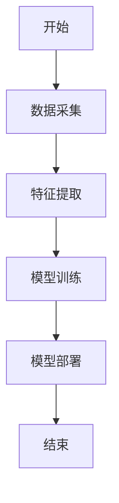
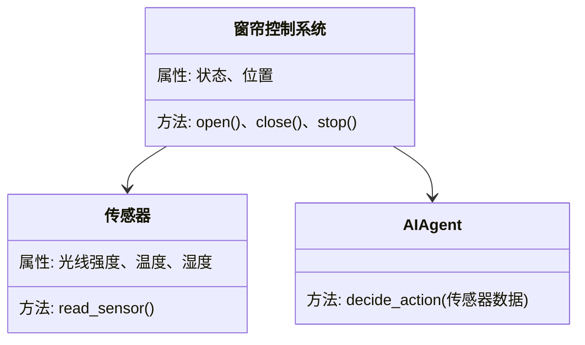
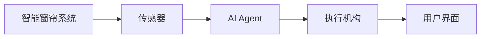

                 


# 智能窗帘：AI Agent的室内环境全面调节

> 关键词：智能窗帘、AI Agent、室内环境、智能家居、物联网

> 摘要：本文深入探讨了智能窗帘的设计与实现，结合AI Agent技术，从背景介绍到系统设计，再到项目实战，全面分析了智能窗帘在室内环境调节中的应用。文章详细讲解了AI Agent的工作原理、核心技术、系统架构以及实际案例，为读者提供了从理论到实践的完整指导。

---

# 第一部分：智能窗帘的背景与现状

## 第1章：智能窗帘的背景介绍

### 1.1 智能窗帘的背景介绍

#### 1.1.1 智能家居的发展趋势

智能家居作为物联网（IoT）的重要组成部分，近年来发展迅速。随着技术的进步，智能家居设备逐渐普及，智能窗帘作为智能家居的一部分，也在不断进化。智能窗帘不仅能够自动开关，还能通过AI Agent技术实现室内环境的全面调节，为用户提供更舒适、更智能的生活体验。

#### 1.1.2 智能窗帘的定义与特点

智能窗帘是一种结合了物联网和人工智能技术的智能设备，能够通过传感器和AI算法实现自动开关、温度调节、光线调节等功能。其特点包括：

- **自动化控制**：通过传感器和AI算法实现自动化操作。
- **智能化调节**：能够根据室内环境和用户需求自动调整。
- **远程控制**：用户可以通过手机APP或语音助手远程控制窗帘。
- **节能环保**：通过智能调节光线和温度，降低能源消耗。

#### 1.1.3 智能窗帘的应用场景与优势

智能窗帘广泛应用于家庭、办公室、酒店等多种场景。其优势包括：

- **提升生活品质**：通过智能调节光线和温度，为用户提供更舒适的环境。
- **节能环保**：智能窗帘能够根据室内环境自动调节，减少能源浪费。
- **安全性**：通过远程控制和传感器，提升家庭安全性。

### 1.2 智能窗帘的现状分析

#### 1.2.1 当前市场现状

目前，智能窗帘市场增长迅速，但仍然存在一些问题，如兼容性差、功能单一、安全性不足等。随着技术的进步，这些问题将逐步得到解决。

#### 1.2.2 用户需求分析

用户对智能窗帘的需求主要集中在以下几个方面：

- **自动化控制**：用户希望窗帘能够自动开关。
- **智能化调节**：用户希望窗帘能够根据室内环境自动调整。
- **远程控制**：用户希望可以通过手机APP或语音助手远程控制窗帘。
- **节能环保**：用户希望智能窗帘能够帮助节约能源。

#### 1.2.3 技术发展瓶颈

目前，智能窗帘技术的发展还存在一些瓶颈，如传感器精度不足、AI算法不够智能、系统安全性不足等。这些问题需要进一步研究和解决。

---

## 第2章：AI Agent的基本原理

### 2.1 AI Agent的概念与特点

#### 2.1.1 AI Agent的定义

AI Agent（人工智能代理）是一种能够感知环境、自主决策并执行任务的智能体。它能够通过传感器获取环境信息，通过算法进行分析和决策，并通过执行机构完成任务。

#### 2.1.2 AI Agent的核心特征

AI Agent的核心特征包括：

- **感知能力**：能够通过传感器获取环境信息。
- **决策能力**：能够通过算法进行分析和决策。
- **执行能力**：能够通过执行机构完成任务。
- **自主性**：能够在没有人工干预的情况下自主完成任务。

#### 2.1.3 AI Agent与传统自动化的区别

AI Agent与传统自动化的区别主要体现在智能性和自主性上。传统自动化设备只能按照预设程序运行，而AI Agent能够根据环境信息自主决策。

### 2.2 AI Agent的工作原理

#### 2.2.1 感知与理解

AI Agent通过传感器获取环境信息，例如光线强度、温度、湿度等。这些信息经过预处理后，被输入到算法中进行分析。

#### 2.2.2 决策与规划

AI Agent通过算法分析环境信息，生成决策。例如，当光线过强时，AI Agent会决策关闭窗帘以减少光线强度。

#### 2.2.3 执行与反馈

AI Agent通过执行机构（如电机）完成决策任务，并通过传感器获取反馈信息，用于下一步决策。

---

## 第3章：智能窗帘的核心技术

### 3.1 传感器技术

#### 3.1.1 常见传感器类型

智能窗帘常用的传感器包括：

- **光线传感器**：用于检测光线强度。
- **温度传感器**：用于检测室内温度。
- **湿度传感器**：用于检测室内湿度。

#### 3.1.2 传感器数据采集与处理

传感器数据采集包括模拟信号采集和数字信号采集。数据处理包括数据滤波、数据融合等技术。

#### 3.1.3 传感器网络的优化

通过优化传感器网络的布置和通信协议，可以提高传感器的灵敏度和准确性。

### 3.2 通信协议

#### 3.2.1 Wi-Fi与蓝牙技术

Wi-Fi和蓝牙是常用的无线通信技术，能够实现智能窗帘与其它设备之间的数据传输。

#### 3.2.2 MQTT协议的应用

MQTT是一种轻量级的物联网通信协议，适合用于智能窗帘的远程控制。

#### 3.2.3 通信安全与可靠性

通过加密技术和冗余设计，可以提高智能窗帘通信的安全性和可靠性。

### 3.3 执行机构

#### 3.3.1 电机与驱动器

电机是智能窗帘的核心执行机构，驱动器用于控制电机的运行。

#### 3.3.2 控制算法

控制算法包括位置控制算法和力矩控制算法，用于实现窗帘的精确控制。

#### 3.3.3 执行机构的优化设计

通过优化电机的控制参数和驱动器的性能，可以提高智能窗帘的运行效率和稳定性。

---

## 第4章：AI Agent在智能窗帘中的应用

### 4.1 算法概述

#### 4.1.1 机器学习基础

机器学习是一种通过数据训练模型的技术，能够帮助AI Agent实现智能化决策。

#### 4.1.2 深度学习的应用

深度学习是一种基于人工神经网络的机器学习技术，能够实现更复杂的决策任务。

#### 4.1.3 强化学习的实现

强化学习是一种通过试错机制优化决策的技术，能够帮助AI Agent实现更高效的决策。

### 4.2 算法实现

#### 4.2.1 算法流程图



#### 4.2.2 Python代码实现

```python
def ai_agent_algorithm(data):
    # 特征提取
    features = extract_features(data)
    # 模型训练
    model = train_model(features)
    # 模型预测
    prediction = model.predict(features)
    return prediction
```

#### 4.2.3 数学模型与公式

AI Agent的决策模型可以表示为：

$$
\text{决策} = f(\text{输入数据})
$$

其中，$f$ 是AI Agent的决策函数，$\text{输入数据}$ 包括光线强度、温度、湿度等环境数据。

---

## 第5章：智能窗帘的系统设计

### 5.1 系统架构设计

#### 5.1.1 领域模型



#### 5.1.2 系统架构图



---

## 第6章：项目实战

### 6.1 环境安装

#### 6.1.1 硬件安装

硬件安装包括传感器、电机、驱动器等设备的安装和连接。

#### 6.1.2 软件安装

软件安装包括操作系统、通信协议栈、AI算法框架等的安装。

### 6.2 系统核心实现

#### 6.2.1 传感器数据采集

```python
import serial

ser = serial.Serial('COM1', 9600)
data = ser.readline()
print(data)
```

#### 6.2.2 AI Agent算法实现

```python
import numpy as np
from sklearn import tree

# 训练数据
X = np.array([[0, 0], [0, 1], [1, 0], [1, 1]])
y = np.array([0, 1, 1, 0])

# 训练模型
model = tree.DecisionTreeClassifier()
model.fit(X, y)

# 预测
prediction = model.predict([[1, 0]])
print(prediction)
```

### 6.3 代码应用解读与分析

#### 6.3.1 传感器数据采集代码

上述代码通过串口读取传感器数据，实现数据采集功能。

#### 6.3.2 AI Agent算法代码

上述代码使用决策树算法训练模型，并实现对传感器数据的分类。

### 6.4 实际案例分析

#### 6.4.1 案例背景

假设某用户希望智能窗帘能够在光线过强时自动关闭。

#### 6.4.2 系统实现

通过传感器采集光线强度数据，AI Agent根据光线强度决定是否关闭窗帘。

### 6.5 项目小结

通过项目实战，我们能够更好地理解智能窗帘的设计与实现过程。

---

## 第7章：优化建议与未来展望

### 7.1 系统优化建议

#### 7.1.1 提高传感器精度

通过优化传感器布置和数据处理算法，可以提高传感器的精度。

#### 7.1.2 提升AI算法性能

通过优化AI算法模型和参数，可以提高AI Agent的决策效率和准确性。

#### 7.1.3 提高系统安全性

通过加密技术和冗余设计，可以提高智能窗帘系统的安全性。

### 7.2 未来展望

随着技术的进步，智能窗帘将更加智能化、自动化，实现更全面的室内环境调节。

---

## 第8章：最佳实践与小结

### 8.1 最佳实践 tips

- 在设计智能窗帘时，需要综合考虑传感器、通信协议、执行机构等多方面因素。
- 在实现AI Agent时，需要选择合适的算法和模型，确保系统的高效性和准确性。

### 8.2 小结

智能窗帘作为智能家居的重要组成部分，通过AI Agent技术实现了室内环境的全面调节。本文从背景介绍到系统设计，再到项目实战，全面分析了智能窗帘的设计与实现过程。

---

## 第9章：注意事项与拓展阅读

### 9.1 注意事项

- 在设计智能窗帘时，需要考虑系统的兼容性、安全性等问题。
- 在实现AI Agent时，需要确保算法的高效性和准确性。

### 9.2 拓展阅读

- 智能家居相关书籍
- 人工智能相关书籍
- 物联网相关书籍

---

# 作者：AI天才研究院/AI Genius Institute & 禅与计算机程序设计艺术 /Zen And The Art of Computer Programming

---

感谢您的阅读！如需进一步了解智能窗帘的设计与实现，欢迎参考上述内容。

