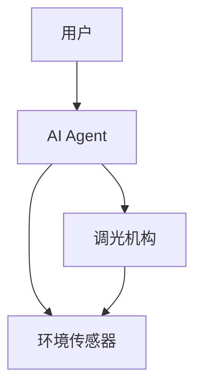
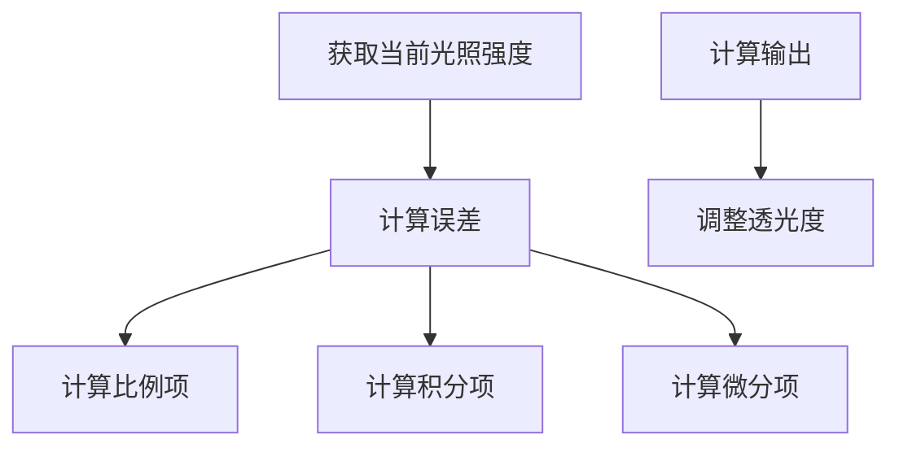
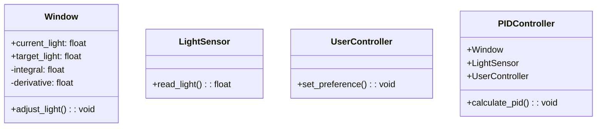
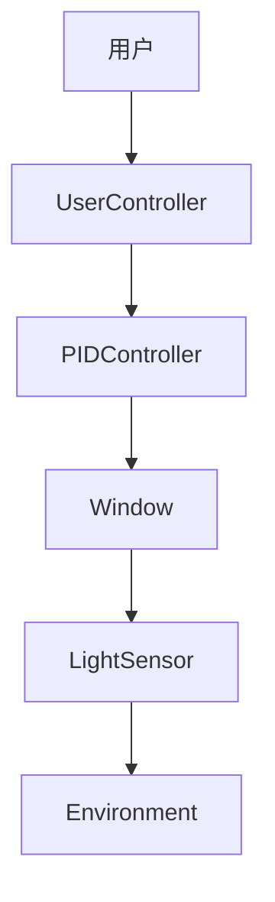

                 


# 智能窗户：AI Agent的自动调光系统

> 关键词：智能窗户，AI Agent，自动调光系统，PID控制，系统架构

> 摘要：智能窗户通过AI Agent实现自动调光，利用传感器和算法优化光线调节，提升用户舒适度和能源效率。本文详细分析其工作原理、系统架构，并提供项目实战和优化建议。

---

# 第1章: 智能窗户的定义与现状

## 1.1 智能窗户的定义
### 1.1.1 传统窗户的功能与局限
传统窗户主要提供采光和通风功能，但存在以下局限：
- 手动调节，不够便捷。
- 无法根据环境变化自动调整，可能导致能源浪费。
- 仅提供有限的隐私保护和遮光功能。

### 1.1.2 智能窗户的定义与特点
智能窗户是结合物联网和AI技术的窗户系统，具备以下特点：
- 自动感知环境光线、温度和用户行为。
- 利用AI算法优化光线调节。
- 提供远程控制和智能化管理。

### 1.1.3 智能窗户的应用场景
- 商业建筑：优化室内光线，降低能源消耗。
- 住宅：提升居住舒适度和隐私保护。
- 公共设施：智能调节光线，适应不同场合需求。

## 1.2 AI Agent在智能窗户中的作用
### 1.2.1 AI Agent的基本概念
AI Agent是一种智能代理，能够感知环境、做出决策并执行动作。在智能窗户中，AI Agent负责：
- 收集环境数据（如光照强度、温度）。
- 分析数据，制定调节策略。
- 执行调光操作。

### 1.2.2 AI Agent在智能窗户中的应用
AI Agent通过传感器实时感知环境数据，利用算法优化调光策略，确保室内光线适宜。同时，AI Agent还能学习用户偏好，提供个性化服务。

### 1.2.3 AI Agent的优势与挑战
- **优势**：提高能源效率，增强用户体验。
- **挑战**：传感器精度、算法优化、隐私保护等。

## 1.3 智能窗户的发展现状
### 1.3.1 当前智能窗户的技术水平
目前，智能窗户主要采用机械式调光机构，结合物联网技术实现远程控制。部分高端产品已开始应用AI技术进行光线优化。

### 1.3.2 市场应用现状
市场上的智能窗户主要集中在高端市场，应用案例包括智能建筑和智能家居。然而，普及率仍较低，主要受限于成本和技术成熟度。

### 1.3.3 未来发展趋势
未来，智能窗户将朝着更高智能化、更低成本和更广泛的应用方向发展，结合5G和AI技术，实现更高效的能源管理和更个性化的服务。

---

# 第2章: 智能窗户的光线调节问题背景

## 2.1 光线调节的重要性
### 2.1.1 光线调节对室内环境的影响
合理的光线调节可以改善室内采光，营造舒适的办公和生活环境，减少眼睛疲劳。

### 2.1.2 光线调节对能源消耗的影响
通过智能调节窗户透光度，可以减少白天的照明需求，降低能源消耗。

### 2.1.3 光线调节对用户舒适度的影响
智能调节光线有助于营造舒适的视觉环境，提升用户满意度。

## 2.2 光线调节的复杂性
### 2.2.1 光线调节的多因素影响
- 光线强度：晴天和阴天需不同调节策略。
- 用户需求：不同用户对光线偏好不同。
- 时间因素：早晨和傍晚的光线变化快。

### 2.2.2 光线调节的目标冲突
- 能源效率与用户舒适度之间的平衡。
- 自动调节与用户干预的协调。

### 2.2.3 光线调节的动态变化
光线条件和用户需求随时变化，需要实时调整。

## 2.3 AI Agent在光线调节中的解决方案
### 2.3.1 AI Agent的感知能力
通过光线传感器、温度传感器和用户行为传感器实时采集数据。

### 2.3.2 AI Agent的决策能力
利用机器学习算法，分析数据并制定最优调节策略。

### 2.3.3 AI Agent的执行能力
通过调光机构执行决策，并实时反馈调节效果。

---

# 第3章: AI Agent的核心概念与联系

## 3.1 AI Agent的核心原理
### 3.1.1 感知层
- 光线传感器：测量环境光照强度。
- 温度传感器：感知室内温度变化。
- 用户行为传感器：监测用户活动模式。

### 3.1.2 决策层
- 光线调节算法：基于当前光照强度和用户需求，计算最佳透光度。
- 用户偏好模型：分析用户历史行为，预测其光线偏好。
- 能源消耗优化模型：平衡舒适度和能源效率。

### 3.1.3 执行层
- 调光机构：根据决策结果调整窗户透光度。
- 执行反馈：将调节结果反馈给感知层，形成闭环系统。

## 3.2 AI Agent的核心概念对比
### 3.2.1 传统窗户与智能窗户的对比

| 特性                | 传统窗户          | 智能窗户          |
|---------------------|-------------------|-------------------|
| 调光方式            | 手动调节          | 自动调节          |
| 感知能力            | 无                | 光线、温度等传感器 |
| 决策能力            | 无                | AI算法            |
| 执行能力            | 无                | 调光机构          |
| 能源效率            | 低                | 高                |

### 3.2.2 实体关系图


---

# 第4章: 算法原理

## 4.1 光线调节算法
### 4.1.1 PID控制算法
PID控制是一种常用的调节算法，适用于光照强度的动态调节。

#### PID算法公式
$$ u(t) = K_p \cdot e(t) + K_i \cdot \int e(t) dt + K_d \cdot \frac{de(t)}{dt} $$

其中：
- \( e(t) \) 是误差
- \( K_p \) 是比例系数
- \( K_i \) 是积分系数
- \( K_d \) 是微分系数

### 4.1.2 PID控制流程图


### 4.1.3 Python实现
```python
def pid_control(current_light, target_light, kp, ki, kd):
    error = target_light - current_light
    integral += error * dt
    derivative = (error - prev_error) / dt
    output = kp * error + ki * integral + kd * derivative
    return output
```

---

# 第5章: 系统分析与架构设计

## 5.1 系统功能设计
### 5.1.1 领域模型类图


### 5.1.2 系统架构图


---

# 第6章: 项目实战

## 6.1 环境安装
安装必要的库：
```bash
pip install numpy
pip install matplotlib
```

## 6.2 核心代码实现
```python
import numpy as np
import matplotlib.pyplot as plt

class PIDController:
    def __init__(self, kp, ki, kd):
        self.kp = kp
        self.ki = ki
        self.kd = kd
        self.integral = 0
        self.prev_error = 0

    def control(self, current_light, target_light, dt):
        error = target_light - current_light
        integral = self.integral + error * dt
        derivative = (error - self.prev_error) / dt
        output = self.kp * error + self.ki * integral + self.kd * derivative
        self.integral = integral
        self.prev_error = error
        return output

# 示例运行
kp = 1
ki = 0.5
kd = 0.2
dt = 0.1
controller = PIDController(kp, ki, kd)
current_light = 50
target_light = 100

output = controller.control(current_light, target_light, dt)
print(f"PID 输出: {output}")
```

## 6.3 实际案例分析
假设当前光照强度为50 lux，目标为100 lux，PID算法计算出输出为15。调光机构调整透光度，使光照强度逐步接近目标值。

---

# 第7章: 最佳实践与小结

## 7.1 注意事项
- 确保传感器精度和数据采集频率。
- 定期更新AI模型，适应环境变化。
- 考虑用户隐私，避免数据泄露。

## 7.2 未来研究方向
- 探索更高效的调光算法，如模糊控制和强化学习。
- 结合更多传感器数据，提升系统智能化水平。
- 推动智能窗户技术在更多领域的应用。

---

作者：AI天才研究院

