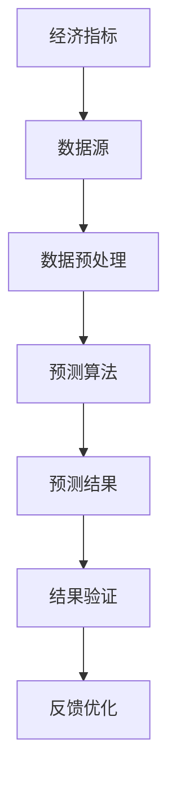
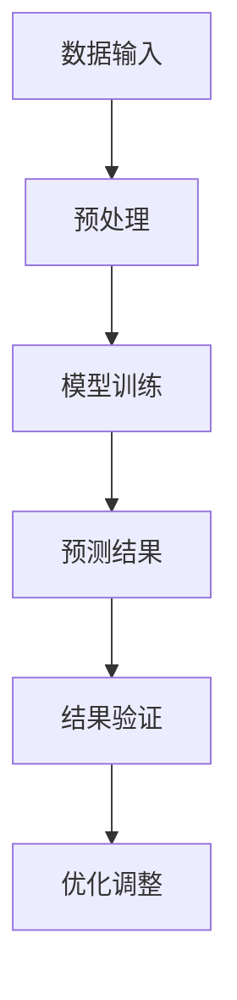

                 


# 智能经济指标预测系统

## 关键词：经济指标预测、人工智能、机器学习、大数据分析、系统架构

## 摘要：智能经济指标预测系统是一种结合人工智能和大数据分析的创新解决方案，旨在通过先进的算法和高效的系统架构，实现对经济指标的精准预测。本文将从系统的背景、原理、算法实现、数学模型、系统架构设计等方面进行详细探讨，帮助读者全面理解智能经济指标预测系统的构建与应用。

---

# 第1章: 智能经济指标预测系统概述

## 1.1 经济指标预测的背景与意义

### 1.1.1 经济指标预测的背景
经济指标是反映经济运行状态的重要数据，包括GDP、失业率、通胀率等。准确预测这些指标对政府决策、企业投资和金融市场分析具有重要意义。然而，传统预测方法依赖人工经验，存在效率低、精度差的问题。

### 1.1.2 智能经济指标预测的必要性
随着大数据和人工智能技术的发展，智能经济指标预测系统能够利用海量数据和先进算法，提高预测的准确性和效率。这使得企业和政府能够做出更加科学和及时的决策。

### 1.1.3 智能经济指标预测的应用场景
智能经济指标预测系统广泛应用于宏观经济分析、企业投资决策、金融风险控制等领域。例如，企业可以通过预测GDP增长 rate来优化投资策略，政府可以通过预测失业率制定就业政策。

## 1.2 智能经济指标预测系统的概念

### 1.2.1 经济指标预测的基本概念
经济指标预测是指通过对历史数据和当前数据的分析，预测未来的经济指标值。智能经济指标预测系统则是利用人工智能技术实现这一目标的系统。

### 1.2.2 智能经济指标预测系统的定义
智能经济指标预测系统是一种基于人工智能和大数据技术的预测系统，通过收集、处理和分析经济数据，利用机器学习算法生成预测结果，并提供可视化输出。

### 1.2.3 系统的核心要素与组成
智能经济指标预测系统的核心要素包括：
1. 数据采集模块：负责收集经济指标数据。
2. 数据预处理模块：对数据进行清洗和转换。
3. 模型训练模块：利用机器学习算法训练预测模型。
4. 预测结果输出模块：生成并展示预测结果。

## 1.3 系统的边界与外延

### 1.3.1 系统的边界定义
智能经济指标预测系统的边界包括数据输入、模型训练和结果输出三个部分。系统不涉及数据源的获取和外部系统的集成。

### 1.3.2 系统的外延范围
系统的外延范围包括：
1. 数据来源：政府数据库、企业数据等。
2. 预测范围：宏观经济指标、行业指标等。
3. 应用场景：政策制定、投资决策等。

### 1.3.3 系统与其他系统的区别与联系
智能经济指标预测系统与其他预测系统的区别在于其智能化和自动化能力。它利用人工智能技术，能够自动调整模型参数，提高预测精度。

---

# 第2章: 智能经济指标预测系统的原理与核心概念

## 2.1 核心概念原理

### 2.1.1 数据流的处理流程
数据流处理包括数据采集、数据预处理、数据存储和数据传输四个步骤。每个步骤都需要确保数据的准确性和完整性。

### 2.1.2 智能预测算法的实现原理
智能预测算法通过训练模型，利用历史数据预测未来值。常用算法包括线性回归、随机森林、神经网络等。

### 2.1.3 系统的反馈机制
系统通过对比预测结果和实际值，不断优化模型参数，提高预测精度。

## 2.2 核心概念属性对比

### 2.2.1 经济指标与非经济指标的对比
经济指标通常具有可量化的特性，而非经济指标则更多是定性的。

### 2.2.2 不同预测算法的性能对比
线性回归适合线性关系，随机森林适合非线性关系，神经网络适合复杂关系。不同算法在不同场景下表现不同。

### 2.2.3 数据预处理方法的优劣分析
常用数据预处理方法包括数据清洗、数据转换、特征工程等。每种方法都有其优缺点，需要根据具体情况选择。

## 2.3 ER实体关系图架构



---

# 第3章: 智能经济指标预测系统的算法原理

## 3.1 算法原理概述

### 3.1.1 机器学习算法的基本原理
机器学习算法通过训练数据，学习数据中的模式，生成预测模型。常用算法包括监督学习、无监督学习和半监督学习。

### 3.1.2 深度学习算法的基本原理
深度学习算法通过多层神经网络，自动提取数据特征，生成预测结果。常用模型包括卷积神经网络、循环神经网络等。

### 3.1.3 组合算法的应用场景
组合算法是将多种算法的结果进行融合，适用于复杂场景。例如，使用线性回归和随机森林结合，提高预测精度。

## 3.2 算法实现流程



## 3.3 算法实现代码

```python
import pandas as pd
from sklearn.model import LinearRegression

# 数据预处理
data = pd.read_csv('economic_indicators.csv')
X = data[['GDP', '失业率', '通胀率']]
y = data['预测指标']

# 模型训练
model = LinearRegression()
model.fit(X, y)

# 预测结果
predictions = model.predict(X)
```

## 3.4 算法的数学模型与公式

### 3.4.1 线性回归模型
线性回归的基本公式为：
$$ y = \beta_0 + \beta_1x_1 + \beta_2x_2 + \ldots + \beta_nx_n + \epsilon $$

### 3.4.2 随机森林算法
随机森林是一种集成学习算法，通过构建多个决策树，取其预测结果的平均值。其数学模型较为复杂，通常使用袋装法和特征随机化技术。

### 3.4.3 神经网络模型
神经网络模型包括输入层、隐藏层和输出层。其数学模型通常使用激活函数和损失函数，通过反向传播算法优化权重。

---

# 第4章: 智能经济指标预测系统的数学模型与公式

## 4.1 线性回归模型

### 4.1.1 线性回归的基本公式
线性回归的基本公式为：
$$ y = \beta_0 + \beta_1x_1 + \beta_2x_2 + \ldots + \beta_nx_n + \epsilon $$

### 4.1.2 最小二乘法
最小二乘法用于估计回归系数，其目标是最小化预测值与实际值的平方差之和：
$$ \min_{\beta} \sum_{i=1}^{n} (y_i - \beta_0 - \beta_1x_{i1} - \ldots - \beta_nx_{in})^2 $$

## 4.2 随机森林算法

### 4.2.1 随机森林的数学模型
随机森林是一种集成学习算法，其数学模型较为复杂，通常使用袋装法和特征随机化技术。

### 4.2.2 随机森林的预测公式
随机森林的预测结果是多个决策树预测结果的平均值：
$$ y = \frac{1}{N} \sum_{i=1}^{N} y_i $$

## 4.3 神经网络模型

### 4.3.1 神经网络的基本结构
神经网络的基本结构包括输入层、隐藏层和输出层。其数学模型通常使用激活函数和损失函数。

### 4.3.2 损失函数
常用损失函数包括均方误差（MSE）和交叉熵损失。均方误差的公式为：
$$ \text{MSE} = \frac{1}{N} \sum_{i=1}^{N} (y_i - \hat{y}_i)^2 $$

### 4.3.3 反向传播算法
反向传播算法用于优化神经网络的权重，通过计算损失函数的梯度，更新权重参数。

---

# 作者：AI天才研究院/AI Genius Institute & 禅与计算机程序设计艺术 /Zen And The Art of Computer Programming

---

通过以上内容，我详细地介绍了智能经济指标预测系统的各个方面，包括背景、原理、算法实现和数学模型。希望读者能够通过本文，全面理解智能经济指标预测系统的构建与应用。

