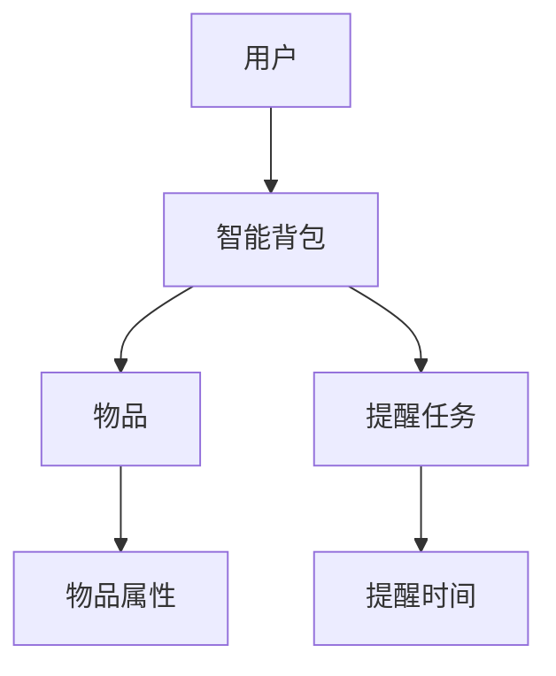
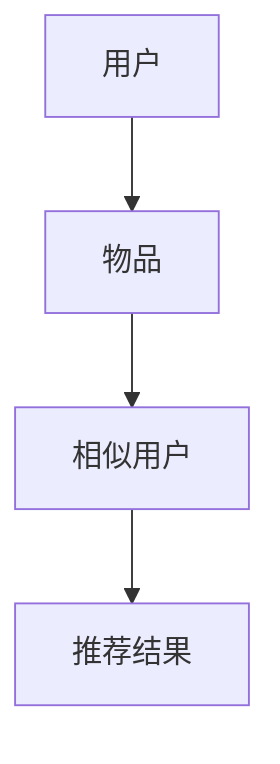
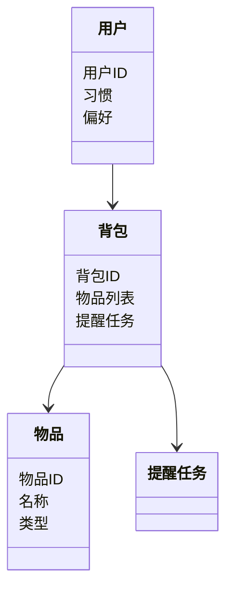
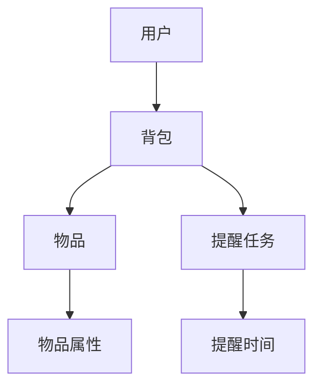

                 


# 智能背包：AI Agent的物品整理与提醒助手

> 关键词：智能背包, AI Agent, 物品整理, 提醒助手, 物联网, 人工智能

> 摘要：本文将探讨AI Agent在物品整理与提醒助手中的应用，分析其核心概念、算法原理、系统架构，并通过实战案例展示其实现过程。

---

# 第一部分: 智能背包的背景与概念

## 第1章: 智能背包的背景介绍

### 1.1 问题背景

#### 1.1.1 物品整理的挑战
现代生活中，物品整理已成为许多人日常生活中的难题。物品种类繁多，管理不当可能导致物品丢失或浪费时间。

#### 1.1.2 提醒功能的重要性
提醒功能在日常生活中的作用不可忽视。无论是工作还是生活，及时的提醒可以避免遗忘重要事项。

#### 1.1.3 AI Agent的应用潜力
AI Agent（智能代理）能够通过学习用户的习惯和偏好，提供个性化的整理和提醒服务。

### 1.2 问题描述

#### 1.2.1 物品整理的核心问题
如何高效整理物品，确保物品的可追溯性和易取性。

#### 1.2.2 提醒功能的需求
提醒功能需要准确、及时，并能够根据用户习惯进行调整。

### 1.3 解决思路

#### 1.3.1 基于AI Agent的解决方案
利用AI Agent的学习能力，优化物品整理和提醒服务。

#### 1.3.2 智能背包的功能设计
智能背包需要具备物品识别、分类整理、智能提醒等功能。

---

## 第2章: 智能背包的核心概念与联系

### 2.1 核心概念原理

#### 2.1.1 AI Agent的基本原理
AI Agent通过感知环境、学习用户行为，提供智能化服务。

#### 2.1.2 物品整理的实现机制
利用物联网设备和传感器，实时监测背包内物品的状态。

### 2.2 概念属性对比

| 概念 | 特性 | 描述 |
|------|------|------|
| AI Agent | 学习能力 | 能够通过数据学习用户习惯 |
| 物品整理 | 自动分类 | 能够自动将物品分类整理 |
| 提醒助手 | 个性化提醒 | 根据用户习惯提供定制化提醒 |

### 2.3 实体关系图



---

# 第二部分: 智能背包的算法与数学模型

## 第3章: AI Agent的算法原理

### 3.1 推荐算法

#### 3.1.1 协同过滤算法
协同过滤算法通过用户行为相似性推荐物品。



#### 3.1.2 算法实现
协同过滤算法的Python实现：

```python
def collaborative_filtering(user_id, items, user_similarity):
    recommendations = []
    for item in items:
        if item not in user_items[user_id]:
            similarity_sum = 0
            count = 0
            for user in user_items:
                if user != user_id and item in user_items[user]:
                    similarity_sum += user_similarity[user][user_id]
                    count += 1
            if count > 0:
                average = similarity_sum / count
                recommendations.append((item, average))
    return sorted(recommendations, key=lambda x: x[1], reverse=True)
```

### 3.2 数学模型

#### 3.2.1 协同过滤的数学公式
$$ \text{预测评分} = \frac{\sum \text{相似度} \times \text{评分}}{\sum \text{相似度}} $$

---

## 第4章: 智能背包的系统架构设计

### 4.1 系统功能设计

#### 4.1.1 领域模型类图



### 4.2 系统架构图



---

## 第5章: 项目实战

### 5.1 环境安装

#### 5.1.1 安装Python
需要安装Python 3.8及以上版本。

#### 5.1.2 安装依赖
安装必要的库，如numpy、pandas、scikit-learn。

### 5.2 核心代码实现

#### 5.2.1 协同过滤算法实现

```python
import numpy as np
from sklearn.metrics.pairwise import cosine_similarity

def collaborative_filtering(user_matrix, user_id):
    # 计算余弦相似度
    similarity = cosine_similarity(user_matrix)
    # 找出与指定用户相似度最高的用户
    similar_users = np.argsort(similarity[user_id])[::-1]
    # 根据相似用户的评分加权平均
    recommendation = {}
    for user in similar_users:
        if user != user_id:
            for item in user_matrix[user]:
                if item in recommendation:
                    recommendation[item] += similarity[user][user_id]
                else:
                    recommendation[item] = similarity[user][user_id]
    # 按相似度降序排序
    sorted_recommendations = sorted(recommendation.items(), key=lambda x: x[1], reverse=True)
    return sorted_recommendations
```

---

## 第6章: 最佳实践与总结

### 6.1 最佳实践

#### 6.1.1 定期更新模型
确保模型能够适应用户行为的变化。

#### 6.1.2 优化提醒策略
根据用户的反馈不断优化提醒的准确性和及时性。

### 6.2 小结
智能背包通过AI Agent实现了物品整理和提醒的智能化，大大提升了用户的效率和生活质量。

### 6.3 注意事项
在实际应用中，需注意数据隐私和模型的实时性。

### 6.4 拓展阅读
推荐阅读相关领域的书籍，如《集体智慧编程》和《机器学习实战》。

---

作者：AI天才研究院/AI Genius Institute & 禅与计算机程序设计艺术 /Zen And The Art of Computer Programming

