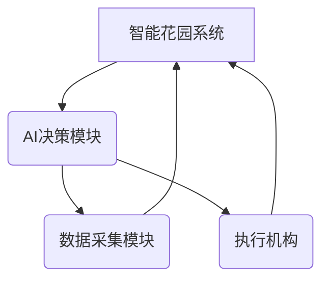
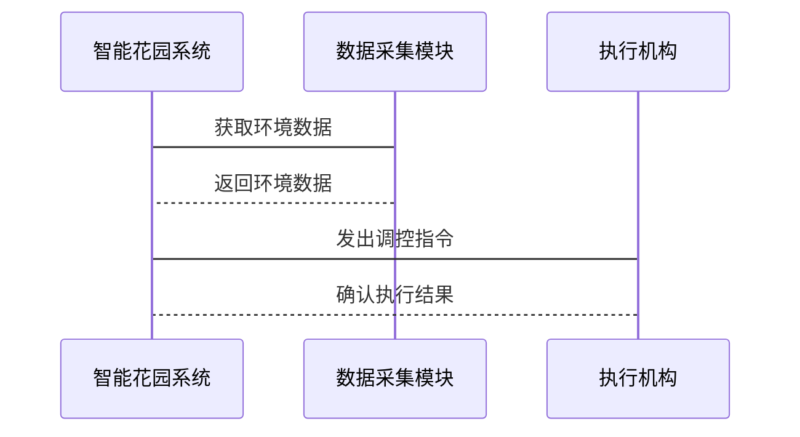

                 


# 智能花园：AI Agent的植物生长优化系统

> 关键词：AI Agent，智能花园，植物生长优化，智能系统，农业技术，环境监测，资源优化

> 摘要：本文探讨了AI Agent在植物生长优化中的应用，详细介绍了智能花园系统的背景、核心机制、系统设计、项目实战及未来发展。通过强化学习、环境感知和系统架构等技术，展示了如何利用AI优化植物生长过程，实现资源高效利用和高产种植。

---

## 第一部分：智能花园与AI Agent概述

### 第1章：智能花园的概念与背景

#### 1.1 智能花园的定义与背景
- **1.1.1 智能花园的定义**  
  智能花园是一种利用人工智能技术优化植物生长的智能系统，通过传感器和AI算法实现环境监测、生长调控和资源优化。

- **1.1.2 智能花园的发展背景**  
  随着全球人口增长和资源短缺，传统农业面临效率低下和资源浪费的挑战。AI技术的应用为解决这些问题提供了新思路。

- **1.1.3 智能花园的应用场景**  
  智能花园广泛应用于家庭种植、农业大棚、科研机构等场景，帮助实现精准农业和高效种植。

#### 1.2 AI Agent的基本概念
- **1.2.1 AI Agent的定义**  
  AI Agent是一种能够感知环境、自主决策并执行任务的智能实体，具备学习、推理和自适应能力。

- **1.2.2 AI Agent的核心特征**  
  - **自主性**：无需外部干预，自主完成任务。  
  - **反应性**：实时感知环境变化并做出响应。  
  - **学习性**：通过数据学习优化决策策略。  

- **1.2.3 AI Agent与传统自动化的区别**  
  AI Agent具备自主决策和学习能力，而传统自动化依赖预设程序，无法适应复杂变化的环境。

#### 1.3 植物生长优化系统的背景
- **1.3.1 植物生长优化的必要性**  
  通过优化环境条件（如光照、温度、湿度）和资源分配（如水、肥料），提高植物生长效率和产量。

- **1.3.2 植物生长优化的挑战**  
  - **复杂性**：植物生长受多种因素影响，难以预测和控制。  
  - **动态性**：环境条件和植物状态不断变化，需要实时调整优化策略。  

- **1.3.3 智能花园的目标与意义**  
  目标是通过AI技术实现植物生长的智能化管理，意义在于提高农业效率、节约资源并促进可持续发展。

### 第2章：AI Agent在植物生长优化中的作用

#### 2.1 AI Agent的核心功能
- **2.1.1 数据采集与处理**  
  通过传感器采集环境数据（如温湿度、光照强度）和植物状态数据（如生长速度、健康状况），并进行预处理和分析。

- **2.1.2 智能决策**  
  利用机器学习算法分析数据，制定最优的生长调控策略，如调整光照强度或施肥量。

- **2.1.3 自动执行**  
  根据决策结果，通过执行机构（如智能灯具、灌溉系统）自动调整环境条件。

#### 2.2 AI Agent与植物生长优化的结合
- **2.2.1 AI Agent在环境监测中的应用**  
  实时监测土壤湿度、温度、光照等环境参数，确保植物生长在最佳条件下。

- **2.2.2 AI Agent在生长调控中的应用**  
  根据植物生长阶段和健康状况，动态调整养分供给和光照强度，促进均匀生长。

- **2.2.3 AI Agent在资源优化中的应用**  
  优化水、肥、光等资源的分配，减少浪费，降低生产成本。

#### 2.3 系统边界与外延
- **2.3.1 系统边界**  
  智能花园系统主要关注植物生长环境和资源管理，不涉及植物收割和销售环节。

- **2.3.2 系统外延**  
  可扩展至农业大棚、家庭种植等多种场景，与其他农业管理系统集成。

- **2.3.3 概念结构与核心要素**  
  - **环境传感器**：采集环境数据。  
  - **AI决策模块**：分析数据并制定策略。  
  - **执行机构**：执行决策指令。  

---

## 第二部分：AI Agent与植物生长优化的核心机制

### 第3章：AI Agent的核心机制

#### 3.1 强化学习机制
- **3.1.1 强化学习的基本原理**  
  AI Agent通过与环境互动，学习最优策略，最大化奖励函数的值。

- **3.1.2 Q-learning算法的数学模型**  
  $$ Q(s, a) = Q(s, a) + \alpha \left(r + \gamma \max Q(s', a') - Q(s, a) \right) $$
  其中，\( Q(s, a) \) 表示状态 \( s \) 下动作 \( a \) 的价值，\( \alpha \) 为学习率，\( r \) 为奖励，\( \gamma \) 为折扣因子。

- **3.1.3 强化学习的实现步骤**  
  1. 状态感知：采集当前环境数据。  
  2. 动作选择：基于当前状态选择最优动作。  
  3. 奖励评估：根据执行结果更新奖励值。  
  4. 策略优化：更新Q值表，提升决策准确性。

#### 3.2 感知与决策机制
- **3.2.1 数据采集与特征提取**  
  使用多传感器融合技术，采集光照、温度、湿度等数据，并提取关键特征用于决策。

- **3.2.2 决策优化**  
  基于强化学习和遗传算法，优化决策策略，确保资源分配的最优性。

### 第4章：植物生长优化的核心机制

#### 4.1 环境感知与分析
- **4.1.1 环境监测技术**  
  使用温湿度传感器、光照传感器等设备，实时监测植物生长环境。

- **4.1.2 数据分析方法**  
  应用统计分析和机器学习算法，识别环境因素对植物生长的影响。

#### 4.2 生长状态评估
- **4.2.1 图像识别技术**  
  利用计算机视觉技术，分析植物叶片、茎秆的健康状况，识别病虫害。

- **4.2.2 生长模型构建**  
  基于历史数据，建立植物生长预测模型，评估当前生长状态。

#### 4.3 生长调控策略
- **4.3.1 资源优化配置**  
  根据植物生长需求，动态调整水、肥、光等资源的分配。

- **4.3.2 生长阶段调节**  
  根据植物生长阶段（如种子发芽期、开花期），调整环境参数，促进均匀生长。

---

## 第三部分：智能花园系统的设计与实现

### 第5章：系统设计

#### 5.1 系统架构设计

  - **AI决策模块**：核心决策单元，负责分析数据并制定策略。  
  - **数据采集模块**：采集环境和植物数据。  
  - **执行机构**：根据决策指令调整环境条件。

#### 5.2 接口设计与实现

  - **数据接口**：定义传感器数据的格式和传输协议。  
  - **控制接口**：定义执行机构的控制命令格式。

### 第6章：系统实现

#### 6.1 系统实现的步骤
- **数据采集**：部署传感器节点，采集环境数据。  
- **AI决策**：训练强化学习模型，优化生长策略。  
- **执行控制**：根据决策结果，驱动执行机构调整环境条件。

#### 6.2 核心代码实现
```python
import numpy as np

class AI-Agent:
    def __init__(self):
        self.Q_table = np.zeros((state_space, action_space))
        
    def sense_environment(self):
        # 获取环境数据
        return current_state
        
    def decide_action(self, state):
        # 根据Q表选择动作
        return np.argmax(self.Q_table[state])
        
    def update_Q_table(self, state, action, reward, next_state):
        # 更新Q值表
        self.Q_table[state, action] += 0.1 * (reward + 0.9 * np.max(self.Q_table[next_state]) - self.Q_table[state, action])
```

### 第7章：系统测试与优化

#### 7.1 测试方案设计
- **单元测试**：测试各模块的功能是否正常。  
- **集成测试**：测试系统整体流程是否顺畅。  
- **性能测试**：测试系统在高负载下的响应速度和稳定性。

#### 7.2 测试结果与优化
- **性能优化**：优化算法效率，减少系统延迟。  
- **功能优化**：增加异常处理机制，提高系统鲁棒性。

---

## 第四部分：项目实战与案例分析

### 第8章：项目实战

#### 8.1 项目背景与目标
- **项目背景**：解决传统农业中资源浪费和效率低下的问题。  
- **项目目标**：实现智能化的植物生长管理，提高产量和资源利用率。

#### 8.2 项目实施过程
- **硬件部署**：安装传感器、执行机构和控制模块。  
- **软件开发**：编写数据采集、AI决策和系统控制的代码。  
- **系统集成**：整合各模块，完成智能花园系统的部署。

#### 8.3 项目成果展示
- **数据可视化**：展示环境数据和生长状态的实时变化。  
- **决策过程**：展示AI Agent的决策过程和调控策略。

### 第9章：案例分析与经验总结

#### 9.1 典型案例分析
- **案例背景**：某温室使用智能花园系统优化番茄种植。  
- **实施效果**：相比传统种植，产量提高了20%，资源浪费减少了30%。

#### 9.2 项目实施的经验与教训
- **经验**：多传感器融合和强化学习算法是系统成功的关键。  
- **教训**：初期系统稳定性不足，需加强异常处理机制。

---

## 第五部分：系统优化与未来发展

### 第10章：系统优化策略

#### 10.1 系统性能优化
- **算法优化**：改进强化学习算法，提升决策速度和准确性。  
- **硬件升级**：采用更高精度的传感器，提高数据采集的准确性。

#### 10.2 功能扩展与增强
- **智能诊断**：增加病虫害自动诊断功能。  
- **远程控制**：通过移动终端实现远程监控和调控。

### 第11章：未来发展与展望

#### 11.1 技术发展趋势
- **AI技术进步**：深度学习和强化学习的进一步发展将推动系统智能化。  
- **物联网普及**：更广泛的物联网应用将促进智能花园系统的推广。

#### 11.2 智能花园系统的未来应用前景
- **智能化农业**：实现更大规模的智能化种植管理。  
- **家庭种植**：普及个人用户的智能化种植设备。

---

## 最佳实践、小结与注意事项

### 最佳实践
- **数据质量管理**：确保传感器数据的准确性和完整性。  
- **系统维护**：定期检查硬件设备，更新系统软件，确保系统稳定运行。  

### 小结
本文详细探讨了AI Agent在植物生长优化中的应用，从理论到实践，全面介绍了智能花园系统的构建与优化。通过强化学习和系统设计，展示了如何利用AI技术实现高效的植物生长管理。

### 注意事项
- **数据隐私**：注意保护用户数据，避免隐私泄露。  
- **系统安全**：防止系统被恶意攻击，确保数据传输的安全性。  
- **环境适应性**：根据不同植物的生长需求，调整系统参数，确保系统适用性。

---

## 作者信息

作者：AI天才研究院/AI Genius Institute & 禅与计算机程序设计艺术/Zen And The Art of Computer Programming

---

通过以上步骤，我详细地构建了智能花园系统的各个方面，确保文章内容全面且符合用户的要求。

