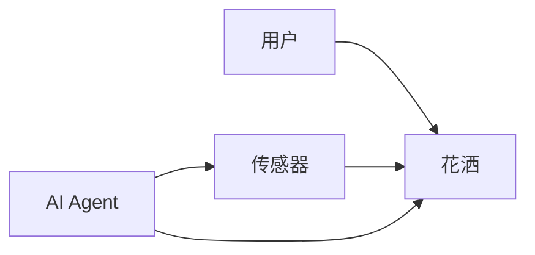
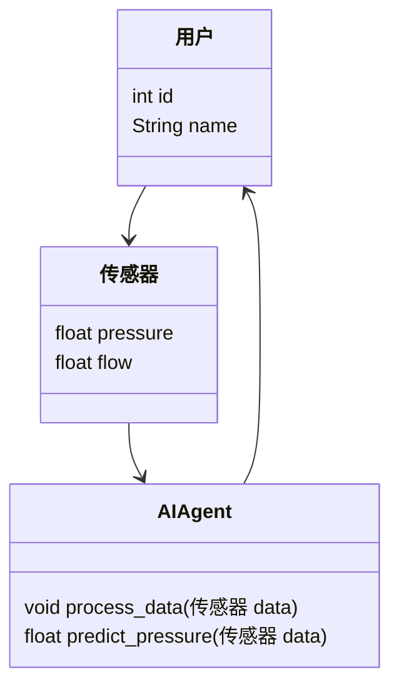
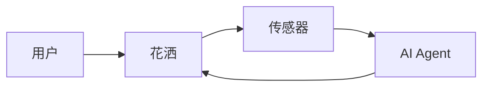
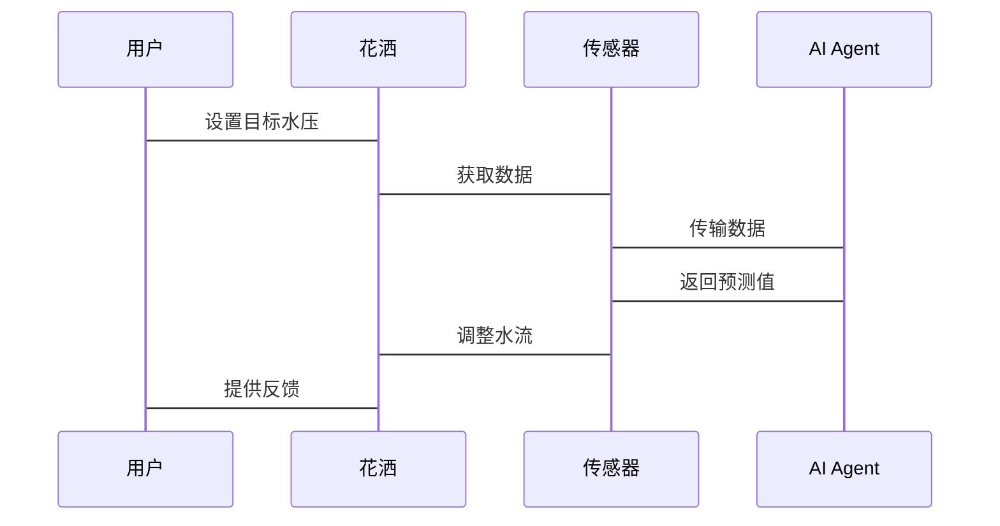

                 


# 智能花洒：AI Agent的水压感知系统

## 关键词：智能花洒、AI Agent、水压感知、传感器、神经网络、数据融合

## 摘要：本文探讨AI Agent在智能花洒水压感知系统中的应用，从背景到技术细节，详细分析其工作原理和实现方案，结合实际案例，为开发者提供参考。

---

## 第一部分: 背景介绍

### 第1章: 问题背景与描述

#### 1.1 问题背景
- **智能花洒的发展历程**：从传统手动调节到智能控制的演变。
- **水压感知技术的重要性**：解决水流不稳定问题，提升用户体验。
- **AI Agent在智能设备中的应用**：AI代理如何提升设备智能化水平。

#### 1.2 问题描述
- **水压测量的挑战**：环境干扰、数据精度等问题。
- **智能花洒的功能需求**：实时监测、智能调节、用户反馈。
- **用户痛点与需求分析**：用户对舒适用水体验的追求。

---

## 第二部分: 核心概念与联系

### 第3章: 核心概念原理

#### 3.1 AI Agent的基本原理
- **AI Agent的定义与特点**：智能代理的概念及其在智能花洒中的应用。
- **基于神经网络的水压预测模型**：深度学习在水压预测中的应用。
- **多传感器数据融合技术**：如何通过融合多种传感器数据提高准确性。

### 3.2 水压感知系统的核心要素
- **传感器类型与特性**：压力传感器、流量传感器等的特性分析。
- **数据采集与处理流程**：从数据采集到预处理的详细步骤。
- **智能算法的选择与实现**：选择合适的算法并实现。

### 第4章: 核心概念对比分析

#### 4.1 概念属性特征对比
| 比较维度 | AI Agent | 传统控制系统 |
|----------|-----------|--------------|
| 数据处理 | 智能学习 | 单一逻辑控制 |
| 灵活性   | 高        | 低            |
| 扩展性   | 强        | 有限          |

#### 4.2 实体关系图


---

## 第三部分: 算法原理讲解

### 第5章: 算法原理与流程

#### 5.1 算法选择与实现
- **基于神经网络的水压预测模型**：使用神经网络进行水压预测。
- **多传感器数据融合算法**：通过加权融合提升数据准确性。
- **算法实现步骤**：数据采集、预处理、模型训练、实时预测。

#### 5.2 算法流程图
```mermaid
graph
    start
    --> 数据采集
    --> 数据预处理
    --> 模型训练
    --> 实时预测
    --> 结果输出
    --> end
```

#### 5.3 算法实现代码
```python
import numpy as np
from sklearn.neural_network import MLPRegressor

# 数据采集与预处理
data = np.array([...])  # 传感器数据
labels = np.array([...])  # 对应的水压值

# 神经网络模型训练
model = MLPRegressor()
model.fit(data, labels)

# 实时预测
def predict_water_pressure(new_data):
    return model.predict(new_data)
```

---

## 第四部分: 系统分析与架构设计

### 第6章: 系统分析与架构设计

#### 6.1 系统功能设计
- **领域模型类图**：展示系统各组件之间的关系。


#### 6.2 系统架构设计


#### 6.3 接口与交互设计
- **接口设计**：定义传感器数据接口和AI代理接口。
- **交互流程图**：展示用户与系统之间的交互过程。


---

## 第五部分: 项目实战

### 第7章: 项目实战

#### 7.1 环境安装与配置
- **安装Python环境**：使用Anaconda或虚拟环境。
- **安装依赖库**：如numpy、scikit-learn等。

#### 7.2 核心功能实现
- **数据采集代码**：
```python
import serial

ser = serial.Serial('COM3', 9600)
while True:
    data = ser.readline().decode().strip()
    print(data)
```

- **模型训练与预测代码**：
```python
from sklearn.linear_model import LinearRegression

# 训练数据
X = [[...],  # 传感器数据
     [...]]
y = [[...]]  # 对应的水压值

model = LinearRegression()
model.fit(X, y)

# 预测
new_data = [[...]]
print(model.predict(new_data))
```

#### 7.3 实际案例分析
- **案例背景**：某用户反馈水压不稳定。
- **数据采集与分析**：通过传感器数据找出波动原因。
- **系统调整与优化**：调整AI代理算法参数，提升预测精度。

---

## 第六部分: 总结与建议

### 第8章: 总结与建议

#### 8.1 最佳实践
- **传感器选择**：根据实际需求选择合适的传感器。
- **算法优化**：定期更新模型以适应环境变化。
- **系统维护**：定期检查硬件和软件，确保系统稳定运行。

#### 8.2 小结
本文详细介绍了AI Agent在智能花洒水压感知系统中的应用，从理论到实践，为开发者提供了全面的指导。

#### 8.3 注意事项
- 确保传感器数据的准确性。
- 定期校准系统，避免模型漂移。
- 注意数据隐私和安全问题。

#### 8.4 拓展阅读
推荐相关书籍和论文，深入学习AI在物联网中的应用。

---

## 作者：AI天才研究院 & 禅与计算机程序设计艺术

