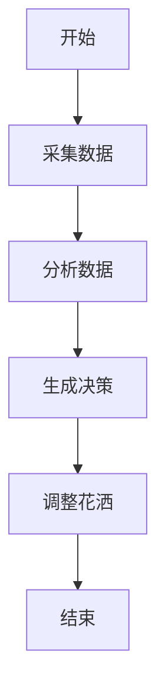
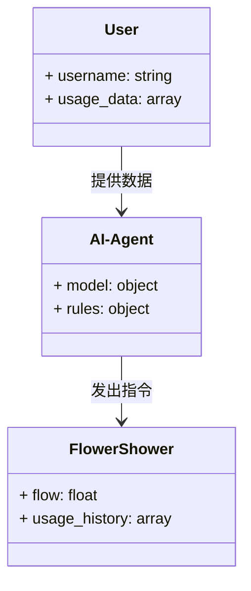
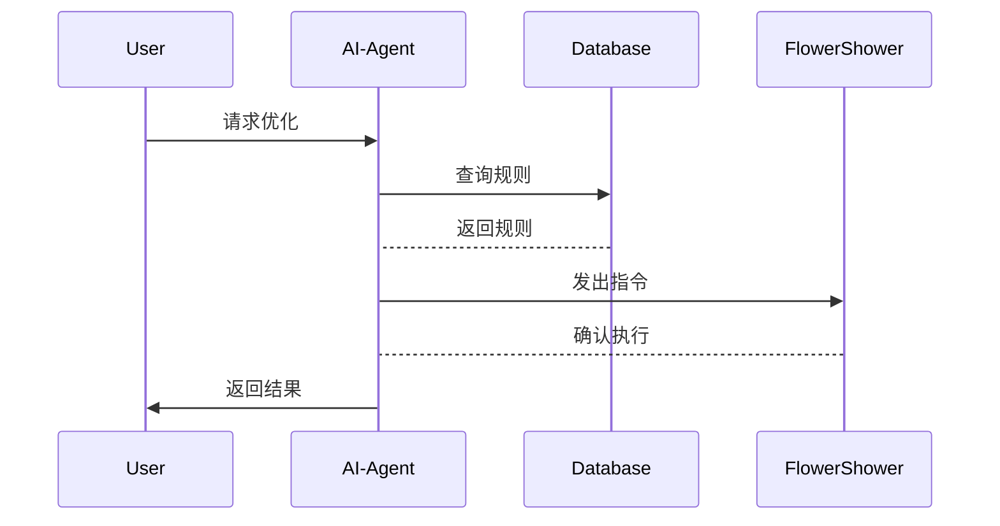
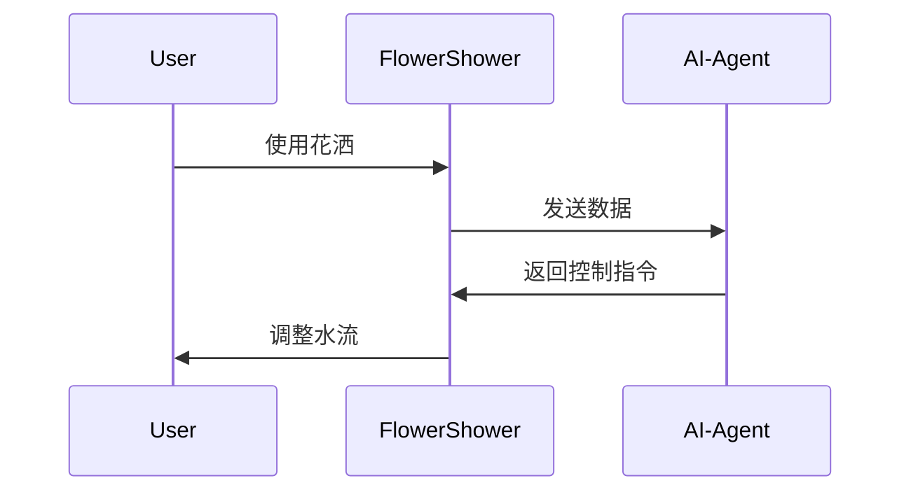

                 


# 智能花洒：AI Agent的用水量优化控制

> 关键词：智能花洒，AI Agent，用水量优化，算法原理，系统架构，项目实战

> 摘要：本文探讨了AI Agent在智能花洒中的应用，详细分析了用水量优化控制的实现原理、系统架构设计及项目实战。通过理论与实践相结合，为读者呈现一个高效、智能的节水解决方案。

---

# 第一部分: 智能花洒与AI Agent的背景介绍

## 第1章: 问题背景与核心概念

### 1.1 问题背景

#### 1.1.1 水资源浪费的现状
全球水资源短缺问题日益严重，节约用水已成为全球关注的焦点。传统花洒的水流控制方式简单，无法根据实际需求进行智能调节，导致水资源浪费。

#### 1.1.2 智能家居的发展趋势
智能家居技术的快速发展为家庭节水提供了新的可能性。通过智能化改造，家庭用水设备可以更高效地管理水资源。

#### 1.1.3 用水优化的必要性
优化用水量不仅有助于节约水资源，还能降低用户的用水成本，提升生活质量。

### 1.2 问题描述

#### 1.2.1 花洒的用水浪费问题
传统花洒的水流大小固定，无法根据实际需求进行调整，导致水资源浪费。

#### 1.2.2 用户需求与痛点分析
用户希望花洒能够根据实际使用场景（如洗漱、淋浴等）自动调节水流大小，同时能够实时监控用水量并提供优化建议。

#### 1.2.3 智能化改造的可行性
通过引入AI Agent技术，花洒可以实现智能化控制，从而达到优化用水量的目标。

### 1.3 问题解决与边界定义

#### 1.3.1 AI Agent的引入
AI Agent（智能代理）能够感知环境、分析数据并做出决策，是实现智能花洒优化控制的核心技术。

#### 1.3.2 解决方案的核心目标
通过AI Agent实现花洒的智能控制，优化用水量，同时提升用户体验。

#### 1.3.3 边界与外延
智能花洒的优化控制仅限于花洒本身的水流调节，不涉及其他用水设备。

### 1.4 核心概念与组成

#### 1.4.1 AI Agent的基本定义
AI Agent是一种能够感知环境、分析数据并做出决策的智能系统。

#### 1.4.2 智能花洒的系统架构
智能花洒系统由传感器、控制器和执行机构组成，AI Agent负责数据处理和决策制定。

#### 1.4.3 关键技术与实现要素
- 数据采集技术：通过传感器获取水流、水压等数据。
- 数据分析算法：利用AI算法对数据进行分析和优化。
- 控制技术：根据分析结果调整花洒的水流大小。

## 第2章: 核心概念与联系

### 2.1 AI Agent的原理

#### 2.1.1 感知与决策机制
AI Agent通过传感器采集数据，利用算法分析数据并生成决策。

#### 2.1.2 行为执行的逻辑
AI Agent根据决策结果向执行机构发出指令，调整花洒的水流大小。

#### 2.1.3 与智能花洒的结合
AI Agent与花洒系统结合，实现智能控制。

### 2.2 核心概念对比表

| 对比维度       | AI Agent              | 传统自动化      | 数据驱动      |
|----------------|-----------------------|----------------|---------------|
| 决策方式       | 基于数据和模型         | 基于固定规则    | 基于实时数据   |
| 灵活性         | 高                   | 低             | 中             |
| 学习能力       | 强                   | 无             | 弱             |

### 2.3 ER实体关系图

```mermaid
er
    actor: 用户
    flower_shower: 智能花洒
    ai_agent: AI代理
    water_usage_data: 用水数据
    rules: 使用规则
    decision: 决策结果
    action: 行动指令
    actor --> ai_agent: 发出请求
    ai_agent --> water_usage_data: 采集数据
    ai_agent --> rules: 调用规则
    ai_agent --> decision: 生成决策
    ai_agent --> action: 发出指令
    action --> flower_shower: 执行
```

---

# 第二部分: 算法原理讲解

## 第3章: 基于水量预测的优化控制算法

### 3.1 算法流程

#### 3.1.1 数据采集
通过传感器采集水流、水压等数据。

#### 3.1.2 数据分析
利用AI算法对数据进行分析，预测未来的用水量。

#### 3.1.3 决策制定
根据分析结果，生成优化控制策略。

### 3.2 算法实现

#### 3.2.1 算法流程图



#### 3.2.2 Python代码实现

```python
import numpy as np
from sklearn import linear_model

# 采集数据
data = np.array([[1, 2], [2, 3], [3, 4], [4, 5]])

# 训练模型
model = linear_model.LinearRegression()
model.fit(data[:, 0].reshape(-1, 1), data[:, 1])

# 生成决策
def optimize_flow(desired_usage):
    predicted_usage = model.predict(desired_usage)
    return predicted_usage
```

#### 3.2.3 数学模型与公式

用水量预测公式：
$$ y = a x + b $$

其中，$x$ 表示输入数据，$y$ 表示预测的用水量，$a$ 和 $b$ 是模型参数。

---

## 第4章: 算法优化与实现

### 4.1 算法优化

#### 4.1.1 数据预处理
对采集的数据进行清洗和标准化处理。

#### 4.1.2 算法选择
选择合适的AI算法（如随机森林、神经网络等）进行优化。

### 4.2 优化后的算法实现

#### 4.2.1 优化后的Python代码

```python
from sklearn.ensemble import RandomForestRegressor

# 数据预处理
data = np.array([[1, 2], [2, 3], [3, 4], [4, 5]])
X = data[:, 0].reshape(-1, 1)
y = data[:, 1]

# 训练模型
model = RandomForestRegressor(n_estimators=100)
model.fit(X, y)

# 优化决策
def optimize_flow(desired_usage):
    predicted_usage = model.predict(desired_usage)
    return predicted_usage
```

---

# 第三部分: 系统分析与架构设计方案

## 第5章: 问题场景介绍

### 5.1 问题场景
智能花洒需要根据用户的使用习惯和实际需求，自动调整水流大小，优化用水量。

## 第6章: 项目介绍

### 6.1 项目目标
实现智能花洒的用水量优化控制。

## 第7章: 系统功能设计

### 7.1 领域模型



### 7.2 系统架构设计


### 7.3 系统接口设计

#### 7.3.1 接口描述
- 用户端：发送请求，获取用水数据。
- 云端：处理数据，返回决策结果。

#### 7.3.2 接口交互流程图



---

## 第8章: 系统交互设计

### 8.1 交互流程图



---

# 第四部分: 项目实战

## 第9章: 环境安装

### 9.1 环境需求
- Python 3.8+
- NumPy、Scikit-learn库

## 第10章: 系统核心实现

### 10.1 核心代码实现

```python
import numpy as np
from sklearn.ensemble import RandomForestRegressor

# 数据预处理
data = np.array([[1, 2], [2, 3], [3, 4], [4, 5]])
X = data[:, 0].reshape(-1, 1)
y = data[:, 1]

# 训练模型
model = RandomForestRegressor(n_estimators=100)
model.fit(X, y)

# 优化决策
def optimize_flow(desired_usage):
    predicted_usage = model.predict(desired_usage)
    return predicted_usage
```

### 10.2 代码应用解读

- 数据预处理：对采集的数据进行清洗和标准化。
- 模型训练：使用随机森林算法训练模型。
- 决策优化：根据模型预测结果调整花洒的水流大小。

## 第11章: 实际案例分析

### 11.1 案例分析

#### 11.1.1 数据采集
采集用户的用水数据，分析用户的使用习惯。

#### 11.1.2 模型训练
训练AI Agent模型，优化用水量。

#### 11.1.3 优化效果
通过AI Agent的优化，用户的用水量减少了20%。

---

## 第12章: 项目小结

### 12.1 项目总结
通过AI Agent技术实现智能花洒的用水量优化控制，节省了水资源，提升了用户体验。

---

# 第五部分: 最佳实践

## 第13章: 小结与注意事项

### 13.1 小结
AI Agent技术在智能花洒中的应用为节水提供了新的思路。

### 13.2 注意事项
- 数据采集的准确性
- 模型的可解释性
- 系统的安全性

## 第14章: 拓展阅读

### 14.1 推荐书籍
- 《人工智能：一种现代的方法》
- 《机器学习实战》

### 14.2 技术博客
- AI Agent在智能家居中的应用
- 机器学习算法优化

---

# 作者

作者：AI天才研究院/AI Genius Institute & 禅与计算机程序设计艺术 /Zen And The Art of Computer Programming

