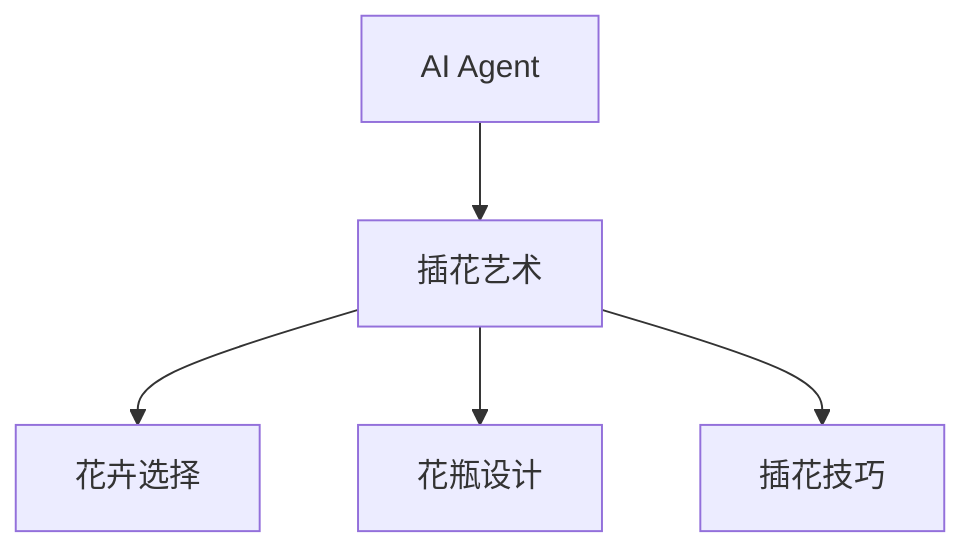
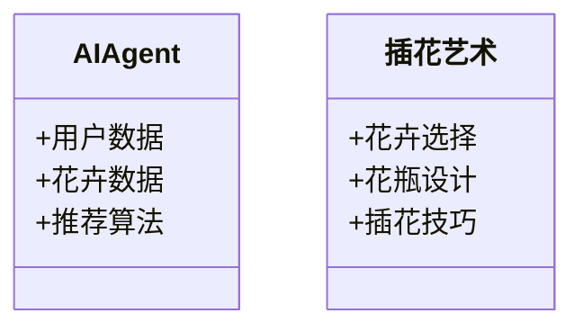
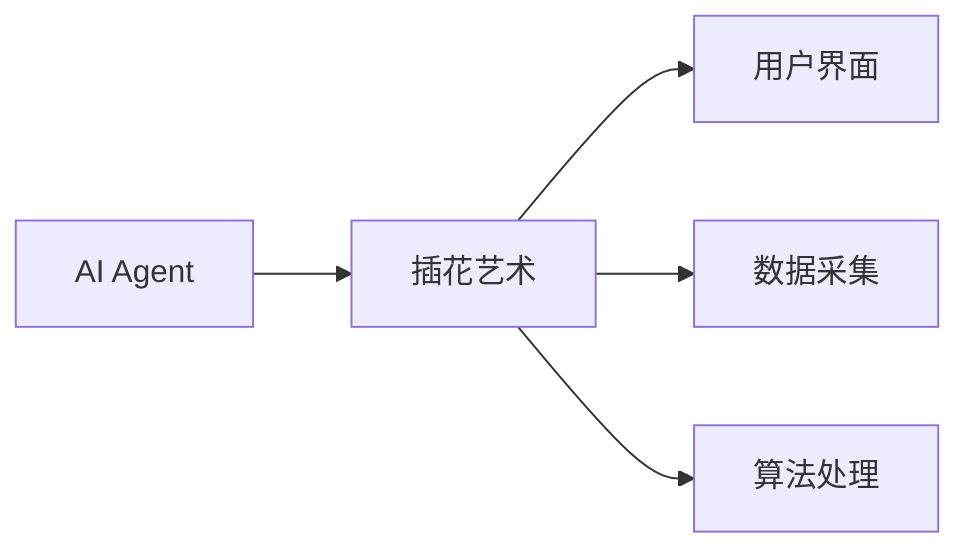
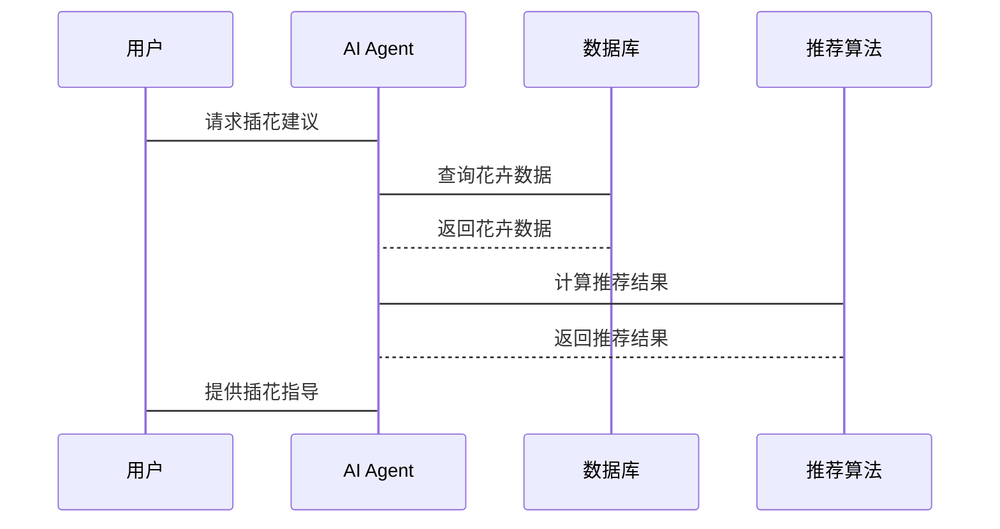

                 


# 智能花瓶：AI Agent的插花艺术指导

> 关键词：AI Agent、插花艺术、智能花瓶、推荐系统、算法原理、系统架构

> 摘要：本文探讨了AI Agent在插花艺术中的应用，通过智能花瓶这一创新工具，结合推荐算法和系统架构设计，为用户提供个性化的插花指导。文章详细分析了AI Agent的核心概念、算法原理、系统架构，并通过实际案例展示了智能花瓶的实现过程，为读者提供了从理论到实践的全面指导。

---

# 第一部分: AI Agent与插花艺术的结合

## 第1章: 智能花瓶与AI Agent的背景介绍

### 1.1 AI Agent的基本概念

#### 1.1.1 AI Agent的定义
AI Agent（人工智能代理）是一种能够感知环境并采取行动以实现目标的智能实体。它可以通过传感器获取信息，利用算法进行决策，并通过执行器与环境交互。AI Agent的核心在于其智能性，能够根据输入的信息做出合理的判断和建议。

#### 1.1.2 AI Agent的核心属性
- **自主性**：AI Agent能够自主决策，无需外部干预。
- **反应性**：能够实时感知环境变化并做出反应。
- **学习能力**：通过数据学习，不断优化自身的推荐算法。
- **交互能力**：能够与用户或其他系统进行有效交互。

#### 1.1.3 AI Agent与传统插花艺术的结合
传统插花艺术依赖于人类的经验和审美，而AI Agent的引入为插花艺术注入了科技元素。通过AI Agent，用户可以得到个性化的插花建议，提升插花的效率和美感。

### 1.2 插花艺术的历史与现状

#### 1.2.1 插花艺术的起源与发展
插花艺术起源于古代，最初用于宗教仪式和装饰。随着人类文明的发展，插花艺术逐渐走向专业化，成为一门独立的艺术形式。

#### 1.2.2 当代插花艺术的特点
- **多样性**：现代插花艺术注重个性化和多元化，融合了各种文化元素。
- **科技化**：随着科技的发展，插花艺术开始引入AI、大数据等技术手段。
- **可持续性**：环保理念逐渐融入插花艺术，提倡使用可持续的花材和插花方式。

#### 1.2.3 插花艺术的数字化趋势
随着数字化技术的发展，插花艺术逐渐向数字化方向转型。AI Agent的出现，使得插花艺术更加智能化和个性化。

### 1.3 智能花瓶的定义与应用场景

#### 1.3.1 智能花瓶的定义
智能花瓶是一种结合了AI技术的插花工具，能够根据用户的喜好和环境因素，推荐最优的插花方案。

#### 1.3.2 智能花瓶的主要功能
- **花卉推荐**：根据用户的喜好和环境条件，推荐适合的花卉种类和搭配。
- **插花指导**：提供插花的步骤和技巧，帮助用户完成插花。
- **实时反馈**：通过传感器实时监测插花效果，并给出优化建议。

#### 1.3.3 智能花瓶的用户群体与市场定位
智能花瓶的主要用户群体包括插花爱好者、室内设计师、家庭用户等。市场定位定位于高端市场，注重用户体验和个性化服务。

## 第2章: AI Agent与插花艺术的核心概念

### 2.1 AI Agent在插花艺术中的核心作用

#### 2.1.1 AI Agent的智能推荐功能
AI Agent能够根据用户的历史行为和偏好，推荐适合的花卉和插花方案。

#### 2.1.2 AI Agent的个性化设计能力
通过学习用户的插花偏好，AI Agent能够设计出符合用户审美的插花方案。

#### 2.1.3 AI Agent的实时反馈机制
AI Agent能够实时监测插花效果，并根据反馈调整推荐策略，提升用户体验。

### 2.2 插花艺术的核心要素

#### 2.2.1 花卉的选择与搭配
花卉的选择和搭配直接影响插花的美感。AI Agent需要考虑花卉的颜色、形状、季节等因素，推荐最优的搭配方案。

#### 2.2.2 花瓶的设计与搭配
花瓶的设计与插花的整体效果密切相关。AI Agent需要考虑花瓶的材质、颜色、形状等因素，推荐适合的花瓶搭配。

#### 2.2.3 插花的摆放技巧
插花的摆放技巧直接影响插花的视觉效果。AI Agent需要提供科学的插花步骤和技巧，帮助用户完成插花。

### 2.3 AI Agent与插花艺术的实体关系图



---

## 第3章: AI Agent的推荐算法原理

### 3.1 推荐算法的原理

#### 3.1.1 协同过滤算法
协同过滤是一种基于用户相似性推荐算法。通过分析用户的历史行为，找到与当前用户相似的用户，推荐他们喜欢的物品。

#### 3.1.2 基于内容的推荐算法
基于内容的推荐算法通过分析物品的属性，找到与当前物品相似的物品，推荐给用户。

#### 3.1.3 混合推荐算法
混合推荐算法结合了协同过滤和基于内容的推荐算法，通过综合考虑用户和物品的特征，推荐更精准的结果。

### 3.2 推荐算法的实现

```mermaid
graph TD
    Start --> Collect Data
    Collect Data --> Preprocess Data
    Preprocess Data --> Train Model
    Train Model --> Make Recommendations
    Make Recommendations --> End
```

### 3.3 推荐算法的数学模型

#### 3.3.1 协同过滤的相似度计算
$$\text{相似度} = \frac{\sum (x_i - \mu_x)(y_i - \mu_y)}{\sqrt{\sum (x_i - \mu_x)^2} \sqrt{\sum (y_i - \mu_y)^2}}$$

#### 3.3.2 基于内容的推荐公式
$$\text{相似度} = \frac{\sum w_{ij}x_i}{\sum w_{i}$$

---

## 第4章: 系统分析与架构设计方案

### 4.1 问题场景介绍

### 4.2 系统功能设计

#### 4.2.1 领域模型


### 4.3 系统架构设计

#### 4.3.1 系统架构图


### 4.4 系统接口设计

### 4.5 系统交互设计

#### 4.5.1 序列图


---

## 第5章: 项目实战

### 5.1 环境安装

### 5.2 系统核心实现

#### 5.2.1 推荐算法实现
```python
def collaborative_filtering(user_id, user_data):
    # 实现协同过滤算法
    pass
```

#### 5.2.2 系统架构实现
```python
class AI_Agent:
    def __init__(self):
        self.user_data = {}
        self.flower_data = {}
```

### 5.3 实际案例分析

### 5.4 项目小结

---

## 第6章: 最佳实践与小结

### 6.1 最佳实践 tips

### 6.2 小结

### 6.3 注意事项

### 6.4 拓展阅读

---

# 作者：AI天才研究院/AI Genius Institute & 禅与计算机程序设计艺术 /Zen And The Art of Computer Programming

