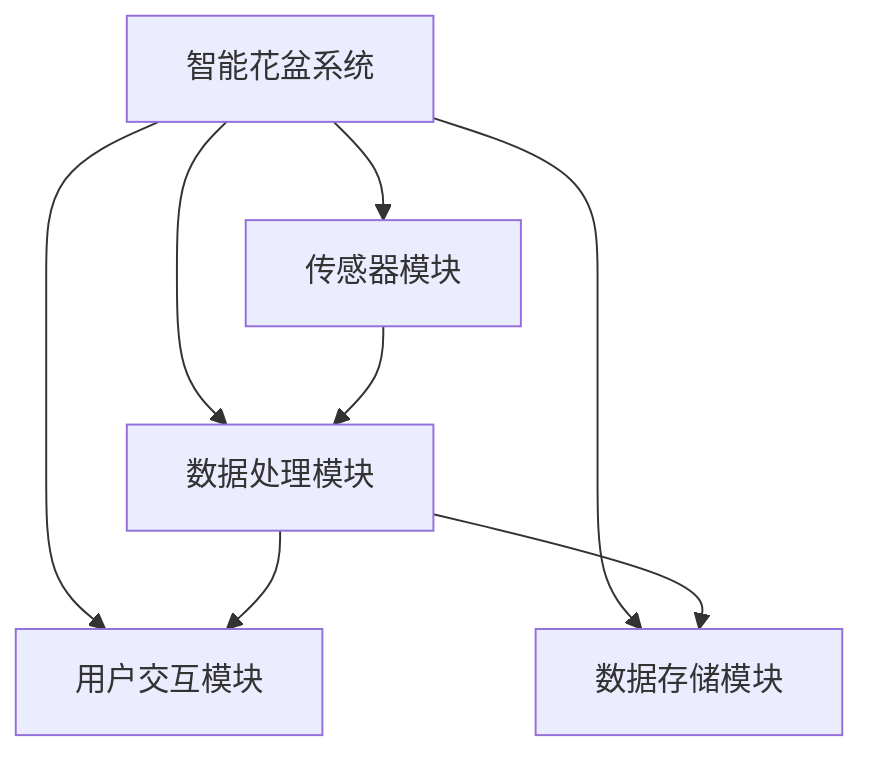

                 


# 智能花盆：AI Agent的植物生长监测

> 关键词：智能花盆, AI Agent, 植物生长监测, 物联网技术, 机器学习, 传感器技术

> 摘要：本文详细探讨了智能花盆的设计与实现，重点介绍了AI Agent在植物生长监测中的应用。通过分析植物生长监测的重要性、系统架构设计、核心技术原理以及项目实战，本文为读者提供了从理论到实践的全面指导。

---

# 第一部分: 智能花盆与AI Agent概述

## 第1章: 智能花盆的概念与背景

### 1.1 智能花盆的定义与应用场景
- **1.1.1 智能花盆的定义**
  - 智能花盆是一种结合了物联网和人工智能技术的智能设备，能够实时监测植物的生长环境并提供相应的反馈。
- **1.1.2 智能花盆的主要应用场景**
  - 家庭养植、农业种植、科研实验等。
- **1.1.3 智能花盆与传统花盆的区别**
  - 传统花盆仅提供基本的种植环境，而智能花盆能够实时监测并优化植物的生长条件。

### 1.2 AI Agent的基本概念
- **1.2.1 什么是AI Agent**
  - AI Agent是一种智能体，能够感知环境并采取行动以实现特定目标。
- **1.2.2 AI Agent的核心特点**
  - 智能性、自主性、反应性、社会性。
- **1.2.3 AI Agent在智能花盆中的作用**
  - 实时监测植物的生长环境，自动调节光照、温度、湿度等条件。

### 1.3 植物生长监测的重要性
- **1.3.1 植物生长监测的基本概念**
  - 植物生长监测是指通过传感器等设备，实时采集植物的生长数据，包括光照、温度、湿度、土壤pH值等。
- **1.3.2 植物生长监测的必要性**
  - 通过监测植物的生长数据，可以及时发现并解决问题，提高植物的生长效率和质量。
- **1.3.3 智能花盆在植物生长监测中的优势**
  - 高效性、准确性、实时性。

### 1.4 本章小结
- 本章介绍了智能花盆的概念、AI Agent的基本原理以及植物生长监测的重要性，为后续章节的深入分析奠定了基础。

---

## 第2章: 智能花盆的系统架构

### 2.1 系统整体架构设计
- **2.1.1 系统模块划分**
  - 传感器模块、数据处理模块、用户交互模块、数据存储模块。
- **2.1.2 各模块之间的关系**
  - 传感器模块采集数据，数据处理模块对数据进行分析，用户交互模块提供人机交互界面，数据存储模块存储数据。
- **2.1.3 系统架构的优缺点分析**
  - 优点：模块化设计，便于维护和扩展；缺点：需要较高的硬件和软件支持。

### 2.2 系统功能设计
- **2.2.1 植物生长监测功能**
  - 实时采集植物的生长数据，包括光照、温度、湿度、土壤pH值等。
- **2.2.2 用户交互功能**
  - 提供人机交互界面，用户可以查看植物的生长数据，并根据数据调整植物的生长环境。
- **2.2.3 数据存储与分析功能**
  - 对采集的数据进行存储，并通过数据分析提供植物生长的建议。

### 2.3 系统架构的Mermaid图


### 2.4 本章小结
- 本章详细介绍了智能花盆的系统架构设计，包括模块划分、功能设计以及系统架构图。

---

## 第3章: 智能花盆的核心技术

### 3.1 AI Agent的核心算法
- **3.1.1 机器学习算法在AI Agent中的应用**
  - 用于预测植物的生长状态和优化生长环境。
- **3.1.2 常见的AI Agent算法介绍**
  - 基于规则的算法、基于模型的算法、基于强化学习的算法。
- **3.1.3 算法选择的依据**
  - 根据具体应用场景和数据特点选择合适的算法。

### 3.2 物联网技术在智能花盆中的应用
- **3.2.1 物联网的基本概念**
  - 物联网是指通过各种信息传感设备，按照约定的协议，把任何物品与互联网连接起来，进行信息交换和通信。
- **3.2.2 物联网技术在智能花盆中的具体应用**
  - 通过传感器采集植物的生长数据，并通过无线通信技术传输到云端进行处理。
- **3.2.3 物联网技术的优势与挑战**
  - 优势：高效性、实时性；挑战：成本高、安全性问题。

### 3.3 传感器技术在植物生长监测中的应用
- **3.3.1 常见的传感器类型**
  - 光照传感器、温度传感器、湿度传感器、土壤pH值传感器。
- **3.3.2 传感器在植物生长监测中的作用**
  - 实时采集植物的生长数据，为AI Agent提供决策依据。
- **3.3.3 传感器数据的采集与处理**
  - 数据采集：通过传感器获取数据；数据处理：对数据进行清洗、分析和存储。

### 3.4 本章小结
- 本章详细介绍了智能花盆的核心技术，包括AI Agent的核心算法、物联网技术的应用以及传感器技术的作用。

---

## 第4章: 智能花盆的数学模型与算法原理

### 4.1 植物生长监测的数学模型
- **4.1.1 植物生长监测的基本模型**
  - 简单线性模型：$y = ax + b$
  - 复杂模型：基于机器学习的预测模型。
- **4.1.2 基于机器学习的植物生长预测模型**
  - 使用神经网络模型进行预测，模型结构包括输入层、隐藏层和输出层。
- **4.1.3 模型的训练与优化**
  - 使用训练数据对模型进行训练，并通过交叉验证优化模型的参数。

### 4.2 AI Agent的核心算法原理
- **4.2.1 机器学习算法的基本原理**
  - 算法通过学习数据中的模式，生成能够预测新数据的模型。
- **4.2.2 算法的数学推导与公式**
  - 线性回归公式：$$y = \beta_0 + \beta_1x + \epsilon$$
  - 神经网络的激活函数：$$f(x) = \sigma(x) = \frac{1}{1 + e^{-x}}$$
- **4.2.3 算法的实现步骤与流程图**
  ```mermaid
  graph TD
  A[输入数据] --> B[特征提取]
  B --> C[模型训练]
  C --> D[输出结果]
  ```

### 4.3 算法的优化与改进
- **4.3.1 算法优化的基本原则**
  - 提高算法的准确性和效率。
- **4.3.2 常见的优化方法**
  - 参数调整、特征选择、模型集成。
- **4.3.3 优化算法的数学推导与公式**
  - 随机梯度下降公式：$$\theta = \theta - \eta \frac{\partial L}{\partial \theta}$$

### 4.4 本章小结
- 本章详细介绍了智能花盆的数学模型和算法原理，包括模型的训练与优化、算法的实现步骤以及优化方法。

---

## 第5章: 智能花盆的系统实现

### 5.1 系统环境的搭建
- **5.1.1 开发工具的选择与安装**
  - 使用Python、TensorFlow、Flask等工具。
- **5.1.2 系统运行环境的配置**
  - 安装必要的库和依赖项。
- **5.1.3 数据库的搭建**
  - 使用MySQL或MongoDB存储植物生长数据。

### 5.2 系统核心实现
- **5.2.1 传感器数据的采集与处理**
  - 使用Raspberry Pi和传感器模块采集数据，并通过Python脚本进行处理。
- **5.2.2 数据的存储与分析**
  - 将数据存储到数据库中，并使用数据可视化工具进行分析。
- **5.2.3 AI Agent的实现**
  - 使用机器学习模型对数据进行分析，并生成相应的反馈。

### 5.3 项目实战
- **5.3.1 环境搭建与代码实现**
  - 示例代码：
    ```python
    import numpy as np
    import tensorflow as tf

    model = tf.keras.Sequential([
        tf.keras.layers.Dense(64, activation='relu'),
        tf.keras.layers.Dense(1, activation='sigmoid')
    ])
    model.compile(optimizer='adam', loss='binary_crossentropy')
    model.fit(X_train, y_train, epochs=10)
    ```
- **5.3.2 代码应用解读与分析**
  - 代码实现了一个简单的神经网络模型，用于预测植物的生长状态。
- **5.3.3 实际案例分析**
  - 通过实际案例分析，展示智能花盆在植物生长监测中的应用效果。
- **5.3.4 项目小结**
  - 总结项目实现的过程和成果，并提出改进建议。

### 5.4 本章小结
- 本章详细介绍了智能花盆的系统实现，包括环境搭建、代码实现以及项目实战。

---

## 第6章: 智能花盆的最佳实践与扩展

### 6.1 最佳实践 tips
- **6.1.1 系统设计中的注意事项**
  - 确保系统的可扩展性和可维护性。
- **6.1.2 算法优化的技巧**
  - 使用交叉验证优化模型的参数。
- **6.1.3 系统安全性的保障**
  - 加强数据加密和用户认证。

### 6.2 系统的扩展与未来发展
- **6.2.1 系统的扩展方向**
  - 增加更多的传感器类型，如光照强度、二氧化碳浓度等。
- **6.2.2 未来的发展趋势**
  - 与智能家居系统结合，实现更加智能化的植物养护。

### 6.3 本章小结
- 本章总结了智能花盆的最佳实践，并展望了未来的发展方向。

---

## 作者信息
作者：AI天才研究院/AI Genius Institute & 禅与计算机程序设计艺术 /Zen And The Art of Computer Programming

---

通过以上目录大纲，读者可以系统地学习智能花盆的设计与实现，从理论到实践，逐步深入理解AI Agent在植物生长监测中的应用。

