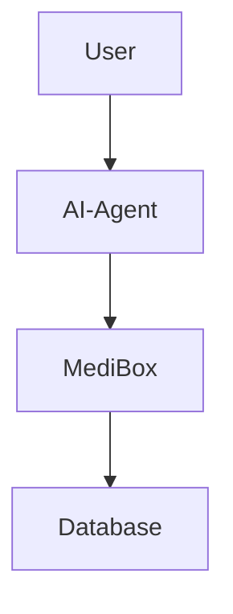
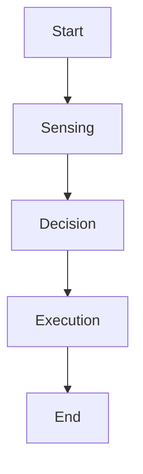
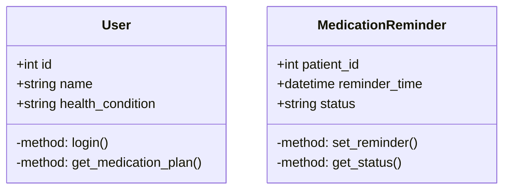
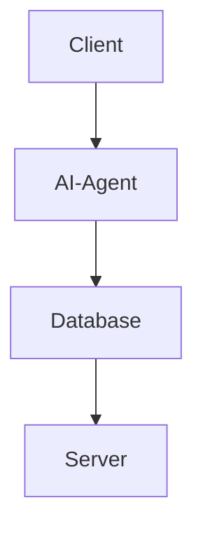
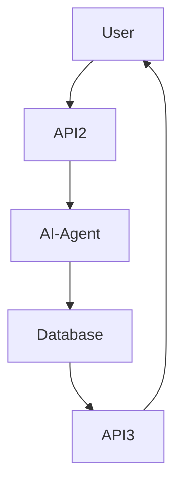

                 


# 智能药盒：AI Agent的用药提醒与管理系统

## 关键词：智能药盒、AI Agent、用药提醒、医疗健康、人工智能、系统设计、项目实战

## 摘要：  
随着人工智能技术的快速发展，AI Agent（智能代理）在医疗健康领域的应用日益广泛。本文深入探讨了AI Agent在智能药盒中的应用，详细分析了用药提醒与管理系统的实现原理、系统架构、算法设计及项目实战。通过理论与实践结合，本文为读者提供了从概念理解到系统实现的全面指导，展示了如何利用AI技术提升用药管理的智能化水平。

---

# 第1章: 智能药盒与AI Agent的背景介绍

## 1.1 问题背景

### 1.1.1 药物管理中的常见问题
现代医疗健康领域面临着诸多挑战，其中之一是用药管理的效率与准确性问题。患者常常需要按照医嘱服用多种药物，而传统的方式（如手动设置闹钟或药盒标记）容易遗忘或误服，尤其是对于老年患者或患有慢性病的群体，这会带来严重的健康风险。

### 1.1.2 传统用药提醒系统的局限性
传统的用药提醒系统主要依赖于简单的闹钟或手机应用，缺乏智能化和个性化。例如：
- 无法根据患者的健康状况动态调整提醒时间；
- 无法结合患者的行为习惯提供精准的用药建议；
- 缺乏对用药数据的深度分析能力，难以提供有效的健康反馈。

### 1.1.3 AI技术在用药管理中的潜力
AI技术的引入为用药管理带来了新的可能性。通过自然语言处理（NLP）、机器学习（ML）和计算机视觉（CV）等技术，AI Agent能够实现个性化的用药提醒、健康数据分析和药物管理优化。例如：
- 根据患者的用药记录和健康数据，AI Agent可以预测潜在的健康风险；
- 提供智能化的用药建议，帮助患者更好地管理药物使用。

## 1.2 问题描述

### 1.2.1 用药提醒系统的功能需求
为了实现高效的用药管理，系统需要具备以下核心功能：
1. **用药提醒**：根据患者的用药计划，智能推送提醒信息；
2. **用药记录**：记录患者每次用药的时间、剂量等信息；
3. **健康数据分析**：结合患者的健康数据，提供用药建议；
4. **个性化设置**：允许患者根据自身需求调整提醒方式和频率。

### 1.2.2 用户行为分析与需求提取
通过对用户的使用场景和行为习惯进行分析，我们可以提取以下关键需求：
- 用户需要在特定时间接收用药提醒；
- 用户希望用药数据能够与电子健康记录（EHR）系统集成；
- 用户需要直观的用药可视化报告。

### 1.2.3 系统边界与外延
智能药盒系统的核心功能是用药提醒与管理，其边界包括：
- 与患者端的交互（如移动应用或智能设备）；
- 与医疗系统的集成（如医院信息管理系统）；
- 数据存储与分析。

## 1.3 问题解决与系统架构

### 1.3.1 AI Agent的核心作用
AI Agent在智能药盒系统中扮演着关键角色，负责：
1. **感知**：收集患者的用药数据和健康信息；
2. **决策**：基于数据生成用药建议；
3. **执行**：通过智能药盒执行提醒任务。

### 1.3.2 系统设计的核心要素与组成
智能药盒系统由以下几个核心部分组成：
1. **硬件设备**：智能药盒、传感器；
2. **软件系统**：用药管理平台、AI Agent；
3. **用户界面**：移动应用或网页界面；
4. **数据接口**：与医疗系统的数据接口。

### 1.3.3 智能药盒的系统架构概述
智能药盒的系统架构可以分为以下几个层次：
1. **感知层**：通过传感器收集患者的用药行为数据；
2. **数据层**：存储和管理用药数据；
3. **算法层**：AI Agent对数据进行分析和决策；
4. **执行层**：通过硬件设备执行提醒任务。

## 1.4 本章小结

### 1.4.1 智能药盒的核心目标
智能药盒的核心目标是通过AI技术实现智能化的用药提醒和管理，提升患者的用药依从性和健康水平。

### 1.4.2 AI Agent在系统中的定位
AI Agent是智能药盒的核心组件，负责系统的智能化决策和执行。

### 1.4.3 系统设计的关键点
系统设计的关键点包括数据采集、算法实现、硬件集成和用户交互。

---

# 第2章: AI Agent的核心概念与联系

## 2.1 AI Agent的定义与类型

### 2.1.1 AI Agent的定义
AI Agent是一种能够感知环境、自主决策并执行任务的智能实体。它可以基于规则、模型或学习算法来完成特定任务。

### 2.1.2 基于规则的AI Agent
基于规则的AI Agent通过预定义的规则进行决策。例如：
- 如果患者错过用药时间超过15分钟，则触发提醒。

### 2.1.3 基于模型的AI Agent
基于模型的AI Agent利用数学模型进行推理和决策。例如：
- 使用马尔可夫模型预测患者的用药依从性。

### 2.1.4 基于学习的AI Agent
基于学习的AI Agent通过机器学习算法（如随机森林、神经网络）不断优化决策策略。例如：
- 基于患者的用药记录和健康数据，预测潜在的用药风险。

## 2.2 AI Agent的核心原理

### 2.2.1 感知层
感知层通过传感器或API收集患者的用药数据和健康信息。例如：
- 智能药盒记录患者每次取药的时间和剂量；
- 智能手环监测患者的运动和心率数据。

### 2.2.2 决策层
决策层基于感知层的数据进行分析和决策。例如：
- AI Agent根据患者的用药记录和健康数据，生成用药建议。

### 2.2.3 执行层
执行层通过硬件设备或软件接口执行决策结果。例如：
- AI Agent触发智能药盒的提醒功能；
- AI Agent向患者的手机发送用药提醒。

## 2.3 实体关系与系统架构

### 2.3.1 用户、药盒、AI Agent的实体关系
以下是用户、药盒和AI Agent的实体关系图：



### 2.3.2 实体属性对比表

| 实体 | 属性 |
|------|------|
| 用户 | 姓名、年龄、健康状况、用药计划 |
| AI Agent | 感知能力、决策能力、执行能力 |
| 智能药盒 | 药盒状态、用药记录、提醒设置 |

---

# 第3章: 算法原理与实现

## 3.1 算法原理

### 3.1.1 AI Agent的算法流程
以下是AI Agent的算法流程图：



### 3.1.2 感知层的数据处理
感知层通过传感器或API获取患者的用药数据和健康信息。例如：

```python
import json

# 示例代码：从智能药盒获取用药记录
def get_medication_record():
    record = {
        "patient_id": 123,
        "medication_time": "2023-10-01 09:00",
        "dose": 500
    }
    return json.dumps(record)
```

### 3.1.3 决策层的数学模型
决策层基于感知层的数据进行分析和决策。例如，使用马尔可夫模型预测患者的用药依从性：

$$ P(依从性) = \alpha \cdot P(按时用药) + (1-\alpha) \cdot P(健康数据正常) $$

### 3.1.4 执行层的触发机制
执行层根据决策层的结果触发提醒任务。例如：

```python
import datetime

# 示例代码：触发用药提醒
def trigger_reminder():
    current_time = datetime.datetime.now().strftime("%Y-%m-%d %H:%M")
    print(f"提醒：请在{current_time}服用药物。")
```

---

# 第4章: 系统分析与架构设计

## 4.1 系统应用场景

### 4.1.1 场景描述
智能药盒的应用场景包括：
- 患者的日常用药管理；
- 医院的用药监控与管理；
- 家庭成员的远程用药提醒。

## 4.2 系统功能设计

### 4.2.1 系统功能模块
系统功能模块包括：
1. 用户管理模块；
2. 用药提醒模块；
3. 用药记录模块；
4. 数据分析模块。

### 4.2.2 系统功能实现
以下是系统功能模块的类图：



## 4.3 系统架构设计

### 4.3.1 系统架构图
以下是系统的总体架构图：



## 4.4 接口设计与交互

### 4.4.1 系统接口设计
以下是系统的接口设计：

| 接口 | 描述 |
|------|------|
| API1 | 获取患者的用药记录 |
| API2 | 设置用药提醒 |
| API3 | 获取用药提醒状态 |

### 4.4.2 交互流程图
以下是用户与系统交互的流程图：



---

# 第5章: 项目实战与实现

## 5.1 环境安装与配置

### 5.1.1 开发环境
开发环境包括：
- Python 3.8+
- Jupyter Notebook
- TensorFlow 2.0+

## 5.2 核心代码实现

### 5.2.1 AI Agent的核心代码
以下是AI Agent的核心代码：

```python
import numpy as np
from sklearn.tree import DecisionTreeClassifier

# 示例代码：基于决策树的用药提醒决策
class AIAgent:
    def __init__(self):
        self.model = DecisionTreeClassifier()

    def train(self, X, y):
        self.model.fit(X, y)

    def predict(self, X):
        return self.model.predict(X)
```

### 5.2.2 系统实现代码
以下是系统实现代码：

```python
import sqlite3

# 示例代码：智能药盒数据库连接
def connect_db():
    conn = sqlite3.connect('medibox.db')
    return conn

def create_table(conn):
    cursor = conn.cursor()
    cursor.execute('''CREATE TABLE IF NOT EXISTS medication_record
                     (id INTEGER PRIMARY KEY AUTOINCREMENT,
                      patient_id INTEGER,
                      medication_time TEXT,
                      dose INTEGER)''')
    conn.commit()
```

## 5.3 项目实战案例

### 5.3.1 案例分析
以下是AI Agent在用药提醒中的应用案例：

```python
# 示例代码：AI Agent预测用药依从性
agent = AIAgent()
X_train = np.array([[70, 1], [65, 0], [75, 1], [68, 0]])
y_train = np.array([1, 0, 1, 0])
agent.train(X_train, y_train)

X_test = np.array([[70, 1]])
y_pred = agent.predict(X_test)
print(f"预测结果：{y_pred}")
```

---

# 第6章: 最佳实践与小结

## 6.1 最佳实践

### 6.1.1 系统设计的关键点
系统设计的关键点包括：
- 数据安全与隐私保护；
- 系统的可扩展性与灵活性；
- 算法的准确性和实时性。

### 6.1.2 实际应用中的注意事项
实际应用中的注意事项包括：
- 确保系统的稳定性和可靠性；
- 定期更新算法模型；
- 提供用户友好的交互界面。

## 6.2 本章小结

### 6.2.1 系统设计的核心要点
系统设计的核心要点包括：
- 系统的智能化与个性化；
- 数据的深度分析与利用；
- 系统的易用性和可维护性。

### 6.2.2 未来的研究方向
未来的研究方向包括：
- 更加智能的AI Agent设计；
- 数据隐私保护技术的提升；
- 系统与医疗生态的深度融合。

---

# 附录: 参考文献与工具指南

## 附录A: 术语表

- AI Agent：智能代理；
- MediBox：智能药盒；
- EHR：电子健康记录。

## 附录B: 工具安装指南

### 1. Python安装
访问Python官网（https://www.python.org/）下载并安装Python。

### 2. Jupyter Notebook安装
安装命令：
```
pip install jupyter
```

### 3. TensorFlow安装
安装命令：
```
pip install tensorflow
```

## 附录C: 参考文献

1. Russell, S., & Norvig, P. (2010). Artificial Intelligence: A Modern Approach.
2. Bishop, C. M. (2006). Pattern Recognition and Machine Learning.

---

# 作者：AI天才研究院/AI Genius Institute & 禅与计算机程序设计艺术 /Zen And The Art of Computer Programming

