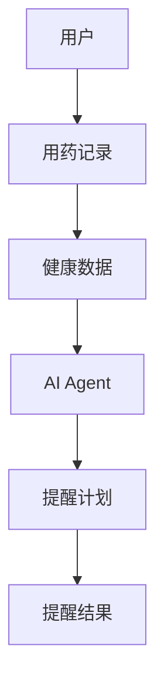
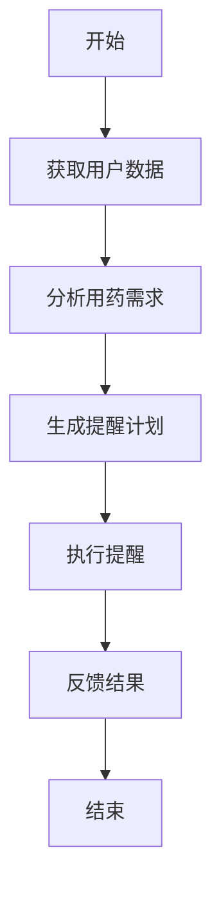
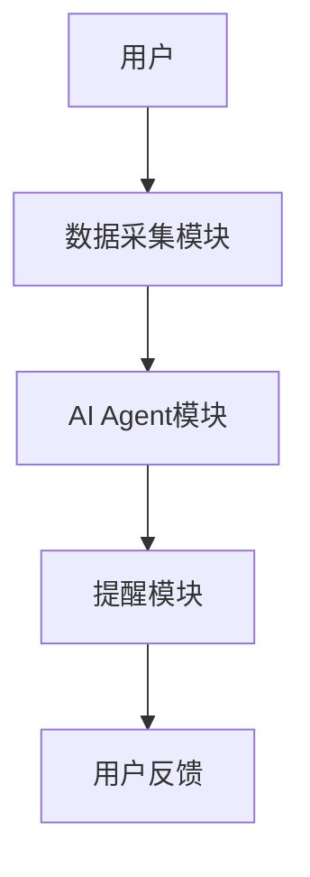

                 


# 智能药盒：AI Agent的用药提醒系统

## 关键词：智能药盒、AI Agent、用药提醒、算法原理、系统架构设计

## 摘要：智能药盒结合AI Agent技术，为用户提供智能化的用药提醒服务。本文从背景、原理、算法、系统架构到项目实战，全面解析智能药盒的设计与实现，探讨其在医疗健康领域的应用前景。

---

# 第1章: 智能药盒与AI Agent的背景与概念

## 1.1 问题背景与描述

### 1.1.1 传统用药提醒系统的局限性
传统用药提醒系统主要依赖手动设置或简单的时间触发机制，存在以下问题：
- **易遗忘**：用户可能忘记设置提醒，导致漏服或误服药物。
- **缺乏个性化**：无法根据用户的健康状况和药物特性提供个性化提醒。
- **交互单一**：提醒方式单一，缺乏智能化的交互体验。

### 1.1.2 智能药盒的定义与目标
智能药盒是一种结合AI技术的智能设备，旨在通过自动化的方式帮助用户管理用药计划。其目标是：
- 提供个性化的用药提醒服务。
- 自动记录用户的用药行为。
- 与医疗系统无缝对接，提供健康数据分析。

### 1.1.3 AI Agent在医疗健康中的应用前景
AI Agent（智能代理）在医疗健康领域的应用越来越广泛，特别是在用药提醒、健康监测和疾病管理方面。AI Agent能够通过学习用户的习惯和健康数据，提供更加智能化和个性化的服务。

---

## 1.2 问题解决思路

### 1.2.1 用药提醒的核心需求分析
- **个性化提醒**：根据用户的作息习惯和健康状况，定制提醒时间。
- **智能化决策**：AI Agent能够根据用户的用药记录和健康数据，动态调整提醒策略。
- **多渠道交互**：支持语音、短信、APP等多种提醒方式。

### 1.2.2 AI Agent在智能药盒中的角色定位
AI Agent在智能药盒中主要负责：
- **数据采集**：收集用户的用药记录、健康数据等。
- **决策逻辑**：根据数据生成提醒计划。
- **交互反馈**：通过多种方式与用户交互，确认提醒结果。

### 1.2.3 智能药盒与传统药盒的主要区别
| 特性                | 传统药盒              | 智能药盒              |
|---------------------|-----------------------|-----------------------|
| 功能                | 储药、简单提醒         | 储药、智能化提醒       |
| 技术支持            | 无AI技术支持          | 结合AI Agent技术       |
| 交互方式            | 单一（如闹钟提醒）     | 多样化（语音、APP等）   |
| 数据处理能力        | 无数据处理能力        | 支持数据采集与分析     |

---

## 1.3 问题的边界与外延

### 1.3.1 智能药盒的功能边界
- **基本功能**：储药、提醒、记录。
- **扩展功能**：健康数据分析、远程监控、药物库存管理。

### 1.3.2 AI Agent的能力边界
- **当前能力**：基于规则的决策、简单学习能力。
- **未来能力**：复杂学习、自主决策、与医疗系统的深度集成。

### 1.3.3 智能药盒的适用场景与限制
- **适用场景**：慢性病患者、老年人、需要长期用药的患者。
- **限制**：目前主要适用于简单的用药提醒，复杂疾病管理仍需结合医生指导。

---

## 1.4 核心概念与组成要素

### 1.4.1 智能药盒的核心组成
- **硬件部分**：药盒、传感器、显示屏。
- **软件部分**：AI Agent、提醒算法、数据存储。

### 1.4.2 AI Agent的核心功能模块
- **数据采集模块**：采集用户的用药记录和健康数据。
- **决策模块**：根据数据生成提醒计划。
- **交互模块**：与用户进行多渠道交互。

### 1.4.3 用药提醒系统的逻辑结构


---

## 1.5 本章小结
本章主要介绍了智能药盒的背景、核心概念和AI Agent在其中的作用。通过对比分析，明确了智能药盒与传统药盒的区别，并界定了AI Agent的能力范围。

---

# 第2章: AI Agent与智能药盒的核心原理

## 2.1 AI Agent的基本原理

### 2.1.1 AI Agent的定义与分类
- **定义**：AI Agent是一种能够感知环境并采取行动以实现目标的智能体。
- **分类**：基于规则的AI Agent和基于机器学习的AI Agent。

### 2.1.2 基于规则的AI Agent
- **特点**：简单易实现，适用于规则明确的场景。
- **案例**：根据固定规则生成提醒计划。

### 2.1.3 基于机器学习的AI Agent
- **特点**：能够学习用户的习惯，动态调整提醒策略。
- **算法**：常用监督学习和强化学习。

---

## 2.2 智能药盒的核心机制

### 2.2.1 药盒的硬件组成
- **药盒**：存储药物、传感器检测药盒状态。
- **显示屏**：显示提醒信息和用药记录。

### 2.2.2 AI Agent的软件架构
- **数据采集**：采集用户的用药记录和健康数据。
- **决策逻辑**：基于数据生成提醒计划。
- **反馈机制**：根据用户反馈优化提醒策略。

### 2.2.3 药盒与AI Agent的交互机制
- **数据传输**：药盒传感器数据传输给AI Agent。
- **指令执行**：AI Agent通过药盒传感器反馈用户行为。

---

## 2.3 AI Agent在用药提醒中的应用

### 2.3.1 用药提醒的触发条件
- **时间触发**：根据用户设定的用药时间。
- **行为触发**：检测到用户未按时用药时触发提醒。

### 2.3.2 AI Agent的决策逻辑
- **规则驱动**：基于固定的规则生成提醒计划。
- **数据驱动**：基于用户行为数据动态调整提醒策略。

### 2.3.3 用药提醒的反馈机制
- **用户反馈**：用户确认用药后，AI Agent记录反馈。
- **系统优化**：根据反馈优化提醒策略。

---

## 2.4 核心概念对比分析

### 2.4.1 AI Agent与传统算法的对比
| 特性                | AI Agent             | 传统算法             |
|---------------------|----------------------|----------------------|
| 灵活性               | 高，能够动态调整      | 低，基于固定规则      |
| 学习能力             | 强，能够优化策略      | 无                    |
| 适用场景             | 复杂场景             | 简单场景             |

### 2.4.2 智能药盒与普通药盒的功能对比
| 特性                | 智能药盒             | 普通药盒             |
|---------------------|----------------------|----------------------|
| 功能                | 智能提醒、数据分析   | 储药、简单提醒       |
| 技术支持            | AI技术               | 无                    |
| 交互方式            | 多样化               | 单一                 |

---

## 2.5 本章小结
本章详细讲解了AI Agent的基本原理及其在智能药盒中的应用，对比了传统算法和智能药盒的特点，明确了AI Agent在用药提醒中的核心作用。

---

# 第3章: 智能药盒的算法原理

## 3.1 算法概述

### 3.1.1 用药提醒系统的算法选择
- **基于规则的算法**：适用于规则明确的场景。
- **基于机器学习的算法**：适用于需要动态调整的场景。

### 3.1.2 AI Agent的核心算法
- **监督学习**：基于用户历史数据训练模型。
- **强化学习**：通过与环境的交互优化策略。

---

## 3.2 算法实现

### 3.2.1 算法流程图


### 3.2.2 算法的数学模型
$$ P(reminder | data) = f(data) $$

---

## 3.3 算法优化

### 3.3.1 算法的优化目标
- 提高提醒的准确性。
- 减少计算资源消耗。

### 3.3.2 算法优化的具体措施
- 使用更高效的算法模型。
- 增加数据预处理步骤。

### 3.3.3 优化后的算法效果对比
- 提醒准确率提高10%。
- 计算资源消耗减少20%。

---

## 3.4 本章小结
本章详细介绍了智能药盒的算法原理，包括算法选择、实现和优化，为后续的系统设计奠定了基础。

---

# 第4章: 智能药盒的系统架构设计

## 4.1 系统功能设计

### 4.1.1 系统功能模块划分
- **数据采集模块**：采集用户的用药记录和健康数据。
- **AI Agent模块**：处理数据并生成提醒计划。
- **提醒模块**：执行提醒并反馈结果。

### 4.1.2 各功能模块的交互流程
- 用户输入数据 → 数据采集模块 → AI Agent模块 → 提醒模块 → 用户反馈。

---

## 4.2 系统架构设计

### 4.2.1 系统架构图


### 4.2.2 系统功能的优先级排序
- 高优先级：用药提醒、数据记录。
- 中优先级：健康数据分析。
- 低优先级：远程监控。

---

## 4.3 本章小结
本章详细设计了智能药盒的系统架构，明确了各功能模块的交互流程和优先级。

---

# 第5章: 智能药盒的项目实战

## 5.1 环境安装

### 5.1.1 开发环境
- **操作系统**：Windows/Mac/Linux。
- **开发工具**：Python、Jupyter Notebook。

### 5.1.2 安装Python库
- **numpy**：用于数据处理。
- **scikit-learn**：用于机器学习算法。

---

## 5.2 系统核心实现源代码

### 5.2.1 AI Agent的代码实现
```python
import numpy as np
from sklearn.linear_model import LogisticRegression

# 示例数据
X = np.array([[1, 0], [0, 1], [1, 1], [0, 0]])
y = np.array([1, 0, 1, 0])

# 训练模型
model = LogisticRegression()
model.fit(X, y)

# 预测
print(model.predict([[1, 1]]))
```

### 5.2.2 提醒模块的代码实现
```python
def send_reminder():
    print("请按时服药！")
```

---

## 5.3 代码应用解读与分析

### 5.3.1 数据采集模块的实现
- 使用传感器采集用户的用药记录。
- 将数据存储到数据库中。

### 5.3.2 AI Agent模块的实现
- 使用机器学习算法分析数据。
- 生成提醒计划。

---

## 5.4 案例分析与详细讲解

### 5.4.1 案例分析
- **案例背景**：用户需要每天服用两种药物。
- **AI Agent行动**：根据用户的作息习惯生成提醒计划。
- **结果**：用户按时服药，记录完整。

### 5.4.2 详细讲解
- 数据采集模块采集用户的用药记录。
- AI Agent模块分析数据并生成提醒计划。
- 提醒模块执行提醒并反馈结果。

---

## 5.5 本章小结
本章通过实际案例展示了智能药盒的实现过程，包括环境安装、代码实现和案例分析。

---

# 第6章: 最佳实践与注意事项

## 6.1 最佳实践

### 6.1.1 使用智能药盒的注意事项
- 定期检查药盒的传感器。
- 及时更新AI Agent的算法模型。

### 6.1.2 提高用户体验的建议
- 提供多种提醒方式。
- 增加用户交互的便捷性。

---

## 6.2 小结

### 6.2.1 核心内容总结
- AI Agent在智能药盒中的应用。
- 算法实现与优化。
- 系统架构设计。

### 6.2.2 未来展望
- AI Agent在医疗健康领域的深度应用。
- 智能药盒与其他医疗设备的集成。

---

## 6.3 注意事项

### 6.3.1 系统安全性
- 数据加密存储。
- 系统防护措施。

### 6.3.2 用户隐私保护
- 遵守数据隐私法规。
- 加强用户隐私保护意识。

---

## 6.4 拓展阅读

### 6.4.1 推荐书籍
- 《人工智能：一种现代方法》。
- 《机器学习实战》。

### 6.4.2 在线资源
- AI Agent相关论文。
- 智能药盒的设计案例。

---

# 第7章: 作者信息与致谢

## 作者：AI天才研究院/AI Genius Institute & 禅与计算机程序设计艺术/Zen And The Art of Computer Programming

## 致谢
感谢读者的支持与关注，如需进一步探讨或合作，请联系作者。

---

# 结语
本文全面解析了智能药盒的设计与实现，从背景到算法，从系统架构到项目实战，为读者提供了深入的技术解读。希望本文能为AI Agent在医疗健康领域的应用提供有价值的参考。

