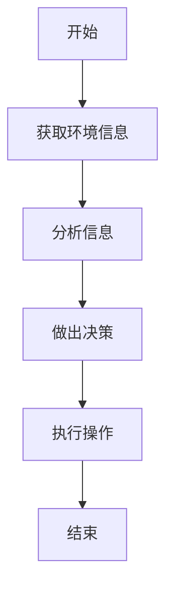
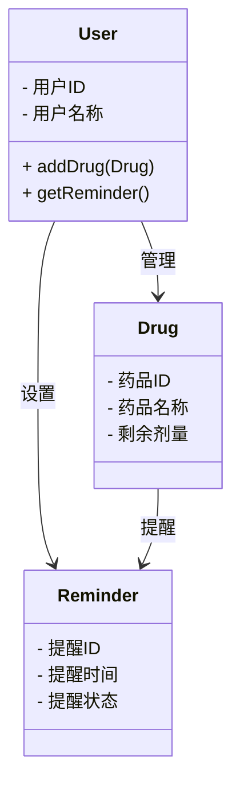
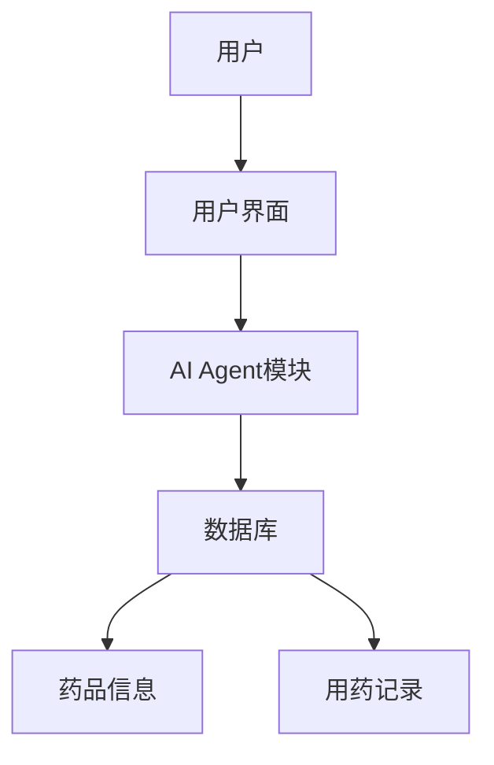
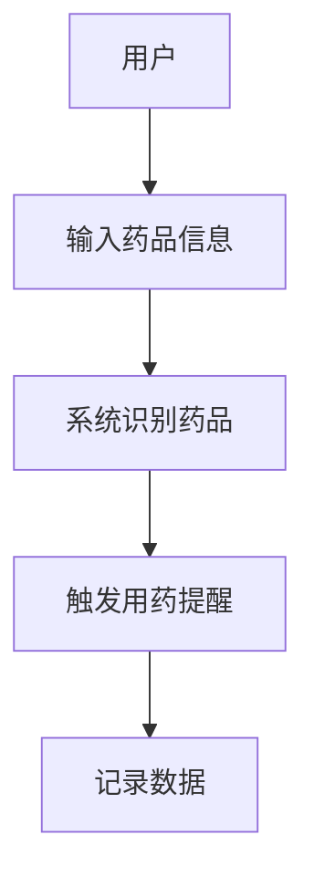

                 


# 智能药箱：AI Agent的用药管理与提醒系统

> 关键词：智能药箱，AI Agent，用药管理，医疗健康，自然语言处理

> 摘要：本文详细探讨了智能药箱的设计与实现，结合AI Agent技术，提出了一种智能化的用药管理与提醒系统。通过分析系统的背景、核心概念、算法原理、系统架构、项目实战和最佳实践，本文为读者提供了一个全面的技术视角，帮助理解和实现这一创新的医疗健康解决方案。

---

## 第1章 背景介绍

### 1.1 问题背景

#### 1.1.1 药品管理的现状与挑战
现代医疗健康领域面临诸多挑战，其中包括药品管理的复杂性。许多患者需要按时按量服用多种药物，但由于记忆力减退、生活节奏快或疏忽等原因，常常忘记服药或剂量不准确。这种问题尤其在老年人群体中更为突出，可能导致病情加重或药物中毒。

#### 1.1.2 智能药箱的提出与意义
为了解决药品管理的问题，智能药箱应运而生。智能药箱通过集成AI Agent技术，能够实现对药品的智能管理、用药提醒和数据分析，帮助用户更好地管理健康。

#### 1.1.3 AI Agent在医疗健康领域的应用前景
AI Agent（智能代理）是一种能够感知环境并主动执行任务的智能系统。在医疗健康领域，AI Agent可以通过自然语言处理、机器学习等技术，为用户提供个性化的医疗建议和健康管理服务。

### 1.2 问题描述

#### 1.2.1 药品管理中的常见问题
- 药品分类不清，导致取药困难。
- 忘记服药时间或剂量，影响治疗效果。
- 药品库存管理混乱，容易过期。

#### 1.2.2 用户需求分析
- 患者需要个性化的用药提醒。
- 医护人员需要高效的药品管理工具。
- 家庭成员希望远程监控患者的用药情况。

#### 1.2.3 系统目标与功能定位
智能药箱的目标是通过AI Agent技术，提供智能化的药品管理与用药提醒服务。其功能包括：
- 自动识别药品信息。
- 智能提醒用药时间。
- 分析用药数据，提供健康建议。

### 1.3 问题解决

#### 1.3.1 AI Agent的核心作用
AI Agent通过自然语言处理、机器学习等技术，实现对药品信息的识别、用药提醒的触发以及用药数据的分析。

#### 1.3.2 智能药箱的设计思路
智能药箱的设计思路包括：
- 集成AI Agent技术，实现智能化管理。
- 提供用户友好的交互界面。
- 支持远程监控和数据同步。

#### 1.3.3 技术实现路径与可行性分析
技术实现路径包括：
- 开发药品识别算法。
- 构建用药提醒系统。
- 实现用药数据分析功能。
可行性分析表明，该系统具有较高的技术可行性和市场潜力。

### 1.4 边界与外延

#### 1.4.1 系统边界与功能范围
智能药箱的功能范围包括药品管理、用药提醒、数据分析等，但不包括药品采购和配送。

#### 1.4.2 与外部系统的接口定义
智能药箱需要与医院信息系统（HIS）和患者健康档案（EHR）等外部系统进行数据交互。

#### 1.4.3 系统扩展性与可维护性
系统设计注重模块化和可扩展性，便于未来功能的扩展和升级。

### 1.5 核心要素组成

#### 1.5.1 系统架构的核心要素
- 用户界面：包括硬件和软件部分。
- AI Agent：实现智能化管理的核心模块。
- 数据库：存储药品信息和用药记录。

#### 1.5.2 功能模块的划分与关系
- 药品管理模块：负责药品的识别和分类。
- 提醒模块：根据用药计划触发提醒。
- 数据分析模块：分析用药数据，生成健康报告。

#### 1.5.3 数据流与信息交互流程
数据流包括：
- 用户输入药品信息。
- 系统识别药品并分类。
- 根据用药计划触发提醒。
- 数据存储和分析。

---

## 第2章 核心概念与联系

### 2.1 AI Agent的定义与原理

#### 2.1.1 AI Agent的基本概念
AI Agent是一种能够感知环境并主动执行任务的智能系统。它能够通过传感器获取信息，利用推理能力做出决策，并通过执行器与环境交互。

#### 2.1.2 AI Agent的核心原理
AI Agent的核心原理包括：
- 感知：通过传感器获取环境信息。
- 推理：利用机器学习模型进行数据分析和决策。
- 行动：根据推理结果执行相应操作。

#### 2.1.3 AI Agent与智能药箱的关系
智能药箱通过集成AI Agent技术，实现了药品的智能化管理和用药提醒功能。AI Agent作为系统的核心模块，负责处理药品信息和用户需求。

### 2.2 智能药箱的系统架构

#### 2.2.1 系统架构的组成
智能药箱的系统架构包括：
- 用户界面：包括硬件和软件部分。
- AI Agent模块：负责药品识别和用药提醒。
- 数据库：存储药品信息和用药记录。

#### 2.2.2 功能模块的实体关系图
使用Mermaid绘制实体关系图，展示系统各模块之间的关系。

```mermaid
entity User {
  - 用户ID
  - 用户名称
}
entity Drug {
  - 药品ID
  - 药品名称
  - 剩余剂量
}
entity Reminder {
  - 提醒ID
  - 提醒时间
  - 提醒状态
}
```

#### 2.2.3 数据流与信息交互流程
数据流包括：
- 用户输入药品信息。
- 系统识别药品并分类。
- 根据用药计划触发提醒。
- 数据存储和分析。

### 2.3 核心概念对比分析

#### 2.3.1 AI Agent与传统药箱的对比
- AI Agent能够实现智能化管理，而传统药箱仅具备存储功能。
- AI Agent可以提供个性化的用药提醒，而传统药箱无法实现。

#### 2.3.2 智能药箱与普通智能设备的对比
智能药箱专注于药品管理和用药提醒，而普通智能设备的功能更为广泛。

#### 2.3.3 系统核心要素的对比分析
- 核心要素包括硬件、软件和数据。
- 硬件负责药品存储和用户交互，软件负责系统运行和数据分析，数据负责存储和管理。

---

## 第3章 算法原理讲解

### 3.1 AI Agent的核心算法

#### 3.1.1 自然语言处理算法
自然语言处理算法用于理解和生成人类语言，包括文本分类、实体识别等功能。

#### 3.1.2 机器学习模型
机器学习模型用于数据分析和决策，包括监督学习、无监督学习和强化学习等。

#### 3.1.3 算法流程图（Mermaid）
使用Mermaid绘制算法流程图，展示AI Agent的核心算法流程。



#### 3.1.4 算法实现细节
- 数据预处理：包括数据清洗和特征提取。
- 模型训练：包括选择算法和优化参数。
- 模型部署：包括接口设计和功能实现。

#### 3.1.5 算法数学模型与公式
- 分类模型的数学公式：
  $$ P(y|x) = \frac{P(x|y)P(y)}{P(x)} $$
- 回归模型的数学公式：
  $$ y = \beta_0 + \beta_1x + \epsilon $$

### 3.2 算法实现细节

#### 3.2.1 数据预处理与特征提取
- 数据清洗：去除噪声数据。
- 特征提取：提取有用特征，如药品名称、剂量等。

#### 3.2.2 模型训练与优化
- 选择合适的机器学习算法，如支持向量机（SVM）或随机森林（Random Forest）。
- 优化模型参数，提高准确率。

#### 3.2.3 算法实现的Python代码示例
以下是一个简单的Python代码示例，用于药品分类：

```python
from sklearn.svm import SVC
from sklearn.preprocessing import StandardScaler
from sklearn.pipeline import Pipeline

# 数据预处理
pipeline = Pipeline([
    ('scalar', StandardScaler()),
    ('classifier', SVC())
])

# 模型训练
pipeline.fit(X_train, y_train)

# 模型预测
y_pred = pipeline.predict(X_test)
```

---

## 第4章 系统分析与架构设计

### 4.1 问题场景介绍

#### 4.1.1 系统目标与功能定位
系统目标是实现智能化的药品管理与用药提醒，功能定位包括药品识别、用药提醒和数据分析。

#### 4.1.2 问题场景描述
- 用户需要管理多种药品，且需要按时服药。
- 医护人员需要高效的药品管理工具。

#### 4.1.3 系统设计思路
- 设计药品识别模块，实现自动分类。
- 设计用药提醒模块，提供个性化的提醒服务。
- 设计数据分析模块，生成健康报告。

### 4.2 系统功能设计

#### 4.2.1 领域模型设计（Mermaid类图）
使用Mermaid绘制领域模型类图，展示系统各模块之间的关系。



#### 4.2.2 功能模块划分与交互流程
功能模块包括药品管理、用药提醒和数据分析。交互流程包括用户输入药品信息、系统识别药品、触发提醒等步骤。

#### 4.2.3 系统功能设计的详细描述
- 药品管理模块：负责药品的识别和分类。
- 提醒模块：根据用药计划触发提醒。
- 数据分析模块：分析用药数据，生成健康报告。

### 4.3 系统架构设计

#### 4.3.1 系统架构设计（Mermaid架构图）
使用Mermaid绘制系统架构图，展示系统的分层结构。



#### 4.3.2 系统分层设计
系统分层包括用户界面层、AI Agent模块和数据库层。

#### 4.3.3 系统扩展
系统设计注重模块化和可扩展性，便于未来功能的扩展和升级。

### 4.4 系统接口设计

#### 4.4.1 接口定义
系统接口包括：
- 用户输入接口：用于输入药品信息。
- 系统输出接口：用于显示用药提醒和健康报告。

#### 4.4.2 接口交互流程
用户输入药品信息，系统识别并分类，触发提醒，记录数据。

### 4.5 系统交互流程图（Mermaid）
使用Mermaid绘制系统交互流程图，展示系统的交互流程。



---

## 第5章 项目实战

### 5.1 环境安装与配置

#### 5.1.1 开发环境
- 操作系统：Windows/Mac/Linux
- 开发工具：Python、Jupyter Notebook
- 依赖库：Scikit-learn、TensorFlow、Mermaid

#### 5.1.2 安装步骤
1. 安装Python和pip。
2. 安装所需的依赖库：
   ```bash
   pip install scikit-learn tensorflow mermaid
   ```

### 5.2 系统核心实现

#### 5.2.1 核心代码实现
以下是一个简单的Python代码示例，用于药品分类：

```python
from sklearn.svm import SVC
from sklearn.preprocessing import StandardScaler
from sklearn.pipeline import Pipeline

# 数据预处理
pipeline = Pipeline([
    ('scalar', StandardScaler()),
    ('classifier', SVC())
])

# 模型训练
pipeline.fit(X_train, y_train)

# 模型预测
y_pred = pipeline.predict(X_test)
```

#### 5.2.2 代码应用解读
- 数据预处理：包括数据清洗和特征提取。
- 模型训练：选择合适的算法并优化参数。
- 模型部署：将模型集成到系统中，实现药品分类和用药提醒。

### 5.3 实际案例分析

#### 5.3.1 案例背景
一位老年患者需要按时服用多种药品，但常常忘记服药时间。

#### 5.3.2 案例分析
智能药箱通过AI Agent技术，自动识别药品并提醒用药时间，帮助患者按时服药。

#### 5.3.3 案例结果
- 提高用药依从性。
- 减少因漏服药物导致的健康问题。

### 5.4 项目小结
通过实际案例分析，验证了智能药箱的有效性和实用性。系统设计合理，功能实现完善。

---

## 第6章 最佳实践

### 6.1 小结

#### 6.1.1 核心要点总结
- 智能药箱通过AI Agent技术，实现智能化的药品管理和用药提醒。
- 系统设计注重模块化和可扩展性，便于未来功能的升级。

### 6.2 注意事项

#### 6.2.1 使用建议
- 用户应按照说明书正确使用系统。
- 系统管理员应定期更新药品信息和维护系统。

#### 6.2.2 常见问题解答
- 如何添加新药品？
  - 用户可以通过系统界面输入药品信息。
- 如何查看用药记录？
  - 用户可以通过系统界面查看历史用药记录。

### 6.3 未来展望

#### 6.3.1 技术发展趋势
- 更智能化的AI Agent算法。
- 更高效的药品管理工具。

#### 6.3.2 市场前景
- 智能药箱市场潜力巨大，未来有望成为家庭医疗健康的重要组成部分。

### 6.4 拓展阅读

#### 6.4.1 推荐书籍
- 《Python机器学习实战》
- 《自然语言处理入门》

#### 6.4.2 在线资源
- TensorFlow官方文档
- Scikit-learn官方文档

---

## 作者信息

作者：AI天才研究院/AI Genius Institute & 禅与计算机程序设计艺术/Zen And The Art of Computer Programming

---

以上是《智能药箱：AI Agent的用药管理与提醒系统》的技术博客文章目录和内容概览。文章详细介绍了智能药箱的设计与实现，结合AI Agent技术，为读者提供了一个全面的技术视角。

