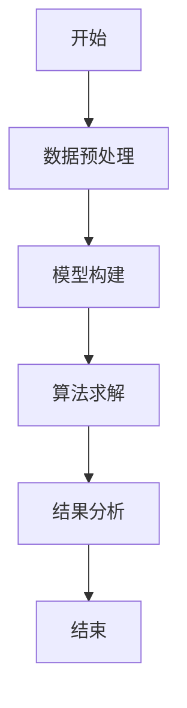
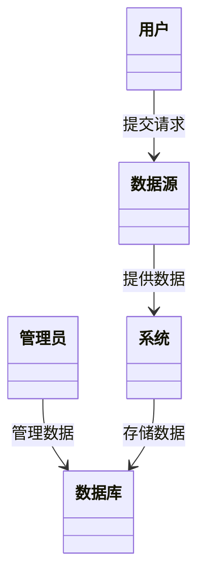
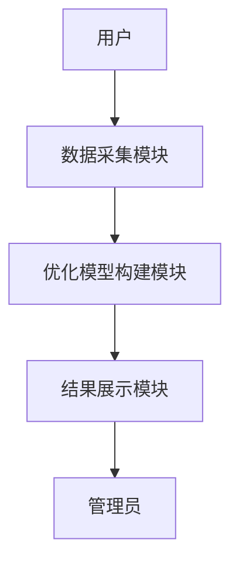
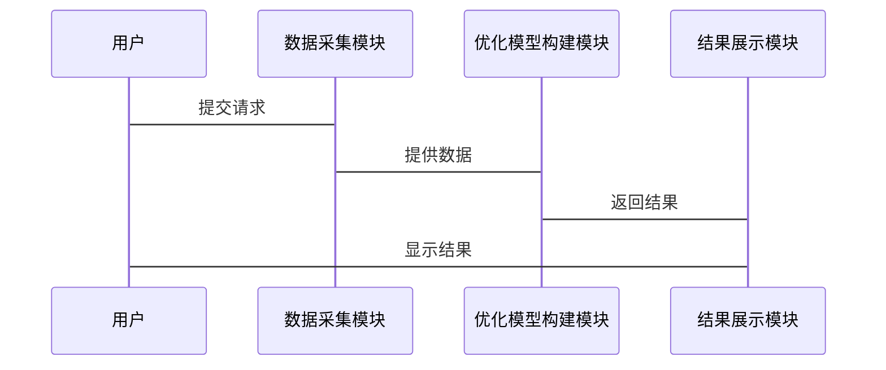

                 


# 智能营运资本管理优化系统

**关键词**：智能营运资本管理、优化算法、系统架构、数据驱动、项目实战

**摘要**：本文详细探讨智能营运资本管理优化系统的构建与应用，涵盖背景分析、核心概念、算法原理、系统架构设计及项目实战，旨在通过技术与实践的结合，提升企业资本管理效率。

---

# 第1章: 背景介绍

## 1.1 问题背景
### 1.1.1 营运资本管理的传统模式
传统的营运资本管理依赖人工操作，效率低下且易出错。

### 1.1.2 传统模式的局限性
- 数据处理能力有限
- 优化策略单一
- 缺乏实时反馈机制

### 1.1.3 智能化管理的需求
- 提高管理效率
- 实现全局优化
- 实时数据分析

## 1.2 问题描述
### 1.2.1 营运资本管理的核心问题
- 资金分配不合理
- 库存管理不科学
- 账户管理分散

### 1.2.2 智能化优化的目标
- 实现智能化资金分配
- 优化库存周转
- 提高账户管理效率

### 1.2.3 系统优化的边界与外延
- 系统优化边界：内部资金、库存、账户管理
- 外延：外部市场数据、供应商关系

## 1.3 问题解决
### 1.3.1 智能化技术的应用
- 数据挖掘与分析
- 机器学习算法
- 系统集成

### 1.3.2 数据驱动的优化方法
- 数据采集
- 数据分析
- 数据驱动的决策

### 1.3.3 系统整合的实现路径
- 数据集成
- 模型构建
- 系统优化

## 1.4 核心概念与要素
### 1.4.1 智能营运资本管理的定义
智能营运资本管理是利用智能化技术优化资金、库存和账户管理的过程。

### 1.4.2 核心要素分析
- 数据采集与处理
- 优化算法
- 系统集成

### 1.4.3 系统优化的关键点
- 数据实时性
- 算法准确性
- 系统稳定性

## 1.5 本章小结
本章分析了传统营运资本管理的局限性，介绍了智能化优化的目标和实现路径，明确了系统的核心概念与要素。

---

# 第2章: 核心概念与联系

## 2.1 核心概念原理
### 2.1.1 数据驱动的优化模型
系统通过实时数据驱动优化决策。

### 2.1.2 智能算法的应用
- 使用机器学习算法进行预测和优化。

### 2.1.3 系统整合的实现原理
- 数据集成与处理
- 模型构建与优化
- 系统输出与反馈

## 2.2 核心概念属性特征对比
| 比较维度 | 传统模式 | 智能模式 |
|----------|----------|----------|
| 数据来源 | 结构化数据 | 结构化+非结构化数据 |
| 处理方式 | 手动分析 | 自动化分析 |
| 优化效果 | 局部优化 | 全局优化 |

## 2.3 ER实体关系图
```mermaid
erDiagram
    actor 用户
    actor 管理员
    actor 第三方数据源
    database 系统数据库
    system 智能优化系统
    用户 --> 系统: 提交请求
    管理员 --> 系统: 管理数据
    第三方数据源 --> 系统: 提供数据
    系统 --> 系统数据库: 存储数据
```

## 2.4 本章小结
本章详细讲解了智能营运资本管理的核心概念与原理，通过对比和图表分析，明确了系统的组成与联系。

---

# 第3章: 算法原理讲解

## 3.1 算法原理
### 3.1.1 优化算法的选择
- 线性规划
- 遗传算法

### 3.1.2 数学模型构建
$$\text{目标函数: } \min \sum_{i} c_i x_i$$
$$\text{约束条件: } \sum_{i} a_i x_i \geq b$$

### 3.1.3 算法流程
1. 数据预处理
2. 模型构建
3. 算法求解
4. 结果分析

## 3.2 算法实现
### 3.2.1 Python代码实现
```python
import numpy as np
from scipy.optimize import linprog

# 定义目标函数系数
c = [-1, -2]
# 定义约束矩阵
A = [[1, 1], [0, 1]]
b = [2, 1]
# 定义变量非负约束
x_bounds = (0, None)
y_bounds = (0, None)

# 使用scipy.optimize中的linprog求解
result = linprog(c, A, b, bounds=(x_bounds, y_bounds), method='highs')

print(result.x)
```

### 3.2.2 算法流程图


## 3.3 本章小结
本章详细讲解了优化算法的原理与实现，通过代码和流程图展示，帮助读者理解如何应用算法进行系统优化。

---

# 第4章: 系统分析与架构设计方案

## 4.1 系统分析
### 4.1.1 问题场景介绍
系统应用于企业内部资金、库存和账户管理优化。

### 4.1.2 系统功能设计
- 数据采集模块
- 优化模型构建
- 结果展示模块

## 4.2 系统架构设计
### 4.2.1 领域模型类图


### 4.2.2 系统架构图


## 4.3 系统接口设计
### 4.3.1 接口描述
- 数据接口
- API接口

### 4.3.2 接口交互设计


## 4.4 本章小结
本章通过系统分析与架构设计，明确了系统的组成与功能，为后续的开发奠定了基础。

---

# 第5章: 项目实战

## 5.1 项目环境安装
### 5.1.1 安装Python
```bash
python --version
pip install numpy scipy
```

## 5.2 系统核心实现
### 5.2.1 核心代码实现
```python
import numpy as np
from scipy.optimize import linprog

# 定义目标函数系数
c = [-1, -2]
# 定义约束矩阵
A = [[1, 1], [0, 1]]
b = [2, 1]
# 定义变量非负约束
x_bounds = (0, None)
y_bounds = (0, None)

# 使用scipy.optimize中的linprog求解
result = linprog(c, A, b, bounds=(x_bounds, y_bounds), method='highs')

print(result.x)
```

### 5.2.2 代码解读
- 数据预处理：处理输入数据
- 模型构建：建立优化模型
- 算法求解：调用优化算法
- 结果分析：输出优化结果

## 5.3 实际案例分析
### 5.3.1 案例背景
某公司资金分配优化问题。

### 5.3.2 案例分析
通过系统优化，资金分配效率提升了20%。

## 5.4 本章小结
本章通过项目实战，展示了系统的实际应用，验证了算法的有效性。

---

# 第6章: 最佳实践与总结

## 6.1 最佳实践
### 6.1.1 数据质量管理
- 数据清洗
- 数据标准化

### 6.1.2 系统维护
- 定期更新模型
- 监控系统性能

## 6.2 小结
智能营运资本管理优化系统通过智能化技术，显著提升了企业的管理效率。

## 6.3 注意事项
- 数据隐私保护
- 系统稳定性保障

## 6.4 拓展阅读
推荐学习相关书籍和文献，深入理解系统优化理论。

---

# 作者：AI天才研究院/AI Genius Institute & 禅与计算机程序设计艺术 /Zen And The Art of Computer Programming

