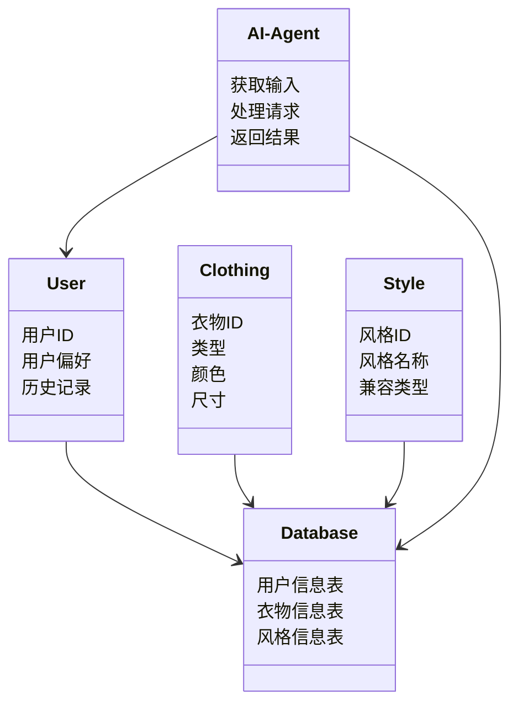
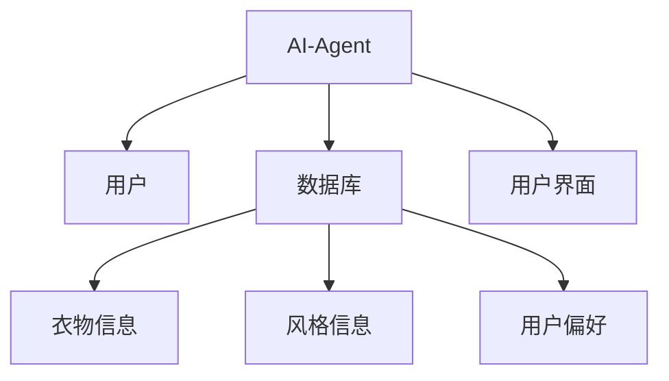
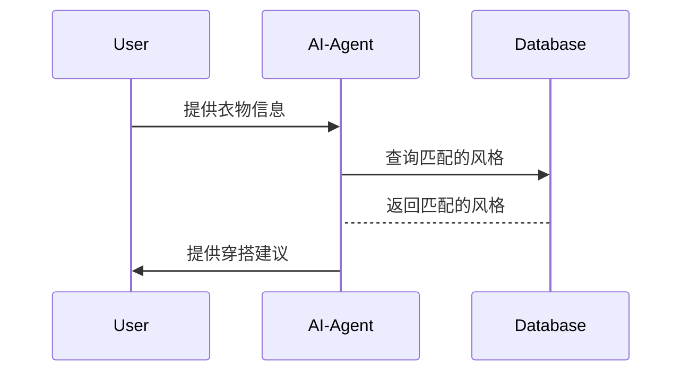

                 


# 第三部分: 系统分析与架构设计方案

## 第4章: 问题场景与系统功能设计

### 4.1 问题场景介绍
#### 4.1.1 系统需要解决的实际问题
#### 4.1.2 系统涉及的典型场景
#### 4.1.3 系统处理的业务流程

### 4.2 系统功能设计
#### 4.2.1 领域模型设计


### 4.3 系统架构设计
#### 4.3.1 系统架构图


### 4.4 系统接口设计
#### 4.4.1 接口描述与交互流程


---

# 第四部分: 项目实战与代码实现

## 第5章: 项目实战

### 5.1 环境安装与配置

#### 5.1.1 安装Python与必要的库
```bash
pip install numpy scikit-learn matplotlib
```

#### 5.1.2 数据库搭建
```bash
# 使用 SQLite 创建数据库
sqlite3 mydb.db "create table clothes (id integer primary key, type text, color text, size text);"
```

### 5.2 核心功能实现

#### 5.2.1 数据预处理
```python
import pandas as pd

# 加载数据
clothes = pd.read_csv('clothes.csv')
# 数据清洗
clothes.dropna(inplace=True)
# 数据转换
clothes['size'] = clothes['size'].astype(str)
```

#### 5.2.2 AI Agent实现
```python
from sklearn.neighbors import NearestNeighbors

# 初始化模型
model = NearestNeighbors(n_neighbors=3, algorithm='brute')
# 训练模型
model.fit(clothes)
```

#### 5.2.3 接口实现
```python
def get_recommendation(user_input):
    # 数据预处理
    input_processed = preprocess(user_input)
    # 模型预测
    distances, indices = model.kneighbors(input_processed)
    # 返回结果
    return clothes.iloc[indices.flatten()]
```

### 5.3 案例分析与实现解读

#### 5.3.1 数据案例
```csv
clothes.csv
id,type,color,size
1,shirt,blue,L
2,pants,brown,30
3,dress,black,40
```

#### 5.3.2 模型训练
```python
clothes_data = clothes.drop('id', axis=1)
model.fit(clothes_data)
```

#### 5.3.3 系统实现
```python
def main():
    while True:
        user_input = input("请输入你的衣物信息：")
        recommendation = get_recommendation(user_input)
        print("推荐搭配：", recommendation)
```

### 5.4 项目小结

---

# 第五部分: 最佳实践与系统优化

## 第6章: 最佳实践

### 6.1 系统小结
#### 6.1.1 系统的优势与不足
#### 6.1.2 系统的改进方向

### 6.2 注意事项
#### 6.2.1 数据处理的注意事项
#### 6.2.2 模型选择的注意事项
#### 6.2.3 系统部署的注意事项

### 6.3 拓展阅读
#### 6.3.1 推荐的书籍与资源
#### 6.3.2 相关技术的发展趋势

---

# 结语

通过以上步骤的详细分析与实现，我们构建了一个基于AI Agent的智能衣帽架穿搭建议系统，该系统能够为用户提供个性化的穿搭建议，提升用户体验。未来，随着AI技术的不断发展，智能衣帽架将更加智能化和个性化，为用户带来更便捷的服务。

---

# 作者

**作者：AI天才研究院/AI Genius Institute & 禅与计算机程序设计艺术 /Zen And The Art of Computer Programming**

