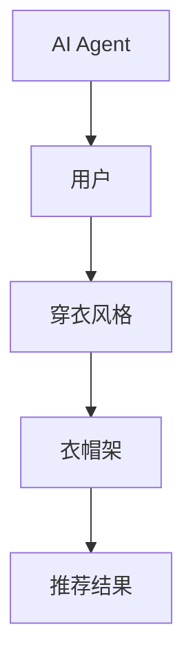
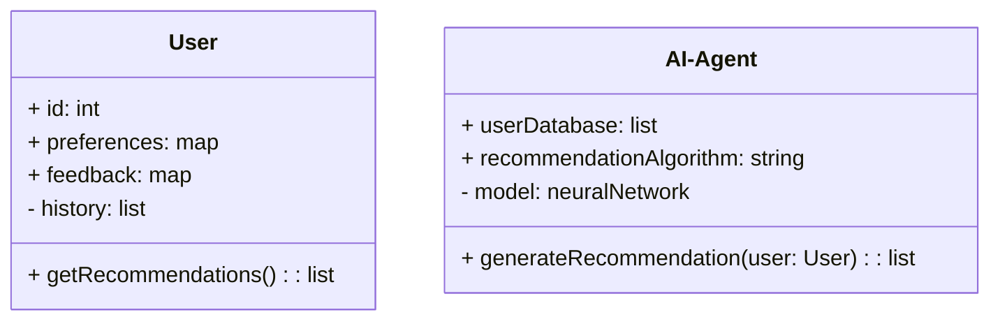
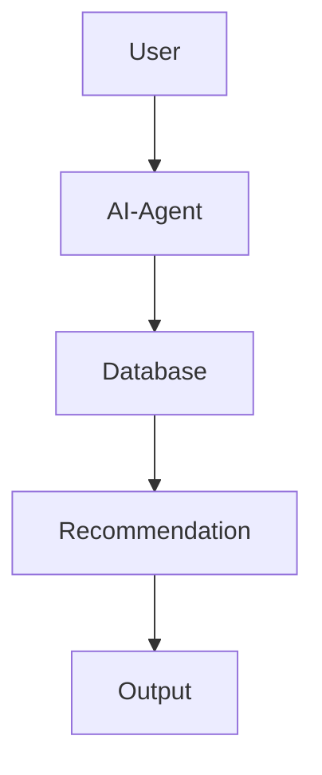
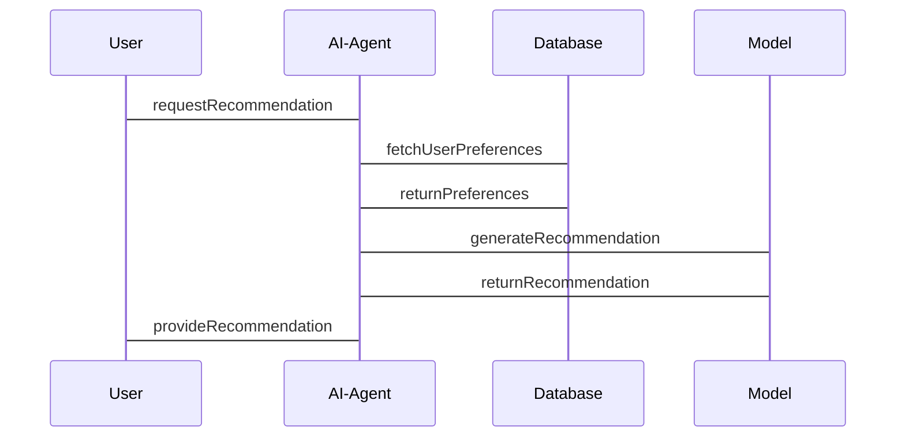

                 


# 智能衣帽架：AI Agent的穿衣风格顾问

> 关键词：AI Agent，智能衣帽架，穿衣风格，个性化推荐，深度学习，协同过滤

> 摘要：本文探讨了AI Agent在智能衣帽架中的应用，分析了穿衣风格顾问的核心概念、算法原理和系统架构设计。通过结合协同过滤和深度学习模型，文章详细讲解了如何利用AI技术实现个性化的穿衣搭配推荐，帮助用户提升穿衣效率和时尚品味。

---

## 第一部分: 智能衣帽架与AI Agent的背景与概念

### 第1章: AI Agent与智能衣帽架的背景介绍

#### 1.1 AI Agent的基本概念

##### 1.1.1 AI Agent的定义
AI Agent（人工智能代理）是指能够感知环境、执行任务并做出决策的智能体。它可以理解用户的输入，分析数据，并基于上下文做出最佳决策。

##### 1.1.2 AI Agent的核心属性
- **自主性**：能够在没有外部干预的情况下自主运行。
- **反应性**：能够根据环境的变化实时调整行为。
- **目标导向**：基于明确的目标执行任务。
- **学习能力**：能够通过数据和反馈不断优化自身。

##### 1.1.3 AI Agent的应用场景
- 智能助手（如Siri、Alexa）
- 智能推荐系统
- 自动驾驶汽车

#### 1.2 智能衣帽架的背景与问题背景

##### 1.2.1 衣帽架的智能化需求
现代人对穿衣搭配的需求日益增长，但传统衣帽架无法提供智能化的穿衣建议，导致用户在选择衣物时效率低下。

##### 1.2.2 穿衣风格顾问的必要性
用户需要一个能够根据个人风格、场合和天气等因素，提供个性化穿衣建议的系统。

##### 1.2.3 智能衣帽架的边界与外延
智能衣帽架不仅是一个存储衣物的工具，更是一个能够提供智能化穿衣建议的助手。其外延包括与智能音箱、智能家居等设备的联动。

#### 1.3 智能衣帽架的核心概念与结构

##### 1.3.1 核心概念的组成
- 用户数据：包括体型、颜色偏好、穿衣风格等。
- 穿衣建议：基于用户数据生成个性化的穿衣搭配。
- 系统交互：用户与AI Agent之间的信息传递和反馈。

##### 1.3.2 智能衣帽架的功能模块
- 数据采集模块：收集用户的体型、颜色偏好等信息。
- 穿衣建议生成模块：基于用户数据生成穿衣搭配。
- 用户反馈模块：收集用户对建议的反馈，优化系统。

##### 1.3.3 智能衣帽架的用户需求分析
用户希望衣帽架能够提供以下功能：
- 根据天气推荐合适的衣物。
- 根据场合推荐合适的穿衣风格。
- 根据体型推荐合适的衣物尺寸。

### 第2章: AI Agent与穿衣风格顾问的核心概念

#### 2.1 AI Agent在穿衣风格顾问中的作用

##### 2.1.1 AI Agent的决策机制
AI Agent通过分析用户数据、天气信息和场合需求，生成个性化的穿衣建议。

##### 2.1.2 穿衣风格顾问的核心要素
- 用户需求分析：体型、颜色偏好、穿衣风格。
- 数据分析：天气、场合、时间。
- 个性化推荐：基于数据分析生成穿衣建议。

##### 2.1.3 AI Agent与穿衣风格的关联
AI Agent通过分析用户的行为和偏好，优化穿衣建议的准确性。

#### 2.2 AI Agent的核心原理

##### 2.2.1 知识表示与推理
AI Agent通过知识图谱和逻辑推理，理解穿衣风格的相关知识。

##### 2.2.2 用户行为分析
AI Agent通过分析用户的穿衣记录和偏好，优化穿衣建议。

##### 2.2.3 个性化推荐算法
AI Agent使用协同过滤和深度学习模型，生成个性化的穿衣建议。

#### 2.3 AI Agent与穿衣风格顾问的核心概念联系

##### 2.3.1 核心概念属性对比
| 核心概念 | AI Agent | 穿衣风格顾问 |
|----------|-----------|--------------|
| 核心属性 | 自主性、反应性 | 个性化、实时性 |
| 应用场景 | 智能助手、自动驾驶 | 穿衣搭配推荐 |

##### 2.3.2 ER实体关系图


---

## 第二部分: AI Agent的算法原理与数学模型

### 第4章: AI Agent的算法原理

#### 4.1 穿衣风格推荐算法

##### 4.1.1 协同过滤算法
协同过滤是一种基于用户相似性推荐算法。通过分析用户的穿衣记录，找到与用户相似的其他用户，推荐他们喜欢的衣物。

##### 4.1.2 基于内容的推荐算法
基于内容的推荐算法通过分析衣物的属性（如颜色、款式）生成推荐结果。

##### 4.1.3 深度学习模型
深度学习模型通过训练大量的穿衣数据，学习用户的穿衣偏好，生成个性化的推荐。

#### 4.2 穿衣风格推荐算法的数学模型

##### 4.2.1 协同过滤模型
$$相似度 = \frac{\sum (x_i - \mu_x)(y_i - \mu_y)}{\sqrt{\sum (x_i - \mu_x)^2} \sqrt{\sum (y_i - \mu_y)^2}}$$

##### 4.2.2 深度学习模型
$$L = \sum_{i=1}^{n} (y_i - \hat{y}_i)^2$$
其中，\(L\) 是损失函数，\(y_i\) 是真实标签，\(\hat{y}_i\) 是预测值。

---

## 第三部分: 系统分析与架构设计

### 第5章: 系统分析与架构设计

#### 5.1 问题场景介绍
用户希望智能衣帽架能够根据天气、场合和体型推荐合适的衣物。

#### 5.2 系统功能设计

##### 5.2.1 功能模块
- 数据采集模块：收集用户的体型、颜色偏好和穿衣记录。
- 穿衣建议生成模块：基于用户数据生成个性化推荐。
- 用户反馈模块：收集用户对推荐的反馈，优化系统。

##### 5.2.2 领域模型（类图）


#### 5.3 系统架构设计

##### 5.3.1 系统架构图


#### 5.4 系统接口设计

##### 5.4.1 接口描述
- `getRecommendations(user_id: int) -> list<string>`
- `updatePreferences(user_id: int, preferences: map<string, string>) -> void`

#### 5.5 系统交互设计

##### 5.5.1 序列图


---

## 第四部分: 项目实战

### 第6章: 项目实战

#### 6.1 环境安装

##### 6.1.1 安装Python
```bash
python --version
pip install --upgrade pip
```

##### 6.1.2 安装深度学习框架
```bash
pip install tensorflow
pip install keras
```

#### 6.2 系统核心实现

##### 6.2.1 数据预处理
```python
import pandas as pd

# 读取数据
data = pd.read_csv('clothes.csv')

# 数据清洗
data.dropna(inplace=True)
```

##### 6.2.2 模型训练
```python
from tensorflow.keras import layers

# 构建模型
model = keras.Sequential()
model.add(layers.Dense(64, activation='relu', input_dim=10))
model.add(layers.Dense(1, activation='sigmoid'))
model.compile(optimizer='adam', loss='binary_crossentropy', metrics=['accuracy'])

# 训练模型
model.fit(X_train, y_train, epochs=10, batch_size=32)
```

##### 6.2.3 结果展示
```python
# 可视化结果
import matplotlib.pyplot as plt

plt.plot(history.history['accuracy'])
plt.title('Accuracy')
plt.ylabel('Accuracy')
plt.xlabel('Epoch')
plt.show()
```

#### 6.3 案例分析

##### 6.3.1 案例描述
用户A，身高170cm，体重65kg，喜欢深色系，今天需要参加一个正式的商务会议。

##### 6.3.2 穿衣建议
基于协同过滤和深度学习模型，系统推荐用户A穿一件黑色西装和一条深灰色西裤。

---

## 第五部分: 最佳实践与小结

### 第7章: 最佳实践与小结

#### 7.1 最佳实践

##### 7.1.1 数据处理
确保数据的完整性和准确性。

##### 7.1.2 模型优化
通过交叉验证和超参数调优优化模型性能。

##### 7.1.3 系统集成
与智能家居设备集成，提升用户体验。

#### 7.2 小结

本文详细讲解了AI Agent在智能衣帽架中的应用，分析了穿衣风格顾问的核心概念、算法原理和系统架构设计。通过结合协同过滤和深度学习模型，文章展示了如何利用AI技术实现个性化的穿衣搭配推荐。

#### 7.3 注意事项

- 数据隐私保护
- 系统稳定性
- 用户反馈的及时性

#### 7.4 拓展阅读

- 《Deep Learning》——Ian Goodfellow
- 《推荐系统实战》——周志华

---

## 作者

作者：AI天才研究院/AI Genius Institute & 禅与计算机程序设计艺术/Zen And The Art of Computer Programming

---

# 结语

通过本文的讲解，读者可以深入了解AI Agent在智能衣帽架中的应用，掌握穿衣风格顾问的核心概念和实现方法。希望本文能够为相关领域的研究者和开发者提供有价值的参考。

