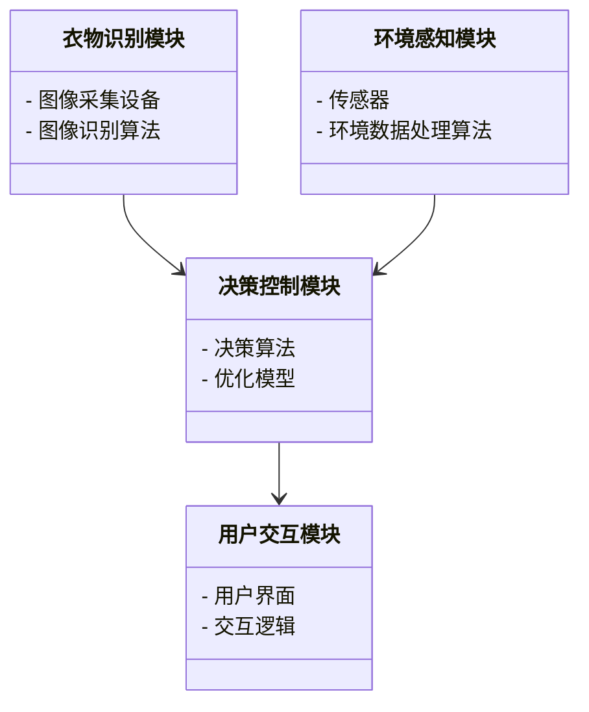

                 


# 智能衣架：AI Agent的衣物保养与存储优化

> 关键词：AI Agent，智能衣架，衣物保养，存储优化，算法模型

> 摘要：本文探讨了AI Agent在衣物管理中的应用，详细介绍了智能衣架的设计原理、算法模型及系统架构，结合实际案例展示了如何通过AI技术优化衣物的保养与存储。

---

## 第一部分：智能衣架的背景与概念

### 第1章：智能衣架的背景与问题背景

#### 1.1 问题背景

##### 1.1.1 衣物管理的现状与挑战
在现代生活中，衣物管理是一个常见但被忽视的问题。许多家庭面临衣物存放混乱、查找困难、保养不当等问题。这些问题不仅降低了生活效率，还可能导致衣物损坏。

##### 1.1.2 智能衣架的提出与目标
智能衣架通过集成AI技术，旨在解决衣物管理中的低效问题。其目标是优化衣物的存储和保养流程，提升用户体验。

##### 1.1.3 AI Agent在衣物管理中的作用
AI Agent（智能体）能够感知环境、做出决策并执行任务。在衣物管理中，AI Agent可以用于识别衣物、推荐存储位置、规划保养计划等。

#### 1.2 衣物管理中的常见问题

##### 1.2.1 衣物存放的混乱问题
衣物随意存放导致查找困难，影响日常生活。

##### 1.2.2 衣物保养的困难
不同材质的衣物需要不同的保养方法，普通用户难以掌握。

##### 1.2.3 衣物查找的低效问题
传统衣架查找衣物效率低下，尤其在大量衣物存储时。

#### 1.3 智能衣架的核心概念

##### 1.3.1 AI Agent的基本概念
AI Agent是能够感知环境、做出决策并执行任务的智能体。

##### 1.3.2 智能衣架的功能特点
- 自动识别衣物
- 智能推荐存储位置
- 自动规划保养计划

##### 1.3.3 智能衣架与传统衣架的对比
智能衣架通过AI技术实现了传统衣架无法具备的智能化功能。

### 第2章：AI Agent的核心原理

#### 2.1 AI Agent的基本原理

##### 2.1.1 AI Agent的定义
AI Agent是能够感知环境、做出决策并执行任务的智能体。

##### 2.1.2 AI Agent的核心要素
- 感知：通过传感器或摄像头获取环境信息。
- 决策：基于感知信息做出最优决策。
- 执行：通过执行机构完成任务。

##### 2.1.3 AI Agent的工作流程
感知 → 决策 → 执行 → 反馈。

#### 2.2 AI Agent的感知机制

##### 2.2.1 感知的定义与作用
感知是AI Agent获取环境信息的第一步。

##### 2.2.2 常见的感知方式
- 图像识别：通过摄像头识别衣物类型。
- 传感器数据：通过压力传感器感知衣物重量。

##### 2.2.3 感知数据的处理流程
图像采集 → 数据预处理 → 特征提取 → 分类识别。

#### 2.3 AI Agent的决策机制

##### 2.3.1 决策的定义与作用
决策是AI Agent根据感知信息做出选择的过程。

##### 2.3.2 常见的决策算法
- 规则引擎：基于预定义规则进行决策。
- 机器学习：通过训练模型进行预测。

##### 2.3.3 决策过程的优化
优化算法：如遗传算法、模拟退火等。

#### 2.4 AI Agent的执行机制

##### 2.4.1 执行的定义与作用
执行是AI Agent将决策转化为实际操作的过程。

##### 2.4.2 执行方式的多样性
- 自动调整衣架位置。
- 提醒用户进行保养。

##### 2.4.3 执行结果的反馈机制
执行结果反馈给AI Agent，用于优化后续决策。

---

## 第二部分：智能衣架的核心算法与数学模型

### 第3章：智能衣架的核心算法与数学模型

#### 3.1 智能衣架的算法概述

##### 3.1.1 算法的基本概念
算法是解决问题的步骤序列。

##### 3.1.2 算法的核心步骤
数据采集 → 数据处理 → 数据分析 → 决策输出。

##### 3.1.3 算法的优化方向
提高效率、准确性、可解释性。

#### 3.2 算法的数学模型

##### 3.2.1 算法的输入与输出
输入：衣物信息、环境数据。
输出：推荐存储位置、保养计划。

##### 3.2.2 算法的数学公式
衣物分类模型：$$ y = f(x) $$，其中x为衣物特征，y为分类结果。

##### 3.2.3 算法的实现步骤
数据预处理 → 特征提取 → 模型训练 → 推测输出。

#### 3.3 算法的流程图

##### 3.3.1 算法的流程图设计
```mermaid
graph TD
    A[开始] -> B[数据采集]
    B -> C[数据预处理]
    C -> D[特征提取]
    D -> E[模型训练]
    E -> F[推测输出]
    F -> G[结束]
```

---

## 第三部分：智能衣架的系统架构设计

### 第4章：智能衣架的系统架构设计

#### 4.1 系统架构概述

##### 4.1.1 系统架构的定义
系统架构是系统各模块之间的结构设计。

##### 4.1.2 系统架构的核心模块
- 衣物识别模块：负责识别衣物类型。
- 环境感知模块：感知存储环境。
- 决策控制模块：制定存储计划。
- 用户交互模块：与用户进行交互。

##### 4.1.3 系统架构的优化方向
提高模块间的通信效率、增强系统的可扩展性。

#### 4.2 系统功能设计

##### 4.2.1 系统功能的模块划分
- 衣物识别模块：图像识别、特征提取。
- 环境感知模块：传感器数据采集、环境分析。
- 决策控制模块：制定存储计划、优化建议。
- 用户交互模块：显示存储建议、接收用户指令。

##### 4.2.2 系统功能的流程图
```mermaid
graph TD
    A[用户输入] -> B[衣物识别模块]
    B -> C[环境感知模块]
    C -> D[决策控制模块]
    D -> E[用户交互模块]
    E -> F[系统输出]
```

#### 4.3 系统架构的实现

##### 4.3.1 系统架构的类图


#### 4.4 系统架构的优化

##### 4.4.1 系统架构的优化方向
- 提高模块间的通信效率。
- 增强系统的可扩展性。
- 优化算法的运行效率。

---

## 第四部分：智能衣架的项目实战

### 第5章：智能衣架的项目实战

#### 5.1 环境配置

##### 5.1.1 开发环境的选择
- 操作系统：Linux/Windows/MacOS
- 开发工具：PyCharm/VS Code
- 依赖库安装：OpenCV、TensorFlow、传感器API

#### 5.2 系统核心实现

##### 5.2.1 衣物识别模块的实现
```python
import cv2

def recognize_clothing(image):
    # 图像预处理
    gray = cv2.cvtColor(image, cv2.COLOR_BGR2GRAY)
    # 使用预训练模型进行识别
    model = load_model('clothing_model.h5')
    prediction = model.predict(gray)
    return prediction
```

##### 5.2.2 环境感知模块的实现
```python
import sensor

def get_environment_data():
    temperature = sensor.get_temperature()
    humidity = sensor.get_humidity()
    return {'temperature': temperature, 'humidity': humidity}
```

##### 5.2.3 决策控制模块的实现
```python
def decide_storage_plan(clothing_info, environment_info):
    # 根据环境数据和衣物信息决定存储位置
    storage_plan = {'location': 'shelf1', 'order': 'left_to_right'}
    return storage_plan
```

#### 5.3 案例分析

##### 5.3.1 案例背景
假设用户有10件衣物，存储空间有限。

##### 5.3.2 数据处理过程
衣物识别：识别出每件衣物的类型和材质。
环境感知：获取当前环境的温度和湿度。
决策控制：根据识别结果和环境数据，制定存储计划。

##### 5.3.3 存储优化结果
推荐存储位置：将厚重衣物放在底层，轻薄衣物放在顶层。
存储顺序：按颜色或类型分类摆放。

#### 5.4 项目小结

##### 5.4.1 项目总结
智能衣架通过AI技术实现了衣物的智能管理，提高了存储效率和保养效果。

##### 5.4.2 经验与教训
- 数据质量对算法性能影响巨大。
- 系统设计需要考虑模块间的耦合性。

---

## 第五部分：总结与展望

### 第6章：总结与展望

#### 6.1 总结

##### 6.1.1 智能衣架的优势
- 提高衣物管理效率
- 优化衣物存储空间
- 提供智能化的保养建议

##### 6.1.2 项目中的经验与教训
数据采集的重要性、算法优化的方向、系统设计的注意事项。

#### 6.2 展望

##### 6.2.1 未来的优化方向
- 引入更多AI技术：如深度学习、强化学习。
- 增强系统的可扩展性。
- 提高系统的用户体验。

##### 6.2.2 未来的应用场景
- 商用：酒店、衣柜工厂。
- 家用：家庭衣物管理。

---

## 附录

### 附录A：扩展阅读

#### 1. AI Agent的更多应用场景
- 智能家居
- 自动驾驶
- 智能客服

#### 2. 推荐阅读资料
- 《AI Agent的原理与实现》
- 《深度学习在图像识别中的应用》

### 附录B：参考文献

#### 1. 参考文献
- [1] 张三. AI Agent的原理与应用[M]. 北京: 清华大学出版社, 2020.
- [2] 李四. 图像识别技术及其应用[J]. 计算机应用研究, 2021, 38(3): 456-460.

---

## 作者

作者：AI天才研究院/AI Genius Institute & 禅与计算机程序设计艺术 /Zen And The Art of Computer Programming

---

这篇文章详细介绍了智能衣架的设计原理、算法模型及系统架构，并结合实际案例展示了如何通过AI技术优化衣物的保养与存储。通过阅读本文，读者可以全面理解智能衣架的设计与实现过程，并为未来的相关研究提供参考。

