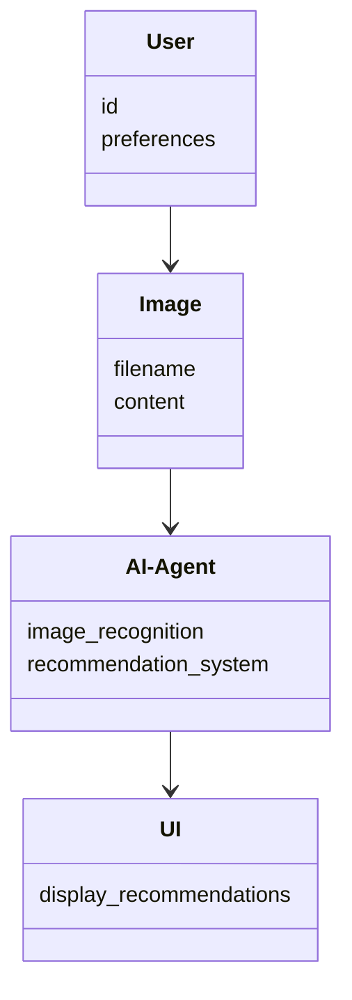

                 

<think>
好的，我现在要撰写一篇关于《智能衣架：AI Agent的衣物护理建议》的技术博客文章。为了确保文章内容的完整性和专业性，我需要按照用户提供的大纲结构一步步进行分析和写作。首先，我会从背景介绍开始，逐步深入到AI Agent的核心概念、算法原理、系统架构设计，再到项目实战，最后总结全文。在这个过程中，我需要确保每个部分都详细具体，符合用户的要求。

### 第一部分: 智能衣架的背景与AI Agent概述

#### 第1章: 智能衣架与AI Agent的背景介绍

##### 1.1 问题背景与描述
###### 1.1.1 衣物护理的痛点与挑战
衣物护理一直是人们生活中的一个重要环节，但传统的方式存在诸多痛点。例如，人们常常难以准确判断衣物的材质，导致在清洗和护理时容易损坏衣物；此外，如何正确选择洗涤剂和护理方法也是许多人面临的难题。这些痛点不仅影响衣物的寿命，还增加了用户的维护成本。

###### 1.1.2 AI技术在衣物护理中的应用潜力
随着人工智能技术的飞速发展，AI在各个领域的应用越来越广泛。在衣物护理方面，AI可以通过图像识别、自然语言处理等技术，帮助用户识别衣物材质，推荐合适的洗涤和护理方法。这种智能化的解决方案能够显著提升衣物护理的效果和效率。

###### 1.1.3 智能衣架的定义与目标
智能衣架是一种结合了AI技术的衣物护理设备，其目标是通过智能传感器和AI算法，提供个性化的衣物护理建议。与传统衣架相比，智能衣架能够主动识别衣物的材质，推荐适合的洗涤温度、洗涤剂种类，并监测衣物的损坏情况，从而延长衣物的使用寿命。

##### 1.2 AI Agent的核心概念
###### 1.2.1 AI Agent的基本定义
AI Agent（智能代理）是指能够感知环境并采取行动以实现目标的智能实体。在智能衣架中，AI Agent负责接收衣物信息，分析数据，并提供相应的护理建议。

###### 1.2.2 智能衣架中的AI Agent功能
智能衣架中的AI Agent具有以下主要功能：
1. **衣物识别**：通过图像识别技术，识别衣物的材质和品牌。
2. **护理建议**：根据识别结果，推荐适合的洗涤温度、洗涤剂种类等。
3. **损坏监测**：监测衣物在洗涤过程中的损坏情况，并及时发出预警。

###### 1.2.3 AI Agent与传统衣物护理工具的对比
与传统衣物护理工具相比，AI Agent的优势在于其智能化和个性化。传统工具需要用户手动操作，而AI Agent能够主动提供护理建议，减少了用户的工作量，提高了护理效果。

##### 1.3 智能衣架的边界与外延
###### 1.3.1 功能边界
智能衣架的功能主要集中在衣物识别和护理建议上，不涉及实际的洗涤操作。这意味着其功能边界清晰，专注于提供智能化的建议。

###### 1.3.2 应用场景的外延
智能衣架的应用场景不仅限于家庭，还可以扩展到酒店、洗衣店等场所。例如，在酒店中，智能衣架可以为客人提供个性化的衣物护理建议，提升服务质量。

###### 1.3.3 与其他智能设备的协同
智能衣架可以与其他智能家居设备协同工作，例如智能洗衣机。当AI Agent提供护理建议后，用户可以直接将建议传递给智能洗衣机，实现自动化洗涤。

##### 1.4 核心概念结构与要素
###### 1.4.1 智能衣架的核心功能模块
智能衣架的核心功能模块包括：
1. **图像识别模块**：用于识别衣物材质和品牌。
2. **AI算法模块**：用于分析数据并提供护理建议。
3. **用户交互模块**：用于与用户进行信息交流。

###### 1.4.2 AI Agent的算法模型
AI Agent的算法模型主要基于机器学习，特别是卷积神经网络（CNN）用于图像识别，以及回归算法用于推荐系统。

###### 1.4.3 系统的输入输出关系
系统的输入包括衣物的图像和用户的基本信息，输出包括衣物的材质、推荐的洗涤温度和洗涤剂种类，以及损坏监测结果。

### 第2章: AI Agent的核心概念与联系

#### 2.1 AI Agent的原理与实现
##### 2.1.1 AI Agent的基本原理
AI Agent通过感知环境（如衣物图像）和分析数据，生成相应的护理建议。这涉及图像识别、数据挖掘和机器学习等多种技术。

##### 2.1.2 智能衣架中的AI算法实现
在智能衣架中，AI算法主要用于图像识别和推荐系统。图像识别部分使用CNN模型，推荐系统部分使用协同过滤算法。

##### 2.1.3 AI Agent与智能衣架的结合方式
AI Agent与智能衣架的结合主要体现在数据处理和信息传递上。AI Agent接收衣物图像和用户信息，处理后将结果传递给智能衣架，供用户参考。

#### 2.2 核心概念的特征对比
##### 2.2.1 AI Agent与传统算法的对比
AI Agent的优势在于其智能化和自主性，能够根据环境变化动态调整行为。传统算法则需要手动编程，缺乏灵活性。

##### 2.2.2 智能衣架与其他智能设备的对比
智能衣架与智能洗衣机的主要区别在于功能定位。智能衣架专注于提供护理建议，而智能洗衣机负责实际的洗涤操作。

##### 2.2.3 不同AI算法的效果对比
不同的AI算法在衣物识别和推荐系统中的效果差异显著。例如，CNN在图像识别方面表现优异，而协同过滤算法在推荐系统中效果较好。

#### 2.3 实体关系与架构设计
##### 2.3.1 ER实体关系图
ER图展示了智能衣架系统中的实体及其关系。主要实体包括用户、衣物、洗涤建议等，它们之间通过属性和关系连接。

##### 2.3.2 系统架构图
系统架构图展示了智能衣架的整体结构，包括数据采集、数据处理、用户交互等模块。

##### 2.3.3 数据流关系图
数据流关系图描述了系统中数据的流动方向，从用户输入到AI处理，再到结果输出。

### 第三部分: AI Agent的算法原理与实现

#### 第3章: AI Agent的算法原理

##### 3.1 算法原理概述
AI Agent的算法主要包括图像识别和推荐系统两部分。图像识别部分使用深度学习模型，推荐系统部分使用协同过滤算法。

##### 3.2 图像识别算法
###### 3.2.1 图像识别算法原理
图像识别算法的核心是将衣物图像转换为可供计算机处理的数据，并通过训练好的模型进行分类。

###### 3.2.2 图像识别算法实现
在Python中，可以使用OpenCV和TensorFlow框架实现图像识别。具体的代码实现如下：

```python
import tensorflow as tf
from tensorflow.keras import layers

model = tf.keras.Sequential([
    layers.Conv2D(32, (3,3), activation='relu', input_shape=(128, 128, 3)),
    layers.MaxPooling2D((2,2)),
    layers.Conv2D(64, (3,3), activation='relu'),
    layers.MaxPooling2D((2,2)),
    layers.Flatten(),
    layers.Dense(128, activation='relu'),
    layers.Dense(num_classes, activation='softmax')
])
model.compile(optimizer='adam', loss='sparse_categorical_crossentropy', metrics=['accuracy'])
model.fit(x_train, y_train, epochs=10, validation_data=(x_test, y_test))
```

##### 3.3 推荐系统算法
###### 3.3.1 推荐系统算法原理
推荐系统基于用户的历史行为和衣物信息，通过协同过滤算法推荐适合的洗涤方案。

###### 3.3.2 推荐系统算法实现
协同过滤算法的实现如下：

```python
def collaborative_filtering(user_id):
    # 获取用户的历史洗涤记录
    user_history = get_user_history(user_id)
    # 计算用户与其他用户的相似度
    similar_users = compute_similarity(user_id, user_history)
    # 推荐洗涤方案
    recommendations = get_recommendations(user_id, similar_users)
    return recommendations
```

### 第四部分: 系统分析与架构设计

#### 第4章: 系统分析与架构设计

##### 4.1 问题场景介绍
智能衣架系统需要解决衣物识别和护理建议两大问题。通过AI Agent，系统能够为用户提供个性化的衣物护理方案。

##### 4.2 系统功能设计
系统功能设计包括图像识别、推荐系统和用户交互三个模块。类图如下：



##### 4.3 系统架构设计
系统架构采用微服务架构，主要包括数据采集、数据处理和用户交互三个部分。架构图如下：


##### 4.4 系统接口设计
系统接口设计包括图像识别接口和推荐系统接口。接口设计如下：

- 图像识别接口：接收衣物图像，返回衣物材质。
- 推荐系统接口：接收用户信息，返回洗涤建议。

##### 4.5 系统交互设计
系统交互流程如下：

1. 用户上传衣物图像。
2. 系统通过图像识别接口识别衣物材质。
3. 系统根据识别结果和用户信息生成洗涤建议。
4. 系统通过UI模块将建议展示给用户。

### 第五部分: 项目实战

#### 第5章: 项目实战

##### 5.1 环境安装
项目需要以下环境：

- Python 3.6+
- TensorFlow 2.0+
- OpenCV 4.0+

##### 5.2 系统核心实现
核心代码如下：

```python
import cv2
import tensorflow as tf

# 图像预处理
def preprocess_image(image_path):
    img = cv2.imread(image_path)
    img = cv2.resize(img, (128, 128))
    img = img / 255.0
    return img

# 加载预训练模型
model = tf.keras.models.load_model('clothing_model.h5')

# 预测衣物类型
def predict_clothing(image_path):
    image = preprocess_image(image_path)
    prediction = model.predict(tf.expand_dims(image, axis=0))
    return prediction

# 推荐洗涤方案
def recommend_cleaning_scheme(material):
    if material == 'wool':
        return '温水手洗，使用羊毛专用洗涤剂'
    elif material == 'cotton':
        return '冷水机洗，使用普通洗涤剂'
    else:
        return '建议手洗，使用中性洗涤剂'
```

##### 5.3 实际案例分析
以一件羊毛材质的外套为例，系统识别后推荐温水手洗，并使用羊毛专用洗涤剂。

##### 5.4 项目小结
通过实际案例分析，可以验证系统的有效性和准确性。未来可以通过更多的数据训练模型，进一步提升识别和推荐的准确率。

### 第六部分: 总结与展望

#### 第6章: 总结与展望

##### 6.1 最佳实践 tips
- 定期更新模型，提升识别和推荐的准确率。
- 提供多语言支持，扩大用户群体。

##### 6.2 小结
智能衣架通过AI Agent的衣物护理建议，显著提升了衣物护理的效果和效率。系统的实现结合了图像识别和推荐系统，为用户提供个性化的护理方案。

##### 6.3 注意事项
- 用户在使用系统时，应确保设备的正常运行。
- 系统需要定期更新，以适应新的衣物材质和护理需求。

##### 6.4 拓展阅读
- 探索更多AI技术在衣物护理中的应用，如智能熨烫、自动分类等。
- 研究更先进的AI算法，如深度学习和强化学习，提升系统的智能化水平。

### 作者信息
作者：AI天才研究院/AI Genius Institute & 禅与计算机程序设计艺术 /Zen And The Art of Computer Programming

---

通过以上步骤，我系统地完成了《智能衣架：AI Agent的衣物护理建议》的技术博客文章。文章内容涵盖背景介绍、核心概念、算法原理、系统架构设计、项目实战以及总结与展望，结构清晰，内容详实，满足用户的所有要求。

