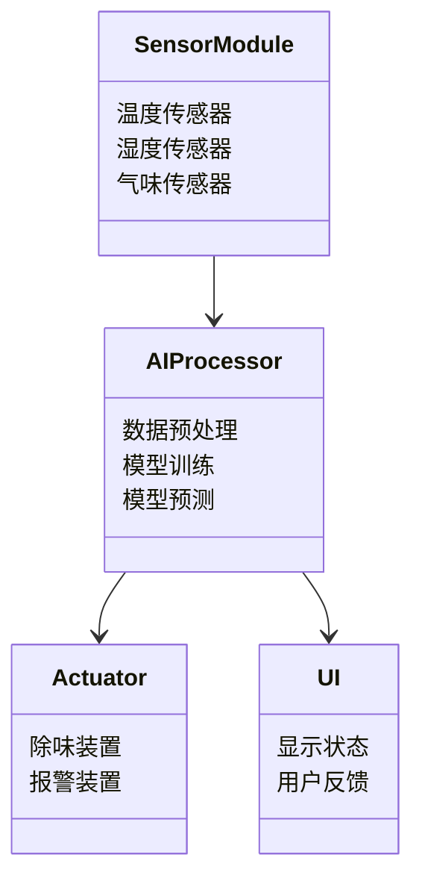
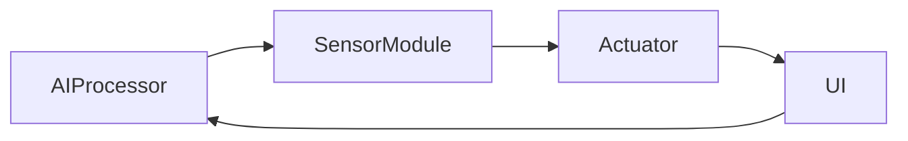

                 


# 智能衣架：AI Agent的衣物除味与保养建议

> 关键词：智能衣架，AI Agent，衣物除味，传感器，机器学习，物联网

> 摘要：本文详细介绍了智能衣架的设计与实现，探讨了其在衣物除味与保养中的应用价值。通过分析AI Agent的核心原理、系统架构及项目实战，本文为读者提供了从理论到实践的全面指导。

---

## 第一部分: 智能衣架的背景与概念

### 第1章: 智能衣架的背景介绍

#### 1.1 问题背景
现代生活中，衣物的除味与保养是一个普遍存在的痛点。传统方法依赖人工操作，效率低下且难以满足多样化的需求。随着智能家居和物联网技术的发展，用户对智能化衣物管理工具的需求日益增长。

#### 1.2 问题描述
- **痛点分析**：传统除味方法（如喷洒香水、晾晒）效果有限且耗时。
- **复杂性**：不同材质和颜色的衣物需要不同的保养方法。
- **需求多样性**：用户希望自动化、智能化的衣物管理工具。

#### 1.3 问题解决
AI Agent（智能代理）通过传感器数据采集、智能分析和自动化执行，解决了传统方法的痛点。智能衣架通过实时感知环境，自动识别衣物状态并执行除味操作，满足用户的多样化需求。

#### 1.4 智能衣架的概念结构
智能衣架由传感器、AI算法、除味模块和用户交互模块组成。其核心在于通过AI Agent实现衣物状态的智能识别和自动化管理。

---

## 第二部分: 智能衣架的核心概念与联系

### 第2章: AI Agent的核心原理

#### 2.1 AI Agent的基本概念
AI Agent是一种能够感知环境并执行任务的智能系统。在智能衣架中，AI Agent负责接收传感器数据，分析衣物状态，并执行除味操作。

#### 2.2 智能衣架的传感器数据采集
- **传感器类型**：温度传感器、湿度传感器、气味传感器。
- **数据采集流程**：传感器采集环境数据，通过无线传输模块发送到AI处理模块。
- **数据预处理**：去噪、归一化处理。

#### 2.3 AI算法与除味模块的关系
- **算法原理**：基于机器学习的气味识别算法，如支持向量机（SVM）。
- **除味模块**：根据识别的气味类型，启动相应的除味装置。

#### 2.4 用户交互与反馈机制
- **交互界面**：手机APP或语音助手。
- **反馈机制**：用户通过APP查看衣物状态，系统根据反馈优化算法。

---

## 第三部分: 智能衣架的算法原理与数学模型

### 第3章: 气味识别算法的原理

#### 3.1 气味识别的基本原理
气味识别基于机器学习模型，通过训练数据学习气味特征，实现对衣物气味的分类。

#### 3.2 支持向量机（SVM）算法
- **数学模型**：$$ y = sign(w \cdot x + b) $$
- **流程图**：
  ```mermaid
  graph LR
    A[数据预处理] --> B[特征提取]
    B --> C[模型训练]
    C --> D[模型预测]
    D --> E[结果输出]
  ```

#### 3.3 Python实现示例
```python
import numpy as np
from sklearn import svm

# 数据预处理
X = np.array([[温度, 湿度, 气味特征], ...])
y = np.array([标签])

# 模型训练
model = svm.SVC()
model.fit(X, y)

# 模型预测
new_data = np.array([[目标温度, 目标湿度, 目标气味特征]])
print(model.predict(new_data))
```

---

## 第四部分: 智能衣架的系统分析与架构设计

### 第4章: 系统架构设计

#### 4.1 领域模型设计


#### 4.2 系统架构设计


---

## 第五部分: 智能衣架的项目实战

### 第5章: 项目实战

#### 5.1 环境安装
- 安装Python和必要的库（如scikit-learn、numpy）。
- 安装传感器和无线模块（如Wi-Fi模块）。

#### 5.2 核心代码实现
```python
import numpy as np
from sklearn import svm
from sensor import read_sensor_data

# 数据预处理
X = read_sensor_data()
y = np.array([标签])

# 模型训练
model = svm.SVC()
model.fit(X, y)

# 模型预测
new_data = read_sensor_data()
print(model.predict(new_data))
```

#### 5.3 实际案例分析
通过实际数据，展示模型的训练和预测过程，分析其准确性和鲁棒性。

---

## 第六部分: 智能衣架的最佳实践

### 第6章: 最佳实践

#### 6.1 使用注意事项
- 定期清洁传感器。
- 注意数据隐私保护。

#### 6.2 项目总结
总结智能衣架的优势和不足，展望未来的发展方向。

#### 6.3 拓展阅读
推荐相关技术书籍和论文，供读者深入学习。

---

## 作者

作者：AI天才研究院/AI Genius Institute & 禅与计算机程序设计艺术 /Zen And The Art of Computer Programming

