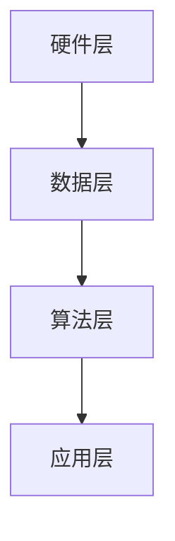

                 


# 智能衣架：AI Agent的衣物除味系统

> 关键词：智能衣架，AI Agent，衣物除味，传感器技术，物联网，人工智能

> 摘要：本文详细介绍了智能衣架的定义、核心功能以及AI Agent在衣物除味系统中的应用。通过分析AI Agent的基本原理、算法实现、系统架构，结合实际项目案例，展示了如何利用AI技术提升衣物管理的智能化水平。文章还探讨了系统的扩展性和实际应用中的注意事项，为读者提供了全面的技术指导。

---

## 第一部分: 背景与概念

### 第1章: 智能衣架的背景与问题描述

#### 1.1 智能衣架的定义与应用场景

智能衣架是一种结合了人工智能（AI）技术的衣物管理设备，能够通过传感器和AI算法实现衣物的智能分类、除味和存储优化。与传统衣架相比，智能衣架能够主动感知衣物状态，并通过AI Agent（智能代理）实现自动化管理。

**应用场景：**
- **家庭使用**：帮助用户整理衣物，解决衣柜空间不足的问题。
- **酒店与民宿**：提供智能衣物管理服务，提升用户体验。
- **公共设施**：如洗衣房或共享衣橱，实现高效衣物管理。

#### 1.2 问题背景与需求分析

传统衣架在衣物管理中存在以下问题：
- **存储混乱**：衣物随意堆放，查找不便。
- **除味困难**：传统除味方法效率低，且需人工操作。
- **缺乏智能性**：无法主动感知衣物状态，难以实现自动化管理。

智能衣架通过AI Agent解决了这些问题，能够实现衣物的智能分类、自动除味和高效存储。

### 第2章: AI Agent与衣物除味系统的核心概念

#### 2.1 AI Agent的基本原理

AI Agent是一种能够感知环境并采取行动以实现目标的智能实体。在智能衣架中，AI Agent负责接收传感器数据，分析衣物状态，并执行相应的操作（如启动除味功能或调整存储位置）。

**AI Agent的核心功能：**
- **感知环境**：通过传感器获取衣物的状态信息。
- **决策与行动**：基于感知数据，AI Agent会做出决策并执行相应的操作。

#### 2.2 衣物除味系统的技术特点

衣物除味系统通过传感器和AI算法实现高效除味。其技术特点包括：
- **实时感知**：传感器实时监测衣物的气味和湿度。
- **智能分析**：AI算法分析传感器数据，判断是否需要启动除味功能。
- **自动操作**：AI Agent根据分析结果，自动启动或关闭除味设备。

#### 2.3 核心概念与联系

AI Agent与衣物除味系统的实体关系如下：

```mermaid
entity AI Agent {
  id: string
  status: string
  action: string
}
entity 衣物除味系统 {
  id: string
  status: string
  action: string
}
AI Agent --> 衣物除味系统: 控制
```

---

## 第二部分: 算法原理

### 第3章: AI Agent的算法实现

#### 3.1 算法原理

AI Agent通过以下步骤实现衣物除味：
1. **数据采集**：传感器采集衣物的气味和湿度数据。
2. **数据处理**：对采集的数据进行预处理，提取特征。
3. **模型训练**：基于历史数据训练机器学习模型。
4. **决策判断**：模型预测是否需要启动除味功能。
5. **执行操作**：AI Agent根据预测结果，控制除味设备。

#### 3.2 算法实现的数学模型

除味决策模型的数学公式如下：

$$
\text{除味状态} = \begin{cases}
\text{启动} & \text{if } \text{气味值} > \text{阈值} \\
\text{关闭} & \text{otherwise}
\end{cases}
$$

---

## 第三部分: 系统分析与架构设计

### 第4章: 系统架构设计方案

#### 4.1 系统功能设计

智能衣架系统的主要功能包括：
- **衣物分类**：根据衣物类型自动分类。
- **除味控制**：根据传感器数据启动或关闭除味功能。
- **存储优化**：通过AI算法优化衣物存储空间。

#### 4.2 系统架构设计

系统架构包括硬件层、数据层、算法层和应用层。以下为系统架构图：



---

## 第四部分: 项目实战

### 第5章: 智能衣架的实现与应用

#### 5.1 项目环境安装

安装Python环境并安装必要的库（如numpy、scikit-learn）。

#### 5.2 核心代码实现

以下是AI Agent的核心代码示例：

```python
import numpy as np
from sklearn.linear_model import LinearRegression

# 传感器数据
sensors = np.array([[25, 60], [26, 55], [24, 70]])
# 标签（是否需要除味）
labels = np.array([1, 0, 1])

# 训练模型
model = LinearRegression()
model.fit(sensors, labels)

# 预测新的数据
new_sensor = np.array([[25, 65]])
prediction = model.predict(new_sensor)
print("是否需要除味：", prediction[0])
```

---

## 第五部分: 最佳实践与总结

### 第6章: 最佳实践与项目总结

#### 6.1 小结

智能衣架通过AI Agent实现了衣物管理的智能化，能够有效解决传统衣架的痛点。AI技术的应用不仅提高了效率，还为用户提供了更好的体验。

#### 6.2 注意事项

- **传感器精度**：传感器的精度直接影响AI算法的效果。
- **数据隐私**：用户数据需严格保密，避免泄露。
- **系统稳定性**：确保系统在复杂环境下仍能稳定运行。

#### 6.3 拓展阅读

建议读者进一步学习AI算法和物联网技术，以深入理解智能衣架的实现原理。

---

## 作者

作者：AI天才研究院/AI Genius Institute & 禅与计算机程序设计艺术/Zen And The Art of Computer Programming

---

通过以上内容，我们详细介绍了智能衣架的定义、核心功能、AI Agent的实现原理以及系统的架构设计。希望本文能够为读者提供有价值的技术指导和启发。

