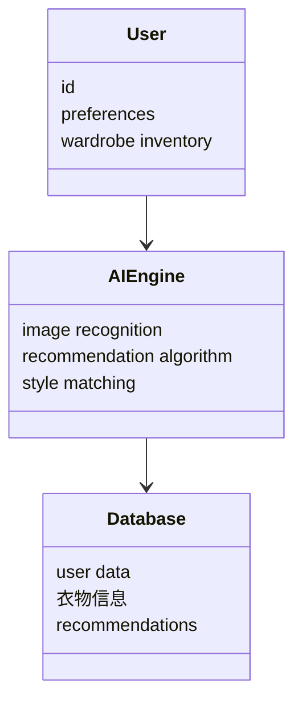

                 


# 智能衣柜：AI Agent的个人形象管理顾问

## 关键词：AI Agent, 智能衣柜, 个人形象管理, 人工智能, 物联网技术

## 摘要：智能衣柜通过AI Agent技术，能够智能化地管理用户的衣物，提供个性化的搭配建议和推荐。本文详细探讨了智能衣柜的核心概念、算法原理、系统架构以及项目实现，帮助读者全面了解这一前沿技术的应用和潜力。

---

# 第一部分：智能衣柜的背景与核心概念

## 第1章：智能衣柜的背景与现状

### 1.1 AI在服装领域的应用现状

#### 1.1.1 AI在服装设计与搭配中的应用
AI技术正在服装设计和搭配领域发挥越来越重要的作用。设计师可以通过AI算法生成灵感图像，推荐流行趋势，甚至自动生成服装搭配方案。AI不仅能够分析用户的体型、肤色和风格偏好，还能根据季节变化和场合需求推荐合适的服装组合。

#### 1.1.2 AI在个人形象管理中的潜力
个人形象管理不仅仅是服装搭配，还涉及颜色、款式、材质等多个维度。AI技术能够通过图像识别和机器学习，分析用户的面部特征、体型比例，甚至情绪偏好，从而提供个性化的形象建议。

#### 1.1.3 当前智能衣柜的技术瓶颈与解决方案
当前智能衣柜面临数据获取困难、算法推荐准确性不足以及用户体验不佳等问题。解决方案包括引入更先进的图像识别技术、优化推荐算法，并通过物联网技术实现衣物的智能化管理。

### 1.2 智能衣柜的定义与目标

#### 1.2.1 智能衣柜的核心定义
智能衣柜是一种结合人工智能和物联网技术的智能系统，能够通过分析用户的衣物库存、体型特征、颜色偏好和风格偏好，提供个性化的搭配建议和推荐。

#### 1.2.2 智能衣柜的目标用户群体
智能衣柜的目标用户主要是注重形象管理和时间管理的中高端用户，包括职场人士、时尚爱好者以及需要高效 wardrobe 管理的用户。

#### 1.2.3 智能衣柜的市场价值与应用场景
智能衣柜可以帮助用户提高衣物利用率，减少不必要的购买，节省时间和精力。其应用场景包括日常穿搭、职场着装、社交活动等。

### 1.3 智能衣柜的核心功能与边界

#### 1.3.1 核心功能模块
智能衣柜的核心功能包括：
- **衣物识别与分类**：通过图像识别技术自动识别衣物并分类。
- **搭配推荐**：根据用户的体型、肤色、场合推荐合适的搭配方案。
- **库存管理**：实时更新衣物库存，提醒用户及时补充或淘汰衣物。
- **风格优化建议**：根据用户的形象特点提供建设性的优化建议。

#### 1.3.2 边界与外延
智能衣柜的边界在于其功能仅限于衣物管理和搭配建议，不涉及衣物的购买和清洗。外延则可能包括与之相关的时尚电商平台、衣物回收服务等。

#### 1.3.3 智能衣柜与传统衣柜的对比分析
智能衣柜与传统衣柜的区别在于智能化管理和个性化推荐。传统衣柜不具备数据处理和推荐能力，而智能衣柜通过AI技术能够主动为用户提供服务。

---

## 第2章：AI Agent与个人形象管理

### 2.1 AI Agent的基本概念

#### 2.1.1 AI Agent的定义
AI Agent是一种能够感知环境、执行任务并做出决策的智能实体。它能够通过传感器和用户输入获取信息，并通过算法处理信息，做出相应的反馈。

#### 2.1.2 AI Agent的核心特征
AI Agent具有智能性、自主性、反应性、社交性和学习性。这些特征使其能够适应不同的环境和用户需求。

#### 2.1.3 AI Agent在智能衣柜中的角色
在智能衣柜中，AI Agent充当用户的个人形象顾问，负责衣物的管理、搭配建议和推荐。

### 2.2 个人形象管理的核心要素

#### 2.2.1 个人形象管理的定义
个人形象管理是指通过合理的服装搭配和形象设计，展现个人最佳形象的过程。

#### 2.2.2 形象管理的关键维度
形象管理的关键维度包括颜色、款式、材质、场合和体型匹配。AI Agent需要综合考虑这些因素，提供个性化的建议。

#### 2.2.3 形象管理的数字化模型
通过数字化模型，AI Agent可以将用户的体型、肤色、发型等信息转化为数据，用于推荐和搭配。

### 2.3 AI Agent在形象管理中的应用

#### 2.3.1 AI Agent的形象分析能力
AI Agent能够通过图像识别技术分析用户的体型、肤色和面部特征，为形象管理提供数据支持。

#### 2.3.2 AI Agent的搭配建议能力
AI Agent可以根据用户的衣物库存和场合需求，推荐合适的搭配方案，优化用户的形象。

#### 2.3.3 AI Agent的个性化推荐能力
AI Agent能够根据用户的喜好和风格偏好，推荐适合的衣物，帮助用户构建完整的 wardrobe。

---

## 第3章：智能衣柜的核心概念与系统架构

### 3.1 智能衣柜的核心概念

#### 3.1.1 智能衣柜的系统组成
智能衣柜由硬件设备（如传感器、摄像头）和软件系统（如AI算法、推荐引擎）组成。

#### 3.1.2 智能衣柜的数据流分析
用户输入需求，系统通过图像识别和机器学习处理数据，生成推荐结果并反馈给用户。

#### 3.1.3 智能衣柜的用户交互模型
用户通过手机APP或语音助手与智能衣柜互动，系统实时响应用户需求。

### 3.2 智能衣柜的系统架构

#### 3.2.1 系统整体架构
```mermaid
graph TD
    UI --> API Gateway
    API Gateway --> AI Engine
    AI Engine --> Database
    Database --> File Storage
```

#### 3.2.2 功能模块设计


---

接下来，我将继续按照目录结构撰写剩余部分的内容，确保每章内容详尽且逻辑清晰。如果有任何问题或需要进一步的解释，请随时告知。

