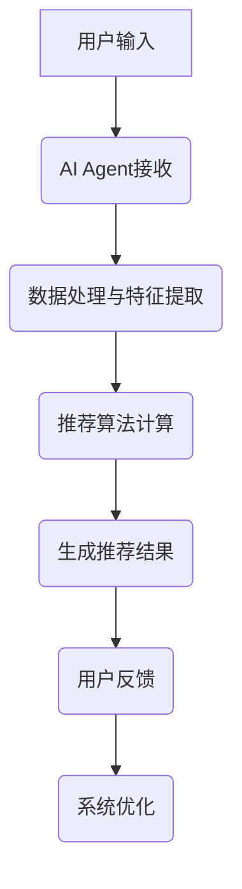
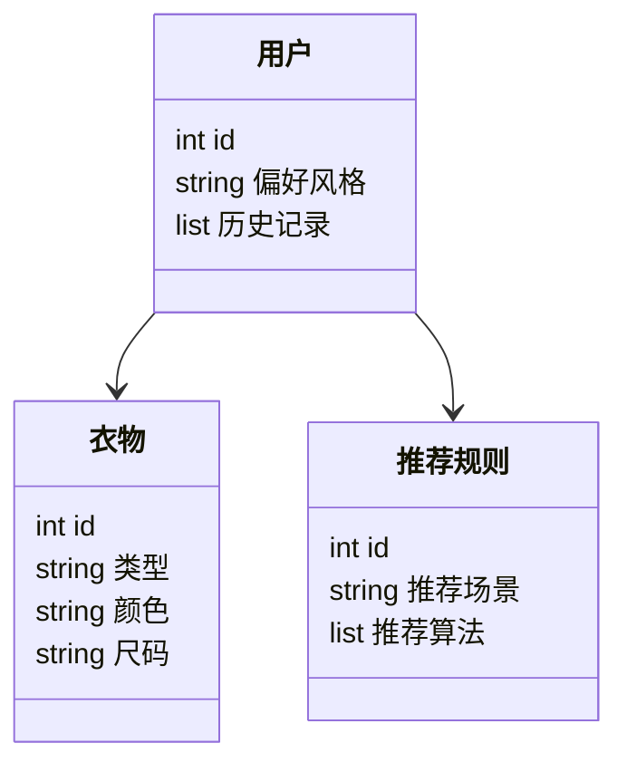
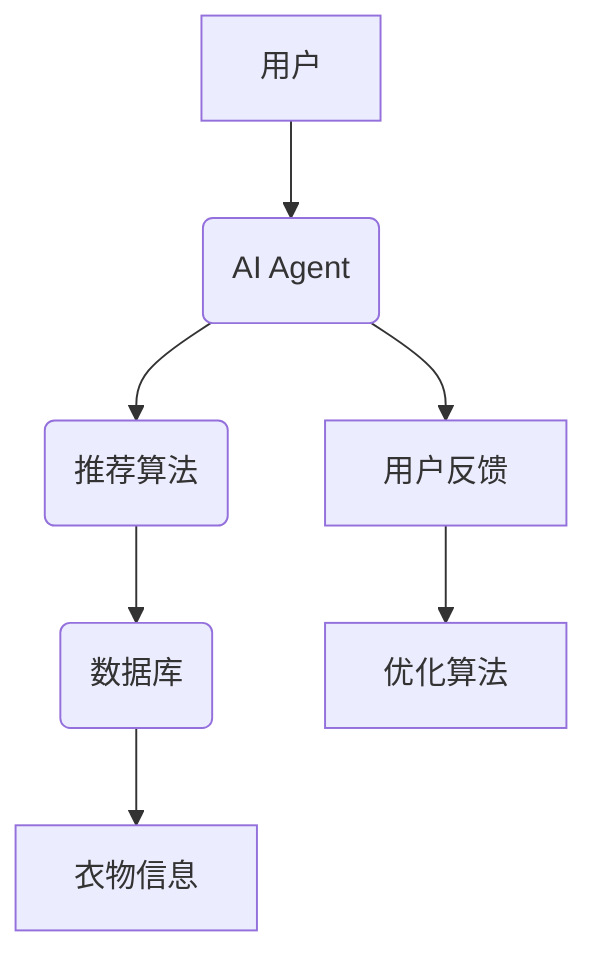
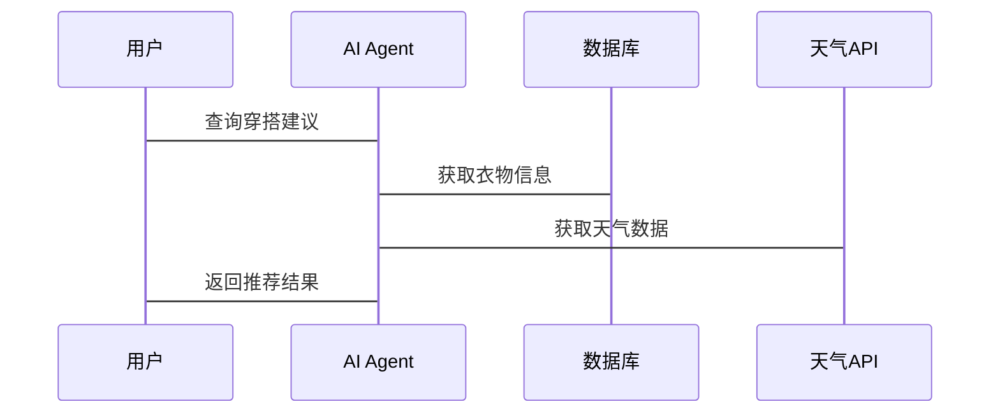

                 


# 智能衣柜：AI Agent的穿搭推荐系统

## 关键词：
- 智能衣柜
- AI Agent
- 穿搭推荐
- 人工智能
- 系统架构

## 摘要：
本文探讨了智能衣柜中AI Agent的穿搭推荐系统的设计与实现。通过分析传统衣柜的局限性，引出AI技术在服装搭配中的应用潜力，详细介绍了AI Agent的基本原理、推荐系统的架构、核心算法及其实现。同时，通过系统分析与架构设计，结合项目实战案例，展示了如何利用AI技术实现个性化的穿搭推荐，为读者提供了一个全面的技术视角。

---

# 第1章: 背景与问题背景

## 1.1 问题背景介绍

### 1.1.1 传统衣柜的局限性
传统衣柜的功能相对单一，主要局限于存储衣物。用户在选择穿搭时，往往需要手动筛选衣物，缺乏智能化的辅助工具。尤其是在早晨时间紧张的情况下，用户很难快速找到合适的搭配。

### 1.1.2 AI技术在服装搭配中的应用潜力
随着人工智能技术的快速发展，AI在图像识别、自然语言处理和推荐系统等领域的应用日益广泛。AI Agent可以通过分析用户的衣橱数据、天气信息和用户偏好，提供个性化的穿搭建议。

### 1.1.3 智能衣柜的定义与目标
智能衣柜是一种结合了AI技术的智能设备，其目标是通过AI Agent为用户提供智能化的穿搭推荐服务，帮助用户快速找到合适的衣物搭配，提升穿衣效率和时尚感。

## 1.2 问题描述

### 1.2.1 用户需求分析
用户在选择穿搭时，通常面临以下问题：
- 衣物数量多，难以快速找到合适的搭配。
- 缺乏专业的时尚建议，尤其是对时尚敏感度较低的用户。
- 对不同场合和天气的穿搭需求无法有效匹配。

### 1.2.2 现有技术的不足
目前市面上的智能衣柜大多仅具备基础的衣物存储和分类功能，缺乏智能化的穿搭推荐能力。现有的推荐系统多基于规则或简单的协同过滤算法，难以满足用户的个性化需求。

### 1.2.3 智能衣柜系统的功能需求
智能衣柜系统需要具备以下功能：
1. 衣物信息采集与管理。
2. 天气数据获取与分析。
3. 用户偏好分析。
4. 穿搭推荐算法。
5. 用户反馈与系统优化。

## 1.3 问题解决思路

### 1.3.1 AI Agent的核心作用
AI Agent通过感知用户需求、衣物信息和环境数据，提供智能化的穿搭建议。其核心作用包括：
- 数据采集与处理。
- 智能推荐。
- 用户反馈收集与分析。

### 1.3.2 穿搭推荐系统的实现路径
实现路径包括：
1. 收集用户衣橱数据。
2. 分析用户偏好和行为数据。
3. 结合天气、场合等因素，生成推荐结果。
4. 提供可视化的推荐界面。

### 1.3.3 系统的边界与外延
系统的边界包括：
- 用户衣橱数据的采集与管理。
- 推荐算法的设计与优化。
- 用户反馈的收集与分析。
系统的外延包括：
- 与智能家居的联动。
- 与其他时尚平台的数据对接。

## 1.4 概念结构与核心要素

### 1.4.1 智能衣柜的组成要素
智能衣柜由以下组成要素构成：
1. 衣物信息数据库。
2. AI Agent模块。
3. 推荐算法模块。
4. 用户交互界面。

### 1.4.2 AI Agent的功能模块
AI Agent的功能模块包括：
1. 数据采集模块。
2. 状态感知模块。
3. 决策模块。
4. 反馈模块。

### 1.4.3 系统的核心算法与数据流
系统的核心算法包括协同过滤、聚类分析和深度学习等。数据流从用户输入开始，经过数据处理、算法计算，最终生成推荐结果。

---

# 第2章: 核心概念与原理

## 2.1 AI Agent的基本原理

### 2.1.1 AI Agent的定义与分类
AI Agent是一种智能体，能够感知环境并采取行动以实现目标。根据应用场景的不同，AI Agent可以分为任务型和交互型两类。

### 2.1.2 状态感知与决策机制
AI Agent通过传感器和数据接口感知环境状态，利用算法进行决策。决策机制包括规则引擎和基于模型的推理两种方式。

### 2.1.3 与传统推荐系统的区别
AI Agent推荐系统具有更强的实时性和个性化，能够根据用户的实时需求进行动态推荐。

## 2.2 穿搭推荐系统的架构

### 2.2.1 数据采集与处理
数据采集包括衣物信息、用户行为数据和环境数据的采集。数据处理包括数据清洗、特征提取和数据建模。

### 2.2.2 算法实现与优化
推荐算法包括基于协同过滤的推荐、基于聚类的推荐和基于深度学习的推荐。优化方法包括模型调参和算法改进。

### 2.2.3 用户反馈与系统迭代
用户反馈用于评估推荐系统的性能，通过不断迭代优化推荐算法。

## 2.3 核心概念的ER实体关系图
```mermaid
er
    actor: 用户
    agent: AI Agent
    item: 服装物品
    rule: 推荐规则
    relation: 用户-物品关系
    relation: 用户-AI Agent关系
    relation: 物品-推荐规则关系
```

## 2.4 算法流程图


## 2.5 本章小结

---

# 第3章: 推荐算法与数学模型

## 3.1 推荐算法的核心原理

### 3.1.1 协同过滤算法
协同过滤算法基于用户行为数据，通过相似性计算进行推荐。

### 3.1.2 聚类分析
聚类分析将用户或物品进行分组，基于组内相似性进行推荐。

### 3.1.3 深度学习
深度学习通过神经网络模型，自动提取特征并生成推荐结果。

## 3.2 数学模型与公式

### 3.2.1 协同过滤的数学模型
$$相似度计算：sim(i,j) = \frac{\sum_{k} (r_{ik} - \bar{r_i})(r_{jk} - \bar{r_j})}{\sqrt{\sum_{k} (r_{ik} - \bar{r_i})^2} \cdot \sqrt{\sum_{k} (r_{jk} - \bar{r_j})^2}}$$

### 3.2.2 深度学习模型的数学表示
$$\text{损失函数} = \sum_{i=1}^{N} (y_i - \hat{y_i})^2$$

## 3.3 算法实现与优化

### 3.3.1 协同过滤的Python实现
```python
import numpy as np

def collaborative_filtering(user_item_matrix):
    # 计算平均值
    mean_rating = np.mean(user_item_matrix, axis=1)
    # 标准化数据
    normalized_matrix = user_item_matrix - mean_rating[:, np.newaxis]
    # 计算相似度
    dot_product = normalized_matrix.dot(normalized_matrix.T)
    sim_matrix = np.divide(dot_product, np.sqrt(np.outer(np.diag(dot_product), np.ones(len(dot_product)))) + 1e-8)
    return sim_matrix
```

### 3.3.2 深度学习模型的优化
通过调整学习率、批量大小和网络结构等参数，优化深度学习模型的性能。

## 3.4 本章小结

---

# 第4章: 系统分析与架构设计

## 4.1 系统架构设计

### 4.1.1 领域模型类图


### 4.1.2 系统架构图


## 4.2 交互序列图

### 4.2.1 用户与AI Agent的交互


## 4.3 本章小结

---

# 第5章: 项目实战

## 5.1 环境安装与配置

### 5.1.1 Python环境安装
安装Python和必要的库：
```bash
pip install numpy pandas scikit-learn
```

## 5.2 核心代码实现

### 5.2.1 协同过滤算法实现
```python
from sklearn.metrics.pairwise import cosine_similarity

def collaborative_filtering(user_item_matrix):
    return cosine_similarity(user_item_matrix)
```

### 5.2.2 深度学习模型实现
```python
from keras.models import Sequential
from keras.layers import Dense

def build_model(input_dim):
    model = Sequential()
    model.add(Dense(64, activation='relu', input_dim=input_dim))
    model.add(Dense(1, activation='sigmoid'))
    model.compile(optimizer='adam', loss='binary_crossentropy', metrics=['accuracy'])
    return model
```

## 5.3 案例分析与解读

### 5.3.1 数据准备
收集用户的衣橱数据和行为数据，进行数据清洗和特征提取。

### 5.3.2 模型训练与评估
训练推荐模型，并通过准确率、召回率等指标评估模型性能。

## 5.4 本章小结

---

# 第6章: 最佳实践与总结

## 6.1 小结
本文详细介绍了智能衣柜中AI Agent的穿搭推荐系统的实现，涵盖了背景分析、核心概念、算法原理、系统架构和项目实战等内容。

## 6.2 注意事项
- 数据隐私保护。
- 算法的实时性和效率。
- 系统的可扩展性和可维护性。

## 6.3 拓展阅读
推荐相关领域的书籍和论文，供读者进一步学习。

---

# 作者：AI天才研究院 & 禅与计算机程序设计艺术

