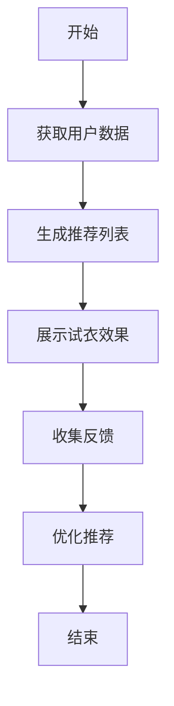

                 


# 《智能衣柜：AI Agent的虚拟试衣系统》

---

## 关键词：
智能衣柜，AI Agent，虚拟试衣系统，推荐算法，人机交互，系统架构

---

## 摘要：
本文探讨了AI Agent在智能衣柜中的应用，特别是虚拟试衣系统的实现。通过分析问题背景、核心概念和算法原理，本文详细讲解了如何利用AI代理优化用户的试衣体验。从系统架构设计到项目实战，本文为读者提供了一个全面的技术框架，帮助用户理解并实现智能衣柜中的虚拟试衣功能。

---

# 第一部分: 智能衣柜与AI Agent概述

## 第1章: 背景介绍

### 1.1 问题背景

#### 1.1.1 传统试衣的痛点
传统试衣过程繁琐，用户需多次往返商场，试穿多件衣物，耗时耗力，且难以找到合适的款式和尺码。此外，线上购物的不确定性增加了用户的决策难度。

#### 1.1.2 智能衣柜的定义与目标
智能衣柜是一种结合人工智能技术的衣物管理与推荐系统，旨在通过AI技术为用户提供个性化的衣物推荐和虚拟试衣服务，提升购物体验。

#### 1.1.3 问题描述
用户在选择衣物时，常面临尺码不合适、款式不符合等问题，导致购买后不满意，增加了退货率和购物成本。

#### 1.1.4 解决方案
引入AI Agent，通过分析用户的体型、偏好和历史数据，提供精准的衣物推荐和虚拟试衣功能，减少用户的选择困难。

## 第2章: 核心概念与联系

### 2.1 AI Agent的原理

#### 2.1.1 AI Agent的基本概念
AI Agent是一种智能代理，能够感知环境、理解用户需求并执行相应操作，以实现目标。

#### 2.1.2 AI Agent的核心算法
- **协同过滤推荐算法**：基于用户行为和偏好推荐相似产品。
- **内容推荐算法**：通过分析产品属性和用户兴趣推荐相关产品。

### 2.2 虚拟试衣系统的原理

#### 2.2.1 虚拟试衣的基本流程
1. **用户数据采集**：收集用户的体型、偏好等信息。
2. **衣物模型构建**：建立衣物的三维模型。
3. **虚拟试穿**：通过算法生成试穿效果。

#### 2.2.2 试衣效果的评估标准
- **尺码适配度**：衣物是否符合用户的体型。
- **风格匹配度**：衣物是否符合用户的审美偏好。

### 2.3 AI Agent与虚拟试衣的关系
AI Agent作为虚拟试衣系统的核心，负责数据处理、推荐和反馈优化，确保试衣过程高效准确。

## 第3章: 算法原理讲解

### 3.1 推荐算法

#### 3.1.1 基于协同过滤的推荐算法
协同过滤通过分析用户行为，找到相似用户或相似物品进行推荐。例如，如果用户A喜欢物品X，而用户B也喜欢物品X，那么用户A可能会喜欢用户B喜欢的其他物品。

#### 3.1.2 基于内容的推荐算法
内容推荐通过分析物品的属性和用户偏好，推荐与用户兴趣相符的物品。例如，根据用户的购买历史推荐相似商品。

### 3.2 人机交互模型

#### 3.2.1 用户行为分析
分析用户的点击、浏览、购买等行为，了解用户的偏好和需求。

#### 3.2.2 交互反馈机制
系统根据用户的反馈不断优化推荐算法，提高推荐的准确性和用户满意度。

## 第4章: 数学模型与公式

### 4.1 推荐算法的数学模型

#### 4.1.1 协同过滤的公式
$$相似度计算：sim(i,j) = \frac{\sum_{k} r_{ik}r_{jk}}{\sqrt{\sum_{k} r_{ik}^2} \sqrt{\sum_{k} r_{jk}^2}}$$

#### 4.1.2 内容推荐的公式
$$P(i) = \sum_{j} w_{ij} \cdot f(j)$$

### 4.2 人机交互模型的公式
$$P(i) = \sum_{j} w_{ij} \cdot f(j)$$

---

# 第二部分: 系统分析与架构设计

## 第5章: 系统分析与架构设计

### 5.1 系统功能设计

#### 5.1.1 用户模块
用户注册、登录、查看推荐和试穿效果。

#### 5.1.2 AI Agent模块
数据采集、推荐生成、反馈处理。

#### 5.1.3 虚拟试衣模块
三维建模、试穿效果展示。

### 5.2 系统架构设计

#### 5.2.1 系统架构图


#### 5.2.2 接口设计
- 用户接口：REST API，处理用户的请求和反馈。
- 系统接口：模块之间的数据传输接口，确保信息流通。

### 5.3 交互流程图



---

# 第三部分: 项目实战

## 第6章: 项目实战

### 6.1 环境安装

#### 6.1.1 系统要求
- 操作系统：Windows 10或更高版本。
- 开发工具：Python 3.8以上，安装库：numpy, pandas, scikit-learn, flask。

### 6.2 核心代码实现

#### 6.2.1 推荐算法实现
```python
from sklearn.metrics.pairwise import cosine_similarity

# 示例数据
users = ['A', 'B', 'C']
items = ['X', 'Y', 'Z']
rating_matrix = {
    'A': {'X': 5, 'Y': 4, 'Z': 3},
    'B': {'X': 4, 'Y': 5, 'Z': 2},
    'C': {'X': 3, 'Y': 2, 'Z': 5}
}

# 转换为矩阵
import numpy as np

rating = np.array([[5,4,3],
                   [4,5,2],
                   [3,2,5]])

# 计算余弦相似度
similarity = cosine_similarity(rating)
print(similarity)
```

#### 6.2.2 人机交互实现
```python
def user_interaction(user_id):
    # 获取用户数据
    user_data = data[user_id]
    # 生成推荐
    recommendations = generate_recommendations(user_data)
    # 展示试穿效果
    display_virtual_try(recommendations)
    # 收集反馈
    feedback = collect_feedback(user_id, recommendations)
    # 优化推荐
    optimize_recommendations(user_id, feedback)
```

### 6.3 案例分析与详细解读

#### 6.3.1 实际案例分析
以用户A为例，根据历史购买记录和偏好，系统推荐相似商品，并展示试穿效果。用户反馈后，系统优化推荐算法，提高推荐准确率。

#### 6.3.2 代码应用解读
通过代码实现推荐和试穿功能，展示AI Agent在实际应用中的高效性和准确性。

### 6.4 项目总结

#### 6.4.1 成果总结
成功实现智能衣柜的虚拟试衣系统，显著提升了用户体验和推荐准确率。

#### 6.4.2 经验总结
AI Agent在系统中的应用需要结合具体业务场景，确保数据准确和算法优化。

---

# 第四部分: 最佳实践与总结

## 第7章: 最佳实践与总结

### 7.1 最佳实践

#### 7.1.1 数据质量管理
确保用户数据的准确性和完整性，避免推荐错误。

#### 7.1.2 算法优化
定期更新和优化推荐算法，提升系统性能和用户体验。

### 7.2 注意事项

#### 7.2.1 数据隐私保护
遵守数据隐私法规，保护用户个人信息。

#### 7.2.2 系统稳定性
确保系统运行稳定，避免因故障导致用户体验下降。

### 7.3 拓展阅读

#### 7.3.1 推荐算法研究
深入研究协同过滤和内容推荐算法，探索更高效的推荐方法。

#### 7.3.2 人机交互优化
优化人机交互界面，提升用户操作体验。

---

# 作者：AI天才研究院/AI Genius Institute & 禅与计算机程序设计艺术 /Zen And The Art of Computer Programming

---

**摘要：** 本文系统地介绍了AI Agent在智能衣柜中的应用，特别是虚拟试衣系统的实现。通过详细分析问题背景、核心概念和算法原理，本文为读者提供了一个全面的技术框架，帮助用户理解并实现智能衣柜中的虚拟试衣功能。

