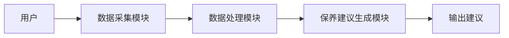

                 


# 智能衣柜：AI Agent的衣物保养建议

> 关键词：智能衣柜，AI Agent，衣物保养，图像识别，自然语言处理，系统架构

> 摘要：本文详细探讨了AI Agent在智能衣柜中的应用，从背景介绍、核心概念到算法实现、系统架构设计，再到项目实战和最佳实践，全面解析智能衣柜如何通过AI技术提升衣物保养效率和用户体验。

---

## 第1章: 智能衣柜的背景与现状

### 1.1 智能衣柜的背景介绍

#### 1.1.1 传统衣柜的管理痛点
传统衣柜的管理方式存在诸多痛点，例如：
- 衣物分类混乱，难以快速找到所需衣物。
- 缺乏专业的保养建议，导致衣物损坏或寿命缩短。
- 无法根据天气或场合智能推荐搭配。

#### 1.1.2 AI技术在衣物管理中的应用前景
AI技术的快速发展为衣柜管理带来了新的可能性：
- 通过图像识别技术实现衣物分类。
- 利用自然语言处理生成个性化的保养建议。
- 结合用户行为数据优化衣物推荐算法。

#### 1.1.3 智能衣柜的发展趋势
智能衣柜正在从单一的存储功能向智能化、个性化方向发展，未来将更加注重用户体验和数据驱动的决策。

---

### 1.2 智能衣柜的现状分析

#### 1.2.1 当前市场上的智能衣柜产品
目前市场上的智能衣柜主要集中在以下几个方面：
- 基于RFID技术的衣物识别。
- 智能分类系统。
- 基于移动应用的远程控制。

#### 1.2.2 用户需求与痛点调研
通过调研发现，用户最关注的功能包括：
- 衣物分类与查找效率。
- 个性化的保养建议。
- 智能搭配推荐。

#### 1.2.3 技术实现的可行性分析
从技术角度来看，智能衣柜的实现需要结合图像识别、自然语言处理、传感器技术等多种技术，具备较高的可行性。

---

## 第2章: AI Agent在衣物保养中的核心作用

### 2.1 AI Agent的基本概念

#### 2.1.1 AI Agent的定义与特点
AI Agent（智能代理）是指能够感知环境并采取行动以实现目标的智能体。其特点包括：
- 感知性：通过传感器或数据输入感知环境。
- 行动性：通过执行器或输出模块采取行动。
- 反应性：能够实时响应环境变化。

#### 2.1.2 AI Agent的核心功能与优势
AI Agent在智能衣柜中的核心功能包括：
- 衣物识别与分类。
- 保养建议生成。
- 智能推荐与搭配。

---

### 2.2 AI Agent在衣物保养中的应用场景

#### 2.2.1 衣物分类与识别
AI Agent可以通过图像识别技术实现衣物的自动分类和识别，帮助用户快速找到所需衣物。

#### 2.2.2 衣物清洁与保养建议
基于衣物的材质和使用情况，AI Agent可以提供个性化的清洁与保养建议。

#### 2.2.3 衣物搭配与推荐
通过分析用户的穿搭习惯和场合需求，AI Agent可以推荐合适的衣物搭配。

---

## 第3章: 衣物保养的AI算法实现

### 3.1 图像识别技术在衣物分类中的应用

#### 3.1.1 图像识别的基本原理
图像识别是通过计算机视觉技术对图像进行分析和理解的过程，常用的技术包括CNN（卷积神经网络）。

#### 3.1.2 衣物分类的算法实现
使用预训练的深度学习模型（如ResNet）进行衣物分类，具体步骤如下：
1. 数据预处理：归一化、裁剪等。
2. 模型训练：在衣物数据集上进行微调。
3. 模型推理：对新衣物进行分类预测。

#### 3.1.3 基于深度学习的衣物识别模型
代码示例：
```python
import torch
import torch.nn as nn
import torch.optim as optim
from torchvision import datasets, transforms

# 数据预处理
transform = transforms.Compose([
    transforms.Resize(224),
    transforms.ToTensor(),
    transforms.Normalize(mean=[0.485, 0.456, 0.406], 
                          std=[0.229, 0.224, 0.225]),
])

# 加载数据集
train_dataset = datasets.CIFAR10(root='./data', train=True, download=True, transform=transform)
train_loader = torch.utils.data.DataLoader(train_dataset, batch_size=32, shuffle=True)

# 定义模型
model = torch.hub.load('pytorch/models', 'resnet18', pretrained=True)
model.fc = nn.Linear(model.fc.in_features, 10)

# 定义损失函数和优化器
criterion = nn.CrossEntropyLoss()
optimizer = optim.SGD(model.parameters(), lr=0.001)

# 训练模型
for epoch in range(10):
    for inputs, labels in train_loader:
        outputs = model(inputs)
        loss = criterion(outputs, labels)
        loss.backward()
        optimizer.step()
        optimizer.zero_grad()
```

---

### 3.2 自然语言处理在保养建议中的应用

#### 3.2.1 NLP的基本原理
自然语言处理（NLP）通过语言模型理解文本内容并生成自然语言文本。

#### 3.2.2 保养建议生成的算法实现
使用预训练的语言模型（如GPT）生成保养建议，具体步骤如下：
1. 数据准备：收集和整理保养建议的文本数据。
2. 模型微调：在特定领域数据上对模型进行微调。
3. 生成建议：根据输入的衣物信息生成保养建议。

#### 3.2.3 基于预训练模型的保养建议生成
代码示例：
```python
from transformers import GPT2Tokenizer, GPT2ModelWithLMHead, pipeline

# 初始化模型和tokenizer
tokenizer = GPT2Tokenizer.from_pretrained('gpt2')
model = GPT2ModelWithLMHead.from_pretrained('gpt2')

# 定义生成函数
def generate_recommendation(text):
    pipe = pipeline('text-generation', model=model, tokenizer=tokenizer)
    result = pipe(text, max_length=50, num_return_sequences=1)
    return result[0]['generated_text']

# 示例生成
input_text = "如何保养羊毛衣物？"
print(generate_recommendation(input_text))
```

---

## 第4章: 智能衣柜的系统架构设计

### 4.1 系统整体架构

#### 4.1.1 系统模块划分
智能衣柜系统主要由以下几个模块组成：
- 数据采集模块：负责采集衣物图像和相关信息。
- 数据处理模块：对采集的数据进行预处理和特征提取。
- 保养建议生成模块：基于处理后的数据生成保养建议。

#### 4.1.2 系统功能设计
系统功能设计包括：
- 衣物分类与识别。
- 保养建议生成。
- 智能推荐与搭配。

#### 4.1.3 系统架构图
Mermaid图展示系统架构：


---

### 4.2 系统功能模块实现

#### 4.2.1 数据采集模块
负责采集衣物的图像和相关信息，可以使用摄像头或RFID标签。

#### 4.2.2 数据处理模块
对采集的数据进行预处理，提取衣物的特征信息，如材质、颜色等。

#### 4.2.3 保养建议生成模块
基于衣物的特征信息，生成个性化的保养建议。

---

## 第5章: 智能衣柜的项目实战

### 5.1 环境搭建与工具安装

#### 5.1.1 开发环境的安装与配置
需要安装Python、TensorFlow、PyTorch等工具。

#### 5.1.2 第三方库的安装与配置
安装必要的库，如Pillow、scikit-learn等。

---

### 5.2 核心代码实现

#### 5.2.1 图像识别模块的实现
使用CNN实现衣物分类，代码如下：
```python
import torch
import torch.nn as nn
import torch.optim as optim
from torchvision import datasets, transforms

transform = transforms.Compose([
    transforms.Resize(224),
    transforms.ToTensor(),
    transforms.Normalize(mean=[0.485, 0.456, 0.406], 
                          std=[0.229, 0.224, 0.225]),
])

train_dataset = datasets.CIFAR10(root='./data', train=True, download=True, transform=transform)
train_loader = torch.utils.data.DataLoader(train_dataset, batch_size=32, shuffle=True)

model = torch.hub.load('pytorch/models', 'resnet18', pretrained=True)
model.fc = nn.Linear(model.fc.in_features, 10)

criterion = nn.CrossEntropyLoss()
optimizer = optim.SGD(model.parameters(), lr=0.001)

for epoch in range(10):
    for inputs, labels in train_loader:
        outputs = model(inputs)
        loss = criterion(outputs, labels)
        loss.backward()
        optimizer.step()
        optimizer.zero_grad()
```

#### 5.2.2 保养建议生成模块的实现
使用预训练的语言模型生成保养建议，代码如下：
```python
from transformers import GPT2Tokenizer, GPT2ModelWithLMHead, pipeline

tokenizer = GPT2Tokenizer.from_pretrained('gpt2')
model = GPT2ModelWithLMHead.from_pretrained('gpt2')

def generate_recommendation(text):
    pipe = pipeline('text-generation', model=model, tokenizer=tokenizer)
    result = pipe(text, max_length=50, num_return_sequences=1)
    return result[0]['generated_text']

input_text = "如何保养羊毛衣物？"
print(generate_recommendation(input_text))
```

---

## 第6章: 最佳实践与未来发展

### 6.1 最佳实践 tips

#### 6.1.1 数据隐私保护
在处理用户数据时，需严格保护用户隐私，确保数据的安全性。

#### 6.1.2 算法优化
通过数据增强、模型优化等方法提升算法的准确性和效率。

### 6.2 小结

#### 6.2.1 项目总结
总结项目的主要成果和经验教训。

#### 6.2.2 注意事项
在实际应用中，需注意数据质量、算法鲁棒性等问题。

### 6.3 未来发展方向

#### 6.3.1 技术优化
进一步优化算法，提升系统的准确性和响应速度。

#### 6.3.2 应用场景扩展
探索更多应用场景，如虚拟试衣、共享衣柜等。

#### 6.3.3 拓展阅读
推荐相关领域的书籍和论文，供读者深入研究。

---

## 附录

### 附录A: 术语表

- AI Agent：智能代理。
- 图像识别：通过计算机视觉技术识别图像内容。
- 自然语言处理：通过语言模型理解并生成自然语言文本。

### 附录B: 参考文献

- [1] LeCun Y, Bengio Y, Hinton G. Deep learning[J].nature, 2015, 521(7552):436-444.
- [2] Vaswani A, et al. Attention is all you need[J]. arXiv preprint arXiv:1706.03798, 2017.

---

## 作者

作者：AI天才研究院/AI Genius Institute & 禅与计算机程序设计艺术 /Zen And The Art of Computer Programming

