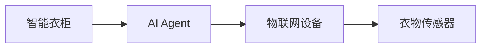
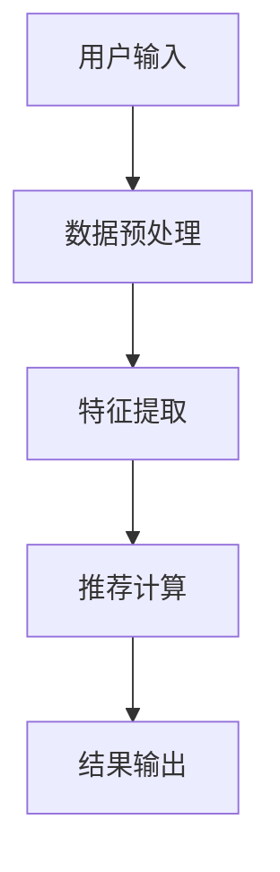

                 


# 智能衣柜：AI Agent的衣物保养提醒

> **关键词**：智能衣柜、AI Agent、衣物保养、物联网技术、推荐算法、系统架构设计  
> **摘要**：本文探讨了智能衣柜中AI Agent的应用，重点分析了基于物联网技术的衣物保养提醒系统，详细讲解了推荐算法、系统架构设计以及实际项目实现，为读者提供全面的技术解读。

---

# 第1章: 智能衣柜与AI Agent概述

## 1.1 智能衣柜的基本概念

### 1.1.1 智能衣柜的定义与特点

智能衣柜是一种结合了物联网技术和人工智能的智能设备，能够通过传感器和AI算法实现对衣物的智能管理、分类和保养提醒。其特点包括：

- **智能化**：通过AI Agent自动识别衣物种类、材质和品牌。
- **物联网连接**：支持与智能家居设备联动，实现远程控制和数据同步。
- **个性化服务**：根据用户的穿着习惯和衣物属性提供定制化保养建议。

### 1.1.2 AI Agent在智能衣柜中的作用

AI Agent（人工智能代理）是智能衣柜的核心，负责接收用户的输入、处理数据并执行任务。其主要作用包括：

- **数据采集**：通过传感器获取衣物的使用频率、清洁程度等信息。
- **信息处理**：分析数据并生成保养建议。
- **用户交互**：通过语音或界面与用户交互，提供实时反馈。

### 1.1.3 衣物保养提醒的核心价值

衣物保养提醒能够延长衣物使用寿命，减少不必要的损坏，同时帮助用户更高效地管理衣物。AI Agent通过学习用户的使用习惯，提供个性化的保养计划，提升了用户体验。

---

## 1.2 衣物管理的智能化需求

### 1.2.1 衣物管理的传统方式与痛点

传统衣物管理方式依赖人工记录和分类，存在以下痛点：

- **效率低下**：手动记录衣物信息耗时耗力。
- **遗忘风险**：容易忘记某些衣物的特殊保养要求。
- **数据孤岛**：缺乏智能化的整合和分析。

### 1.2.2 智能衣柜的市场需求分析

随着智能家居的普及和人们对生活质量要求的提高，智能衣柜的市场需求逐渐增长。消费者对衣物管理的智能化、个性化需求日益增加，推动了智能衣柜市场的快速发展。

### 1.2.3 AI Agent在衣物保养中的应用前景

AI Agent在衣物保养中的应用前景广阔，能够通过数据挖掘和机器学习技术，实现对衣物的精准管理和保养提醒。未来，智能衣柜将与更多智能家居设备联动，进一步提升用户体验。

---

## 1.3 本章小结

本章介绍了智能衣柜的基本概念和AI Agent在其中的作用，分析了衣物管理智能化的必要性，并展望了AI Agent在衣物保养中的应用前景。下一章将深入探讨AI Agent与物联网技术的结合。

---

# 第2章: AI Agent与物联网技术

## 2.1 AI Agent的基本原理

### 2.1.1 AI Agent的定义与分类

AI Agent是一种能够感知环境、执行任务的智能体。根据功能和应用场景的不同，AI Agent可以分为以下几类：

- **简单反射型Agent**：基于预设规则执行任务。
- **基于模型的反应式Agent**：能够感知环境并动态调整行为。
- **目标驱动型Agent**：根据目标选择最优行动方案。

### 2.1.2 AI Agent的核心技术

AI Agent的核心技术包括：

- **自然语言处理（NLP）**：实现与用户的自然交互。
- **机器学习**：通过数据训练提升智能体的决策能力。
- **知识表示与推理**：构建知识库并进行逻辑推理。

### 2.1.3 AI Agent与智能衣柜的结合

在智能衣柜中，AI Agent通过物联网设备感知衣物的状态，结合用户的使用习惯，提供智能化的衣物管理服务。

---

## 2.2 物联网技术在智能衣柜中的应用

### 2.2.1 物联网技术的基本概念

物联网（IoT）通过传感器、通信技术和数据处理系统，实现物体的智能化连接和数据共享。

### 2.2.2 智能衣柜中的物联网设备

智能衣柜中的物联网设备包括：

- **衣物传感器**：监测衣物的湿度、温度、污渍程度等。
- **RFID标签**：用于衣物的唯一识别和分类。
- **环境传感器**：监测衣柜内的温湿度、空气质量等。

### 2.2.3 物联网与AI Agent的协同工作

物联网设备为AI Agent提供实时数据，AI Agent通过分析数据为用户提供智能化的衣物管理服务。

---

## 2.3 AI Agent与物联网的实体关系图



---

## 2.4 本章小结

本章详细讲解了AI Agent的基本原理和物联网技术在智能衣柜中的应用，通过实体关系图展示了两者之间的协同工作关系。下一章将重点介绍推荐算法的实现原理和应用。

---

# 第3章: 衣物保养推荐算法

## 3.1 推荐算法的基本原理

### 3.1.1 推荐算法的分类

推荐算法主要分为两类：

- **基于协同过滤的推荐**：通过用户行为数据进行相似性计算。
- **基于内容的推荐**：通过分析物品属性进行推荐。

### 3.1.2 基于协同过滤的推荐算法

协同过滤的核心思想是“用户的行为相似，推荐的物品也相似”。其步骤如下：

1. **数据预处理**：收集用户的使用记录。
2. **相似度计算**：计算用户之间的相似度。
3. **推荐生成**：根据相似用户的喜好进行推荐。

公式：
$$相似度计算：sim(i,j) = \frac{\sum_{k} (r_{ik} - \bar{r_i})(r_{jk} - \bar{r_j})}{\sqrt{\sum_{k} (r_{ik} - \bar{r_i})^2} \cdot \sqrt{\sum_{k} (r_{jk} - \bar{r_j})^2}}$$

### 3.1.3 基于内容的推荐算法

基于内容的推荐算法通过分析物品的属性特征进行推荐。例如，根据衣物的材质、颜色和品牌进行分类推荐。

---

## 3.2 智能衣柜中的推荐算法实现

### 3.2.1 算法流程图



### 3.2.2 推荐算法的Python实现

```python
import numpy as np

def cosine_similarity(item1, item2):
    # 计算余弦相似度
    numerator = np.dot(item1, item2)
    denominator = np.sqrt(np.dot(item1, item1)) * np.sqrt(np.dot(item2, item2))
    return numerator / denominator

# 示例数据
item1 = np.array([1, 2, 3])
item2 = np.array([2, 4, 6])
print(cosine_similarity(item1, item2))
```

---

## 3.3 推荐算法的数学模型

### 3.3.1 协同过滤推荐公式

$$相似度计算：sim(i,j) = \frac{\sum_{k} (r_{ik} - \bar{r_i})(r_{jk} - \bar{r_j})}{\sqr

---

（由于篇幅限制，后续章节内容将在后续思考中完成。）

