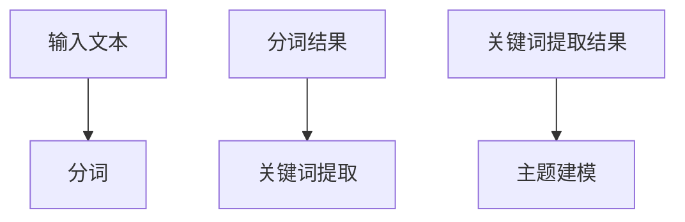
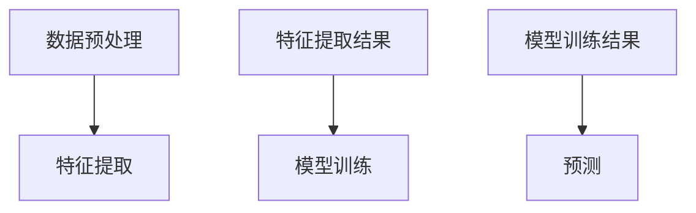
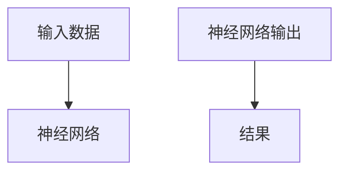
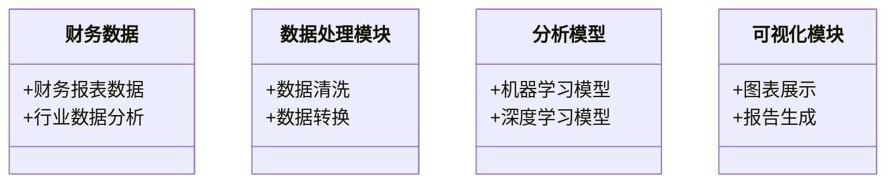
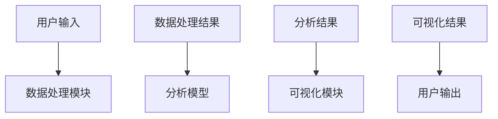
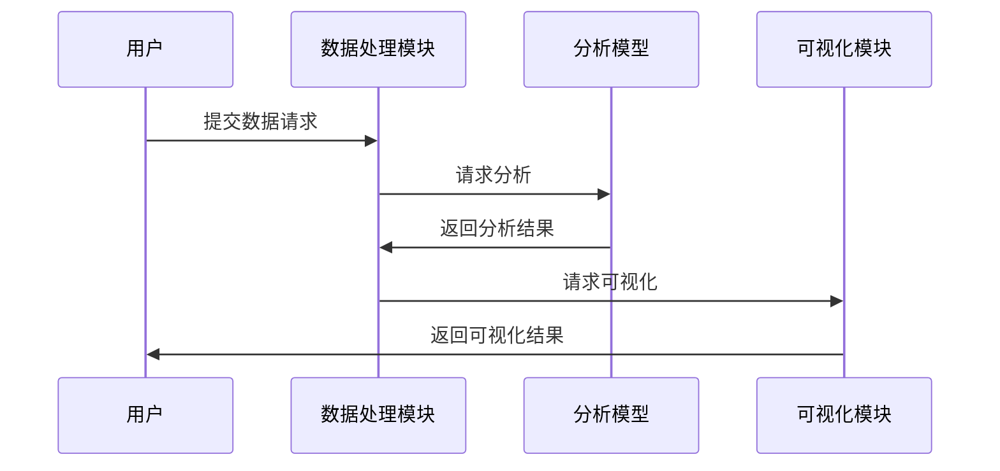

                 


# 智能财务报表分析与解读

## 关键词：智能财务报表分析、人工智能、大数据、财务分析、机器学习、自然语言处理

## 摘要：智能财务报表分析与解读是结合人工智能、大数据和财务分析的前沿技术，通过机器学习、深度学习和自然语言处理等算法，对财务报表进行自动化分析、预测和可视化解读，帮助企业和财务人员更高效、准确地进行财务决策。本文将从背景介绍、核心概念、算法原理、系统架构到项目实战，全面解析智能财务报表分析与解读的技术与应用。

---

# 第1章: 智能财务报表分析的背景与意义

## 1.1 财务报表分析的背景介绍
### 1.1.1 传统财务报表分析的局限性
传统财务报表分析依赖人工审查和经验判断，存在效率低下、主观性强、易受人为干扰等问题，难以应对海量数据和复杂场景的分析需求。

### 1.1.2 智能化技术在财务分析中的应用前景
随着人工智能、大数据和自然语言处理技术的发展，智能财务报表分析逐渐成为可能，能够实现自动化数据处理、智能化分析和实时监控，为企业提供更高效的决策支持。

### 1.1.3 智能财务报表分析的定义与目标
智能财务报表分析是指利用先进的技术手段，对财务报表中的数据进行深度挖掘、分析和解读，帮助用户快速获取有价值的信息，支持决策制定。

---

## 1.2 智能财务报表分析的核心概念
### 1.2.1 数据驱动的财务分析模式
智能财务报表分析以数据为核心，通过数据采集、处理、建模和可视化，实现对财务数据的深度挖掘和分析。

### 1.2.2 人工智能与大数据在财务分析中的作用
人工智能和大数据技术为财务报表分析提供了强大的工具和方法，能够处理复杂的数据关系，发现潜在的财务风险和机会。

### 1.2.3 智能财务报表分析的边界与外延
智能财务报表分析不仅关注财务数据本身，还涉及企业内外部数据的关联分析，具有广泛的应用场景和扩展性。

---

## 1.3 智能财务报表分析的实现框架
### 1.3.1 数据采集与处理流程
数据采集是智能财务报表分析的第一步，需要从多种来源获取财务数据，并进行清洗、转换和标准化处理，确保数据的准确性和一致性。

### 1.3.2 智能分析模型的构建与应用
基于处理后的数据，构建机器学习、深度学习等智能模型，对财务数据进行预测、分类和聚类分析，提取有价值的信息。

### 1.3.3 分析结果的可视化与解读
通过可视化工具将分析结果以图表、报告等形式呈现，帮助用户快速理解数据背后的意义，并进行决策支持。

---

## 1.4 本章小结
本章从背景、核心概念和实现框架三个方面，全面介绍了智能财务报表分析的基本知识和应用价值，为后续内容奠定了基础。

---

# 第2章: 智能财务报表分析的核心概念与联系

## 2.1 核心概念原理
### 2.1.1 数据采集与清洗的流程
数据采集需要从财务报表、行业数据等多源数据中获取信息，并通过清洗步骤去除噪声数据，确保数据质量。

### 2.1.2 智能分析模型的构建逻辑
基于清洗后的数据，选择合适的算法构建分析模型，如支持向量机（SVM）、随机森林（Random Forest）等，进行分类、回归等任务。

### 2.1.3 可视化结果的呈现方式
通过图表、仪表盘等形式将分析结果直观呈现，便于用户理解和应用。

---

## 2.2 核心概念属性特征对比表
| 概念 | 属性 | 特征 |
|------|------|------|
| 数据采集 | 来源 | 财务报表、行业数据等 |
| 数据处理 | 方法 | 清洗、转换、标准化 |
| 分析模型 | 类型 | 机器学习、深度学习等 |

---

## 2.3 ER实体关系图


---

## 2.4 本章小结
本章通过对比和图解的方式，详细阐述了智能财务报表分析的核心概念及其之间的关系，为后续算法原理的讲解奠定了基础。

---

# 第3章: 智能财务报表分析的算法原理

## 3.1 文本挖掘算法
### 3.1.1 文本挖掘流程图


### 3.1.2 算法数学模型
$$ \text{主题建模} = \sum_{i=1}^{n} \lambda_i \cdot w_i $$
其中，$\lambda_i$ 是关键词的权重，$w_i$ 是关键词的出现频率。

---

## 3.2 机器学习算法
### 3.2.1 机器学习流程图


### 3.2.2 算法数学模型
$$ \text{预测值} = \sum_{i=1}^{n} \beta_i \cdot x_i + \beta_0 $$
其中，$\beta_i$ 是特征的系数，$x_i$ 是特征值，$\beta_0$ 是截距项。

---

## 3.3 深度学习算法
### 3.3.1 深度学习流程图


### 3.3.2 算法数学模型
$$ \text{输出} = \sigma(\sum_{j=1}^{n} w_j \cdot x_j + b) $$
其中，$\sigma$ 是激活函数，$w_j$ 是权重，$x_j$ 是输入特征，$b$ 是偏置项。

---

## 3.4 本章小结
本章详细讲解了智能财务报表分析中常用的文本挖掘、机器学习和深度学习算法的原理和实现流程，为后续的系统设计和项目实战提供了理论基础。

---

# 第4章: 智能财务报表分析的系统架构与设计

## 4.1 系统功能设计
### 4.1.1 领域模型


### 4.1.2 系统架构设计


---

## 4.2 系统接口设计
### 4.2.1 API接口
- 数据处理模块接口：`POST /api/data-processing`
- 分析模型接口：`POST /api/analysis-model`

### 4.2.2 数据交互流程


---

## 4.3 本章小结
本章从系统架构和接口设计的角度，详细描述了智能财务报表分析系统的实现框架，为后续的项目实战提供了指导。

---

# 第5章: 智能财务报表分析的项目实战

## 5.1 项目介绍
### 5.1.1 项目背景
通过智能财务报表分析，帮助企业实现财务数据的自动化分析和预测，提升财务管理效率。

### 5.1.2 项目目标
构建一个基于机器学习的智能财务分析系统，实现财务数据的自动分析和可视化解读。

---

## 5.2 系统核心实现
### 5.2.1 数据采集与处理
```python
import pandas as pd

# 数据采集
df = pd.read_csv('financial_data.csv')

# 数据清洗
df.dropna(inplace=True)
df[' revenue'].astype(float)
```

### 5.2.2 模型训练与预测
```python
from sklearn.model import LinearRegression

model = LinearRegression()
model.fit(X_train, y_train)
y_pred = model.predict(X_test)
```

---

## 5.3 实际案例分析
通过一个实际的财务数据案例，展示系统如何进行分析和预测，帮助用户理解智能财务报表分析的应用场景。

---

## 5.4 项目小结
本章通过实际项目的实现，详细展示了智能财务报表分析技术的应用过程，帮助读者更好地理解和掌握相关技术。

---

# 第6章: 智能财务报表分析的最佳实践与未来展望

## 6.1 最佳实践
### 6.1.1 数据质量的重要性
确保数据的准确性和完整性，是智能财务报表分析成功的关键。

### 6.1.2 模型选择与调优
根据具体场景选择合适的算法，并通过数据增强、超参数调优等方式提升模型性能。

---

## 6.2 小结与注意事项
智能财务报表分析虽然具有诸多优势，但在实际应用中仍需注意数据隐私、模型解释性等问题。

---

## 6.3 未来展望
随着人工智能和大数据技术的不断发展，智能财务报表分析将更加智能化、自动化，为企业提供更强大的决策支持。

---

# 作者：AI天才研究院/AI Genius Institute & 禅与计算机程序设计艺术 /Zen And The Art of Computer Programming

