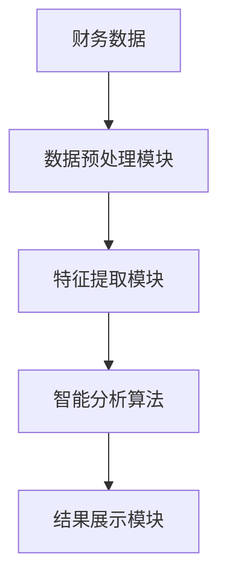
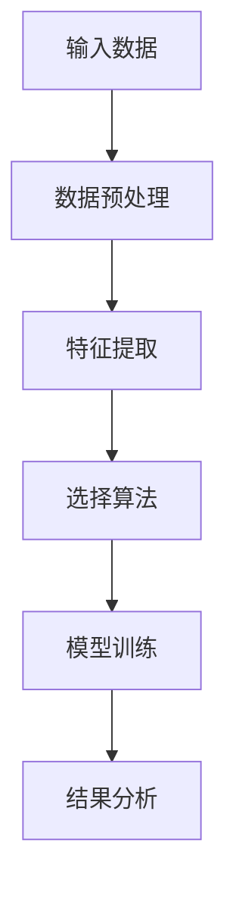
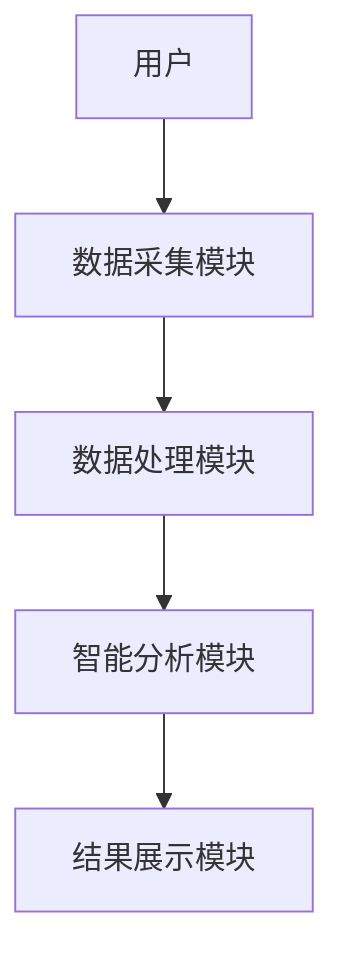

                 


# 智能财务报表比较分析系统

> 关键词：智能财务，财务分析，机器学习，数据处理，可视化

> 摘要：本文详细探讨智能财务报表比较分析系统的构建与实现，从背景介绍、核心概念、算法原理、系统架构到项目实战，全面剖析系统的各个方面，为读者提供深入的技术见解。

---

# 第一部分: 背景介绍

## 第1章: 问题背景

### 1.1 传统财务报表分析的局限性
传统财务报表分析主要依赖人工操作，存在效率低、易出错、难以处理大规模数据等问题。企业面对海量财务数据时，人工分析不仅耗时，还容易因疏忽导致错误，难以满足现代财务管理的需求。

### 1.2 智能化分析的需求驱动
随着企业数字化转型的推进，对高效、精准的财务分析工具的需求日益增长。智能财务报表比较分析系统通过自动化处理和智能算法，能够快速提取关键信息，帮助决策者做出更明智的判断。

### 1.3 企业财务管理的数字化转型
企业财务管理正在从传统的人工模式向数字化、智能化方向转变。智能财务报表比较分析系统作为这一转型的重要工具，能够显著提升财务分析的效率和准确性。

---

## 第2章: 问题解决

### 2.1 智能化财务分析的核心目标
通过智能算法和大数据技术，实现财务报表的自动化分析、比较和预测，帮助用户快速获取关键信息，支持决策。

### 2.2 系统化解决方案的提出
构建一个集数据采集、预处理、智能分析和结果展示于一体的系统，涵盖从数据输入到结果输出的全生命周期管理。

### 2.3 系统的边界与外延
系统专注于财务报表的分析与比较，不涉及财务数据的录入和生成，但可以与其他财务管理系统进行集成。

---

# 第二部分: 核心概念与联系

## 第3章: 核心概念

### 3.1 智能财务报表比较分析系统的原理
系统通过采集和预处理财务数据，提取关键特征，运用智能算法进行分析和比较，最后将结果以可视化形式展示给用户。

### 3.2 核心概念对比分析
| 比较维度 | 传统方法 | 智能方法 |
|----------|-----------|-----------|
| 效率     | 低        | 高        |
| 准确性   | 易出错     | 高        |
| 扩展性   | 差         | 好        |

### 3.3 实体关系图


---

# 第三部分: 算法原理讲解

## 第4章: 数据预处理算法

### 4.1 数据清洗流程
1. 去除重复数据
2. 处理缺失值
3. 标准化数据格式

### 4.2 数据标准化方法
$$
z = \frac{x - \mu}{\sigma}
$$
其中，$\mu$ 是均值，$\sigma$ 是标准差。

### 4.3 特征提取技术
使用主成分分析（PCA）提取关键特征：
$$
Y = X \cdot W
$$

## 第5章: 智能分析算法

### 5.1 机器学习算法选择
- 分类算法：随机森林、支持向量机（SVM）
- 聚类算法：K-means

### 5.2 算法流程图


### 5.3 分类算法数学模型
$$
L(\theta) = -\sum_{i=1}^{n} [y_i \log p(y_i) + (1-y_i)\log(1-p(y_i))]
$$
其中，$p(y_i)$ 是预测概率，$y_i$ 是真实标签。

---

# 第四部分: 系统分析与架构设计

## 第6章: 系统架构设计

### 6.1 系统功能设计
- 数据采集模块
- 数据处理模块
- 智能分析模块
- 结果展示模块

### 6.2 系统架构图


### 6.3 系统接口设计
- 数据接口：RESTful API
- 用户界面：Web 界面

---

# 第五部分: 项目实战

## 第7章: 环境安装与核心代码

### 7.1 环境安装
安装 Python 和相关库：
```
pip install numpy pandas scikit-learn
```

### 7.2 核心代码实现
```python
import pandas as pd
from sklearn.ensemble import RandomForestClassifier
from sklearn.metrics import accuracy_score

# 数据加载
data = pd.read_csv('financial_data.csv')

# 数据预处理
data.dropna()
data = data.drop_duplicates()

# 特征提取
X = data.drop(columns=['label'])
y = data['label']

# 模型训练
model = RandomForestClassifier()
model.fit(X, y)

# 模型预测
y_pred = model.predict(X)
print("准确率：", accuracy_score(y, y_pred))
```

---

## 第8章: 项目案例分析

### 8.1 案例背景
分析制造业的财务数据，识别潜在的财务风险。

### 8.2 数据分析结果
通过模型预测，发现某些财务指标异常，提示企业可能存在潜在风险。

### 8.3 案例小结
智能系统能够快速识别异常，帮助财务部门及时采取措施，降低风险。

---

# 第六部分: 最佳实践与总结

## 第9章: 最佳实践

### 9.1 数据预处理的重要性
确保数据质量是系统准确性的基础。

### 9.2 模型调优技巧
- 调整超参数
- 使用交叉验证

### 9.3 系统安全性
保护财务数据的安全，防止数据泄露。

---

## 第10章: 小结

智能财务报表比较分析系统通过自动化处理和智能算法，显著提升了财务分析的效率和准确性。本文详细探讨了系统的构建过程，从理论到实践，为读者提供了全面的技术指导。

---

# 结语

智能财务报表比较分析系统是企业数字化转型的重要工具，其应用将推动财务管理迈向新的高度。

---

# 作者

作者：AI天才研究院 & 禅与计算机程序设计艺术

