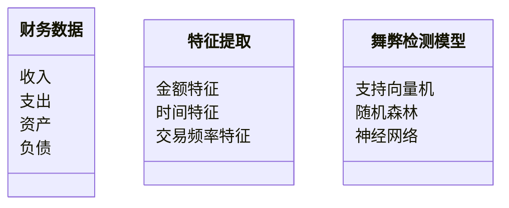

                 


# 智能财务舞弊检测系统

## 关键词
智能财务舞弊检测系统，人工智能，机器学习，系统架构，智能审计，反欺诈系统

## 摘要
随着企业规模的不断扩大和财务复杂性的增加，财务舞弊问题日益严重。传统的财务舞弊检测方法依赖于人工审核和经验判断，效率低下且容易受到主观因素的影响。为了提高财务舞弊检测的效率和准确性，智能财务舞弊检测系统应运而生。本文将探讨如何利用人工智能技术构建智能财务舞弊检测系统，分析其核心算法原理、系统架构设计及实际应用场景，为企业提供一种高效可靠的财务舞弊检测解决方案。

---

# 第一部分: 智能财务舞弊检测系统概述

## 第1章: 智能财务舞弊检测系统背景介绍

### 1.1 财务舞弊的基本概念
#### 1.1.1 财务舞弊的定义与分类
财务舞弊是指通过故意虚构、篡改或隐匿财务信息，以达到骗取资金、逃避债务或其他非法目的的行为。常见的财务舞弊形式包括虚构交易、虚增收入、隐瞒支出、虚减负债等。根据舞弊主体的不同，可以分为管理层舞弊、员工舞弊和第三方舞弊。

#### 1.1.2 财务舞弊的常见形式与特征
- **虚构交易**：通过编造交易记录，虚增收入或虚减支出。
- **虚增收入**：通过夸大收入或提前确认收入，虚增财务报表中的收入。
- **隐瞒支出**：通过漏记或延迟记录支出，虚减财务报表中的支出。
- **虚减负债**：通过隐瞒或虚减负债，虚增资产或净资产。
- **虚假关联交易**：通过与关联方进行不公允的交易，转移资产或利润。

#### 1.1.3 财务舞弊对企业的影响
- 损害企业利益，导致资产流失。
- 影响企业信誉，降低投资者信心。
- 增加企业经营风险，可能导致法律追究。

### 1.2 人工智能技术的发展与应用
#### 1.2.1 人工智能技术的演进历程
人工智能（Artificial Intelligence，AI）技术经历了从规则驱动到数据驱动的演变。近年来，随着深度学习（Deep Learning）的崛起，AI技术在自然语言处理、图像识别、语音识别等领域取得了显著进展。

#### 1.2.2 人工智能在财务领域的应用现状
人工智能技术在财务领域的应用主要包括智能记账、智能报账、智能审计、智能风控等。其中，智能审计和智能风控是当前研究的热点。

#### 1.2.3 智能财务舞弊检测系统的概念与意义
智能财务舞弊检测系统是一种结合人工智能技术的财务舞弊检测系统，通过机器学习算法对财务数据进行分析，识别潜在的舞弊行为。其意义在于提高舞弊检测的效率和准确性，降低企业财务风险。

### 1.3 智能财务舞弊检测系统的背景与需求
#### 1.3.1 财务舞弊检测的传统方法与局限性
传统的财务舞弊检测方法主要依赖于人工审核和经验判断，存在以下局限性：
- **效率低**：人工审核耗时耗力，难以应对海量数据。
- **主观性强**：依赖审核人员的经验和判断，存在人为误差。
- **覆盖面有限**：难以覆盖所有可能的舞弊形式。

#### 1.3.2 人工智能技术在财务舞弊检测中的优势
- **高效性**：机器学习算法可以快速处理海量数据，提高检测效率。
- **准确性**：通过数据分析和模式识别，降低人为误差。
- **全面性**：可以覆盖多种舞弊形式，发现潜在的舞弊行为。

#### 1.3.3 智能财务舞弊检测系统的建设需求
随着企业对财务数据的依赖增加，建立智能财务舞弊检测系统已成为企业风险管理的重要手段。通过自动化、智能化的舞弊检测，企业可以更好地保护自身利益，提升财务管理水平。

### 1.4 本章小结
本章介绍了财务舞弊的基本概念、人工智能技术的发展与应用，以及智能财务舞弊检测系统的背景与需求。通过分析传统舞弊检测方法的局限性，指出了人工智能技术在财务舞弊检测中的优势和建设需求。

---

# 第二部分: 智能财务舞弊检测系统的核心概念与技术

## 第2章: 智能财务舞弊检测系统的核心概念

### 2.1 智能财务舞弊检测系统的定义与组成
#### 2.1.1 系统的定义
智能财务舞弊检测系统是一种利用人工智能技术，对财务数据进行分析和挖掘，识别潜在舞弊行为的系统。

#### 2.1.2 系统的核心组成要素
- **数据采集模块**：负责采集财务数据，包括收入、支出、资产、负债等。
- **数据预处理模块**：对数据进行清洗、转换和标准化，确保数据质量。
- **特征提取模块**：从财务数据中提取特征，如金额、时间、交易频率等。
- **模型训练模块**：利用机器学习算法对特征数据进行训练，构建舞弊检测模型。
- **结果分析模块**：对模型输出的结果进行分析，识别潜在舞弊行为。

#### 2.1.3 系统的输入输出关系
- **输入**：财务数据、历史舞弊案例数据。
- **输出**：潜在舞弊行为的预警信息。

### 2.2 财务数据特征与舞弊检测的关系
#### 2.2.1 财务数据的特征分析
- **金额特征**：交易金额的异常性，如远高于或低于正常水平。
- **时间特征**：交易时间的集中性，如集中在特定时间段。
- **交易频率特征**：交易频率的异常性，如短时间内频繁交易。
- **关联性特征**：交易之间的关联性，如关联交易频繁或金额异常。

#### 2.2.2 舞弊行为与财务数据特征的关联性
- **虚构交易**：交易金额虚高，时间集中。
- **虚增收入**：收入金额虚高，时间集中。
- **隐瞒支出**：支出金额虚低，时间分散。
- **虚减负债**：负债金额虚低，时间分散。

#### 2.2.3 数据特征对舞弊检测的影响
- **异常特征**：能够帮助识别潜在舞弊行为。
- **正常特征**：可以帮助排除正常交易。

### 2.3 人工智能技术在舞弊检测中的应用原理
#### 2.3.1 机器学习在财务舞弊检测中的作用
机器学习通过数据分析和模式识别，能够发现数据中的异常模式，从而识别潜在舞弊行为。

#### 2.3.2 深度学习在舞弊检测中的优势
深度学习通过多层神经网络结构，能够自动提取数据特征，适用于复杂的数据模式识别。

#### 2.3.3 自然语言处理在财务文本分析中的应用
自然语言处理技术可以对财务报表中的文本信息进行分析，识别潜在的舞弊行为。

### 2.4 本章小结
本章介绍了智能财务舞弊检测系统的核心概念，分析了财务数据特征与舞弊检测的关系，并探讨了人工智能技术在舞弊检测中的应用原理。

---

# 第三部分: 智能财务舞弊检测系统的算法原理

## 第3章: 常见的机器学习算法及其应用

### 3.1 支持向量机（SVM）在舞弊检测中的应用
#### 3.1.1 SVM算法的基本原理
支持向量机（Support Vector Machine，SVM）是一种监督学习算法，通过构建超平面将数据分为两类。

#### 3.1.2 SVM算法的数学模型
$$ \text{目标函数：} \min_{w,b,\xi} \frac{1}{2}||w||^2 + C\sum_{i=1}^n \xi_i $$
$$ \text{约束条件：} y_i(w \cdot x_i + b) \geq 1 - \xi_i $$
$$ \xi_i \geq 0 $$

#### 3.1.3 SVM在财务舞弊检测中的实现流程
1. 数据预处理：清洗、标准化。
2. 特征提取：提取财务数据特征。
3. 模型训练：利用SVM算法训练舞弊检测模型。
4. 模型预测：对新数据进行预测，识别潜在舞弊行为。

### 3.2 随机森林（Random Forest）在舞弊检测中的应用
#### 3.2.1 随机森林算法的基本原理
随机森林是一种基于决策树的集成学习算法，通过构建多棵决策树，集成出一个强分类器。

#### 3.2.2 随机森林算法的数学模型
$$ \text{预测结果：} f(x) = \frac{1}{n}\sum_{i=1}^n h_i(x) $$
其中，$h_i$表示第i棵决策树的预测结果，$n$为决策树的数量。

#### 3.2.3 随机森林在财务舞弊检测中的实现流程
1. 数据预处理：清洗、标准化。
2. 特征提取：提取财务数据特征。
3. 模型训练：利用随机森林算法训练舞弊检测模型。
4. 模型预测：对新数据进行预测，识别潜在舞弊行为。

### 3.3 神经网络（Neural Network）在舞弊检测中的应用
#### 3.3.1 神经网络算法的基本原理
神经网络是一种模仿人脑结构和功能的算法，通过多层神经元网络结构进行数据特征提取和分类。

#### 3.3.2 神经网络算法的数学模型
$$ \text{输入层：} x $$
$$ \text{隐藏层：} h = \sigma(w_1x + b_1) $$
$$ \text{输出层：} y = \sigma(w_2h + b_2) $$
其中，$\sigma$表示激活函数，如ReLU或Sigmoid。

#### 3.3.3 神经网络在财务舞弊检测中的实现流程
1. 数据预处理：清洗、标准化。
2. 特征提取：提取财务数据特征。
3. 模型训练：利用神经网络算法训练舞弊检测模型。
4. 模型预测：对新数据进行预测，识别潜在舞弊行为。

### 3.4 本章小结
本章介绍了常见的机器学习算法在财务舞弊检测中的应用，包括支持向量机、随机森林和神经网络。通过分析这些算法的原理和实现流程，可以看出机器学习在财务舞弊检测中的巨大潜力。

---

# 第四部分: 智能财务舞弊检测系统的系统架构与设计

## 第4章: 系统架构设计

### 4.1 系统架构设计
#### 4.1.1 系统功能模块设计
- **数据采集模块**：负责采集财务数据。
- **数据预处理模块**：对数据进行清洗、转换和标准化。
- **特征提取模块**：从数据中提取特征。
- **模型训练模块**：利用机器学习算法训练舞弊检测模型。
- **结果分析模块**：对模型输出的结果进行分析，识别潜在舞弊行为。

#### 4.1.2 系统架构的Mermaid图
```mermaid
graph TD
A[数据采集] -> B[数据预处理]
B -> C[特征提取]
C -> D[模型训练]
D -> E[结果分析]
```

### 4.2 系统功能设计
#### 4.2.1 领域模型的Mermaid类图


#### 4.2.2 系统架构的Mermaid架构图


#### 4.2.3 系统接口设计
- **数据接口**：与财务系统对接，获取财务数据。
- **模型接口**：与机器学习框架对接，训练舞弊检测模型。
- **结果接口**：向用户展示舞弊检测结果。

#### 4.2.4 系统交互的Mermaid序列图
```mermaid
sequenceDiagram
    客户端 -> 中间件: 发送数据请求
    中间件 -> 数据库: 查询财务数据
    数据库 -> 中间件: 返回财务数据
    中间件 -> 特征提取模块: 提取数据特征
    特征提取模块 -> 中间件: 返回特征数据
    中间件 -> 模型训练模块: 训练舞弊检测模型
    模型训练模块 -> 中间件: 返回训练好的模型
    中间件 -> 结果分析模块: 分析模型结果
    结果分析模块 -> 客户端: 返回舞弊检测结果
```

### 4.3 本章小结
本章设计了智能财务舞弊检测系统的系统架构，包括功能模块设计、系统架构图、接口设计和交互流程设计，为系统的实现提供了理论基础。

---

## 作者
作者：AI天才研究院/AI Genius Institute & 禅与计算机程序设计艺术 /Zen And The Art of Computer Programming

---

以上是《智能财务舞弊检测系统》的技术博客文章的完整目录大纲和部分内容示例。希望这篇博客能够为读者提供清晰的思路和深入的技术分析。

