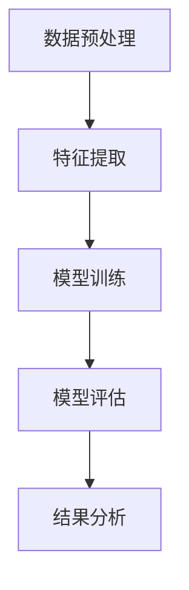
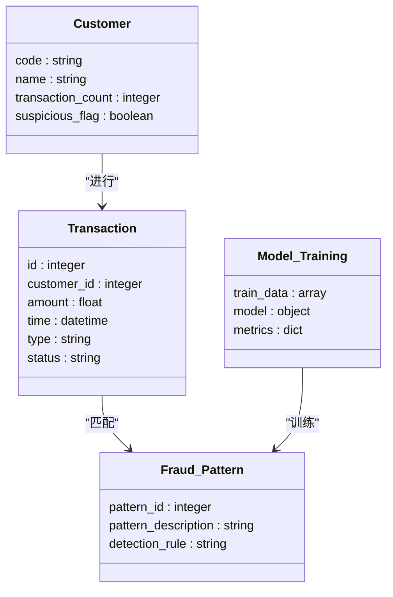
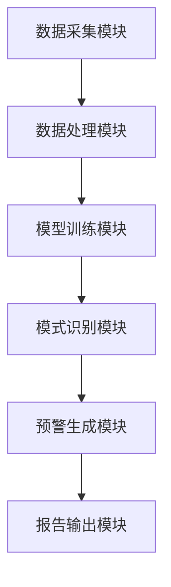
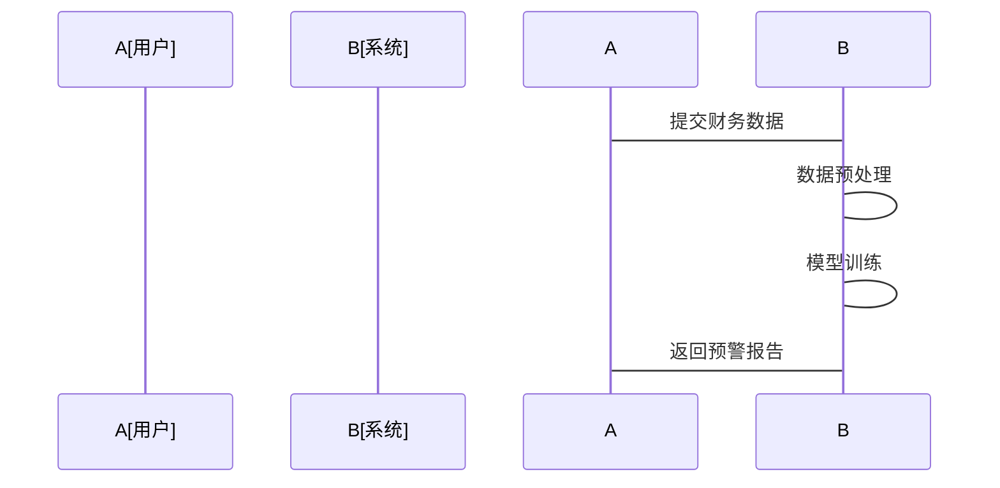

                 


# 智能财务舞弊模式识别系统

> 关键词：智能财务、舞弊模式识别、人工智能、大数据分析、系统架构

> 摘要：本文探讨了智能财务舞弊模式识别系统的核心概念、算法原理、系统架构及项目实现。通过分析财务舞弊的背景、核心概念与联系、算法原理、系统架构设计、项目实战，最终总结出智能财务舞弊模式识别系统的最佳实践。本文旨在帮助读者全面理解财务舞弊模式识别的原理与实践，提供从理论到实践的系统性解决方案。

---

# 第一部分: 智能财务舞弊模式识别系统背景与概念

# 第1章: 财务舞弊模式识别的背景与问题

## 1.1 问题背景
### 1.1.1 财务舞弊的定义与特征
- 财务舞弊是指企业或个人在财务活动中通过虚假陈述、欺诈行为或其他非法手段，故意歪曲财务信息或数据的行为。
- 财务舞弊的特征包括隐蔽性、复杂性、多样性和技术性。

### 1.1.2 财务舞弊对企业的影响
- 财务舞弊可能导致企业资产损失、声誉损害、法律风险和监管处罚。
- 财务舞弊会影响企业的正常经营和财务管理秩序。

### 1.1.3 传统财务舞弊识别的局限性
- 传统财务舞弊识别方法依赖人工审核，效率低且易受主观因素影响。
- 传统方法难以应对日益复杂的舞弊手段和多样化舞弊模式。

## 1.2 问题描述
### 1.2.1 财务舞弊模式识别的核心目标
- 通过智能技术识别财务数据中的异常模式，及时发现潜在的舞弊行为。
- 提供高精度、高效率的财务舞弊识别方法。

### 1.2.2 财务舞弊模式识别的关键挑战
- 数据量大、数据复杂性高，传统方法难以应对。
- 舞弊手段多样，模式识别模型需要具备高适应性。
- 数据隐私和安全问题，要求系统具备强安全性。

### 1.2.3 财务舞弊模式识别的边界与外延
- 边界：限定在财务数据范围内，关注舞弊行为的识别。
- 外延：结合其他领域数据（如业务数据、行为数据）进行综合分析。

## 1.3 问题解决思路
### 1.3.1 数据驱动的财务舞弊识别方法
- 利用大数据技术对财务数据进行深度挖掘和分析。
- 通过数据建模和机器学习算法识别异常模式。

### 1.3.2 智能化技术在财务舞弊识别中的应用
- 使用人工智能技术（如深度学习、自然语言处理）进行智能识别。
- 应用图像识别技术对财务文档进行自动分析。

### 1.3.3 财务舞弊模式识别的系统性解决方案
- 构建多维度数据采集与分析系统。
- 建立智能化的模式识别模型。
- 实现高效的系统架构设计。

## 1.4 概念结构与核心要素
### 1.4.1 财务舞弊模式识别的核心要素
- 数据采集：获取财务数据、业务数据、行为数据等多源数据。
- 数据预处理：清洗、转换和特征提取。
- 模型训练：构建分类、聚类或深度学习模型。
- 结果分析：识别舞弊模式并生成预警报告。

### 1.4.2 财务舞弊模式识别的系统架构
- 数据层：数据采集、存储与管理。
- 计算层：数据预处理、特征提取与建模。
- 应用层：模式识别、预警与报告生成。

### 1.4.3 财务舞弊模式识别的流程框架
- 数据采集：从企业财务系统、业务系统等多源数据源获取数据。
- 数据预处理：清洗数据、提取特征、处理缺失值。
- 模型训练：基于机器学习或深度学习算法训练模式识别模型。
- 模型评估：验证模型准确率、召回率等指标。
- 应用部署：将模型部署到生产环境，实时监控财务数据。

## 1.5 本章小结
- 本章介绍了财务舞弊模式识别的背景、问题描述、解决思路及核心要素。
- 强调了数据驱动和智能化技术在财务舞弊识别中的重要性。
- 为后续章节的深入分析奠定了基础。

---

# 第二部分: 智能财务舞弊模式识别的核心概念与联系

# 第2章: 财务舞弊模式识别的核心概念

## 2.1 财务舞弊模式识别的原理
### 2.1.1 财务舞弊模式识别的基本原理
- 基于机器学习的分类、聚类或异常检测算法，识别财务数据中的异常模式。
- 利用深度学习技术（如LSTM、CNN）捕捉复杂舞弊模式。

### 2.1.2 财务舞弊模式识别的关键技术
- 分类算法：如随机森林、支持向量机（SVM）。
- 聚类算法：如K-means、DBSCAN。
- 异常检测算法：如孤立森林（Isolation Forest）、自动编码器（Autoencoder）。
- 深度学习模型：如LSTM、Transformer。

### 2.1.3 财务舞弊模式识别的数学模型
- 分类模型：逻辑回归、随机森林、SVM。
- 聚类模型：K-means、DBSCAN。
- 异常检测模型：孤立森林、自动编码器。
- 深度学习模型：LSTM、Transformer。

## 2.2 核心概念的特征对比
### 2.2.1 财务数据特征的分类与对比
- 财务数据特征包括金额、时间、交易频率、交易类型等。
- 不同特征在不同舞弊模式中的表现不同。

### 2.2.2 财务舞弊特征的识别与分析
- 舞弊特征包括异常交易、金额波动、交易时间集中等。
- 不同舞弊类型（如虚增收入、虚减费用）的特征差异。

### 2.2.3 财务舞弊模式的特征提取方法
- 统计特征：均值、方差、偏度等。
- 时间序列特征：周期性、趋势性、波动性。
- 文本特征：关键词提取、语义分析。

## 2.3 ER实体关系图架构
### 2.3.1 财务舞弊模式识别的实体关系图
```mermaid
erDiagram
    customer[CUSTOMER] {
        code : string
        name : string
        transaction_count : integer
        suspicious_flag : boolean
    }
    transaction[TRANSACTION] {
        id : integer
        customer_id : integer
        amount : float
        time : datetime
        type : string
        status : string
    }
    fraud_pattern[FRAUD_PATTERN] {
        pattern_id : integer
        pattern_description : string
        detection_rule : string
    }
    CUSTOMER --> TRANSACTION : "进行"
    TRANSACTION --> FRAUD_PATTERN : "匹配"
```

### 2.3.2 实体关系图的构建与分析
- CUSTOMER表：记录客户信息，包括客户代码、名称、交易次数、可疑标志等。
- TRANSACTION表：记录交易信息，包括交易ID、客户ID、金额、时间、类型、状态等。
- FRAUD_PATTERN表：记录舞弊模式，包括模式ID、模式描述、检测规则等。

### 2.3.3 实体关系图与模式识别的关系
- 实体关系图用于构建数据模型，为模式识别提供数据基础。
- 模式识别算法基于实体关系图中的数据进行分析和建模。

## 2.4 本章小结
- 本章分析了财务舞弊模式识别的核心概念和特征对比。
- 通过ER实体关系图展示了数据模型与模式识别的关系。
- 为后续算法实现提供了数据基础。

---

# 第三部分: 智能财务舞弊模式识别的算法原理

# 第3章: 财务舞弊模式识别的算法原理

## 3.1 算法原理概述
### 3.1.1 算法选择与比较
- 分类算法：随机森林、SVM。
- 聚类算法：K-means、DBSCAN。
- 异常检测算法：孤立森林、自动编码器。
- 深度学习模型：LSTM、Transformer。

### 3.1.2 算法优缺点对比
- 分类算法：适合已知舞弊类型，需要大量标注数据。
- 聚类算法：适用于未知舞弊模式的发现。
- 异常检测算法：适合实时监控，无需标注数据。
- 深度学习模型：适合复杂模式识别，但需要大量数据和计算资源。

### 3.1.3 算法的适用场景
- 分类算法：已知舞弊类型，有大量标注数据。
- 聚类算法：发现未知舞弊模式。
- 异常检测算法：实时监控和预警。
- 深度学习模型：复杂舞弊模式识别。

## 3.2 算法实现与流程
### 3.2.1 数据预处理
```python
# 数据清洗
data = data.dropna()
data = data.drop_duplicates()

# 特征提取
from sklearn.preprocessing import StandardScaler
scaler = StandardScaler()
scaled_data = scaler.fit_transform(data)
```

### 3.2.2 模型训练
```python
# 使用随机森林进行分类
from sklearn.ensemble import RandomForestClassifier
model = RandomForestClassifier(n_estimators=100, random_state=42)
model.fit(X_train, y_train)
```

### 3.2.3 模型评估
```python
# 评估准确率、召回率和F1分数
from sklearn.metrics import accuracy_score, recall_score, f1_score
y_pred = model.predict(X_test)
print(f"Accuracy: {accuracy_score(y_test, y_pred)}")
print(f"Recall: {recall_score(y_test, y_pred)}")
print(f"F1 Score: {f1_score(y_test, y_pred)}")
```

### 3.2.4 算法流程图


## 3.3 数学公式与模型解释
### 3.3.1 随机森林的数学模型
- 样本内误差估计：使用Oob（Out-of-bag）误差估计模型性能。
- 特征重要性：通过特征的分裂增益计算特征重要性。

### 3.3.2 支持向量机的数学模型
- 最大-margin分类：找到最优超平面，最大化类别间隔。
- 核函数：通过核函数将低维数据映射到高维空间，处理非线性可分问题。

### 3.3.3 深度学习模型的数学基础
- 神经网络：通过多层神经网络逼近复杂函数，捕捉数据中的非线性特征。
- LSTM：长短期记忆网络，适合时间序列数据的建模。

## 3.4 算法实现与优化
### 3.4.1 算法实现
```python
# 使用LSTM进行异常检测
import tensorflow as tf
from tensorflow.keras.layers import LSTM, Dense, Dropout
from tensorflow.keras.models import Sequential

model = Sequential()
model.add(LSTM(64, input_shape=(timesteps, features)))
model.add(Dropout(0.5))
model.add(Dense(1, activation='sigmoid'))
model.compile(loss='binary_crossentropy', optimizer='adam', metrics=['accuracy'])
model.fit(X_train, y_train, epochs=10, batch_size=32)
```

### 3.4.2 算法优化
- 参数调优：调整模型参数（如学习率、批次大小、神经网络层数）。
- 正则化：使用L1/L2正则化防止过拟合。
- 交叉验证：使用k折交叉验证评估模型性能。

## 3.5 本章小结
- 本章详细讲解了财务舞弊模式识别算法的原理与实现。
- 对比了不同算法的优缺点，分析了适用场景。
- 通过Python代码展示了算法实现，并给出了优化建议。

---

# 第四部分: 智能财务舞弊模式识别的系统架构

# 第4章: 系统架构设计与实现

## 4.1 系统分析与需求设计
### 4.1.1 问题场景介绍
- 系统目标：实时监控财务数据，识别舞弊模式。
- 使用场景：企业财务部门、审计部门、监管机构。

### 4.1.2 项目介绍
- 项目目标：构建智能财务舞弊模式识别系统。
- 项目范围：涵盖财务数据采集、处理、分析和预警。

## 4.2 系统功能设计
### 4.2.1 领域模型类图


### 4.2.2 系统架构设计


### 4.2.3 系统接口设计
- 数据接口：提供API用于数据导入和导出。
- 模型接口：提供API用于模型训练和预测。
- 预警接口：提供API用于预警信息的推送。

### 4.2.4 系统交互设计


## 4.3 系统实现与优化
### 4.3.1 系统实现
- 数据采集模块：从数据库中读取财务数据。
- 数据处理模块：清洗、转换和特征提取。
- 模型训练模块：训练分类、聚类或深度学习模型。
- 模式识别模块：识别舞弊模式并生成预警。
- 报告输出模块：输出预警报告和分析结果。

### 4.3.2 系统优化
- 数据存储优化：使用分布式数据库提高数据访问效率。
- 模型优化：通过参数调优和模型压缩提高预测精度。
- 系统性能优化：通过并行计算和异步处理提高系统响应速度。

## 4.4 本章小结
- 本章详细描述了智能财务舞弊模式识别系统的架构设计与实现。
- 通过类图和流程图展示了系统的模块划分和交互流程。
- 分析了系统实现的关键模块和优化方法。

---

# 第五部分: 智能财务舞弊模式识别的项目实战

# 第5章: 项目实战与案例分析

## 5.1 环境安装与配置
### 5.1.1 环境要求
- 操作系统：Linux/Windows/MacOS
- Python版本：3.6+
- 依赖库：numpy、pandas、scikit-learn、tensorflow、mermaid、matplotlib

### 5.1.2 环境配置
```bash
pip install numpy pandas scikit-learn tensorflow mermaid matplotlib
```

## 5.2 系统核心实现
### 5.2.1 数据采集与预处理
```python
import pandas as pd
from sklearn.preprocessing import StandardScaler

# 数据加载
data = pd.read_csv('financial_data.csv')

# 数据清洗
data = data.dropna()
data = data.drop_duplicates()

# 特征提取
features = data[['amount', 'time', 'type']]
labels = data['is_fraud']
```

### 5.2.2 模型训练与评估
```python
from sklearn.ensemble import RandomForestClassifier
from sklearn.metrics import accuracy_score, recall_score, f1_score

# 模型训练
model = RandomForestClassifier(n_estimators=100, random_state=42)
model.fit(features, labels)

# 模型预测
y_pred = model.predict(features)
print(f"Accuracy: {accuracy_score(labels, y_pred)}")
print(f"Recall: {recall_score(labels, y_pred)}")
print(f"F1 Score: {f1_score(labels, y_pred)}")
```

### 5.2.3 代码解读与分析
- 数据加载：使用pandas读取CSV文件。
- 数据清洗：删除缺失值和重复值。
- 特征提取：选择金额、时间、交易类型作为特征。
- 模型训练：使用随机森林分类器进行训练。
- 模型评估：计算准确率、召回率和F1分数。

## 5.3 实际案例分析
### 5.3.1 案例背景
- 某企业财务数据中存在虚增收入的舞弊行为。
- 数据包括交易金额、时间、类型等特征。

### 5.3.2 案例分析与解读
- 数据预处理：清洗数据并提取特征。
- 模型训练：训练随机森林分类器。
- 模型预测：识别出异常交易并生成预警报告。

### 5.3.3 案例总结
- 通过智能财务舞弊模式识别系统，成功识别出虚增收入的舞弊行为。
- 系统准确率高、召回率高，有效降低了财务舞弊风险。

## 5.4 本章小结
- 本章通过实际案例展示了智能财务舞弊模式识别系统的实现过程。
- 从数据采集到模型训练，再到结果分析，详细解读了系统的实战应用。
- 为读者提供了从理论到实践的系统性指导。

---

# 第六部分: 智能财务舞弊模式识别的最佳实践

# 第6章: 最佳实践与经验总结

## 6.1 小结
- 本文详细探讨了智能财务舞弊模式识别系统的背景、核心概念、算法原理、系统架构及项目实现。
- 通过理论分析和实际案例，展示了如何利用人工智能技术识别财务舞弊模式。

## 6.2 注意事项
- 数据质量：确保数据的完整性和准确性。
- 模型调优：通过参数优化和模型选择提高预测精度。
- 数据隐私：严格遵守数据隐私保护法规，确保数据安全。

## 6.3 拓展阅读
- 推荐阅读《机器学习实战》、《深度学习》等书籍，深入理解机器学习和深度学习算法。
- 关注财务舞弊识别领域的最新研究和技术进展。

## 6.4 本章小结
- 本文总结了智能财务舞弊模式识别系统的最佳实践。
- 提供了数据质量、模型调优和数据隐私等方面的注意事项。
- 为读者提供了拓展阅读的方向，帮助深入学习相关知识。

---

# 作者：AI天才研究院/AI Genius Institute & 禅与计算机程序设计艺术/Zen And The Art of Computer Programming

