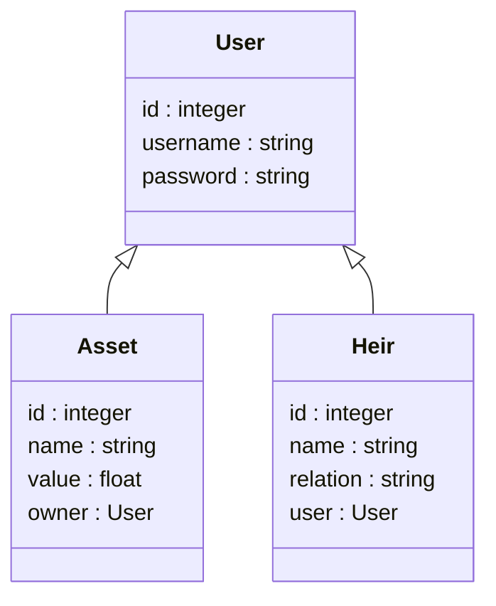
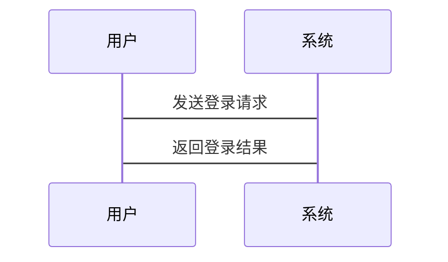
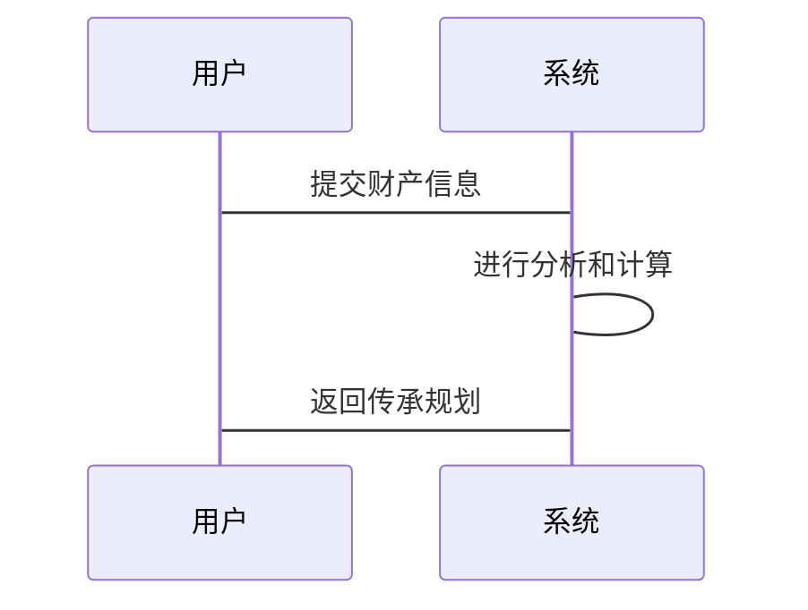

                 


# 第一部分: 智能财富传承规划工具的背景与概念

# 第1章: 智能财富传承规划工具的背景与需求

## 1.1 财富传承的历史演变
### 1.1.1 传统财富传承方式的局限性
- 手工记录和管理的低效性
- 易出错性和不准确性
- 信息更新和维护的困难

### 1.1.2 现代财富传承的需求变化
- 财产种类的多样化
- 继承人关系的复杂化
- 法律法规的不断变化

### 1.1.3 智能化传承的必要性
- 高效性：快速处理大量数据
- 准确性：减少人为错误
- 灵活性：适应复杂和变化的场景

## 1.2 智能财富传承规划工具的定义与特点
### 1.2.1 工具的定义
- 利用人工智能和大数据技术，辅助用户进行财富传承规划的工具

### 1.2.2 工具的核心特点
- 智能化：通过AI算法自动分析和推荐
- 个性化：根据用户具体情况定制方案
- 实时性：及时更新和反馈

### 1.2.3 工具的适用场景与边界
- 适用于个人、家庭和企业
- 边界：不涉及实际法律执行，仅为规划建议

## 1.3 财富传承规划工具的核心要素
### 1.3.1 财产评估与分配模型
- 财产分类与估值
- 分配规则与优先级

### 1.3.2 风险评估与规避策略
- 风险识别
- 风险应对措施

### 1.3.3 继承人权益保护机制
- 权益分配
- 权益保障措施

## 1.4 本章小结
- 介绍了财富传承的历史演变和智能化的必要性
- 定义了智能财富传承规划工具并阐述了其特点
- 总结了工具的核心要素

# 第二部分: 智能财富传承规划工具的核心概念与联系

# 第2章: 智能财富传承规划工具的核心概念

## 2.1 AI在财富传承中的应用
### 2.1.1 人工智能在财产评估中的应用
- 自动分类与估值
- 数据挖掘与模式识别

### 2.1.2 机器学习在传承规划中的应用
- 预测模型
- 推荐系统

### 2.1.3 自然语言处理在法律文本分析中的应用
- 文本解析
- 情感分析

## 2.2 大数据技术在财富传承中的作用
### 2.2.1 数据收集与分析
- 数据来源
- 数据清洗与预处理

### 2.2.2 用户行为分析与个性化推荐
- 用户画像
- 推荐算法

### 2.2.3 市场趋势预测与资产配置
- 市场分析
- 资产配置建议

## 2.3 智能财富传承工具的系统架构
### 2.3.1 系统核心模块
- 数据采集模块
- 智能分析模块
- 用户交互模块

### 2.3.2 模块之间的关系与数据流
- 数据采集模块向智能分析模块提供数据
- 智能分析模块根据数据生成建议
- 用户交互模块将建议展示给用户

### 2.3.3 系统整体架构图
```mermaid
graph TD
    A[数据采集] -> B[智能分析]
    B -> C[用户交互]
    C -> D[用户]
```

# 第3章: 核心概念与联系的对比分析

## 3.1 智能财富传承工具与传统工具的对比
### 3.1.1 功能对比
| 功能 | 传统工具 | 智能工具 |
|------|----------|----------|
| 财产评估 | 手工记录 | AI自动评估 |
| 继承人管理 | 纸质记录 | 数据库管理 |
| 风险评估 | 人工分析 | AI自动分析 |

### 3.1.2 技术实现对比
- 传统工具：基于规则的简单逻辑
- 智能工具：基于机器学习的复杂模型

### 3.1.3 使用体验对比
- 传统工具：繁琐且容易出错
- 智能工具：高效且精准

## 3.2 智能财富传承工具的实体关系图
```mermaid
entity User {
    id: integer
    name: string
    age: integer
}

entity Asset {
    id: integer
    name: string
    value: float
    owner_id: integer
}

entity Heir {
    id: integer
    name: string
    relation: string
    user_id: integer
}

User -> Asset: owns
User -> Heir: has
Asset -> Heir: inherits
```

## 3.3 本章小结
- 对比分析了智能工具与传统工具在功能和实现上的差异
- 绘制了系统的实体关系图，明确了各实体之间的关系

# 第三部分: 智能财富传承规划工具的算法原理

# 第4章: 算法原理

## 4.1 机器学习算法在财富传承中的应用
### 4.1.1 分类算法
- 简单解释分类算法的基本原理
- 举例说明如何应用于继承人识别

### 4.1.2 回归算法
- 回归算法的数学模型
- 应用于财产价值预测的示例

## 4.2 自然语言处理在法律文本分析中的应用
### 4.2.1 分词与词性标注
- 使用Python的jieba库进行分词
- 代码示例：
```python
import jieba
text = "智能财富传承规划工具"
words = jieba.cut(text)
print(list(words))
```

### 4.2.2 情感分析
- 使用预训练的情感分析模型
- 代码示例：
```python
from transformers import pipeline
sentiment_pipeline = pipeline("sentiment-analysis")
result = sentiment_pipeline("这个工具非常有用")
print(result)
```

## 4.3 集成学习与模型优化
### 4.3.1 集成学习的基本原理
- bagging和boosting的区别
- 代码示例：
```python
from sklearn.ensemble import RandomForestClassifier
model = RandomForestClassifier(n_estimators=10)
model.fit(X_train, y_train)
print(model.score(X_test, y_test))
```

### 4.3.2 模型优化与调参
- 使用网格搜索进行参数优化
- 代码示例：
```python
from sklearn.model_selection import GridSearchCV
param_grid = {'n_estimators': [10, 20], 'max_depth': [None, 5]}
grid_search = GridSearchCV(RandomForestClassifier(), param_grid)
grid_search.fit(X_train, y_train)
best_params = grid_search.best_params_
print(best_params)
```

## 4.4 本章小结
- 详细讲解了机器学习和自然语言处理在工具中的应用
- 提供了具体的算法实现代码和优化方法

# 第四部分: 智能财富传承规划工具的系统分析与架构设计

# 第5章: 系统分析与架构设计

## 5.1 问题场景介绍
### 5.1.1 用户需求
- 系统需要支持多用户同时使用
- 提供个性化的传承规划建议
- 具备良好的用户界面和交互体验

### 5.1.2 功能模块
- 用户管理模块
- 资产评估模块
- 传承规划模块
- 报告生成模块

## 5.2 系统功能设计
### 5.2.1 领域模型类图


### 5.2.2 系统架构设计


### 5.2.3 系统接口设计
- 用户登录接口
- 财产评估接口
- 传承规划生成接口

## 5.3 系统交互设计
### 5.3.1 登录流程


### 5.3.2 传承规划生成流程


## 5.4 本章小结
- 分析了系统的需求和功能模块
- 绘制了系统的架构图和交互流程图

# 第五部分: 智能财富传承规划工具的项目实战

# 第6章: 项目实战

## 6.1 环境安装与配置
### 6.1.1 安装Python
- 下载并安装Python 3.8以上版本
- 配置环境变量

### 6.1.2 安装必要的库
- 使用pip安装numpy、pandas、scikit-learn等库
- 代码示例：
```bash
pip install numpy pandas scikit-learn
```

## 6.2 系统核心实现
### 6.2.1 数据预处理
- 加载数据
- 数据清洗
- 数据转换

### 6.2.2 模型训练
- 使用scikit-learn训练分类模型
- 代码示例：
```python
from sklearn.tree import DecisionTreeClassifier
model = DecisionTreeClassifier()
model.fit(X_train, y_train)
```

### 6.2.3 模型部署
- 将模型部署为API服务
- 使用Flask构建Web接口
- 代码示例：
```python
from flask import Flask, request, jsonify
app = Flask(__name__)
@app.route('/predict', methods=['POST'])
def predict():
    data = request.json
    prediction = model.predict([[data['feature']]])
    return jsonify({'result': prediction[0]})
```

## 6.3 实际案例分析
### 6.3.1 案例背景
- 某用户的财产状况
- 继承人关系

### 6.3.2 案例分析
- 数据分析
- 模型预测
- 生成传承规划

## 6.4 项目总结
### 6.4.1 项目经验
- 开发中的难点
- 解决方案
- 可优化的空间

## 6.4.2 注意事项
- 数据隐私保护
- 模型的持续优化
- 系统的可扩展性

## 6.4.3 拓展阅读
- 推荐相关技术书籍
- 提供进一步学习的资源

## 6.5 本章小结
- 详细讲解了项目的环境配置和核心实现
- 通过案例分析展示了工具的实际应用
- 总结了开发经验和注意事项

# 第六部分: 总结与展望

# 第7章: 总结与展望

## 7.1 最佳实践 tips
- 数据的准确性和完整性
- 模型的持续优化
- 用户体验的设计

## 7.2 未来展望
### 7.2.1 技术发展
- 更先进的AI算法
- 更强大的大数据分析能力

### 7.2.2 应用场景扩展
- 更多领域的应用
- 更个性化的服务

## 7.3 本章小结
- 总结了工具的开发和应用经验
- 展望了未来的发展方向

# 结束语

# 参考文献

# 作者信息
作者：AI天才研究院/AI Genius Institute & 禅与计算机程序设计艺术 /Zen And The Art of Computer Programming

---

**摘要：** 智能财富传承规划工具是一种结合人工智能和大数据技术的工具，旨在提高财富传承的效率和准确性。本文详细介绍了工具的背景、核心概念、算法原理、系统架构、项目实战以及总结与展望，为读者提供了全面的技术解析和实践指导。

**关键词：** 智能财富传承规划工具，人工智能，大数据，机器学习，自然语言处理，系统架构，项目实战

