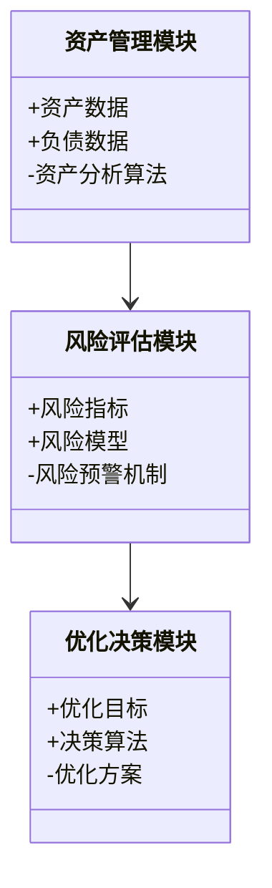

                 


# 智能资产负债管理工具

## 关键词
智能资产负债管理工具，人工智能，金融风险管理，资产负债表优化，大数据技术

## 摘要
智能资产负债管理工具通过整合人工智能、大数据和区块链等先进技术，优化企业资产负债表的管理。本文从背景、核心概念、算法原理、系统架构、项目实战和最佳实践等方面，全面解析智能资产负债管理工具的设计与应用，提供实践指导。

---

# 第一部分：智能资产负债管理工具的背景与概念

## 第1章：智能资产负债管理工具的定义与背景

### 1.1 资产负债管理的基本概念

#### 1.1.1 资产负债表的定义与作用
资产负债表是反映企业在某一特定时点的财务状况的重要报表，包括资产、负债和所有者权益三大部分。它是企业财务管理的核心工具，用于评估企业的财务健康状况。

#### 1.1.2 资产负债管理的核心目标
资产负债管理的核心目标在于优化资产和负债的结构，提高资产使用效率，降低负债成本，同时有效控制财务风险。

#### 1.1.3 智能化管理的必要性
随着金融市场的复杂化和数据量的爆炸式增长，传统的资产负债管理方式已难以满足企业的需求。智能化管理能够通过数据挖掘、机器学习等技术，提高决策效率和准确性。

---

### 1.2 智能资产负债管理工具的发展现状

#### 1.2.1 传统资产负债管理的局限性
传统资产负债管理主要依赖人工分析和经验判断，存在效率低、风险控制不足等问题。

#### 1.2.2 智能化技术在金融领域的应用趋势
人工智能、大数据和区块链等技术的快速发展，为智能资产负债管理提供了强有力的技术支持。越来越多的企业开始采用智能化工具进行资产负债管理。

#### 1.2.3 当前市场上的智能工具实例
目前市场上已有一些智能资产负债管理工具，例如通过机器学习模型预测资产风险、优化负债结构等。

---

### 1.3 智能资产负债管理工具的技术基础

#### 1.3.1 人工智能在金融领域的应用
人工智能技术，如机器学习和深度学习，被广泛应用于金融领域的风险评估、资产定价和投资决策等方面。

#### 1.3.2 大数据技术对资产负债管理的支撑
大数据技术能够帮助企业在海量数据中提取有价值的信息，为资产负债管理提供数据支持。

#### 1.3.3 区块链技术的潜在影响
区块链技术在金融领域的应用主要体现在提高交易透明度和安全性，未来可能在智能资产负债管理中发挥重要作用。

---

### 1.4 智能资产负债管理工具的核心目标

#### 1.4.1 提高资产配置效率
通过智能工具优化资产配置，提高资产的使用效率和回报率。

#### 1.4.2 优化负债结构
通过智能工具合理分配负债结构，降低负债成本，降低财务风险。

#### 1.4.3 风险管理与预警
利用智能工具进行风险评估和预警，及时发现和处理潜在的财务风险。

---

### 1.5 智能资产负债管理工具的实施意义

#### 1.5.1 提升企业财务决策能力
智能工具能够提供实时数据分析和决策支持，帮助企业做出更明智的财务决策。

#### 1.5.2 降低财务风险
通过智能工具进行风险评估和预警，能够有效降低企业的财务风险。

#### 1.5.3 提高企业运营效率
智能化管理能够提高资产负债管理的效率，减少人工操作的误差，提升整体运营效率。

---

## 第2章：智能资产负债管理工具的核心模块

### 2.1 智能分析模块

#### 2.1.1 数据采集与处理
智能分析模块需要采集企业内外部的财务数据，包括资产负债表、损益表等，并进行清洗和预处理。

#### 2.1.2 资产负债数据分析模型
通过构建数学模型，对资产和负债进行多维度分析，例如资产回报率、负债成本率等。

#### 2.1.3 数据可视化与报表生成
将分析结果以图表形式展示，并自动生成财务报表，方便企业管理者进行决策。

---

### 2.2 风险评估模块

#### 2.2.1 风险识别与评估方法
通过机器学习算法，对企业潜在的财务风险进行识别和评估，例如信用风险、市场风险等。

#### 2.2.2 风险预警机制
设置风险预警指标，当潜在风险超过预设阈值时，及时发出预警信号。

#### 2.2.3 风险应对策略
根据风险评估结果，制定相应的风险应对策略，例如调整资产配置、优化负债结构等。

---

### 2.3 优化决策模块

#### 2.3.1 资产负债结构优化
通过智能算法优化资产和负债的结构，例如调整资产的流动性、降低负债的成本等。

#### 2.3.2 资金流动预测
基于历史数据和市场趋势，预测未来的资金流动情况，为企业制定合理的财务计划。

#### 2.3.3 决策支持系统
提供决策支持，包括最优资产配置建议、风险控制策略等。

---

## 第3章：智能资产负债管理工具的算法原理

### 3.1 机器学习算法在资产负债管理中的应用

#### 3.1.1 线性回归模型
线性回归模型可以用于预测资产和负债之间的关系，例如负债与资产回报率的关系。

#### 3.1.2 随机森林模型
随机森林模型能够处理高维数据，适合用于资产和负债的风险评估和分类。

---

### 3.2 算法实现与代码示例

#### 3.2.1 线性回归模型的数学模型
线性回归模型的数学表达式为：
$$ y = \beta_0 + \beta_1 x + \epsilon $$
其中，$y$ 是目标变量，$x$ 是自变量，$\beta_0$ 和 $\beta_1$ 是回归系数，$\epsilon$ 是误差项。

#### 3.2.2 线性回归模型的Python代码实现
```python
import numpy as np
from sklearn.linear_model import LinearRegression

# 示例数据
X = np.array([[1], [2], [3], [4], [5]])
y = np.array([2, 4, 5, 4, 6])

# 创建线性回归模型
model = LinearRegression()
model.fit(X, y)

# 预测结果
print(model.predict(X))
```

---

### 3.3 随机森林模型的应用

#### 3.3.1 随机森林模型的数学模型
随机森林模型通过构建多个决策树，并对结果进行投票或平均，提高模型的准确性和稳定性。

#### 3.3.2 随机森林模型的Python代码实现
```python
from sklearn.ensemble import RandomForestRegressor

# 示例数据
X = np.array([[1], [2], [3], [4], [5]])
y = np.array([2, 4, 5, 4, 6])

# 创建随机森林模型
model = RandomForestRegressor(n_estimators=100)
model.fit(X, y)

# 预测结果
print(model.predict(X))
```

---

## 第4章：智能资产负债管理工具的系统架构

### 4.1 问题场景介绍

#### 4.1.1 企业面临的财务问题
企业在资产负债管理中可能面临的问题包括资产流动性不足、负债成本高、财务风险大等。

#### 4.1.2 问题描述
以某银行为例，该银行需要优化其资产和负债结构，降低财务风险，提高资金使用效率。

---

### 4.2 系统功能设计

#### 4.2.1 领域模型（Mermaid 类图）


---

### 4.3 系统架构设计（Mermaid 架构图）


---

## 第5章：项目实战

### 5.1 环境安装

#### 5.1.1 安装Python和相关库
安装Python和以下库：
```bash
pip install numpy scikit-learn matplotlib
```

---

### 5.2 系统核心实现

#### 5.2.1 核心代码实现
```python
import numpy as np
from sklearn.ensemble import RandomForestRegressor

# 示例数据
X = np.array([[1], [2], [3], [4], [5]])
y = np.array([2, 4, 5, 4, 6])

# 创建随机森林模型
model = RandomForestRegressor(n_estimators=100)
model.fit(X, y)

# 预测结果
print(model.predict(X))
```

---

### 5.3 代码应用解读与分析

#### 5.3.1 代码功能解读
上述代码实现了基于随机森林模型的资产和负债数据分析，能够预测资产的回报率和负债的成本。

#### 5.3.2 代码功能分析
通过随机森林模型，可以有效处理高维数据，提高预测的准确性和稳定性。

---

### 5.4 实际案例分析

#### 5.4.1 案例背景
以某银行为例，该银行需要优化其资产和负债结构，降低财务风险。

#### 5.4.2 数据分析与结果解读
通过智能工具分析，发现该银行的负债成本较高，可以通过优化负债结构降低财务成本。

---

### 5.5 项目小结

#### 5.5.1 实践总结
通过项目实战，验证了智能资产负债管理工具的有效性和实用性。

#### 5.5.2 经验分享
在实际应用中，需要注意数据的准确性和模型的调优，以提高工具的性能和效果。

---

## 第6章：最佳实践、小结、注意事项、拓展阅读

### 6.1 最佳实践

#### 6.1.1 数据质量管理
确保数据的准确性和完整性，是智能工具有效运行的基础。

#### 6.1.2 模型调优
根据实际情况，不断调整和优化模型参数，提高预测准确率。

#### 6.1.3 安全管理
加强数据安全和系统安全，防止数据泄露和系统攻击。

---

### 6.2 小结

通过本文的分析和实践，我们了解了智能资产负债管理工具的核心概念、算法原理和系统架构，掌握了其实现方法和应用技巧。

---

### 6.3 注意事项

#### 6.3.1 数据隐私
在实际应用中，需要注意数据隐私和合规性，遵守相关法律法规。

#### 6.3.2 系统维护
定期对系统进行维护和更新，确保工具的稳定性和安全性。

#### 6.3.3 人员培训
对相关人员进行培训，提高其使用智能工具的能力和效率。

---

### 6.4 拓展阅读

#### 6.4.1 推荐书籍
1. 《机器学习实战》
2. 《金融风险管理》
3. 《区块链技术与应用》

#### 6.4.2 推荐博客和资源
1. [Towards Data Science](https://towardsdatascience.com/)
2. [Medium - AI & Machine Learning](https://medium.com/ai-and-machine-learning)

---

## 作者信息

作者：AI天才研究院/AI Genius Institute & 禅与计算机程序设计艺术/Zen And The Art of Computer Programming

---

通过以上内容，我们详细介绍了智能资产负债管理工具的设计与实现，从背景、核心概念、算法原理到系统架构和项目实战，为读者提供了全面的技术指导和实践参考。

