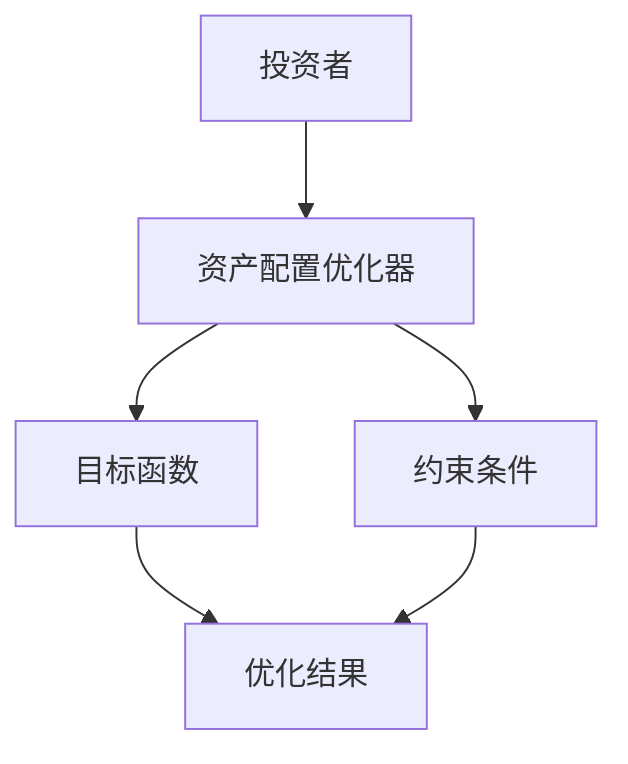
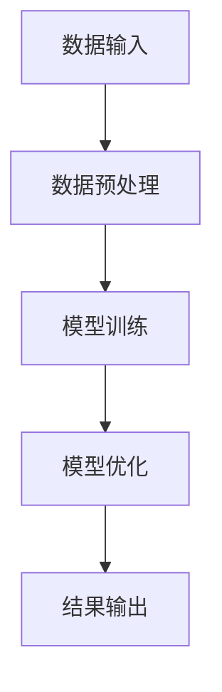
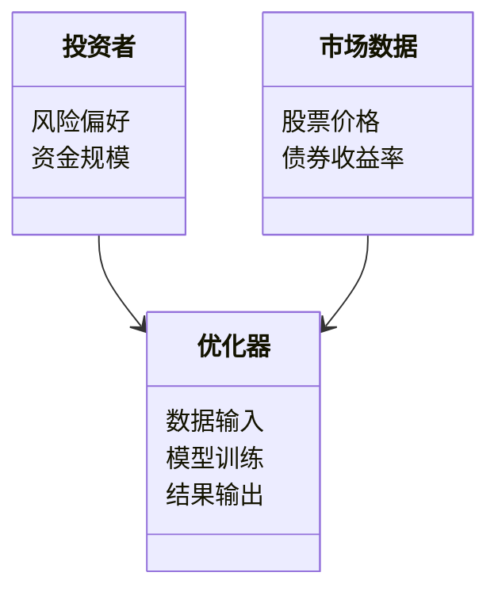
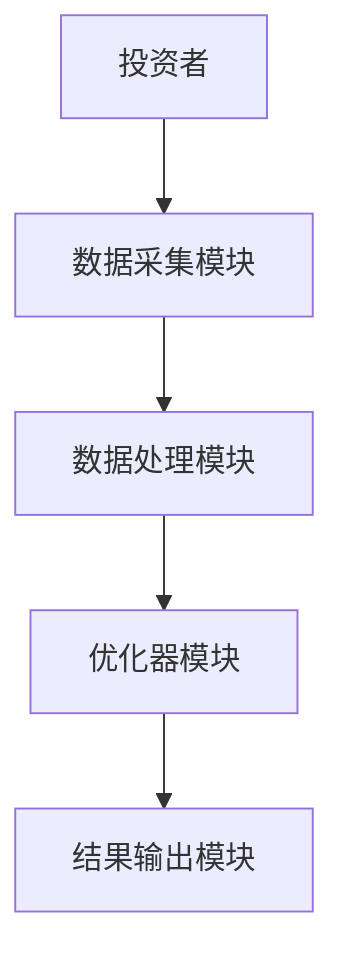
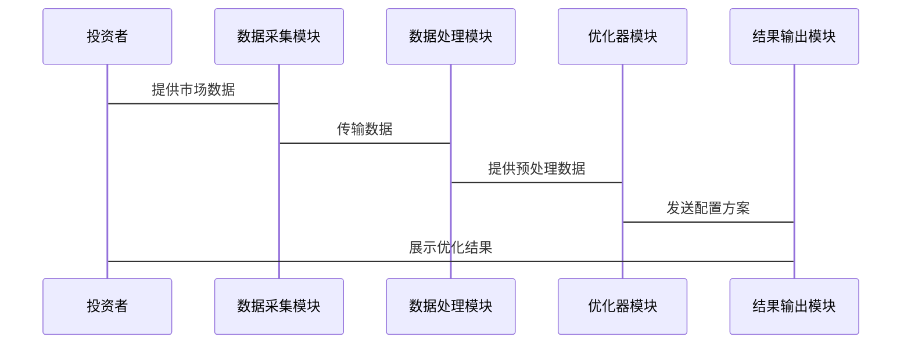

                 


# 智能资产配置优化器

> 关键词：智能资产配置、优化算法、投资组合、人工智能、风险管理、系统架构

> 摘要：本文详细探讨智能资产配置优化器的设计与实现，涵盖背景介绍、核心概念、算法原理、系统架构、项目实战及最佳实践，帮助读者理解如何利用人工智能技术优化资产配置，提升投资收益并降低风险。

---

## 第一部分: 背景介绍与核心概念

### 第1章: 资产配置优化的背景与问题背景

#### 1.1 问题背景
##### 1.1.1 资产配置的传统方法与局限性
传统的资产配置方法依赖于历史数据和经验判断，存在以下问题：
- 无法及时捕捉市场波动。
- 无法处理高维复杂数据。
- 难以平衡风险与收益。
- 无法应对非线性关系。

##### 1.1.2 传统资产配置中的痛点
- **收益与风险的平衡**：传统方法难以在复杂市场中找到最优解。
- **数据处理能力**：无法高效处理多维度、海量数据。
- **实时性不足**：传统方法难以应对快速变化的市场环境。
- **模型局限性**：线性假设在复杂市场中失效。

##### 1.1.3 智能化资产配置的需求与趋势
随着人工智能技术的发展，智能优化算法逐渐成为资产配置的核心工具，主要需求包括：
- **实时优化**：快速响应市场变化。
- **高维数据处理**：处理多资产类别、多市场数据。
- **复杂关系建模**：应对非线性市场动态。
- **个性化配置**：根据投资者风险偏好定制方案。

#### 1.2 问题描述
##### 1.2.1 资产配置优化的核心目标
- **目标函数**：最大化收益、最小化风险。
- **约束条件**：资产权重、流动性、风险敞口等限制。

##### 1.2.2 智能资产配置优化器的定义
智能资产配置优化器是一种利用人工智能算法，根据市场数据和投资者需求，动态优化资产配置的系统。

##### 1.2.3 优化器的边界与外延
- **边界**：仅关注资产配置，不涉及具体交易执行。
- **外延**：可扩展至风险预警、收益预测等其他投资功能。

#### 1.3 问题解决
##### 1.3.1 传统优化方法的不足
- **线性假设**：难以应对非线性市场。
- **计算能力**：传统方法难以处理海量数据。
- **静态优化**：无法动态调整配置。

##### 1.3.2 智能优化的核心优势
- **非线性建模**：深度学习模型可捕捉复杂市场关系。
- **实时处理**：高效算法支持实时优化。
- **动态调整**：根据市场变化快速调整配置。

##### 1.3.3 优化器的实现路径
1. 数据收集与预处理。
2. 模型训练与优化。
3. 配置结果生成与输出。

#### 1.4 核心概念结构与要素
##### 1.4.1 优化器的组成要素
- 数据输入模块：市场数据、投资者信息。
- 智能优化算法：基于机器学习的优化模型。
- 输出模块：优化后的资产配置方案。

##### 1.4.2 各要素之间的关系
数据输入模块为优化算法提供输入，优化算法生成配置方案，输出模块将结果呈现给用户。

##### 1.4.3 优化器的核心逻辑框架
$$\text{优化目标} = f(\text{市场数据}, \text{投资者偏好})$$

---

## 第2章: 核心概念与联系

### 2.1 核心概念原理
#### 2.1.1 智能优化算法的原理
智能优化算法通过学习历史数据，建立市场行为的非线性模型，实时优化资产配置。

#### 2.1.2 数据驱动的优化方法
利用大数据和机器学习模型，从海量数据中提取特征，优化资产配置。

#### 2.1.3 多目标优化的实现方式
在优化过程中，同时考虑收益、风险、流动性等多个目标。

### 2.2 核心概念对比
#### 2.2.1 传统优化与智能优化的对比
| 对比维度 | 传统优化 | 智能优化 |
|----------|----------|----------|
| 计算能力 | 依赖线性假设 | 支持非线性建模 |
| 数据处理 | 低效 | 高效 |
| 实时性 | 低 | 高 |

#### 2.2.2 不同优化算法的优劣势对比
| 算法类型 | 优点 | 缺点 |
|----------|------|------|
| 遗传算法 | 全局优化 | 计算复杂 |
| 梯度下降 | 计算高效 | 易陷入局部最优 |
| 非线性规划 | 精确解 | 依赖线性假设 |

#### 2.2.3 数据特征与优化目标的关联性分析
数据特征（如波动率、相关性）直接影响优化目标（如风险收益比）。

### 2.3 实体关系架构


---

## 第3章: 算法原理讲解

### 3.1 算法原理
智能资产配置优化器的核心算法是基于强化学习的多目标优化算法。

#### 3.1.1 算法步骤
1. 数据预处理：清洗、特征提取。
2. 模型训练：建立强化学习模型。
3. 模型优化：调整参数，提升性能。
4. 结果输出：生成最优配置方案。

#### 3.1.2 算法流程图


#### 3.1.3 Python代码实现
```python
import numpy as np
import pandas as pd
from sklearn.preprocessing import StandardScaler
from tensorflow.keras import layers, models

# 数据预处理
def preprocess_data(data):
    scaler = StandardScaler()
    X = scaler.fit_transform(data)
    return X

# 模型训练
def train_model(X, y):
    model = models.Sequential()
    model.add(layers.Dense(64, activation='relu', input_dim=X.shape[1]))
    model.add(layers.Dense(1, activation='linear'))
    model.compile(optimizer='adam', loss='mean_squared_error')
    model.fit(X, y, epochs=100, batch_size=32)
    return model

# 模型优化
def optimize_model(model, X_test, y_test):
    # 调整超参数
    model.compile(optimizer='adam', loss='mean_squared_error')
    model.fit(X_test, y_test, epochs=200, batch_size=16)
    return model

# 主程序
data = pd.read_csv('market_data.csv')
X = preprocess_data(data)
y = data['target']
model = train_model(X, y)
optimized_model = optimize_model(model, X, y)
```

#### 3.1.4 数学模型
目标函数：
$$ \text{收益} = \sum_{i=1}^n w_i \cdot r_i $$
约束条件：
$$ \sum_{i=1}^n w_i = 1 $$
$$ w_i \geq 0 $$

---

## 第4章: 系统分析与架构设计方案

### 4.1 系统分析
#### 4.1.1 问题场景介绍
投资者希望通过系统动态优化资产配置，提升收益并降低风险。

#### 4.1.2 系统功能设计
- 数据采集模块：收集市场数据。
- 数据处理模块：清洗、特征提取。
- 模型训练模块：训练优化算法。
- 结果输出模块：生成配置方案。

#### 4.1.3 领域模型


### 4.2 系统架构设计

#### 4.2.1 系统架构图


#### 4.2.2 系统接口设计
- **输入接口**：接收市场数据和投资者信息。
- **输出接口**：返回优化后的配置方案。

#### 4.2.3 系统交互流程图


---

## 第5章: 项目实战

### 5.1 环境搭建
#### 5.1.1 安装Python和相关库
```bash
pip install numpy pandas scikit-learn tensorflow
```

#### 5.1.2 数据准备
下载市场数据，保存为CSV格式。

### 5.2 核心功能实现
#### 5.2.1 数据预处理
```python
def preprocess_data(data):
    scaler = StandardScaler()
    X = scaler.fit_transform(data)
    return X
```

#### 5.2.2 模型训练与优化
```python
def train_model(X, y):
    model = models.Sequential()
    model.add(layers.Dense(64, activation='relu', input_dim=X.shape[1]))
    model.add(layers.Dense(1, activation='linear'))
    model.compile(optimizer='adam', loss='mean_squared_error')
    model.fit(X, y, epochs=100, batch_size=32)
    return model
```

#### 5.2.3 结果分析
分析优化后的资产配置方案，评估收益与风险。

### 5.3 实际案例分析
以实际市场数据为例，展示优化器的运行过程和结果。

### 5.4 项目小结
总结项目实现的关键点和注意事项。

---

## 第6章: 最佳实践与小结

### 6.1 最佳实践
#### 6.1.1 数据预处理的重要性
- 数据清洗是优化器性能的基础。
- 特征选择影响模型效果。

#### 6.1.2 模型调参技巧
- 逐步调整学习率和批量大小。
- 使用交叉验证评估模型性能。

#### 6.1.3 系统监控
- 实时监控模型性能。
- 定期更新市场数据。

### 6.2 小结
智能资产配置优化器通过结合人工智能技术，显著提升了资产配置的效率和效果，为投资者提供了更优的决策支持。

### 6.3 注意事项
- 确保数据质量和完整性。
- 定期更新模型以适应市场变化。
- 注意模型的可解释性和风险管理。

### 6.4 拓展阅读
- 《机器学习实战》
- 《深度学习》
- 《投资学原理》

---

## 作者
作者：AI天才研究院 & 禅与计算机程序设计艺术

