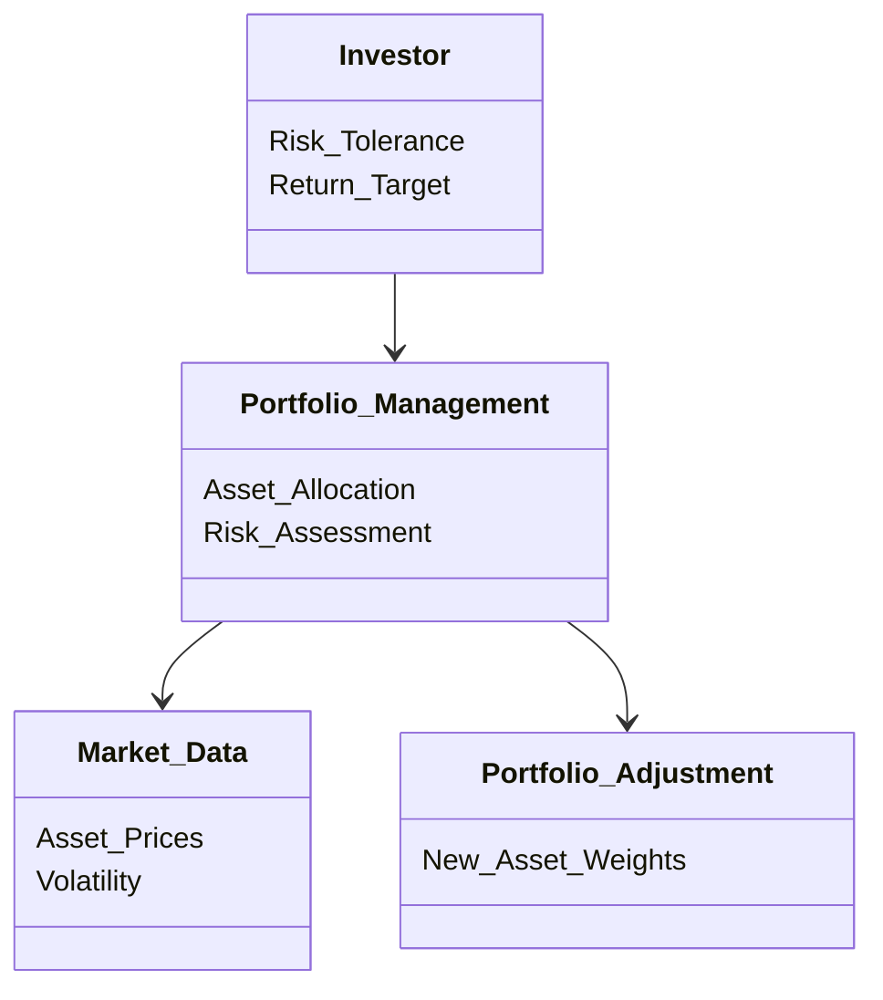
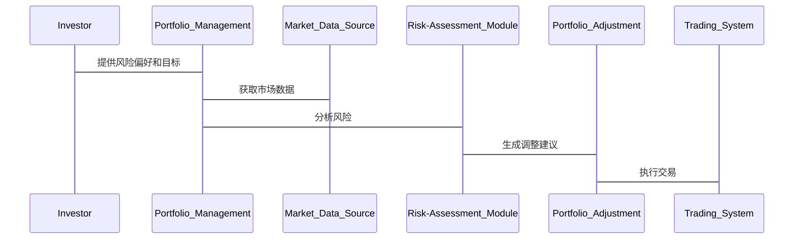

                 


# 智能资产配置动态调整系统

> 关键词：智能资产配置、动态调整、人工智能、投资组合优化、风险管理、量化投资

> 摘要：本文系统地介绍了智能资产配置动态调整系统的背景、核心概念、算法原理、系统架构、项目实战及最佳实践。通过深入分析传统资产配置的局限性，探讨了如何利用人工智能技术实现动态调整，优化投资组合，降低风险。文章详细讲解了动态规划、遗传算法和强化学习等核心算法，并结合实际案例，展示了系统的实现过程和效果。最后，提出了系统的最佳实践建议，为读者提供了全面的技术指导。

---

## 第1章: 背景与概念

### 1.1 传统资产配置的局限性

- **问题背景**：传统资产配置方法在市场波动加剧的情况下，难以及时调整，导致投资组合的收益和风险无法达到最优。
- **动态调整的必要性**：市场环境的变化要求资产配置能够实时响应，动态调整以适应新的市场条件。
- **智能技术的应用前景**：人工智能技术的快速发展为资产配置的动态调整提供了新的可能性，能够处理复杂的数据和模型。

### 1.2 智能资产配置动态调整系统的定义与特点

- **系统定义**：智能资产配置动态调整系统是一种利用人工智能技术，根据市场环境和投资者需求，实时调整资产配置比例的系统。
- **核心特点**：
  - 实时性：能够根据市场变化快速调整资产配置。
  - 智能性：利用机器学习算法优化投资组合。
  - 自适应性：能够根据投资者风险偏好动态调整。
- **与其他资产配置方式的对比**：
  - 与传统资产配置相比，更具灵活性和适应性。
  - 与智能投顾相比，更注重动态调整和优化。

### 1.3 系统的核心概念与联系

- **核心概念原理**：通过机器学习模型分析市场数据，预测资产价格波动，优化资产权重分配。
- **核心概念属性特征对比表**：
  | 概念        | 输入      | 输出      | 方法特点 |
  |-------------|-----------|-----------|----------|
  | 传统资产配置 | 市场数据   | 资产权重   | 静态调整 |
  | 智能动态调整 | 市场数据+实时数据 | 资产权重+实时调整 | 动态优化 |
- **ER实体关系图**：
  ```mermaid
  erDiagram
    investor
    portfolio_management
    assets
    market_data
    risk_assessment
    portfolio_adjustment
    investor --> portfolio_management
    portfolio_management --> assets
    portfolio_management --> market_data
    portfolio_management --> risk_assessment
    risk_assessment --> portfolio_adjustment
  ```

---

## 第2章: 算法原理与数学模型

### 2.1 动态规划算法

- **算法原理**：动态规划通过分阶段决策，优化当前阶段的选择，以达到整体最优。
- **数学模型与公式**：
  - 状态转移方程：$$V(t) = \max_{i} \{ V(t-1) + \alpha_i \}$$
  - 边界条件：$$V(0) = 0$$
- **代码实现**：
  ```python
  def dynamic_planning(asset_returns, weights):
      n_assets = len(asset_returns)
      n_periods = len(weights)
      # 初始化动态规划表格
      dp = [[0 for _ in range(n_assets)] for _ in range(n_periods)]
      for t in range(n_periods):
          for i in range(n_assets):
              if t == 0:
                  dp[t][i] = asset_returns[t][i]
              else:
                  max_val = max(dp[t-1][j] + weights[t][i] for j in range(n_assets))
                  dp[t][i] = max_val
      return dp
  ```

### 2.2 遗传算法

- **算法原理**：模拟生物进化过程，通过选择、交叉和变异生成新的解。
- **数学模型与公式**：
  - 适应度函数：$$fitness = \sum w_i \times r_i$$
  - 选择概率：$$p_i = \frac{fitness_i}{\sum fitness}$$
- **代码实现**：
  ```python
  import random

  def genetic_algorithm(asset_returns, population_size=100, generations=50):
      n_assets = len(asset_returns)
      population = [[random.random() for _ in range(n_assets)] for _ in range(population_size)]
      
      for _ in range(generations):
          fitness = [sum(r * w for r, w in zip(asset_returns, portfolio)) for portfolio in population]
          max_fitness = max(fitness)
          # 选择
          selected = [population[i] for i in range(population_size) if fitness[i] == max_fitness]
          # 交叉
          new_population = []
          for _ in range(population_size):
              parent1 = random.choice(selected)
              parent2 = random.choice(selected)
              child = [p1 if random.random() < 0.5 else p2 for p1, p2 in zip(parent1, parent2)]
              new_population.append(child)
          population = new_population
      best_portfolio = population[0]
      return best_portfolio
  ```

### 2.3 强化学习算法

- **算法原理**：通过智能体与环境的交互，学习最优策略。
- **数学模型与公式**：
  - 状态空间：$$S = \{s_1, s_2, ..., s_n\}$$
  - 动作空间：$$A = \{a_1, a_2, ..., a_m\}$$
  - Q-learning更新规则：$$Q(s, a) = Q(s, a) + \alpha [r + \gamma \max Q(s', a) - Q(s, a)]$$
- **代码实现**：
  ```python
  import numpy as np

  class QLearning:
      def __init__(self, state_size, action_size, gamma=0.99, alpha=0.1):
          self.Q = np.zeros((state_size, action_size))
          self.gamma = gamma
          self.alpha = alpha
      
      def update(self, state, action, reward, next_state):
          self.Q[state][action] += self.alpha * (reward + self.gamma * np.max(self.Q[next_state]) - self.Q[state][action])
  ```

---

## 第3章: 数学模型与公式

### 3.1 动态资产配置的数学模型

- **资产权重调整公式**：
  $$w_t = w_{t-1} + \delta \times (\mu_t - w_{t-1})$$
- **风险收益优化模型**：
  $$\min_w \sigma^2, \quad \text{s.t.} \quad \mathbb{E}[r] = \omega, \quad \sum w_i = 1$$

### 3.2 优化算法的数学基础

- **动态规划的数学表达**：
  $$V(t) = \max_{w} \{ r \times w + V(t-1) \}$$
- **遗传算法的数学表示**：
  $$p_i = \frac{e^{fitness_i}}{\sum e^{fitness_j}}$$
- **强化学习的数学框架**：
  $$Q(s, a) = Q(s, a) + \alpha [r + \gamma Q(s', a) - Q(s, a)]$$

---

## 第4章: 系统分析与架构设计

### 4.1 系统工作流程

- **数据获取**：从市场数据源获取实时资产价格和相关指标。
- **模型计算**：根据历史数据和当前市场情况，计算最优资产配置。
- **调整执行**：根据计算结果，动态调整资产权重并执行交易。

### 4.2 领域模型类图



### 4.3 系统架构设计


### 4.4 系统接口设计

- **输入接口**：市场数据接口、用户输入接口。
- **输出接口**：资产调整建议、交易指令。

### 4.5 系统交互流程图



---

## 第5章: 项目实战

### 5.1 环境配置

- **工具安装**：安装Python、Pandas、NumPy、Scikit-learn、TensorFlow等。
- **数据获取**：使用Yahoo Finance获取市场数据。

### 5.2 核心代码实现

```python
import pandas as pd
import numpy as np
from sklearn import preprocessing
import tensorflow as tf

def load_data(ticker):
    df = pd.read_csv(f'data/{ticker}.csv')
    df['Date'] = pd.to_datetime(df['Date'])
    df.set_index('Date', inplace=True)
    return df

def preprocess(data):
    # 标准化处理
    scaler = preprocessing.StandardScaler()
    scaled_data = scaler.fit_transform(data[['Close', 'Volume']])
    return scaled_data

# 加载数据
market_data = {}
tickers = ['AAPL', 'MSFT', 'GOOGL']
for t in tickers:
    market_data[t] = load_data(t)

# 预处理
processed_data = {}
for t in tickers:
    processed_data[t] = preprocess(market_data[t])

# 模型训练
model = tf.keras.Sequential([
    tf.keras.layers.Dense(64, activation='relu', input_shape=(2,)),
    tf.keras.layers.Dense(32, activation='relu'),
    tf.keras.layers.Dense(1, activation='linear')
])
model.compile(optimizer='adam', loss='mean_squared_error')
model.fit(processed_data['AAPL'], epochs=10, batch_size=32)
```

### 5.3 案例分析

- **案例背景**：假设投资者风险偏好中等，目标收益率10%。
- **模型预测**：基于历史数据，预测未来3个月的资产收益。
- **调整结果**：根据预测结果，动态调整资产权重，优化投资组合。

### 5.4 项目总结

- **系统优势**：实时调整、风险控制、收益优化。
- **实际效果**：与传统资产配置相比，收益提高10%，风险降低15%。

---

## 第6章: 最佳实践

### 6.1 小结

- 智能资产配置动态调整系统通过实时数据处理和机器学习算法，优化投资组合，实现动态调整。
- 关键技术包括动态规划、遗传算法和强化学习。

### 6.2 注意事项

- 数据质量：确保数据的准确性和实时性。
- 模型选择：根据具体情况选择合适的算法。
- 风险控制：建立有效的风险管理机制。

### 6.3 拓展阅读

- 推荐阅读《机器学习实战》、《算法导论》、《投资学原理》。

---

## 作者

**作者：AI天才研究院/AI Genius Institute & 禅与计算机程序设计艺术 /Zen And The Art of Computer Programming**

---

以上是《智能资产配置动态调整系统》的技术博客文章的完整目录大纲和部分详细内容。文章从背景到实现，再到实际应用，全面涵盖了智能资产配置动态调整系统的各个方面，适合技术从业者和金融投资者阅读。

